#contents

## 開催概要
- 会期：2009年10月15,16日
  - 15日（木）　 　　10：00～17：00
  - 16日（金） 　　　10：00～16：30
- 場所：
  - 独立行政法人 産業技術総合研究所 つくばセンター
- 対象：
  - 産業界、大学、公的研究機関等の皆様
- 主な当部門の展示：
  - I-20 RTミドルウエア技術
  - I-21 作業サービスロボット技術
  - I-22 ロボット用音声対話ツールキット
  - I-23 人と安全に共存する双腕型の次世代産業用ロボット
  - I-24 福祉用ロボットアームの操作支援システム
  - I-25 電動車いすのための屋内走行システム
  - I-26 小型・軽量パーソナルモビリティロボット
  - I-27 屋外自律移動ロボットの要素技術とその応用
  - I-28 触覚を通じて人間がリードするヒューマノイドロボット
- 参加費：
  - 無料
- 事前登録：
  - **ホームページ（[http](//www.aist-openlab.jp/index.html::http://www.aist-openlab.jp/index.html)）からの事前来場登録（来場申し込み）とラボ事前予約が必要となります。**
- 交通機関：
  - つくばエクスプレス「つくば駅」（秋葉原から快速45分）より無料バスを運行予定
- 公式Webページ
  - [http](//www.aist-openlab.jp/index.html:http://www.aist-openlab.jp/index.html)

# 展示内容
RTミドルウエア関連の展示は以下のとおりです。
- I-20 RTミドルウエア技術

### RTミドルウエア：OpenRTM-aist
****出展者**|[産総研・知能システム研究部門・安藤慶昭**: http](//www.is.aist.go.jp)
:**概要**|
RTミドルウエア（OpenRTM-aist）はロボットシステムを容易に構築するためのソフトウエアプラットフォームです。ロボットの機能要素（センサ、アクチュエータ、アルゴリズム等）を、RTコンポーネントと呼ばれる単位でモジュール化し、その組み合わせでシステムを構成します。ミドルウエアには、モジュール化とその再利用を容易にするための機能が備わっており、ロボットシステムの開発期間の短縮、コストの削減に貢献します。
RTコンポーネントは、言語（C++、Java、Python）、OS（UNIX、Windows、MacOS X等）を問わず作成・動作が可能で、異言語・OS上のRTコンポーネント同士をネットワーク経由で容易に連携させることができます。RTミドルウエア（OpenRTM-aist）のインターフェース仕様は、産総研が中心となって策定されたOMG（Object Management Group）の国際標準：RTC (Robotic Technology Component)仕様に準拠しています。OpenRTM-aistは今年のロボット大賞2007 ソフトウエア・部品部門優秀賞受賞ソフトウエアです。

:**特徴**|
  - ロボットをモジュール単位で容易に構築するソフトウエアプラットフォーム
  - モジュール化と再利用によって開発期間の短縮、コスト削減が可能
  - ロボット特有なソフトウエア機能、異言語・異OS間で連携する機能を提供

### OpenRTM-aistツール(RTCBuilder・RTSystemEditor)
****出展者**|[産総研・知能システム研究部門・安藤慶昭**: http](//www.is.aist.go.jp)
:**概要**|
現在、NEDO「次世代ロボット知能化技術開発プロジェクト(通称：知能化プロジェクト)」(2007-2011)において、ロボットシステム開発のための統合開発プラットフォーム **OpenRT Platform** が開発されています。このソフトウエアプラットフォームは、OpenRTMをベースとし、多くのツール群(ツールチェーン)によりロボットの開発効率の向上を目指しています。
旧OpenRTMツール(RtcTemplate・RtcLink)も、OpenRT Platform ツールチェーンに取り込まれ、様々な機能追加・改良を行った RTCBuilder・RTCSystemEditor として新たにリリースされました。
本展示では、新しいツールの新機能・改良点などをご紹介します。
:**特徴**|
- **RTCBuilder**
  - わかりやすいGUIで、コンポーネントの設計をより簡単に
  - C++、Java、Python、C#のひな型コードを自動生成
- **RTSystemEditor**
  - RTコンポーネントシステムを簡単に設計・操作可能
  - 新機能・オフラインエディタ

<strong>RTCBuilder</strong>

 

### 組込みCPU向けRTコンポーネント(実演)
****出展者**|[産総研・知能システム研究部門・安藤慶昭**: http](//www.is.aist.go.jp)
:**概要**|
組込みLinux向けのRTコンポーネント開発環境と、RTコンポーネントを搭載した組込みデバイスの実例([アットマークテクノ社製](http://www.atmark-techno.com/) [Armadillo](http://armadillo.atmark-techno.com/)シリーズ)をご紹介します。
:**特徴**|
  - 組込みLinux用RTコンポーネントクロス開発環境
  - [アットマークテクノ社製](http://www.atmark-techno.com/) [Armadillo](http://armadillo.atmark-techno.com/)シリーズ用RTコンポーネントを簡単に開発
  - USBメモリにインストールされたRTコンポーネントを自動起動
  - 実例としてArmadilloとURGセンサを組み合わせた分散LRFユニットを展示

<a href="Armadillo_URG.png">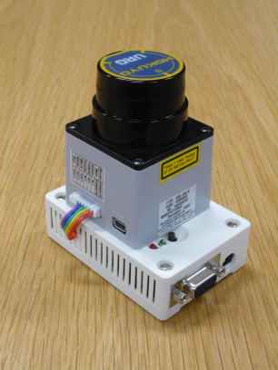</a>
;

<a href="LRFViewer.png">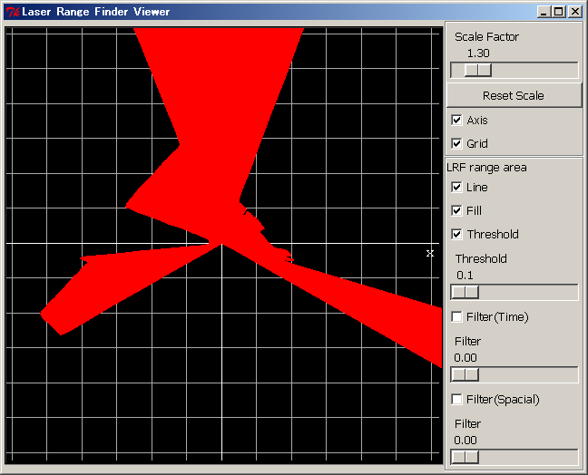</a>
;

<strong>分散LRFユニット</strong>

<a href="Armadillo_URG3.png">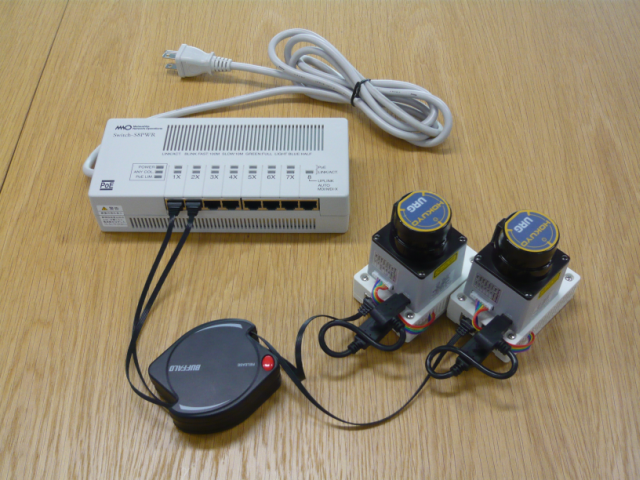</a>

<strong>PoE (Power over Ether) により給電可能</strong>

 

### RTミドルウェアを応用したアクティブキャスタ
****出展者**|[産総研・知能システム研究部門・安藤慶昭、鈴木 圭介**: http](//www.is.aist.go.jp)
:**概要**|
我々は住宅のロボット化による生活支援の一つにアクティブキャスタを利用した物理的支援の研究を進めています．
アクティブキャスタは汎用性に優れたモータ付キャスタで，これを装着することで対象に動力を付加することができます．居住者が必要に応じて家具や家電などに取り付け，取り外しが可能で，RTミドルウェアのコンポーネントを呼び出すことで簡単に構成を変えて使うことができます．
本展示ではこのRTミドルウェアを応用したアクティブキャスタについて紹介します．

<a href="AC1.jpg">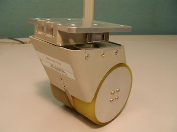</a>

<a href="AC2.jpg">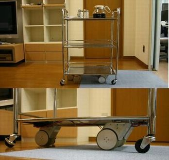</a>

## 協力展示
### PatterWaver for RT-Middleware
****出展者**|[株式会社テクノロジックアート**: http](//www.tech-arts.co.jp/)
:**概要**|
UMLモデリングツールをベースとしたRTコンポーネントの設計ツールです．
- 主な特徴：
  - GUIを用いた直感的な操作によるコンポーネント設計が可能
  - C++版RTC・Java版RTC・Python版RTCのスケルトンコードの自動生成
  - CORBA IDLの自動生成
  - 設計情報の再利用をサポート

<a href="pw_for_rtm.png">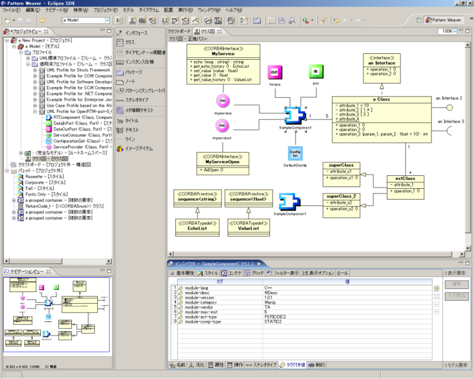</a>

<strong>PatterWeaver for RT-Middleware</strong>

### 再利用技術研究センターの活動概要
****出展者**|[富士ソフト株式会社**: http](//www.fsi.co.jp/)
:**概要**|
NEDOの｢次世代ロボット知能化技術開発プロジェクト｣による「ロボット知能ソフトウェア再利用性向上技術の開発」プロジェクトの活動拠点として、「RTC再利用技術研究センター」を開設した。そこには、検証環境（再利用性試験プラットフォーム）を構築して、RTM上で開発された各研究体のRTコンポーネント(RTC)の動作試験、およびその再利用性の向上を図るために、アプリケーション事例を用いてRTCの再利用検証及び組み換え検証を開始した。ここではその活動概要を紹介する。

<a href="rt_reuse_center.png">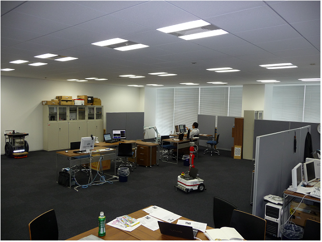</a>

<strong>NEDO知能化プロジェクト・RTC再利用技術研究センター</strong>

<a href="rt_reuse_platform.png">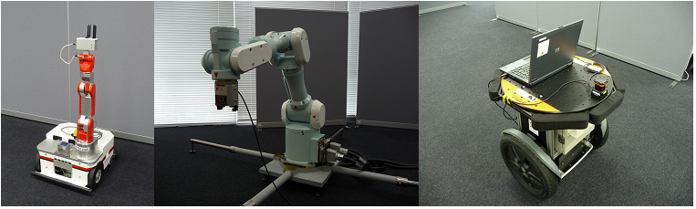</a>

<strong>RTC再利用技術研究センターで利用可能なロボットプラットフォーム</strong>

### RTミドルウェア技術を活用した受付ロボットシステム
****出展者**|[株式会社セック**: http](//www.sec.co.jp)
:**概要**|RTミドルウェア技術を活用した受付ロボットシステムです。レーザレンジファインダで人を検知・追跡し、人の距離に応じて、案内メッセージを切り替えます。
国際標準仕様のロボット部品化技術であるRTミドルウェアを採用することで、高い拡張性と保守性を実現しています。博物館での来場者数・動線計測ロボット、倉庫での監視ロボットなどに応用することができます。

<a href="sec.png">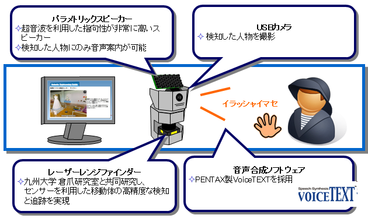</a>

<strong>RTミドルウェア技術を活用した受付ロボットシステム</strong>

### 知能化空間におけるヒューマンインタフェース
****出展者**|[東京大学橋本研究室・佐々木毅氏**: http](//dfs.iis.u-tokyo.ac.jp/ja/)
:**概要**|
東京大学生産技術研究所橋本研究室では、空間に多数のセンサやアクチュエータを分散配置することで実現される知能化空間の研究を進めています。知能化空間では、環境に埋め込まれたセンサによって観測した情報を基に、アクチュエータを介してユーザに物理的・情報的支援を提供します。本展示では、ユーザが分散デバイスを用いて知能化空間内のサービスを利用するための空間ヒューマンインタフェースについてご紹介します。

<a href="hlab.jpg">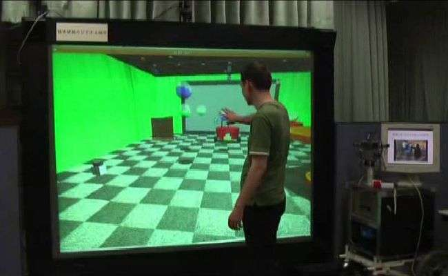</a>

<strong>知能化空間におけるヒューマンインタフェース</strong>

### DAQ-Middleware(DAQミドルウェア)
****出展者**|[高エネルギー加速器研究機構**: http](//www.kek.jp)
:**概要**|
DAQ-Middleware[1]はOpenRTM-aistを基盤とした高エネルギー加速器研究機構（KEK[2]）や大強度陽子加速器施設（J-PARC[3]）等の実験データ収集（DAQ）システムで使用するためのソフトウェアフレームワークである。 
RTコンポーネントを拡張したDAQコンポーネントによる汎用で柔軟なDAQシステム構築を目指している。 
現在、J-PARCの物質・生命科学実験施設（MLF[4]）の複数の実験装置で稼働中。 
:**References**|
1. http://daqmw.kek.jp/
1. http://www.kek.jp/
1. http://j-parc.jp/
1. http://j-parc.jp/MatLife/ja/

### 組込みシステムバス上の分散制御ロボット用RT-Middleware:RTC-CANopen-0.3.0
****出展者**|[芝浦工業大学水川研究室**: http](//www.hri.ee.shibaura-it.ac.jp/)
:**概要**|
RTC-CANopenとは、安全バスシステムとして広く使用されているCANopenの特徴を
取り入れた組込み向けのRT-Middlewareです。RTC-CANopenは、ネイティブバスで
あるCANを介して接続される各種デバイスと汎用PC上のEthernetで接続されるデ
バイスやアルゴリズムと相互に接続することが可能となっている他、PnP機能を
サポートしており柔軟なロボットシステムの構築が可能となっています。

<a href="RTC-CANopen.jpg">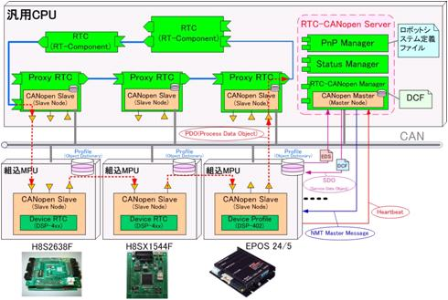</a>

<strong>RTC-CANopen System</strong>

### WiiRemoteコンポーネント群
****出展者**|[芝浦工業大学水川研究室**: http](//www.hri.ee.shibaura-it.ac.jp/)
:**概要**|
任天堂株式会社製の家庭用ゲーム機「Wii」のコントローラ(Wii Remote)をRTコ
ンポーネント化しました．Bluetoothモジュールを用いて接続したWii Remoteへ
の入力をデータポートから利用可能です．
:**特徴**|
- Wiiコントローラを多目的に利用可能
- コンポーネントの組み替えにより各種拡張コントローラを利用可能  （ヌンチャク，クラシックコントローラ，Wiiバランスボード，WiiMotionPlusに対応）
- 今後追加される未知の拡張コントローラを意識した設計
- 実用例としてOpenRTM-aist-Python版サンプル「NXTRTC」に対応

<a href="WiiRemoteComp.jpg">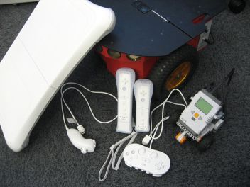</a>

<strong>WiiRemoteコンポーネント群</strong>

### 共有メモリーコンポーネントを用いた階層協調型制御システムの構築
****出展者**|[中央大学國井研究室**: http](//www.hmsl.elect.chuo-u.ac.jp/)
:**概要**|
- 移動ロボットの遠隔・自律システムをRTミドルウェアで構築
- RTMにて複数CPU間の共有メモリを提供する枠組みを実現
- RTコンポーネントのポート自動接続と実行制御のツールを提供し運用の効率化
を実現

:**特徴**|
- 複数のCPU間で共有メモリを仮想的に使用し高速な通信を実現
- 分散システムにおける排他制御のサービス提供（共有メモリ・ロックサービス）
- ポート接続を意識せずにGUIから任意のRTCを一括して実行・停止できる

<a href="kuniilab.png">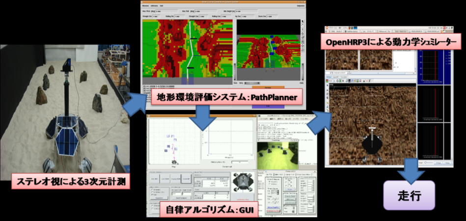</a>

<strong>移動ロボットの階層協調型制御システム</strong>

### 名刺受け機能付きマスコット・ロボット
****出展者**|[早稲田大学菅野研究室・菅佑樹氏**: http](//www.ysuga.net/robot/rtm/index.html) 
:**概要**|
RTミドルウェアを用い，名刺受け機能搭載型マスコット・ロボット・システムを開発いたしました． 本ロボットは頚部に2つの自由度を持ち，カメラから取得した画像を用いて首振り・うなずき動作が可能なほか，口蓋内に備えた名刺スキャナと，独自に開発した芳名認識ソフトウェアによって，お客様の御氏名を抽出・認識し，音声合成によって読み上げを行うことができます． RTミドルウェアにより，顧客の要望に応じたシステムの追加等を迅速に行うことができました．

;

### RT-MiddlewareのIceによる拡張を用いた仮想研究室フレームワーク
:**出展者**|ブタペスト経済工科大学・Korondi研究室
:**概要**|
将来的に分散仮想研究室が実用的になると予想されます。こうした研究室は、コスト効率が高く、24時間世界中から利用することが可能です。標準化されたソフトウエアフレームワークによって、誰もがこうした仮想研究室に接続し実験を行うことが可能になります。我々は、分散した複数の研究室が仮想的な一つの研究室を共有する、高度にモジュール化されたバーチャルコラボレーションアリーナ (Virtual Collaboration Arena: VIRCA) を提案しています。VIRCAはRTミドルウエアを基盤にデータポート通信をInternet Communication Engine (ICE) により拡張 しています。この拡張により、それぞれが持つリソースを同じ場所にいるかのように、同じ方法で共有することが可能です。工業用ロボットと移動ロボットが遠隔の研究室にある仮想的なボールを介して相互作用するVIRBAを使った例を示します。

<a href="rtc_formation.jpg">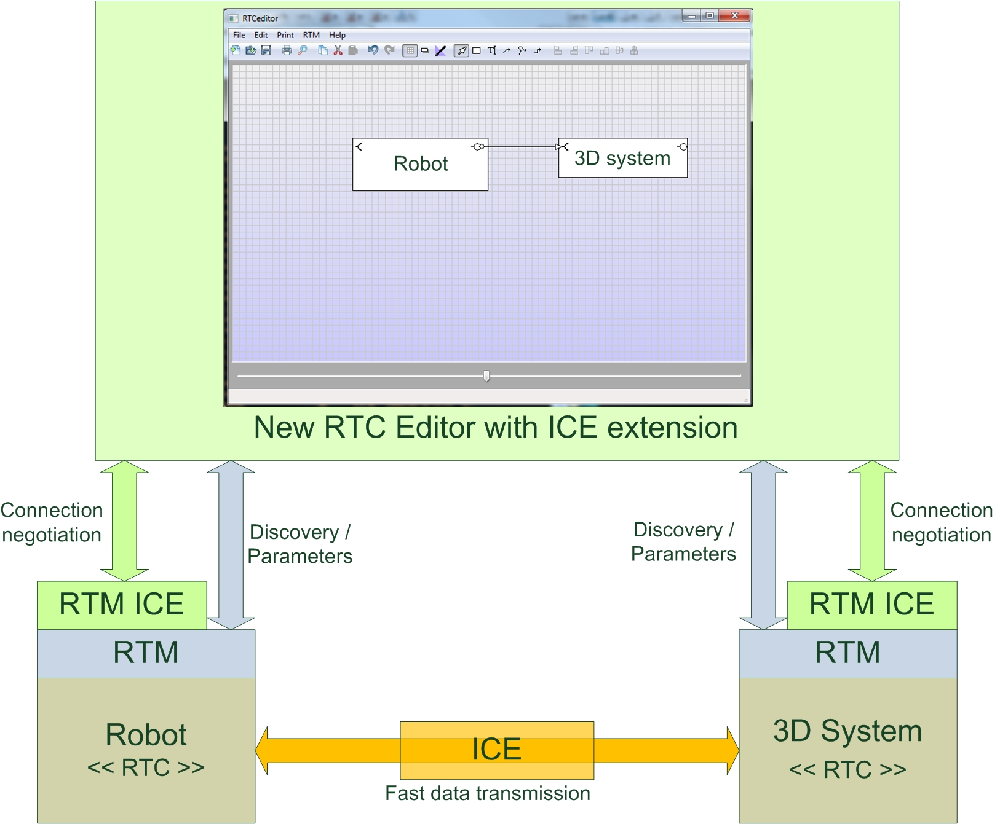</a>

<strong>RT-MiddlewareのIceによる拡張</strong>

<a href="rt_ice_extension.jpg">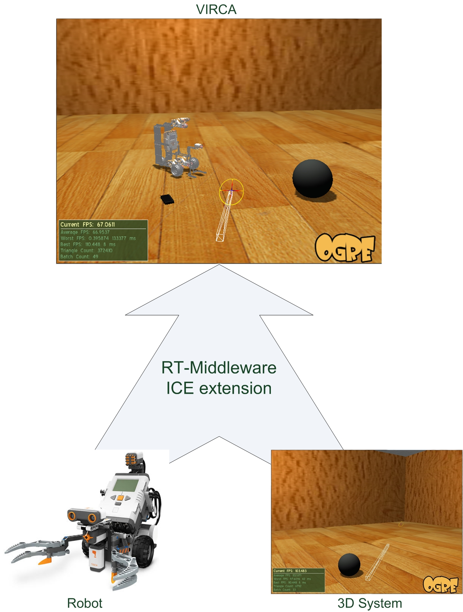</a>

<strong>仮想研究室:Virtual Collaboration Arena(VIRCA)</strong>

