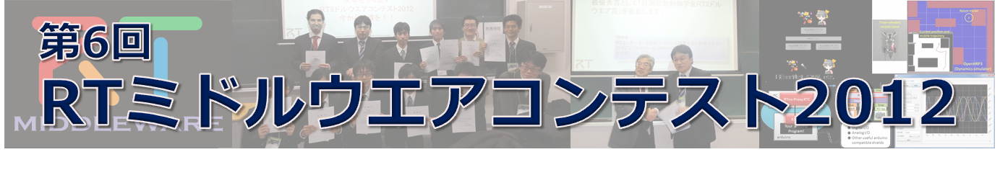

#contents

# RTミドルウエアコンテスト2012表彰（協賛）：

RTシステムの技術の蓄積と共有を促進することを狙って優れた開発成果を表彰いたします。 昨年に引き続き、システム構築に便利なソフトウェアライブラリやハードウェア要素の部品化（RTコンポーネント化）、RTミドルウエア技術を利用した開発ツールを対象とするとともに、新たに既開発の部品（RTコンポーネント）を組み合わせたシステムによるロボットサービスの実現も募集対象とします。

- 成果発表会を盛況に開催することができました。[審査結果速報](http://www.openrtm.org/openrtm/sites/default/files/5079/RTMcontest2012_award.pdf)をご覧下さい。

## [計測自動制御学会学会](http://www.sice.or.jp/)RTミドルウエア賞　（最優秀賞）（副賞10万円）　（1件）
総合評価として一番優秀な開発成果に対して最優秀賞として 「計測自動制御学会RTミドルウエア賞」を表彰します。

<!-- ** 奨励賞（特別協賛） 　（副賞2 万円＋提供製品）　（0件）　 -->

<!-- （お申し込み順に掲載させていただいております） -->

<!-- *** やっぱ、カメラたくさんで賞 part2【提供：株式会社 ビュープラス】 -->

<!-- 副賞２万円＋130万画素USB2.0 デジタルカラーカメラ Chameleon CMLN-13S2C-CS 提供 -->
<!-- 知能化に不可欠なカメラを、手軽に，かつ，うまく使ってもらいたい。 -->

## 奨励賞（賞品協賛） 　（提供製品）　（3件）
<!-- &color(red){New!}; -->
（お申し込み順に掲載させていただいております）
　
### ヴイストン ロボットショップ賞【提供：[ヴイストン株式会社](http://www.vstone.co.jp/)】

[ビュートローバー RTC-BT](http://www.vstone.co.jp/products/beauto_rover_rtc/)　1台提供  
RTMの初心者向けに、学習・開発をサポートするようなコンポーネント・ツールに対して表彰します。

### やっぱ、カメラたくさんで賞３【提供：[株式会社ビュープラス](http://www.viewplus.co.jp/)】

[高性能 USB2.0 非圧縮カラーカメラ(SDK,cableを含む）FMVU-13S2C-CS](http://www.viewplus.co.jp/product/camera/fireflymv.html) 2台提供 
知能化に不可欠なカメラを、手軽に，かつ，うまく使ってもらいたい。

### ウィン電子工業賞【提供：有限会社ウィン電子工業】

**RTミドルウエア BeagleBoard 学習キット**（CPUボード、WEBカメラ、その他付属品一式） 1式提供  
我々ウィン電子工業は、RTミドルウエアがロボット分野を越えて普及し、それに伴い分野を越えた技術の交換がなされ発展して行く事を望んでおります。RTミドルウエアコンテストでは、
- RTミドルウエアを導入していない技術者に対して、導入したいと思わせる魅力あるコンポーネント
- RTミドルウエアを応用して新しい分野へ挑戦し間口を広げる期待がある作品

以上の２つの視点から審査いたします。[ビギナー限定賞;]

## 奨励賞（団体協賛） 　（副賞2万円）（10件）　

（お申し込み順に掲載させていただいております）

### パナソニック賞【提供：[パナソニック株式会社](http://panasonic.jp/)】

ユニバーサルデザインの観点から、誰が使っても使いやすく、 安心・安全に間違いなく動作することはもちろん、特に省電力・省資源といった、 環境にやさしくエコにつながる優れた応募作品に対し、表彰致します。

### パートナーロボット賞【提供：[トヨタ自動車株式会社](http://www.toyota.co.jp/)】

私たちは生活に役に立つパートナーとしての実用ロボット実現のため、特に物体認識・物体把持に関する、安全信頼性と利便性を両立できる実用ミドルウェアの提案を評価したい。

### OROCHI賞【提供：[株式会社アールティ](http://www.rt-net.jp)】

RTミドルウェアリファレンスハードウェアロボットアームOROCHIに対して作成されたRTCを広く普及するような優れた作品に賞を贈ります。

### GR-001賞【提供：[株式会社アールティ](http://www.rt-net.jp)】

人型ロボットG-ROBOTS GR-001、及び関連するハードウェアに対して作成されたRTCとして優れた作品に賞を贈ります。

### グローバルアシスト賞【提供：[株式会社グローバルアシスト](http://globalassist.co.jp/)】

ＲＴミドルウェアをより容易に利用するためのツールや、応用分野を広げるためのＲＴシステム構築例など、今後更にＲＴミドルウェアを広めていく上で有用と思われる作品に対して表彰を行わせて頂きます。
なお、最終的な成果物のみではなく、開発作業の進め方、各種ドキュメント類も審査の対象とさせて頂きます。

### アドイン賞【提供：[株式会社アドイン研究所](http://www.adin.co.jp/)】

実世界の多様性に適応可能な優れた技術を実現したRTコンポーネントの開発に対して表彰する。

### ロボットサービスイニシアチブ(RSi)賞【提供：[ロボットサービスイニシアチブ(RSi)](http://www.robotservices.org/)】

パーソナルロボットによる通信ネットワークを活用した魅力あるサービスであり，新しいロボット産業誕生に繋がることを期待できるロボットサービスを表彰いたします．ロボットサービスはＲＳＮＰライブラリを用いて開発し，ＲＴコンポーネントと組み合わせたサービスであること，相互運用性がありロボットならではのサービス提供モデルが提案されていることを評価のポイントとします．

### ＮＴＴデータ変える力を、ともに生み出す賞【提供：[株式会社 NTTデータ](http://www.nttdata.com/)】

「繋ぐ、守る、支える、豊かな暮らしを実現する、よりインテリジェンスな社会インフラ」になるような、システム開発技術とロボティクス技術の融合となるような作品を表彰します。また、従来にない新しい発想で社会の仕組みを変えるロボット技術を利用した作品も表彰する。

### ベストコンセプト賞【提供：[ロボットビジネス推進協議会](http://www.roboness.jp/)】

将来的なビジネスへの発展が期待できる作品、もっとも優れたコンセプト提案を表彰する。

### 日本ロボット工業会賞【提供：[一般社団法人日本ロボット工業会](http://www.jara.jp/)】

総合評価として、今回初めてRTミドルウエアコンテストにエントリーした参加者の中で、 最も優秀な開発成果に対する奨励賞として「日本ロボット工業会賞」を表彰する。[ビギナー限定賞;]

<!-- *** ヴイストン賞　【提供：ヴイストン株式会社】 -->

<!-- 優れたアイディア（革新性、もしくは皆が驚くようなもの）を持ったテーマ、もしくは、先端技術に対し積極的に取り組んでいるテーマに対して表彰します。 -->

<!-- *** 富士ソフト賞　【提供：富士ソフト株式会社】 -->

<!-- サービスロボット市場へのビジネス展開 （システム開発・システムインテグレ－ション・アプリケーションなど）に繋がることが期待できる ＲＴコンポーネントであり、再利用性向上のための要素（モジュール粒度・構成、インタフェース等） が適切に組み入れられている汎用性の高いＲＴＣを表彰する。 なお、当該RTCについてのドキュメント（機能仕様書、試験仕様書など）、 利用マニュアルも評価のポイントとする。 -->

## 奨励賞（個人協賛）（副賞1万円）（5件）　

（お申し込み順に掲載させていただいております）

### RTコンポーネント再利用賞【提供：[平井成興](http://www.furo.org/)（千葉工業大学）】

他者の提供しているＲＴコンポーネントと 自分が今回新たに開発したＲＴコンポーネントを組み合わせて、 何らかのＲＴシステムを構成した作品に対して贈呈する。 なお、当該システムの説明書および利用マニュアルも評価の対象とする。　[ビギナー限定賞;]

<!-- ** 女流RTC賞　【提供：平井成興（千葉工業大学）】 -->

<!-- 女性が作成したRTCを対象とする。女性ならではの発想が入っているものは特に高く評価する。連名となっている場合、当該RTCやロボットシステムの担当 部分を明示すること。その際、担当部分が当該RTCやロボットシステムで果たす役割、ロボットシステムとしての意義も説明するものとし、評価の参考とす る。 -->

### 便利ツール賞【提供：[末廣尚士](http://www.taka.is.uec.ac.jp/)（電気通信大学）】

ＲＴＣを利用してロボットアプリケーションシステムを構築するために有用なツールを表彰することで、 そのようなツールの開発促進・普及を期待する。

### ベストサポート賞【提供：[神徳徹雄](http://staff.aist.go.jp/t.kotoku/)（産総研）】

RTミドルウエアが目指す、技術の共有と再利用のためには、使ってもらうためのホームページ作りと、 皆に利用していただいて完成度や使い勝手を高めるというプロセスが欠かせません。もっとも活発にユーザからの質問・コメント・要望を集め、 それに対して積極的にサポートした作品に対して贈呈いたします。

### インタラクションコンポーネント賞【提供：鈴川裕一（UDトラックス）】

大学院時代にRTM講習会を機にこのコンテストに興味を持ちました。この度、人とロボットの協調作業をより円滑に行 うためのコンポーネント群を増やしたいと考え提案しました。最初ということもあり、人とのコミュニケーションを取ることができるコンポーネント開発やシス テム構築提案などを期待したいと考えています。[ビギナー限定賞;]

### 初心者にやさしいRTCで賞【提供：[菅佑樹](http://ysuga.net/robot/rtm)（個人）】

RTミドルウエアの初心者，とくにソフトウエアに不慣れな高校生，高専生，大学学部生に有用なコンポーネントやツール，情報を提供する作品に賞を贈ります．たとえば，コンポーネントが特殊なものであっても，マニュアル全体として初心者がRTMを使い始めてから，慣れるのに有効な情報（インストールなどの チュートリアル）を含んでいれば，賞に値すると考えます．

<!-- *** グローバルスタンダード賞　【提供：小倉崇（OTL(有)）】 -->

<!-- 国内だけでなく海外の人に使ってもらうことを前提としたRTMを表彰します。英語のドキュメントの充実具合、多言語化への対応や世界中で使っ てもらえそうな波及効果の大きなモジュールなどもよいですね。グローバルスタンダードを目指しましょう！ -->

## 審査基準

- 最優秀賞の評価基準は、相互運用性を考えた機能のモジュール化や インタフェース設計、 ユーザマニュアルの完成度、ソフトウエア（プログラム）としての完成度、ユーザサポートの優劣、 開発成果プレゼンテーションの優劣などを総合的に判断いたします。審査委員会は運営委員会のページを参照ください。

- 奨励賞の評価基準は、各奨励賞の視点で奨励賞のスポンサーが選定いたします。

### 成果発表会と表彰式
日時：2012年12月18日（火)  
場所：[福岡国際会議場](http://www.marinemesse.or.jp/congress/)
（[SICEシステムイン テグレーション部門講演会2012](http://www.si-sice.org/si2012/) 会場にて）

### お問い合わせ
協賛に関する相談・申込み： 
ビジネス推進協議会事務局 [RTMcontest-JARA-ml@aist.go.jp](mailto:rtmcontest-jara-ml@aist.go.jp)

