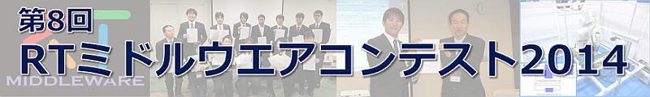

<div align="left"><a href="/ja/node/5566"></a></div>

<br>

&nbsp;&nbsp;&nbsp;&nbsp;&nbsp;&nbsp;&nbsp;&nbsp;&nbsp;<div align="center"><a href="#overview"></a></div>; &nbsp;&nbsp;&nbsp;&nbsp;&nbsp;&nbsp;&nbsp;&nbsp; <div align="center"><a href="#program"></a></div>; &nbsp;&nbsp;&nbsp;&nbsp;&nbsp;&nbsp;&nbsp;&nbsp; <div align="center"><a href="/contests/2014"></a></div>; &nbsp;&nbsp;&nbsp;&nbsp; &nbsp;&nbsp;&nbsp;&nbsp;<div align="center"><a href="#evaluation"></a></div>;

<br>

&nbsp;&nbsp;&nbsp;&nbsp;&nbsp;&nbsp;&nbsp;&nbsp;&nbsp;<div align="center"><a href="#award"></a></div>; &nbsp;&nbsp;&nbsp;&nbsp;&nbsp;&nbsp;&nbsp;&nbsp; <div align="center"><a href="#pastwork"></a></div>; &nbsp;&nbsp;&nbsp;&nbsp;&nbsp;&nbsp;&nbsp;&nbsp; <div align="center"><a href="#registration"></a></div>; &nbsp;&nbsp;&nbsp;&nbsp;&nbsp;&nbsp;&nbsp;&nbsp; <div align="center"><a href="#contact"></a></div>;

<br>

#contents

いつも、RTミドルウエアへの技術フィードバックをいただき、ありがとうございます。ロボット技術のモジュール化の普及企画として、コミュニティの醸成を期待してRTミドルウエアコンテストを実施させていただいております。 今年も皆さんのご支援とご協力をいただきながら開催させていただくよう準備を進めておりますので、ソースコードを公開して技術の蓄積を図る試みに積極的にエントリいただくようお願い申し上げます。

## 最新情報
- コンテスト申し込みのプロセスについて，記載を追加いたしました．(2014.08.20)
- 申し込みフォームをオープンいたしました．(2014.08.11)
- 奨励賞の最新情報をUPいたしました．(2014. 5. 19)
- Webページをオープンいたしました。(2013.12.25)


<!-- ------------------------------------------------------------- -->
&aname(overview){};
## 開催案内 

### 趣旨

RTミドルウエアは、ロボットを構成する様々な要素をモジュール化し、容易に組み合わせることができるようにするソフトウエア基盤としてのロボット用ミドルウエアです。モジュール化技術は、他の研究者などが開発した様々なアルゴリズムやセンサモジュールを統合してシステムを構築するのに適した技術です。しかし、その普及には便利なモジュールが提供されていることが不可欠であり、必要な部品が揃っていないと、開発者にはRTミドルウエアに対応する手間が増えるだけで、導入に躊躇することになります。

現在、RTミドルウエアのフレームワークとなるコンポーネントモデルはソフトウエアの国際標準化団体であるOMGに おいて標準仕様として採用された状況で、ロボット技術を国際的にリードするためにも国内での普及が不可欠です。そこで、ロボット技術の共有と蓄積を図るために、有益なコンポーネントを充実させるべく本コンテストを開催することにしました。また、このコンテストを通して、これからのロボットソフトウエア開発者に不可欠なRTミドルウエアに精通する技術者も育成できるものと期待しています。

### 開催概要

[計測自動制御学会(SICE)](http://www.sice.org)のシステムインテグレーション部門講演会 (SI2014) の特別セッションとしての開催を予定しております。詳細が決まり次第こちらのページでご案内いたします。


- 日時: 2014年12月15日（月）～17日（水）（SI2014の1セッションとして開催予定）
- 場所: [東京ビッグサイト](https://www.bigsight.jp/)
- 申込締切: 2014年 8月22日（金）
- 原稿〆切: 2014年 9月26日（金）

### 募集作品

本年度も、昨年に引き続き、システム構築に便利なソフトウェアライブラリやハードウェア要素の部品化（RTコンポーネント化）、RTミドルウエア技術を利用した開発ツールを対象とするとともに、既開発の部品（RTコンポーネント）を組み合わせたシステムによるロボットサービスの実現も募集対象とします。

### 応募資格

制限はありません。高専・大学等の学生や教員、企業・公設研等の技術者・研究者、個人の趣味で取り組まれている方、どなたでも結構です。

コンテストの趣旨の普及を図る点から、ソースコード（システム構成情報を含む）の公開をあらかじめご承諾ください。ソフトウエアの著作権に関しては著者が責任を持つと共に、**利用者のためにライセンスを明示**いただくようお願い致します（制約がある場合を除いて、BSDやLGPL等のよく使われているオープンソースライセンスをお勧めします）。 市販製品や他のオープンソースなどのライブラリを利用する場合は、それを明示するとともに利用者にその入手先が分かるようにしてください。知財権などの問題がありますので、学生さんは**指導教員を共著者に加えて、事前に参加許可**を得てからお申し込みください。

### 主なスケジュール

- **4月頃**: 各種奨励賞・審査基準開示
- **5月25日**: ROBOMECH2014にてRTM講習会開催
- **8月4日～8日**: RTミドルウエアサマーキャンプ
- **8月22日（金）**: エントリ〆切　（SI2014講演申込み〆切） 
- **9月26日（金）**: 原稿〆切（SI2014原稿〆切）
- **10月中旬頃**:　　ホームページにてソフトウエア登録開始（一般ユーザへの公開開始）
<!-- - ''12月初旬頃''：　プログラム及び資料登録締め切り -->
- **11月下旬～14日**: オンライン評価期間 (一般ユーザによるオンライン評価期間)
- **12月15日**：SI2014会場にて、プレゼンテーションと表彰者発表(予定)　

### 応募手順
- ** 事前登録 **~
このページ下部に連絡先の登録フォームがあります。
- [SI2014への発表申込](http://www.si-sice.org/si2014)（8月22日）~
申込セッションとして「特別OS：RTミドルウエアコンテスト2014」、講演の種類として「一般講演」をそれぞれ選択し、講演題目のところに開発したRTコンポーネントや関連技術の名称を、著者のところに開発者の情報をそれぞれ記入お願いいたします。学生さんがエントリする場合は**事前に指導教員の了承**を得るとともに、指導教員を共著者として登録いただくようお願いいたします。
- 作品登録用IDの通知（9月上旬）~
作品登録用のIDを参加者宛に通知します．
- [SI2014への予稿原稿の投稿](http://www.si-sice.org/si2014)（9月26日）~
投稿規定に従って、講演予稿集のための2～6ページの原稿を作成し、投稿ください。
- [SI2014への参加登録](http://www.si-sice.org/si2014) ~
事前参加登録の〆切りまでに参加登録を行い、参加費支払手続きをしていただくとお得です。
- [[OpenRTM-aist Webサイト:openrtm.org]]への作品登録（10月下旬予定）
  - ソースコード
  - マニュアル
  - 概要説明のスライド
  - 作品紹介の動画等

が必要となります。特に、SI2014への参加には参加登録料が必要となりますことを予めご了承ください。また、SI2014の会場にてプレゼンテーションを行うことが求められます。
SI2014の申込方法、申込および原稿〆切および具体的な開催日時やプログラムは [SI2014のホームページ](http://www.si-sice.org/si2014) にてご確認下さい。

<!-- - 概要説明のスライドダウンロード &ref(RTMContestCatalog2013.ppt); -->

### OpenRTM-aist Webサイトへの作品の登録
発表する作品は、

- OpenRTM-aist Webサイトの[プロジェクト](http://www.openrtm.org/openrtm/ja/content/%E3%83%97%E3%83%AD%E3%82%B8%E3%82%A7%E3%82%AF%E3%83%88-0)として登録すること。（プロジェクトページに紹介ビデオを掲載することを推奨）
- ソースコードをオープンにすること。
- 分かりやすいマニュアルを添付し、できるだけ第三者が結果を再現できるようにすること。
- 参考にしたRTコンポーネントやソースコードがある場合は、マニュアル・論文中で出典を明記してオリジナル作者に敬意を払うこと。
- 参考にした論文などがある場合、マニュアル、論文中で出典を明記すること。

論文の参考文献のように、お互いに成果を尊重し合う文化を醸成し、論文のインパクトファクターのソースコード版が将来的に実現できればと考えています。

### 主催・協賛
- [共同主催]　[ロボットビジネス推進協議会](http://www.roboness.jp/)
- [共同共催］ [（社）計測自動制御学会](http://www.sice.jp/)　[システムインテグレーション部門](http://www.si-sice.org/si_div/)
- [共同共催］ [（独）産業技術総合研究所](http://www.aist.go.jp/) [知能システム研究部門](http://unit.aist.go.jp/is/ci/index_j.html)
- [協賛］ 奨励賞を提供いただく団体、個人など　(協賛賞募集中)
（詳細は**[表彰(協賛)ページ](http://www.openrtm.org/openrtm/ja/node/5406/)**参照）

### 実行委員会
- 実行委員長　：平井成興 (ロボットビジネス推進協議会）
- 実行副委員長：山下智輝 (SlCE RTシステムインテグレーション部会主査）
- 実行副委員長：塩沢恵子（(株)アドイン研究所）
- 審査委員長　：原功（産総研）
- 広報委員長　：大原賢一（名城大学）

<!-- ------------------------------------------------------------- -->
&aname(program){};
## プログラム 
<table class="table-alt">
  <tr>
    <th>CENTER:100</th>
    <th>LEFT:</th>
    <th>LEFT:200</th>
    <th>LEFT:200</th>
    <th>c</th>
  </tr>
  <tr>
    <td>></td>
    <td>第A室　第1スロット</td>
    <td>著者</td>
    <td>受賞情報</td>
  </tr>
  <tr>
    <td>1A1-2 <br>(10:45 - 11:00)</td>
    <td><a href="http://www.openrtm.org/openrtm/ja/project/contest2014_18">ORiNとの連携によるRTMの産業機器用ハードウェアRTCの拡充</a></td>
    <td>藤間瑞樹（埼玉大），程島竜一（埼玉大），犬飼利宏（デンソーウェーブ），琴坂信哉（埼玉大）</td>
    <td>ベストコンセプト賞<br>優秀RT技術賞</td>
  </tr>
  <tr>
    <td>1A1-3 <br>(11:00 - 11:15)</td>
    <td><a href="http://www.openrtm.org/openrtm/ja/project/contest2014_1">低価格患者見守りシステムの開発</a></td>
    <td>谷山功紀（奈良先端大），音田恭宏（奈良高専），島田健史（奈良先端大），池田篤俊（奈良先端大），上田悦子（奈良高専），小笠原司（奈良先端大）</td>
  </tr>
  <tr>
    <td>1A1-4 <br>(11:15 - 11:30)</td>
    <td><a href="http://www.openrtm.org/openrtm/ja/project/contest2014_2">視覚脳科学研究を目的としたRTミドルウェアの応用と結果</a></td>
    <td>中村大樹（電通大），佐藤俊治（電通大），韓雪花（電通大），占部一輝（電通大）</td>
    <td>日本ロボット工業会賞<br>ベストサポート賞</td>
  </tr>
  <tr>
    <td>1A1-5 <br>(11:30 - 11:45)</td>
    <td><a href="http://www.openrtm.org/openrtm/ja/project/contest2014_4">屋内地図モデルの簡易生成コンポーネント群</a></td>
    <td>立川将（芝浦工大），土屋彩茜（芝浦工大），奥野万丈（芝浦工大），佐々木毅（芝浦工大）</td>
    <td>チェンジビジョン賞<br>RTミドルウェアを普及しま賞</td>
  </tr>
</table>

<table class="table-alt">
  <tr>
    <th>CENTER:100</th>
    <th>LEFT:</th>
    <th>LEFT:200</th>
    <th>LEFT:200</th>
    <th>c</th>
  </tr>
  <tr>
    <td>></td>
    <td>第A室　第2スロット</td>
    <td>著者</td>
    <td>受賞情報</td>
  </tr>
  <tr>
    <td>1A2-1 <br>(13:00 - 13:15)</td>
    <td><a href="http://www.openrtm.org/openrtm/ja/project/contest2014_6">オフィスソフトを操作するためのRTコンポーネント群</a></td>
    <td>宮本信彦</td>
    <td>計測自動制御学会RTミドルウェア賞<br>SUGAR SWEET ROBOTICS賞</td>
  </tr>
  <tr>
    <td>1A2-2 <br>(13:15 - 13:30)</td>
    <td><a href="http://www.openrtm.org/openrtm/ja/project/contest2014_7">複数台の移動ロボットを対象とした経路計画法の検証用RTC</a></td>
    <td>布垣俊武（立命館），朴鐘承（立命館），李周浩（立命館）</td>
  </tr>
  <tr>
    <td>1A2-3 <br>(13:30 - 13:45)</td>
    <td><a href="http://www.openrtm.org/openrtm/ja/project/contest2014_8">ロボットによるWebコンテンツ配信コンポーネントの開発</a></td>
    <td>浦野羅馬（芝浦工大），佐々木毅（芝浦工大）</td>
  </tr>
  <tr>
    <td>1A2-4 <br>(13:45 - 14:00)</td>
    <td><a href="http://openrtm.org/openrtm/ja/project/contest2014_9">ロボットとインタラクションを行うためのつま先の位置推定コンポーネント</a></td>
    <td>能口友伸（立命館），李周浩（立命館）</td>
  </tr>
  <tr>
    <td>1A2-5 <br>(14:00 - 14:15)</td>
    <td><a href="http://www.openrtm.org/openrtm/ja/project/contest2014_10">ユーザによる指差し指示のためのコンポーネント</a></td>
    <td>竹内龍（立命館），李周浩（立命館）</td>
  </tr>
</table>

<table class="table-alt">
  <tr>
    <th>CENTER:100</th>
    <th>LEFT:</th>
    <th>LEFT:200</th>
    <th>LEFT:200</th>
    <th>c</th>
  </tr>
  <tr>
    <td>></td>
    <td>第A室　第3スロット</td>
    <td>著者</td>
    <td>受賞情報</td>
  </tr>
  <tr>
    <td>1A3-1 <br>(14:30 - 14:45)</td>
    <td><a href="http://www.openrtm.org/openrtm/ja/project/contest2014_11">RTMによるカメラマンロボットの動作確実性の向上</a></td>
    <td>生田目祥吾（芝浦工大），藤本一真（芝浦工大），松日楽信人（芝浦工大）</td>
    <td>トヨタ自動車(株)パートナーロボット賞</td>
  </tr>
  <tr>
    <td>1A3-2 <br>(14:45 - 15:00)</td>
    <td><a href="http://www.openrtm.org/openrtm/ja/project/contest2014_12">メディアアートコミュニティ実現に向けたRTコンポーネントの開発と提案</a></td>
    <td>土屋彩茜（芝浦工大），立川将（芝浦工大），遠藤太貴（芝浦工大），佐々木毅（芝浦工大）</td>
    <td>NTTデータ賞<br>女流RTC賞</td>
  </tr>
  <tr>
    <td>1A3-3 <br>(15:00 - 15:15)</td>
    <td><a href="http://www.openrtm.org/openrtm/ja/project/contest2014_13">コサイン類似度を用いた日常動作認識のためのテンプレート作成および動作認識RTコンポーネント群</a></td>
    <td>柴田佳幸（中央大），新妻実保子（中央大）</td>
  </tr>
  <tr>
    <td>1A3-4 <br>(15:15 - 15:30)</td>
    <td><a href="http://www.openrtm.org/openrtm/ja/project/contest2014_14">実用的なKobuki利用のためのRTC群の開発</a></td>
    <td>Wu Shih-En（Tamkang University），松田啓明（電通大），林直宏（電通大），末廣尚士（電通大），工藤俊亮（電通大）</td>
    <td>RTC再利用賞</td>
  </tr>
  <tr>
    <td>1A3-5 <br>(15:30 - 15:45)</td>
    <td><a href="http://www.openrtm.org/openrtm/ja/project/contest2014_15">OpenRTMにより複数台Kinectを連携させた室内人物位置計測コンポーネント</a></td>
    <td>久原太志（東京理科大），陳祐樹（東京理科大），小木津武樹（東京理科大），竹村裕（東京理科大），溝口博（東京理科大）</td>
    <td>ロボットビジネス賞</td>
  </tr>
  <tr>
    <td>1A3-6 <br>(15:45 - 16:00)</td>
    <td><a href="http://www.openrtm.org/openrtm/ja/project/contest2014_16">楽器演奏のためのMIDI RTコンポーネントの開発</a></td>
    <td>松田啓明（電通大），二瓶陽介（電通大），田附雄一（電通大），工藤俊介（電通大），末廣尚士（電通大）</td>
    <td>ウィン電子工業賞<br>HOTMOCK賞<br>グローバルアシスト賞</td>
  </tr>
  <tr>
    <td>1A3-7 <br>(16:00 - 16:15)</td>
    <td><a href="http://www.openrtm.org/openrtm/ja/project/contest2014_17">LeapMotionを用いたロボットマニピュレータの操作支援コンポーネント</a></td>
    <td>三好智之（立命館），奥野和也（立命館），李周浩（立命館）</td>
  </tr>
</table>

<table class="table-alt">
  <tr>
    <th>CENTER:100</th>
    <th>LEFT:</th>
    <th>LEFT:200</th>
    <th>LEFT:200</th>
    <th>c</th>
  </tr>
  <tr>
    <td>></td>
    <td>第A室　第4スロット</td>
    <td>著者</td>
    <td>受賞情報</td>
  </tr>
  <tr>
    <td>1A4-1 <br>(16:30 - 16:45)</td>
    <td><a href="http://www.openrtm.org/openrtm/ja/project/contest2014_19">RTミドルウェアを用いたLEDキャンドルの協調動作の実現</a></td>
    <td>遠藤太貴（芝浦工大），近藤貴大（芝浦工大），佐々木毅（芝浦工大）</td>
    <td>サマーキャンプ賞</td>
  </tr>
  <tr>
    <td>1A4-2 <br>(16:45 - 17:00)</td>
    <td><a href="http://www.openrtm.org/openrtm/ja/project/contest2014_20">AR Drone用OPEN-RTM通信コンポーネントの実装</a></td>
    <td>川名雄樹（奈良先端大），Ricardez Gustavo（奈良先端大），Alfonso Garcia（奈良先端大），向山寛人（奈良先端大），高松淳（奈良先端大），小笠原司（奈良先端大）</td>
    <td>組込システム技術協会賞<br>便利ツール賞</td>
  </tr>
  <tr>
    <td>1A4-3 <br>(17:00 - 17:15)</td>
    <td><a href="http://www.openrtm.org/openrtm/ja/project/contest2014_21">RTM-RSNPによる人数管理システム</a></td>
    <td>野見山大基（芝浦工大），石田真一（芝浦工大），生田目祥吾（芝浦工大），松日楽信人（芝浦工大）</td>
    <td>アドイン賞<br>ロボットサービスイニシアチブ(RSi)賞</td>
  </tr>
  <tr>
    <td>1A4-4 <br>(17:15 - 17:30)</td>
    <td><a href="http://www.openrtm.org/openrtm/ja/project/contest2014_22">HMDを用いたPTカメラのインターネット遠隔操作</a></td>
    <td>萩谷浩史（芝浦工大），石田真一（芝浦工大），安田福啓（芝浦工大），松日楽信人（芝浦工大）</td>
  </tr>
</table>


&aname(evaluation){};
## 作品を評価する 

RTミドルウエアコンテストは、コミュニティの皆で作り上げるイベントです。作品を応募するのもひとつの貢献方法ですが、応募された作品を評価して技術フィードバックをすることや、協賛として課題を設定した奨励賞を提供することなど、皆さんのご協力をお待ちしております。

### 作品へコメントする
応募作品が集まりましたら、本Webサイト上で掲示いたします。
応募作品を実際に動かしてみるなどして試していただき、どのような環境で動作したか/しなかったか、バグやその修正のためのパッチ情報、作品に対するコメントや感想を作品のプロジェクトページに書き込み、作者にフィードバックすることが出来ます。
これらのフィードバックを元に応募者が改良を加え、SI2014でのプレゼンテーションまでに、より良い作品になるようご協力ください。
- [コメントの書き方ガイド](http://www.openrtm.org/openrtm/ja/node/4569)
<!-- - [[コンテスト作品一覧へ:/contests/2014]] -->

### 奨励賞を提供する

趣旨に賛同いただく企業（一口 2万円）、個人（一口 1万円）の協賛金で、どのような作品を期待しているかを指定した奨励賞を提供することができます。また、副賞として自社製品を提供する特別協賛や賞品協賛にもご協力ください。製品の宣伝とともに、その製品を使用したRTコンポーネントを募集するといった双方にメリットのある奨励賞に出来ればと考えています。

- [奨励賞登録フォーム](https://docs.google.com/forms/d/1_gvztEri7wISA-qfYLTmvIK59q__va8ISEAtgpH4600/viewform)


<!-- ------------------------------------------------------------- -->
&aname(award){};
## 表彰 

ロボット技術の蓄積と共有を促進することを狙って、優れた開発成果を表彰いたします。 

- 最優秀賞（学会賞) : 1件、副賞10万円
- 奨励賞（賞品協賛）: 若干、製品提供
- 奨励賞 (団体協賛) : 若干、副賞２万円
- 奨励賞 (個人協賛) : 若干、副賞１万円

総合評価として一番優秀な成果に対して、最優秀賞として「計測自動制御学会RTミドルウエア賞」を、 また、それぞれのスポンサーの視点から魅力的な開発成果に対して奨励賞を表彰いたします。多くの支持を集めた魅力的な作品ほど数多く奨励賞を獲得する、一種の投票システムになっています。
- [奨励賞一覧](http://www.openrtm.org/openrtm/ja/content/rtmcontest2014-award)

### 審査

審査委員会にて成果発表プレゼンテーションを含めて総合的に審査させていただきます。評価基準は、以下を総合的に判断いたします。

- 相互運用性を考えた機能のモジュール化やインタフェース設計、
- ユーザマニュアルの完成度、
- ソフトウエア（プログラム）としての完成度、
- 期間内に報告されたバグへの対応状況、
- 開発成果プレゼンテーションの優劣など

<!-- ------------------------------------------------------------- -->
&aname(pastwork){};
## 過去のコンテスト情報 

- [RTミドルウエアコンテスト2007](http://www.openrtm.org/rt/RTMcontest/2007/)
（[応募作品](http://www.openrtm.org/rt/RTMcontest/2007/entry_public.html)）
- [RTミドルウエアコンテスト2008](http://www.openrtm.org/rt/RTMcontest/2008/)
（[応募作品](http://www.openrtm.org/rt/RTMcontest/2008/entry.html)）
- [RTミドルウエアコンテスト2009](http://www.openrtm.org/rt/RTMcontest/2009/)
（[応募作品](http://openrtm.sakura.ne.jp/cgi-bin/wiki/wiki.cgi/2009?page=%B1%FE%CA%E7%A5%C6%A1%BC%A5%DE)）
- [RTミドルウエアコンテスト2010](http://www.openrtm.org/rt/RTMcontest/2010/)
（[応募作品](http://openrtm.sakura.ne.jp/cgi-bin/wiki/wiki.cgi/2010?page=%B1%FE%CA%E7%A5%C6%A1%BC%A5%DE)）
- [RTミドルウエアコンテスト2011](http://www.openrtm.org/rt/RTMcontest/2011/) 
（[応募作品](http://www.openrtm.org/openrtm/contests/2011)）
- [RTミドルウエアコンテスト2012](http://www.openrtm.org/openrtm/ja/node/5079) 
（[応募作品](http://www.openrtm.org/openrtm/contests/2012)）
- [RTミドルウエアコンテスト2013](http://www.openrtm.org/openrtm/ja/node/5403) 
（[応募作品](http://www.openrtm.org/openrtm/contests/2013)）


<!-- ------------------------------------------------------------- -->
&aname(contact){};
## お問い合わせ 

まず、[コンテストのFAQ](http://www.openrtm.org/openrtm/ja/node/5121)を確認いただき、問い合わせ内容に応じて下記に連絡ください。

- 応募に関すること：~
RTミドルウエアコンテスト事務局: contest2014@openrtm.org

- 冠賞のスポンサー申込に関すること：~
ロボットビジネス推進協議会事務局: contest2014@openrtm.org

- RTミドルウエアの技術的なご相談：~
RTミドルウエアの[フォーラム](http://www.openrtm.org/openrtm/ja/node/281)や、
[メーリングリスト](http://www.openrtm.org/openrtm/ja/node/275) [ rtm-users<at>openrtm.org ：要事前登録] にお問い合わせいただき、情報の共有に御協力ください。

```
 RTミドルウエアコンテスト2014 事務局
 〒305-8568 茨城県つくば市梅園１－１－１
 産業技術総合研究所　知能システム研究部門
 contest2014@openrtm.org
```

                                                      - 
&aname(registration){};
## 作品登録 

### ユーザ登録
エントリ希望者は、個別に連絡が取れるように、以下のフォームを使って事前登録して下さい。（SI2014の講演申込を済ませてから正式登録となります。重要な案内をお送りするための事前登録ですので、**エントリを迷っている時は気軽に事前登録**してください）

- 事前登録するまえにwww.openrtm.orgサイトのユーザ登録をお願いします。[ユーザ登録はこちら](http://openrtm.org/openrtm/ja/user/register)
- 当サイトに登録済みの方は<span style="color:red;">名前の欄にユーザ登録されたユーザ名が出ますが、必ず、氏名に書き換え</span>;てください。

<span style="color:red;">※お手数ですが、ユーザ登録したユーザ名でログインしていただくと、登録フォームが表示されます</span>;

### プロジェクトページへの作品登録
<span style="color:red;">事務局よりID発行後より，作品登録が可能になります．連絡があるまで，しばらくお待ちください．</span>;~
応募作品はプロジェクトページに登録する必要があります。

- [プロジェクトページ](http://openrtm.org/openrtm/ja/project/projects_ja)
  - [プロジェクト作成マニュアル](http://openrtm.org/openrtm/ja/node/1554)
  - [新規プロジェクトの作成](http://openrtm.org/openrtm/ja/node/1553)

上記のプロジェクト作成マニュアルに則り、作品を登録してください。
RTミドルウエアコンテストでは、プロジェクト登録されたコンポーネントなどがコンテスト応募作品であるかどうかを明確にするために以下のルールを取っております。下記ルールに従い作品を登録してください。

1. ボキャブラリ **RTM contest 2014** を設定する
  - プロジェクト登録画面にボキャブラリと呼ばれるタグを設定する画面が現れますが、そこで **RTM contest 2014** を選択してください。これによりRTMコンテスト参加作品であることがわかります。
1. プロジェクト名をSIの発表タイトルとできるだけ同じ名前に設定する
  - 審査の都合上、SIの発表タイトルとプロジェクト名をひも付ける必要があります。可能であればSI2014での発表タイトルと同じ名前でプロジェクトの登録をお願いいたします。ただし、論文タイトルが 「○○の□□コンポーネントの実装」のようなものの場合、プロジェクト名は 「○○の□□コンポーネント」としていただいた方が、プロジェクトページとしては妥当かと思われます。発表タイトルとプロジェクトの関係がわかる程度でプロジェクト名を設定していただきますようよろしくお願いいたします。
1. プロジェクト情報「Short project name」をcontest2014_<番号>としてください．
  - 番号は講演申し込み完了後，参加者に対して事務局よりご連絡いたします．
  - 上記だけだと、論文・発表とプロジェクトの対応が一意に取れませんので、プロジェクト情報の「Short project name」を下記のフォーマットで入力してください
```
     contest2014_X
```
  - Xは事務局よりご連絡した番号になります。これによりURLは
http://openrtm.org/openrtm/ja/project/contest2014_X
となります。

<!-- *** 当Webページへの登録 &color(red){既に終了しました。}; -->


