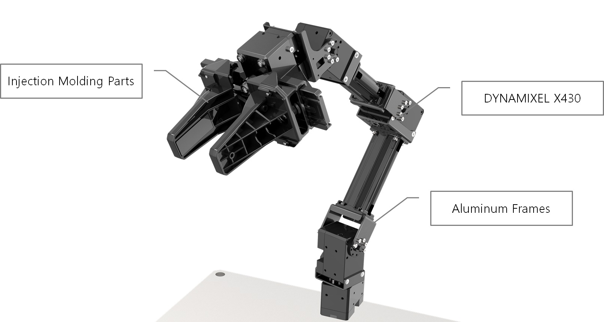

#contents(3)

RTシステムの技術の蓄積と共有を促進することを狙って優れた開発成果を表彰いたします。 昨年に引き続き、システム構築に便利なソフトウェアライブラリやハードウェア要素の部品化（RTコンポーネント化）、RTミドルウエア技術を利用した開発ツールを対象とするとともに、新たに既開発の部品（RTコンポーネント）を組み合わせたシステムによるロボットサービスの実現も募集対象とします。

## [計測自動制御学会学会](http://www.sice.jp/)RTミドルウエア賞（最優秀賞）（副賞10万円）
総合評価として一番優秀な開発成果に対して最優秀賞として 「計測自動制御学会RTミドルウエア賞」を表彰します。
      - 

## 奨励賞（賞品協賛）

### Dynamixel賞
#### 【提供：[株式会社ロボティズ](https://www.robotis.co.jp/)】

**電流制御対応の4軸+グリッパーの小型マニピュレータ組立キットOpenMANIPULATOR-XとPCに接続するためのUSBインターフェース、ACアダプターのセット 数量 1**  

近年、産業分野でもマニピュレータの自律化が進んでおり、そのためのロボットアプリケーション等のニーズが高まっています。そのような研究・開発に対応するために、[ 電流制御対応の4軸+グリッパーの小型マニピュレータ組立キットOpenMANIPULATOR-X](https://emanual.robotis.com/docs/en/platform/openmanipulator_x/overview/)とPCに接続するためのUSBインターフェース、ACアダプターのセットを提供します
[ビギナー優先賞;]

### 川崎重工業賞
#### 【提供：[川崎重工業株式会社 精密機械・ロボットカンパニー](https://kawasakirobotics.com/jp/)】

**川崎重工業株式会社 双腕スカラロボット「duAro」のプラモデル 数量 7**  

ロボットソフトウェア開発者に不可欠なミドルウェアに精通する技術者として活躍されることを期待し、全応募チームへ「duAro」プラモデルを贈ります。
[参加賞;]

      - 

## 奨励賞（団体協賛）（副賞2万円）

### 日本ロボット工業会賞
#### 【提供：一般社団法人日本ロボット工業会】

総合評価として、今回初めてRTミドルウエアコンテストにエントリーした参加者の中で、最も優秀な開発成果に対する奨励賞として「日本ロボット工業会賞」を表彰します。[狭義のビギナー限定賞;]

### グローバルアシスト賞
#### 【提供：株式会社グローバルアシスト】

汎用的な用途に利用できる可能性のある作品に対して表彰させていただきます．成果物(ソフトウェア)の完成度，有用性に加え，分析・設計/開発作業の進め方，各種ド キュメント類，既存の標準仕様への準拠なども審査の対象とさせて頂きます．

### システムズエンジニアリング賞
#### 【提供：[株式会社セック](http://www.sec.co.jp/)】

セック（Systems Engineering Consultants）は、リアルタイム技術専門のソフトウェア会社です。ロボット分野では、「ロボットにシステム工学を」というコンセプトで、研究開発とビジネス化に取り組んでいます。 本奨励賞では、単なる研究の枠にとどまらず、新しい市場の創出を予感させるイノベーティブな作品や、システム工学を追求した作品、あるいは、当社のプロダクト（OpenRTM.NET、RTM on Android等）を有効に活用した作品に対して表彰します。

### チェンジビジョン賞
#### 【提供：[株式会社チェンジビジョン](https://astah.change-vision.com/ja/)】

RTミドルウェアの普及を促し、今後の研究開発やビジネスへの貢献を連想させるような作品に対して表彰いたします。モデリング技法は問いませんが、モデリングの活用を期待します。

<!-- ***ホンダ・フロンティアロボティクス賞 -->
<!-- ****【提供：[[株式会社本田技術研究所>https://www.honda.co.jp/RandD/innovative_research-e/]]】 -->
<!-- RTC を用いることで、頑強で安定した商品化に容易につながるようなアプリケーションに対して表彰することで、RTC の利用促進・普及を期待します。 -->

### パナソニック アドバンストテクノロジー(株)賞
#### 【提供：[パナソニック アドバンストテクノロジー株式会社](http://adtsd.jpn.panasonic.com/)】

パナソニック アドバンストテクノロジー(株)は、システムおよびソフトウェア設計開発を通じて、安全・安心、快適・便利な暮らしの実現を目的にした技術開発会社です。本奨励賞では、開発目的の意欲性、設計の品質、開発手法のレベル等をポイントとして総合的に評価させていただきます。

### ロボットサービスイニシアチブ(RSi)賞
#### 【提供：[ロボットサービスイニシアチブ ](http://www.robotservices.org/)】

<!-- パーソナルロボットによる通信ネットワークを活用した魅力あるサービスであり、新しいロボット産業誕生に繋がることを期待できるロボットサービスを表彰いたします。ロボットサービスはＲＳＮＰライブラリを用いて開発し、ＲＴコンポーネントと組み合わせたサービスであること、相互運用性がありロボットならではのサービス提供モデルが提案されていることを評価のポイントとします。 -->
パーソナルロボットによる通信ネットワークを活用した魅力あるサービスであり、新しいロボット産業誕生に繋がることを期待できるロボットサービスを表彰いたします。相互運用性がありロボットならではのサービス提供モデルが提案されていることを評価のポイントとします。また、ＲＳＮＰライブラリを用いて開発し、ＲＴコンポーネントと組み合わせたサービスの提案も歓迎します。

### アドイン賞
#### 【提供:[株式会社アドイン研究所](http://www.adin.co.jp/)】

実世界の多様性に適応可能な優れた技術を実現したRTコンポーネントの開発に対して表彰します。

      - 

## 奨励賞（個人協賛）（副賞1万円）

### ベストサポート賞 
#### 【提供：[神徳徹雄](http://staff.aist.go.jp/t.kotoku/)（産総研）】

RTミドルウエアが目指す、技術の共有と再利用のためには、使ってもらうためのホームページ作りと、 皆に利用していただいて完成度や使い勝手を高めるというプロセスが欠かせません。もっとも活発にユーザからの質問・コメント・要望を集め、それに対して積極的にサポートした作品に対して贈呈いたします。

### 便利ツール賞
#### 【提供：[末廣尚士](http://www.taka.is.uec.ac.jp/)（電気通信大学）】

ＲＴＭを利用してロボットアプリケーションシステムを構築するために有用なツールを表彰することで、そのようなツールの開発促進・普及を期待します。

### カーボンニュートラルロボティクス賞
#### 【提供：（株）前川製作所】

近年気候変動に対する取り組みが世界的に進む中，2020年10月に国会で「カーボンニュートラル」実現への宣言が出て以来，国内でもカーボンニュートラルへの取り組みが始まっています．本賞では，ロボット分野でもカーボンニュートラルに貢献できる要素技術，システム技術があることを示してくれる作品に対して贈賞したいと考えています．

### RTM技術賞
#### 【提供：[安藤慶昭](https://n-ando.github.io/) （産総研）】

RTミドルウェアの利便性を高めるRTCやそのシステム、ツール、OpenRTM-aistそのものの拡張等、RTミドルウェアの可能性を広げる可能性のある作品に対して贈賞します。

### RTミドルウェアサマーキャンプ賞
#### 【提供：大原賢一（名城大学）】

RTミドルウェアサマーキャンプに参加した方の作品で，優秀な作品を表彰します．[ビギナー限定賞;]

<!-- *** 女流RTコンポーネント賞 -->
<!-- **** 【提供：[[平井成興>http://www.furo.org/]]（NEDO）】 -->

<!-- 女性の研究者、技術者、学生、その他ＲＴミドルウェアに関心をもつ持つ女性が主体となって作成した作品を表彰することで、ＲＴミドルウェア普及に女性の力を活用しようというものである。[&color(red){女性限定賞};][&color(red)//{ビギナー限定賞};] -->

### ベストチーム賞
#### 【提供：平井成興】

チームワークが一番生きていたと感じられるチームに贈ります。

<!-- *** RTミドルウェアを普及しま賞 -->
<!-- **** 【提供：[[塩沢恵子>http://www.adin.co.jp/]]（株式会社アドイン研究所）】 -->

<!-- 多様なフィールドで、こんなサービスを実現したい！をＲＴミドルウェアを使って簡易に実現し、その効果を実証することで、ＲＴミドルウェアの普及に貢献している作品に対して贈呈いたします。 -->

※今後も、順次掲載予定です。もう少々お待ちください。

（お申し込み順に掲載させていただいております）

## 審査基準
- 奨励賞の評価基準は、各奨励賞の視点で奨励賞のスポンサーが選定いたします。

## 成果発表会と表彰式
- 日時: 2022年12月14日（水） 13:25-16:45 （SI2022のOSとして開催）
  - 13:25-15:10 セッション審査
  - 15:10-16:00 最終審査委員会
  - 16:00-16:45 表彰式
- 場所: 幕張メッセ国際会議場

