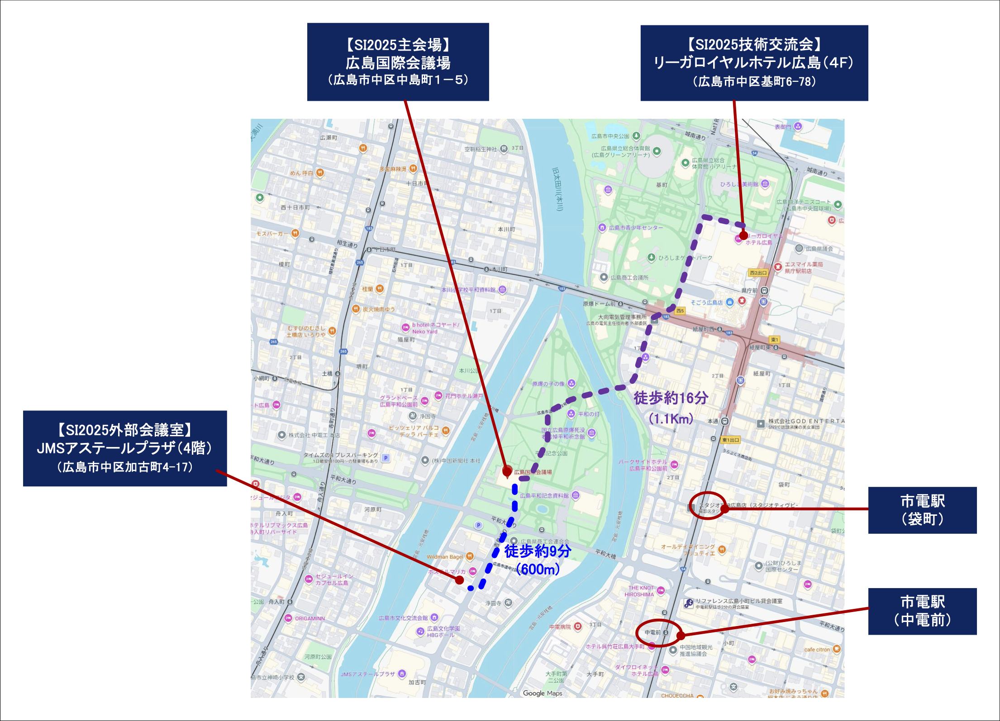
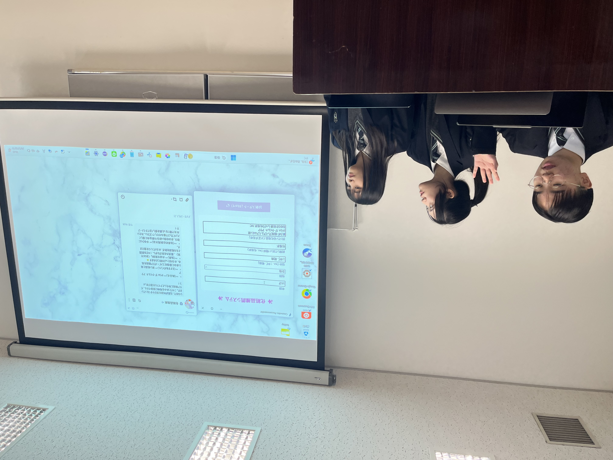
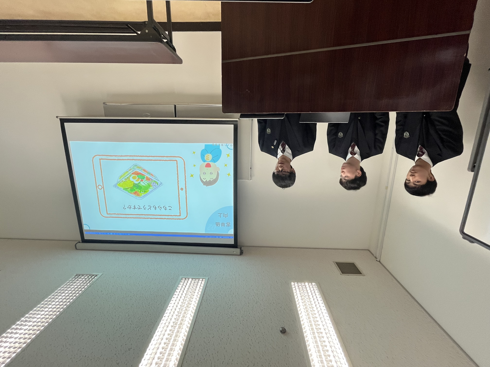
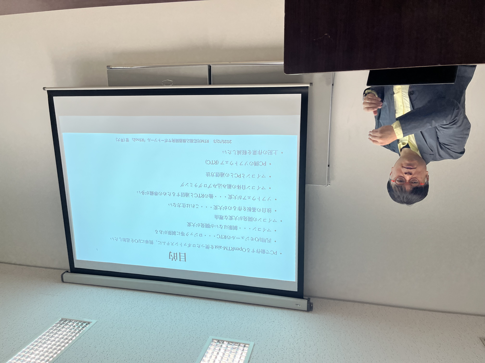

<br>

&nbsp;&nbsp;&nbsp;&nbsp;&nbsp;&nbsp;&nbsp;&nbsp;&nbsp;&nbsp;&nbsp;&nbsp;&nbsp;&nbsp;<div align="center"><a href="#overview"></a></div>;
&nbsp;&nbsp;&nbsp;&nbsp;&nbsp;&nbsp;&nbsp;&nbsp; <div align="center"><a href="#program"></a></div>; 
&nbsp;&nbsp;&nbsp;&nbsp;&nbsp;&nbsp;&nbsp;&nbsp; <div align="center"><a href="http://www.openrtm.org/openrtm/ja/category/rtm-contest/rtm-contest-2025"></a></div>;
<!-- &nbsp;&nbsp;&nbsp;&nbsp;&nbsp;&nbsp;&nbsp;&nbsp; &ref(contest2013_worklist.png,50%,url=/ja/contests/2025); -->
&nbsp;&nbsp;&nbsp;&nbsp; &nbsp;&nbsp;&nbsp;&nbsp;<div align="center"><a href="#evaluation"></a></div>;

<br>

&nbsp;&nbsp;&nbsp;&nbsp;&nbsp;&nbsp;&nbsp;&nbsp;&nbsp;&nbsp;&nbsp;&nbsp;&nbsp;&nbsp;<div align="center"><a href="#award"></a></div>; 
&nbsp;&nbsp;&nbsp;&nbsp;&nbsp;&nbsp;&nbsp;&nbsp; <div align="center"><a href="#pastwork"></a></div>; 
&nbsp;&nbsp;&nbsp;&nbsp;&nbsp;&nbsp;&nbsp;&nbsp; <div align="center"><a href="#registration"></a></div>;
&nbsp;&nbsp;&nbsp;&nbsp;&nbsp;&nbsp;&nbsp;&nbsp; <div align="center"><a href="#contact"></a></div>;

<br>

#contents

いつも、RTミドルウエアへの技術フィードバックをいただき、ありがとうございます。ロボット技術のモジュール化の普及企画として、コミュニティの醸成を期待してRTミドルウエアコンテストを実施させていただいております。 今年も皆さんのご支援とご協力をいただきながら開催させていただくよう準備を進めておりますので、ソースコードを公開して技術の蓄積を図る試みに積極的にエントリいただくようお願い申し上げます。

## 最新情報

- Webページをオープンいたしました。(2025.05.26)
<!-- - コンテストの日程が確定いたしました。(2024.09) -->
<!-- - 応募手順を掲載しました。(2021.MM.DD) -->
<!-- -エントリーは締め切りとなりました．多数のご応募ありがとうございました。(2021.08.16) -->
<!-- -コンテスト作品の登録方法について掲載しました(2021.MM.DD) -->
<!-- -コンテスト応募の皆様には個別で連絡申し上げましたが、''&color(red){コンテスト作品のページ登録締め切り日は10月31日まです．};''期限内での登録をお願い申し上げます．(2017.MM.DD) -->
<!-- -コンテストの作品一覧とプレゼンテーションのプログラムを掲載しました。(2017.MM.DD) -->
<!-- -RTコンテスト2021成果発表会を盛況に開催することができました。審査結果は[[プログラム>#program]]をご覧下さい。(2021.12.12) -->


&aname(overview){};
## 開催案内 

### 趣旨

RTミドルウエアは、ロボットを構成する様々な要素をモジュール化し、容易に組み合わせることができるようにするソフトウエア基盤としてのロボット用ミドルウエアです。モジュール化技術は、他の研究者などが開発した様々なアルゴリズムやセンサモジュールを統合してシステムを構築するのに適した技術です。しかし、その普及には便利なモジュールが提供されていることが不可欠であり、必要な部品が揃っていないと、開発者にはRTミドルウエアに対応する手間が増えるだけで、導入に躊躇することになります。

現在、RTミドルウエアのフレームワークとなるコンポーネントモデルはソフトウエアの国際標準化団体であるOMGに おいて標準仕様として採用された状況で、ロボット技術を国際的にリードするためにも国内での普及が不可欠です。そこで、ロボット技術の共有と蓄積を図るために、有益なコンポーネントを充実させるべく本コンテストを開催することにしました。また、このコンテストを通して、これからのロボットソフトウエア開発者に不可欠なRTミドルウエアに精通する技術者も育成できるものと期待しています。

### 開催概要

[計測自動制御学会(SICE)](http://www.sice.jp)の[システムインテグレーション部門講演会 (SI2025) ](https://sice-si.org/si2025/)の特別セッションとしての開催を予定しております。詳細が決まり次第こちらのページでご案内いたします。

- 日時: 2025年12月10日(水)
- 場所: JMSアステールプラザ H室（中会議室）
  - [JMSアステールプラザへのアクセス](https://sice-si.org/conf/si2025/venue.php)
<div align="left"><a href="map_251201.png"></a></div>
- オープンフォーラムとなっておりますのでどなたでもご参加いただけます。
- 申込締切: 2025年 9月下旬
- 原稿〆切: 2025年 10月下旬


### 募集作品

本年度も、昨年に引き続き、システム構築に便利なソフトウェアライブラリやハードウェア要素の部品化（RTコンポーネント化）、RTミドルウエア技術を利用した開発ツールを対象とするとともに、既開発の部品（RTコンポーネント）を組み合わせたシステムによるロボットサービスの実現も募集対象とします。

### 応募資格

制限はありません。高専・大学等の学生や教員、企業・公設研等の技術者・研究者、個人の趣味で取り組まれている方、どなたでも結構です。

コンテストの趣旨の普及を図る点から、ソースコード（システム構成情報を含む）の公開をあらかじめご承諾ください。ソフトウエアの著作権に関しては著者が責任を持つと共に、**利用者のためにライセンスを明示**いただくようお願い致します（制約がある場合を除いて、BSDやLGPL等のよく使われているオープンソースライセンスをお勧めします）。 市販製品や他のオープンソースなどのライブラリを利用する場合は、それを明示するとともに利用者にその入手先が分かるようにしてください。知財権などの問題がありますので、学生さんは**指導教員を共著者に加えて、事前に参加許可**を得てからお申し込みください。


### 主催・協賛
- [共同主催]　[日本ロボット工業会](https://www.jara.jp/)
- [共同共催］ [公益社団法人 計測自動制御学会](https://www.sice.jp/) [システムインテグレーション部門](http://www.sice-si.org)
- [共同共催］ [国立研究開発法人産業技術総合研究所](https://www.aist.go.jp/) 
- [協賛］ 奨励賞を提供いただく団体、個人など　(協賛賞募集中)
<!-- （詳細は''[[表彰(協賛)ページ>http://www.openrtm.org/openrtm/ja/node/5406/]]''参照） -->

&aname(program){};
## プログラム

当日ZooMミーティングでプレゼンテーションを視聴できます。以下のZoomリンクからお入りください。

- [ Zoomミーティング](https://us02web.zoom.us/j/81689478098?pwd=XAcJVHsIQaU6GF6B0lGc3lH7keeMYV.1)
  - ミーティング ID: 816 8947 8098 
  - パスコード: 739500 

<table class="table-alt">
  <tr>
    <th>CENTER:160</th>
    <th>CENTER:160</th>
    <th>LEFT:600</th>
    <th>LEFT:600</th>
    <th>LEFT:600</th>
    <th>c</th>
  </tr>
  <tr>
    <td>></td>
    <td>></td>
    <td>></td>
    <td>2025年12月10日 10:40~</td>
  </tr>
  <tr>
    <td>番号</td>
    <td>時間</td>
    <td>タイトル</td>
    <td>所属・氏名</td>
  </tr>
  <tr>
    <td>si2025-0026</td>
    <td>10:40-10:55</td>
    <td><a href="/ja/project/contest2025-si2025-0026">利用者の肌の情報と気象情報を用いたAI化粧品選出システムの開発 </a></td>
    <td>山田　留里花 、烏田　美歌 、鈴木　悠花 <br>（芝浦工業大学附属高等学校 ） <br>佐々木　毅 （芝浦工業大学 ）<br> 山岡　佳代 、米川　大地 <br> （芝浦工業大学附属中学高等学校 ）</td>
    <td>フレッシャーズ賞<br> チェンジビジョン賞</td>
  </tr>
  <tr>
    <td>si2025-0048</td>
    <td>10:55-11:10</td>
    <td><a href="/ja/project/contest2025-si2025-0048">大型小売店向け自動走行案内ロボ『スマートカート』の開発</a></td>
    <td>平松　蓮 、河合　航希 、森尾　太一 <br> （芝浦工業大学附属中学校） <br> 山岡　佳代、米川　大地<br> （芝浦工業大学附属中学高等学校）<br> 佐々木　毅 （芝浦工業大学 ）</td>
    <td>ベストサポート賞<br> ロボットサービスイニシアチブ賞<br> 日本ロボット工業会賞</td>
  </tr>
  <tr>
    <td>si2025-1059</td>
    <td>11:10-11:25</td>
    <td><a href="/ja/project/contest2025-si2025-1059">RTミドルウェア対応組み込み機器開発をサポートするためツール「RTno2」の開発</a></td>
    <td>菅　佑樹 、尾形　哲也 （早稲田大学 ）</td>
    <td>RTM技術賞<br>帰ってきた「世界一小さなRTコンポーネント賞」</td>
  </tr>
  <tr>
    <td>si2025-1336</td>
    <td>11:25-11:40</td>
    <td><a href="/ja/project/contest2025-si2025-1336">コンテナ技術を活用したソフトウェアプロファイルに基づくソフトウェアモジュール生成・運用に関する研究</a></td>
    <td>斎藤　雅弘 、大原　賢一 （名城大学 ）</td>
    <td><span style="color:red;">計測自動制御学会学会RTミドルウエア賞（最優秀賞）</span>;<br>グローバルアシスト賞<br>システムエンジニアンリング賞<br> SUGAR SWEET ROBOTICS賞</td>
  </tr>
  <tr>
    <td></td>
    <td>11:40-12:10頃</td>
    <td>></td>
    <td>審査委員会</td>
  </tr>
  <tr>
    <td></td>
    <td>12:10〜12:40</td>
    <td>></td>
    <td>表彰式</td>
  </tr>
</table>


&aname(evaluation){};
## 作品を評価する 

RTミドルウエアコンテストは、コミュニティの皆で作り上げるイベントです。作品を応募するのもひとつの貢献方法ですが、応募された作品を評価して技術フィードバックをすることや、協賛として課題を設定した奨励賞を提供することなど、皆さんのご協力をお待ちしております。

### 作品へコメントする
応募作品が集まりましたら、本Webサイト上で掲示いたします。

応募作品を実際に動かしてみるなどして試していただき、どのような環境で動作したか/しなかったか、バグやその修正のためのパッチ情報、作品に対するコメントや感想を作品のプロジェクトページに書き込み、作者にフィードバックすることが出来ます。コメントの受付はGitHubのissue等を使う事もできます。その場合は、プロジェクトページにその旨を記載してください。
これらのフィードバックを元に応募者が改良を加え、SI2025でのプレゼンテーションまでに、より良い作品になるようご協力ください。
- [コメントの書き方ガイド](/node/4569)

- コンテスト作品一覧へ（ただいま準備中です）
<!-- - [[コンテスト作品一覧へ:/contests/2021]] -->

### 奨励賞を提供する

趣旨に賛同いただく企業（一口 2万円）、個人（一口 1万円）の協賛金で、どのような作品を期待しているかを指定した奨励賞を提供することができます。また、副賞として自社製品を提供する特別協賛や賞品協賛にもご協力ください。製品の宣伝とともに、その製品を使用したRTコンポーネントを募集するといった双方にメリットのある奨励賞に出来ればと考えています。奨励賞に関するお問い合わせは当ページ一番下に記載しました、日本ロボット工業会事務局でお願い申し上げます。

<!-- 詳細は準備中です。 -->

お申し込みは、奨励賞申し込み書の送付または以下のオンラインフォーム、いずれからでも結構です。

- 冠賞スポンサー依頼・奨励賞申し込み書: <div align="center"><a href="RTMContestSponsorForm2025.pdf"></a></div>;
  - Word版: <div align="center"><a href="RTMContestSponsorForm2025.docx"></a></div>;
<!-- - [[奨励賞登録フォーム>https://forms.gle/vqZogZWknUHqfbb79]](MicrosoftFormに移動します) -->
- [奨励賞登録フォーム](https://forms.office.com/r/1UbnHgwFxw)(MicrosoftFormsに移動します)
<!-- -- ※当webサイトにてユーザログインしないと入力フォームが表示されませんので、ユーザ登録がまだの方は当Webページのユーザ登録をお願いします。[[ユーザ登録はこちら>http://openrtm.org/openrtm/ja/user/register]] -->

&aname(award){};
## 表彰 

ロボット技術の蓄積と共有を促進することを狙って、優れた開発成果を表彰いたします。 

- 最優秀賞（学会賞) : 1件、副賞10万円
- 奨励賞（賞品協賛）: 若干、製品提供
- 奨励賞 (団体協賛) : 若干、副賞２万円
- 奨励賞 (個人協賛) : 若干、副賞１万円

総合評価として一番優秀な成果に対して、最優秀賞として「計測自動制御学会RTミドルウエア賞」を、 また、それぞれのスポンサーの視点から魅力的な開発成果に対して奨励賞を表彰いたします。多くの支持を集めた魅力的な作品ほど数多く奨励賞を獲得する、一種の投票システムになっています。

- [奨励賞一覧](/ja/content/rtmcontest2025-award)
<!-- - 奨励賞一覧(順次掲載予定です。もう少々お待ちください。) -->
<!-- -- 今後も、順次掲載予定です。もう少々お待ちください。 -->


### 主なスケジュール
- **8月中旬**: RTミドルウエアサマーキャンプ
- **8月30日（金）**: エントリ〆切　（SI2025講演申込み〆切）
- **10月3日**: 原稿〆切（SI2025原稿〆切）
<!-- - ''10月25日（水）'': 原稿〆切（SI2025原稿〆切） -->
- **11月上旬頃**: ホームページにてソフトウエア登録開始（一般ユーザへの公開開始）
- **11月下旬**: 作品登録締め切り
- **11月下旬～12月10日**: オンライン評価期間 (一般ユーザによるオンライン評価期間)
- **12月10日**: SI2025会場にて、プレゼンテーションと表彰者発表　
- **12月11日**: SI2025授賞式にて最優秀者表彰

### 応募手順

- [SI2025への発表申込](https://sice-si.org/conf/si2025/)
申込セッションとして「特別OS：RTミドルウエアコンテスト2025」、講演の種類として「一般講演」をそれぞれ選択し、講演題目のところに開発したRTコンポーネントや関連技術の名称を、著者のところに開発者の情報をそれぞれ記入お願いいたします。学生さんがエントリする場合は**事前に指導教員の了承**を得るとともに、指導教員を共著者として登録いただくようお願いいたします。~
※申し込み締切日が決まってますので、**エントリー登録を決意した方はSI2025の講演申し込みを先に進めてください**。

- [SI2025への予稿原稿の投稿](https://sice-si.org/conf/si2025/)（10月3日）~ //後で修正
投稿規定に従って、講演予稿集のための2～6ページの原稿を作成し、投稿ください。
- [SI2025への参加登録](https://sice-si.org/conf/si2025/) ~
事前参加登録の〆切りまでに参加登録を行い、参加費支払手続きをしていただくとお得です。
<!-- - Githubサイトへの作品登録''(10月31日)'' -->
- Githubサイトへの作品登録
  - ソースコード
  - マニュアル
  - 概要説明のスライド
  - 作品紹介の動画等

が必要となります。特に、SI2025への参加には参加登録料が必要となりますことを予めご了承ください。また、SI2025の会場にてプレゼンテーションを行うことが求められます。
SI2025の申込方法、申込および原稿〆切および具体的な開催日時やプログラムは [SI2025のホームページ](https://sice-si.org/conf/si2025/) にてご確認下さい。

### OpenRTM-aist Webサイトへの作品の登録
発表する作品は、

- github等の上に登録し以下の要件を満たすこと。(URLを rtm-contest@aist.go.jp へお知らせください。)
- 作品を紹介するページを作成すること。 (github では MarkdownでWebページを作成することができます。 参考：[過去の優勝者のページ](https://github.com/Nobu19800/RTM-Lua)、 [プロジェクトのドキュメント①](https://github.com/Nobu19800/RTM-Lua/blob/master/README.md)、 [プロジェクトのドキュメント②](https://nobu19800.github.io/RTM-Lua/docs/)）
ソースコードをオープンにすること。
- 分かりやすいマニュアルを添付し、できるだけ第三者が結果を再現できるようにすること。
- 参考にしたRTコンポーネントやソースコードがある場合は、マニュアル・論文中で出典を明記してオリジナル作者に敬意を払うこと。
- 参考にした論文などがある場合、マニュアル、論文中で出典を明記すること

論文の参考文献のように、お互いに成果を尊重し合う文化を醸成し、論文のインパクトファクターのソースコード版が将来的に実現できればと考えています。

&aname(pastwork){};
## 過去のコンテスト情報 

- [RTミドルウエアコンテスト2007](http://www.openrtm.org/rt/RTMcontest/2007/)
（[応募作品](http://www.openrtm.org/rt/RTMcontest/2007/entry_public.html)）
- [RTミドルウエアコンテスト2008](http://www.openrtm.org/rt/RTMcontest/2008/)
（[応募作品](http://www.openrtm.org/rt/RTMcontest/2008/entry.html)）
- [RTミドルウエアコンテスト2009](http://www.openrtm.org/rt/RTMcontest/2009/)
（[応募作品](http://openrtm.sakura.ne.jp/cgi-bin/wiki/wiki.cgi/2009?page=%B1%FE%CA%E7%A5%C6%A1%BC%A5%DE)）
- [RTミドルウエアコンテスト2010](http://www.openrtm.org/rt/RTMcontest/2010/)
（[応募作品](http://openrtm.sakura.ne.jp/cgi-bin/wiki/wiki.cgi/2010?page=%B1%FE%CA%E7%A5%C6%A1%BC%A5%DE)）
- [RTミドルウエアコンテスト2011](http://www.openrtm.org/rt/RTMcontest/2011/) 
（[応募作品](http://www.openrtm.org/openrtm/contests/2011)）
- [RTミドルウエアコンテスト2012](http://www.openrtm.org/openrtm/ja/node/5079) 
（[応募作品](http://www.openrtm.org/openrtm/contests/2012)）
- [RTミドルウエアコンテスト2013](http://www.openrtm.org/openrtm/ja/content/rtmcontest2013) 
（[応募作品](http://www.openrtm.org/openrtm/contests/2013)）
- [RTミドルウエアコンテスト2014](http://www.openrtm.org/openrtm/ja/content/rtmcontest2014) 
（[応募作品](http://www.openrtm.org/openrtm/contests/2014)）
- [RTミドルウエアコンテスト2015](http://www.openrtm.org/openrtm/ja/content/rtmcontest2015) 
（[応募作品](http://www.openrtm.org/openrtm/contests/2015)）
- [RTミドルウエアコンテスト2016](http://www.openrtm.org/openrtm/ja/content/rtmcontest2016) 
（[応募作品](http://www.openrtm.org/openrtm/contests/2016)）
- [RTミドルウエアコンテスト2017](/content/rtmcontest2017) 
（[応募作品](http://www.openrtm.org/openrtm/contests/2017)）
- [RTミドルウエアコンテスト2018](/content/rtmcontest2018) 
（[応募作品](http://www.openrtm.org/openrtm/contests/2018)）
- [RTミドルウエアコンテスト2019](/content/rtmcontest2019) 
（[応募作品](http://www.openrtm.org/openrtm/contests/2019)）
- [RTミドルウエアコンテスト2020](/content/rtmcontest2020) 
（[応募作品](http://www.openrtm.org/openrtm/contests/2020)）
- [RTミドルウエアコンテスト2021](/content/rtmcontest2021) 
（[応募作品](http://www.openrtm.org/openrtm/contests/2021)）
- [RTミドルウエアコンテスト2022](/content/rtmcontest2022)  
（[応募作品](http://www.openrtm.org/openrtm/contests/2022)）
- [RTミドルウエアコンテスト2023](/content/rtmcontest2023)  
（[応募作品](http://www.openrtm.org/openrtm/contests/2023)）
- [RTミドルウエアコンテスト2024](/content/rtmcontest2024)  
（[応募作品](http://www.openrtm.org/openrtm/contests/2024)）

<!-- &aname(registration){}; -->
<!-- ** コンテスト作品のwebへの登録方法  -->

### プロジェクトページへの作品登録
<!-- &color(red){事務局よりID発行後より，作品登録が可能になります．連絡があるまで，しばらくお待ちください．};~ -->
応募作品は期日までにプロジェクトページに登録する必要があります。

- [プロジェクトページ](http://openrtm.org/openrtm/ja/project/projects_ja)
  - [プロジェクト作成マニュアル](http://openrtm.org/openrtm/ja/node/1554)
<!-- -- [[新規プロジェクトの作成:http://openrtm.org/openrtm/ja/node/1553]] -->

上記のプロジェクト作成マニュアルに則り、作品を登録してください。
RTミドルウエアコンテストでは、プロジェクト登録されたコンポーネントなどがコンテスト応募作品であるかどうかを明確にするために以下のルールを取っております。下記ルールに従い作品を登録してください。

1. 事務局で作成済みのプロジェクトページを開いて、「編集」をクリックしてください。
  - 「編集」などの項目はログインしている状態で表示されます。
<!-- + ボキャブラリ ''RTM contest 2025' を設定する -->
<!-- -- プロジェクト登録画面にボキャブラリと呼ばれるタグを設定する画面が現れますが、そこで ''RTM contest 2025' を選択してください。これによりRTMコンテスト参加作品であることがわかります。 -->
<!-- + プロジェクト名をSIの発表タイトルとできるだけ同じ名前に設定する -->
  - 審査の都合上、SIの発表タイトルとプロジェクト名をひも付ける必要があります。可能であればSI2025での発表タイトルと同じ名前でプロジェクトの登録をお願いいたします。ただし、論文タイトルが 「○○の□□コンポーネントの実装」のようなものの場合、プロジェクト名は 「○○の□□コンポーネント」としていただいた方が、プロジェクトページとしては妥当かと思われます。発表タイトルとプロジェクトの関係がわかる程度でプロジェクト名を設定していただきますようよろしくお願いいたします。
<!-- + プロジェクト情報「Short project name」をcontest2025_<番号>としてください． -->
<!-- --番号は講演申し込み完了後，参加者に対して事務局よりご連絡いたします． -->
<!-- -- 上記だけだと、論文・発表とプロジェクトの対応が一意に取れませんので、プロジェクト情報の「Short project name」を下記のフォーマットで入力してください -->
<!-- contest2025_X -->
<!-- -- Xは事務局よりご連絡した番号になります。これによりURLは -->
<!-- http://openrtm.org/openrtm/ja/project/contest2025_X -->
<!-- となります。 -->

&aname(contact){};
## お問い合わせ 

まず、[コンテストのFAQ](/ja/node/5121)を確認いただき、問い合わせ内容に応じて下記に連絡ください。<br>
※スパムメール対策のため、以下に記載したメールアドレスで<at>の部分は@に読み替えて下さい。

- 応募に関すること：~

RTミドルウエアコンテスト事務局: rtm-contest<at>aist.go.jp

- 冠賞のスポンサー申込に関すること：~
ロボットビジネス推進協議会事務局: rtm-contest<at>aist.go.jp

```
 RTミドルウエアコンテスト2025 事務局
 〒305-8568 茨城県つくば市梅園１－１－１
 産業技術総合研究所　インテリジェントシステム研究部門
 rtm-contest<at>aist.go.jp
```

                                                      - 

<!-- ** エントリー登録 -->

<!-- //&color(red){既に終了しました。}; -->
<!-- エントリー希望者は、個別に連絡が取れるように、以下のフォームを使って事前登録して下さい。 -->

<!-- - 当webサイトにてユーザログインしないと入力フォームが表示されませんので、ユーザ登録がまだの方は当Webページのユーザ登録をお願いします。[[ユーザ登録はこちら>http://openrtm.org/openrtm/ja/user/touroku]] -->
<!-- - 入力フォームにしたがって作品タイトル、氏名、エントリー歴、奨励賞受賞歴（あり/なし）等を入力して下さい。[[各種奨励賞>http://www.openrtm.org/openrtm/ja/content/rtmcontest2025-award]]選考の参考とさせていただきます。 -->

## コンテスト当日の様子


<div align="center"><a href="contest2025_007.jpg"></a></div>
<br>
<br>
<br>
<br>
<div align="center"><a href="contest2025_008.jpg"></a></div>
<br>
<br>
<br>
<br>
<div align="center"><a href="contest2025_009.jpg"></a></div>
<br>
<br>
<br>
<br>

