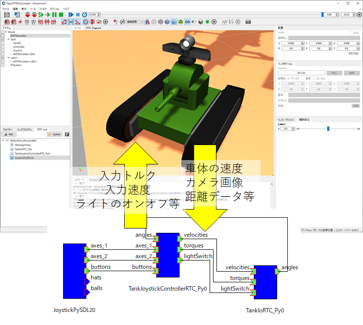

i---
layout: page
title: "Procedure for Creating a Custom Execution Context"
---

<!-- Choreonoid OpenRTMプラグインの利用方法 -->
#contents
Choreonoid is open-source robot simulation software.
It is highly extensible, and physics engines, communication functions, scripting functions, control algorithms, and other features can be added as C++ plugins.

- [Choreonoid Homepage](https://choreonoid.org/en/)

The OpenRTM plugin for Choreonoid can start RTCs on Choreonoid and create RTCs that associate inputs and outputs such as torque and velocity of objects in the simulator, vision sensors, laser range sensors, and others with port inputs and outputs.
This enables external RTCs to work together with Choreonoid inputs and outputs, improves simulator execution efficiency through RTC reuse, and enables seamless migration from the simulator environment to the real-machine environment.

<div align="center"><a href="choreonoid1_1.png"></a></div>

This page explains the installation procedure for the OpenRTM plugin.


## Build Procedure
The OpenRTM plugin currently no longer supports OpenRTM-aist 1.2.2 and earlier versions.
OpenRTM-aist version 2.0.0 or later must be installed.

### Windows
#### Building and Installing OpenRTM-aist

Build and install OpenRTM-aist+omniORB by following the procedure below.
* This is not necessary if OpenRTM-aist has been installed using the installer.

- [Procedure for Building OpenRTM-aist (C++ version) with CMake]({{ site.baseurl }}/en/doc/installation/install_2_0/cpp_2_0/build_2_0/openrtm_cpp_cmake_build#windowsomniorb)

However, when running CMake, specify the OpenRTM-aist installation folder so that it is installed there.

```
 set OPENRTM_INSTALL_DIR=C:/work/openrtm_install
 set OMNIORB_SOURCE_DIR=C:/workspace/omniORB-4.2.5-x64-vc14-py310
 cmake .. -DORB_ROOT=%OMNIORB_SOURCE_DIR% -DCMAKE_INSTALL_PREFIX=%OPENRTM_INSTALL_DIR%
 cmake --build . --config Release
 cmake --build . --config Release --target install
```

Also, extract the OpenSSL header files and libraries to an appropriate location.

- https://openrtm.org/pub/OpenSSL/1.1.0/

#### Building and Installing Choreonoid

Build and install Choreonoid by following the procedure below.

- [Building and Installing from Source Code (Windows)](https://choreonoid.org/en/documents/latest/install/build-windows.html)

Pay attention to the versions of CMake, Boost, and Qt.

- If the CMake version is old, Boost libraries may not be detected. Install the latest version as much as possible.
- Boost is installed by default in a folder such as **C:\local\boost_1_77_0**, but CMake searches for Boost from **C:\local\boost_{version number}**. Therefore, if an older version is already installed under **C:\local\**, note that CMake may detect that version.

To use the OpenRTM plugin, the CORBA plugin must be built and various files such as header files must be installed.
Also, to use the OpenRTM Python plugin, the Python plugin must be built.

<table class="table-alt">
  <tr>
    <th>Setting Item</th>
    <th>Description</th>
    <th>Setting Example</th>
  </tr>
  <tr>
    <td>ENABLE_CORBA</td>
    <td>Enable or disable CORBA communication functions</td>
    <td>ON</td>
  </tr>
  <tr>
    <td>BUILD_CORBA_PLUGIN</td>
    <td>Whether to build the CORBA plugin</td>
    <td>ON</td>
  </tr>
  <tr>
    <td>CHOREONOID_OMNIORB_DIR</td>
    <td>Path to the omniORB installation folder</td>
    <td><strong>'C:/work/openrtm_install/2.0.0/omniORB/4.2.5_vc16</strong>'</td>
  </tr>
  <tr>
    <td>INSTALL_SDK</td>
    <td>Whether to install various files such as header files</td>
    <td>ON</td>
  </tr>
  <tr>
    <td>ENABLE_PYTHON</td>
    <td>Whether to build the Python scripting function and Python plugin</td>
    <td>ON</td>
  </tr>
  <tr>
    <td>CMAKE_INSTALL_PREFIX</td>
    <td>Choreonoid installation folder</td>
    <td><strong>'C:/work/choreonoid_install</strong>'</td>
  </tr>
</table>


Regarding **CHOREONOID_OMNIORB_DIR**, if the environment variable OMNI_ROOT is set, omniORB is detected automatically. However, due to an issue with the CMake config file generated by Choreonoid, an error may occur when building the OpenRTM plugin, so be sure to set the path manually.
Also, install Python in order to build the Python plugin.

You can enter the following commands.

```
 set CHOREONOID_INSTALL_DIR=C:/work/choreonoid_install
 Invoke-WebRequest -Uri https://github.com/choreonoid/choreonoid/archive/refs/tags/v1.7.0.zip -OutFile choreonoid-1.7.0.zip
 Expand-Archive -Path choreonoid-1.7.0.zip -DestinationPath .
 Rename-Item choreonoid-1.7.0 choreonoid
 cd choreonoid
 mkdir build
 cd build
 cmake .. -DENABLE_CORBA=ON -DBUILD_CORBA_PLUGIN=ON -DINSTALL_SDK=ON -DCHOREONOID_OMNIORB_DIR=%OPENRTM_INSTALL_DIR%/2.0.0/omniORB/4.2.5_vc16 -DENABLE_PYTHON=ON -DCMAKE_INSTALL_PREFIX=%CHOREONOID_INSTALL_DIR%
 cmake --build . --config Release
 cmake --build . --config Release --target install
```

* There is a bug in the source code of the master branch of the [choreonoid repository](https://github.com/choreonoid/choreonoid), and an error occurs when building CorbaPlugin on Windows. If you use the source code from the master branch, modify the following part of **src/CorbaPlugin/CorbaPlugin.cpp**.

```
 nameServerProcess.start(QString("\"") + command.c_str() + "\""); // Before correction
 
 nameServerProcess.start(QString("\"") + command.c_str() + "\"", QStringList()); // After correction
```

* If OpenRTM-aist has been installed using the installer, the CHOREONOID_OMNIORB_DIR option does not need to be set.

#### Building and Installing the OpenRTM Plugin

The source code of the OpenRTM plugin can be obtained from the following.

- [choreonoid-openrtm](https://github.com/OpenRTM/choreonoid-openrtm)

As with Choreonoid, build it with Visual Studio after running CMake.

Set the following items in CMake.

<table class="table-alt">
  <tr>
    <th>Setting Item</th>
    <th>Description</th>
    <th>Setting Example</th>
  </tr>
  <tr>
    <td>Choreonoid_DIR</td>
    <td>Folder where the Choreonoid CMake config file is installed</td>
    <td><strong>'C:/work/choreonoid_install/share/choreonoid/cmake</strong>'</td>
  </tr>
  <tr>
    <td>OpenRTM_DIR</td>
    <td>Folder where the OpenRTM-aist CMake config file is installed</td>
    <td><strong>'C:/work/openrtm_install/2.0.0/cmake</strong>'</td>
  </tr>
</table>

You can build and install it by running the following commands.
The generated OpenRTM plugin will be copied to the Choreonoid installation folder.

```
 git clone https://github.com/OpenRTM/choreonoid-openrtm
 cd choreonoid-openrtm
 mkdir build
 cd build
 cmake .. -DChoreonoid_DIR=%CHOREONOID_INSTALL_DIR%/share/choreonoid/cmake -DOpenRTM_DIR=%OPENRTM_INSTALL_DIR%/2.0.0/cmake
 cmake --build . --config Release
 cmake --build . --config Release --target install
```

* If OpenRTM-aist has been installed using the installer, the OpenRTM_DIR option does not need to be set.

#### Building and Installing the OpenRTM Python Plugin

The source code of the OpenRTM plugin can be obtained from the following.

- [OpenRTMPythonPlugin](https://github.com/Nobu19800/OpenRTMPythonPlugin)

The CMake setting items are the same as for the OpenRTM plugin.

You can build and install it by running the following commands.

```
 git clone https://github.com/Nobu19800/OpenRTMPythonPlugin
 cd OpenRTMPythonPlugin
 mkdir build
 cd build
 cmake .. -DChoreonoid_DIR=%CHOREONOID_INSTALL_DIR%/share/choreonoid/cmake -DOpenRTM_DIR=%OPENRTM_INSTALL_DIR%/2.0.0/cmake
 cmake --build . --config Release
 cmake --build . --config Release --target install
```

* If OpenRTM-aist has been installed using the installer, the OpenRTM_DIR option does not need to be set.

#### Collecting the Required Files

When Choreonoid is built and installed, basically the required files are copied to the installation destination.
However, when building the Python plugin, the corresponding version of Python must be installed.

Therefore, if the corresponding version of Python is not installed, you need to bundle the embedded Python environment as described on the following page.

- [Quickly Creating a Python 3.7 Execution Environment on Windows](https://qiita.com/hirohiro77/items/377dfc0a264acb3db222)


First, download the corresponding version of **python-3.x.y-embed-amd64**.

- https://www.python.org/ftp/python/

Next, install the required libraries.
Choreonoid requires numpy, so install it.

```
 python -m pip install numpy
```

Also, PySDL2 is required to run the sample programs of the Choreonoid Python plugin, so install it.

```
 python -m pip install pysdl2 pysdl2-dll
```

Since omniORB and OpenRTM-aist must be installed, copy the following files and folders under **python-3.x.y-embed-amd64/Lib/site-packages**.

- CosNaming
- omniidl
- omniidl_be
- omniORB
- OpenRTM_aist
- OpenRTM-aist.pth
- CORBA.py
- CosNaming_idl.py
- CosNaming__POA
- PortableServer.py
- PortableServer__POA.py
- _omnicodesets.pyd
- _omniConnMgmt.pyd
- _omnihttpCrypto.pyd
- _omnihttpTP.pyd
- _omnipy.pyd
- _omnisslTP.pyd


### Ubuntu
#### Building and Installing OpenRTM-aist

Build and install OpenRTM-aist+omniORB by following the procedure below.

- [Procedure for Building OpenRTM-aist (C++ version) with CMake]({{ site.baseurl }}/en/doc/installation/install_2_0/cpp_2_0/build_2_0/openrtm_cpp_cmake_build#ubuntuomniorb)

```
 export OPENRTM_INSTALL_PATH=~/work/openrtm_install
 git clone https://github.com/OpenRTM/OpenRTM-aist
 cd OpenRTM-aist/
 mkdir build
 cd build/
 git clone 
 cmake .. -DCMAKE_BUILD_TYPE=Release -DCMAKE_INSTALL_PREFIX=$OPENRTM_INSTALL_PATH
 cmake --build . --config Release
 sudo cmake --build . --config Release --target install
```


#### Building and Installing Choreonoid

Build and install Choreonoid by following the procedure below.

- [Building and Installing from Source Code (Windows)](https://choreonoid.org/en/documents/latest/install/build-windows.html)

Pay attention to the versions of CMake, Boost, and Qt.

- If the CMake version is old, Boost libraries may not be detected. Install the latest version as much as possible.
- Boost is installed by default in a folder such as **C:\local\boost_1_77_0**, but CMake searches for Boost from **C:\local\boost_{version number}**. Therefore, if an older version is already installed under **C:\local\**, note that CMake may detect that version.

To use the OpenRTM plugin, the CORBA plugin must be built and various files such as header files must be installed.
Also, to use the OpenRTM Python plugin, the Python plugin must be built.

<table class="table-alt">
  <tr>
    <th>Setting Item</th>
    <th>Description</th>
    <th>Setting Example</th>
  </tr>
  <tr>
    <td>ENABLE_CORBA</td>
    <td>Enable or disable CORBA communication functions</td>
    <td>ON</td>
  </tr>
  <tr>
    <td>BUILD_CORBA_PLUGIN</td>
    <td>Whether to build the CORBA plugin</td>
    <td>ON</td>
  </tr>
  <tr>
    <td>INSTALL_SDK</td>
    <td>Whether to install various files such as header files</td>
    <td>ON</td>
  </tr>
  <tr>
    <td>ENABLE_PYTHON</td>
    <td>Whether to build the Python scripting function and Python plugin</td>
    <td>ON</td>
  </tr>
  <tr>
    <td>CMAKE_INSTALL_PREFIX</td>
    <td>Choreonoid installation folder</td>
    <td>'/work/choreonoid_install'</td>
  </tr>
</table>

```
 export CHOREONOID_INSTALL_DIR=~/work/choreonoid_install
 git clone https://github.com/choreonoid/choreonoid
 cd choreonoid
 mkdir build
 cd build
 cmake .. -DENABLE_CORBA=ON -DBUILD_CORBA_PLUGIN=ON -DINSTALL_SDK=ON  -DENABLE_PYTHON=ON -DCMAKE_INSTALL_PREFIX=$CHOREONOID_INSTALL_DIR
 cmake --build . --config Release
 cmake --build . --config Release --target install
```


#### Building and Installing the OpenRTM Plugin

The source code of the OpenRTM plugin can be obtained from the following.

- [choreonoid-openrtm](https://github.com/OpenRTM/choreonoid-openrtm)


Set the following items in CMake.

<table class="table-alt">
  <tr>
    <th>Setting Item</th>
    <th>Description</th>
    <th>Setting Example</th>
  </tr>
  <tr>
    <td>Choreonoid_DIR</td>
    <td>Folder where the Choreonoid CMake config file is installed</td>
    <td>`/work/choreonoid_install/share/choreonoid/cmake`</td>
  </tr>
  <tr>
    <td>OpenRTM_DIR</td>
    <td>Folder where the OpenRTM-aist CMake config file is installed</td>
    <td>`/work/openrtm_install/lib/openrtm-2.0/cmake`</td>
  </tr>
</table>

You can build and install it by running the following commands.
The generated OpenRTM plugin will be copied to the Choreonoid installation folder.

```
 git clone https://github.com/OpenRTM/choreonoid-openrtm
 cd choreonoid-openrtm
 mkdir build
 cd build
 cmake .. -DChoreonoid_DIR=$CHOREONOID_INSTALL_DIR/share/choreonoid/cmake -DOpenRTM_DIR=$OPENRTM_INSTALL_PATH/lib/openrtm-2.0/cmake
 cmake --build . --config Release
 cmake --build . --config Release --target install
```


#### Building and Installing the OpenRTM Python Plugin

The source code of the OpenRTM plugin can be obtained from the following.

- [OpenRTMPythonPlugin](https://github.com/Nobu19800/OpenRTMPythonPlugin)

The CMake setting items are the same as for the OpenRTM plugin.

You can build and install it by running the following commands.

```
 git clone https://github.com/Nobu19800/OpenRTMPythonPlugin
 cd OpenRTMPythonPlugin
 mkdir build
 cd build
 cmake .. -DChoreonoid_DIR=$CHOREONOID_INSTALL_DIR/share/choreonoid/cmake -DOpenRTM_DIR=$OPENRTM_INSTALL_PATH/lib/openrtm-2.0/cmake
 cmake --build . --config Release
 cmake --build . --config Release --target install
```

## Usage

For usage, refer to the following pages.

- [OpenRTM Plugin](https://choreonoid.org/en/documents/1.7/openrtm/index.html)
- [OpenRTM Integration Plugin for Choreonoid, Python Version Manual]({{ site.baseurl }}/en/content/choreonoid_openrtm_python_manual)
