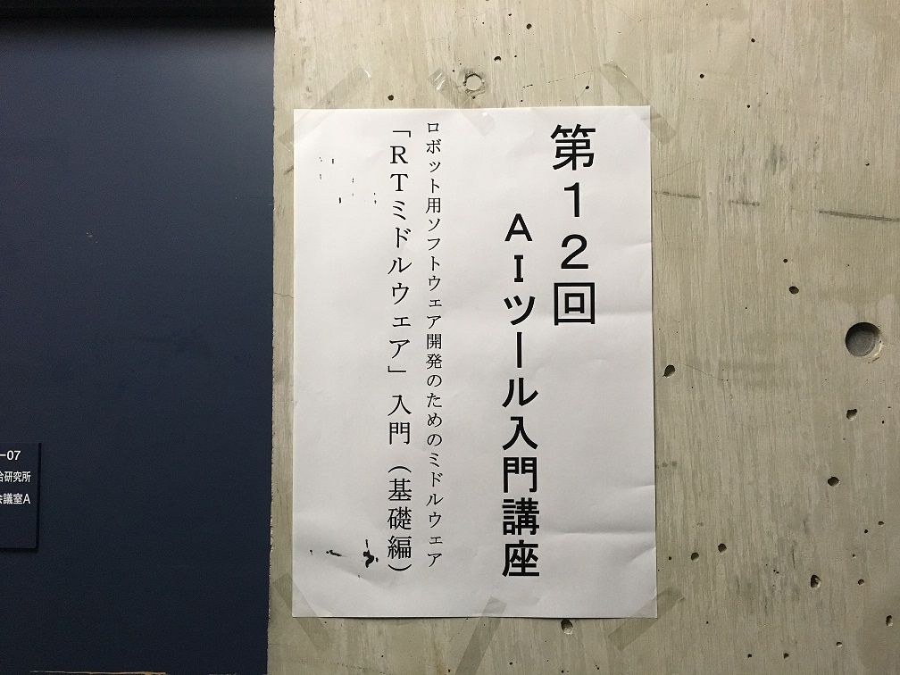
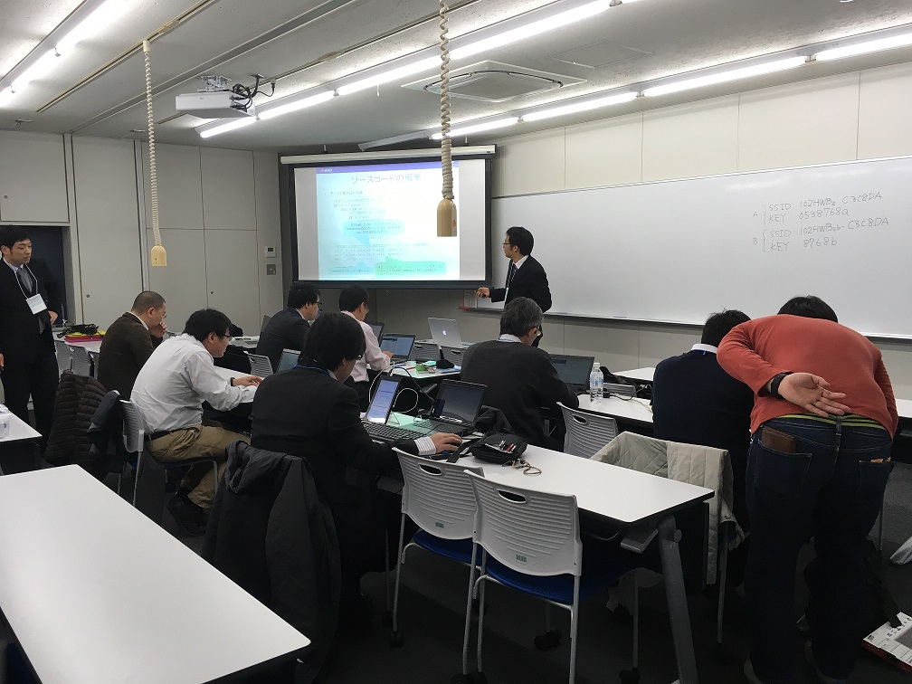
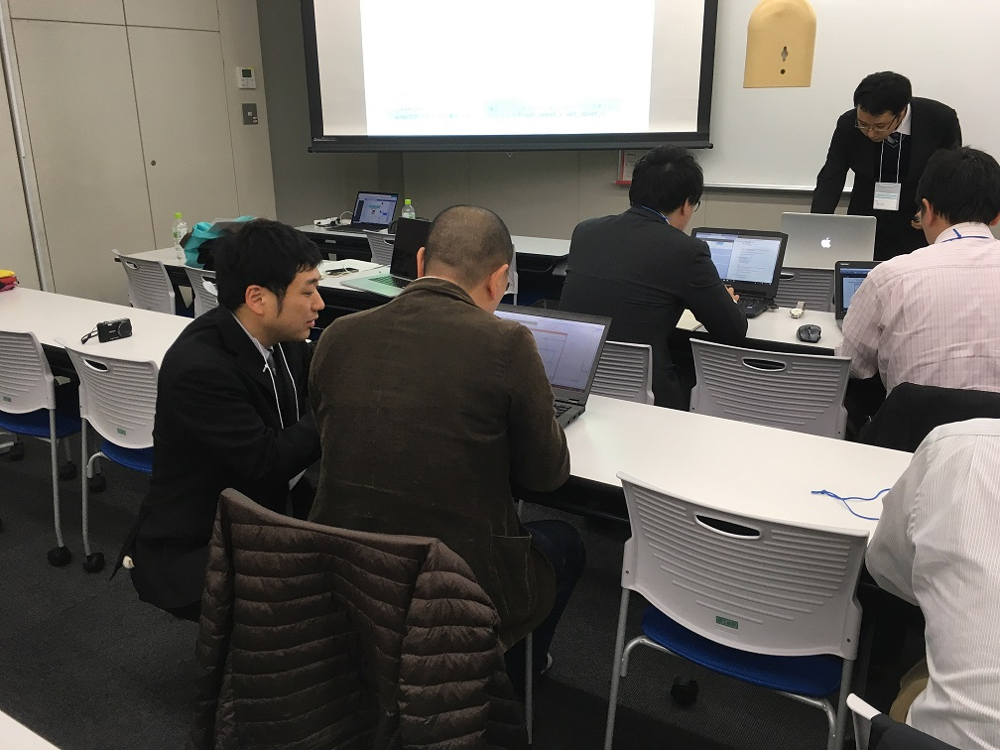
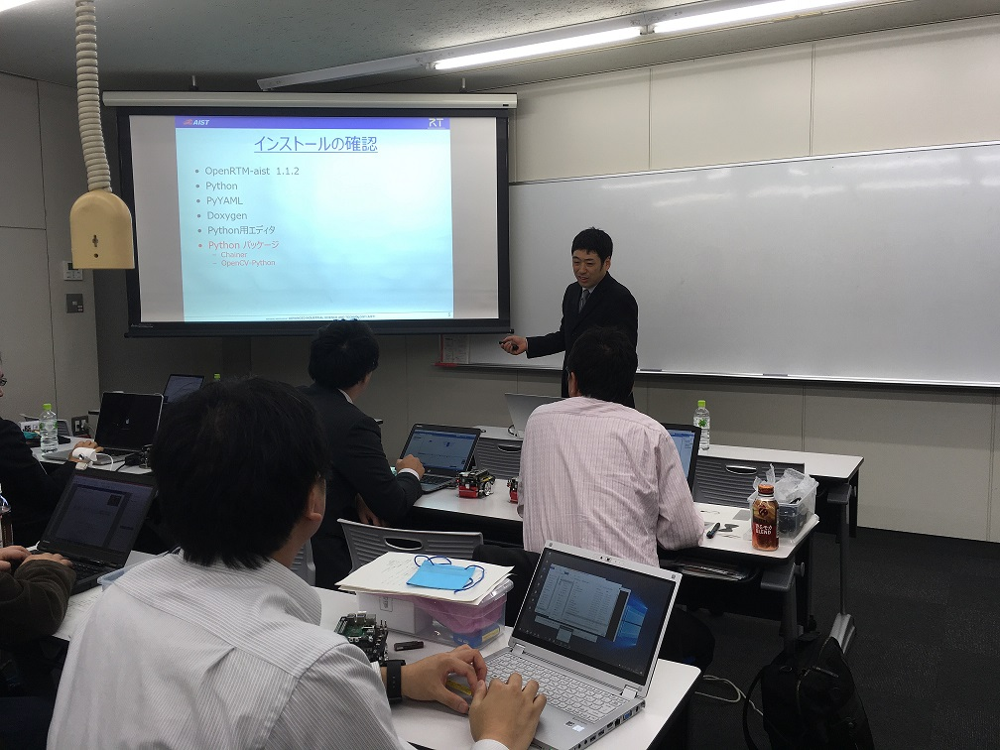

#contents(4)

<!-- ** 開催案内 -->
## 開催報告

2017年11月28日(火)に人工知能学会主催 の 第12回AIツール入門講座 において、RTミドルウエア講習会を開催いたしました。

<!-- 人工知能学会主催 の 第12回AIツール入門講座 において、RTミドルウエア講習会を開催いたします。&br; -->

RTミドルウエアはロボットシステムの構築を効率化するソフトウエアプラットフォームです。RTコンポーネントと呼ばれるモジュール化されたソフトウエアを多数組わせてロボットシステムを構築するため、システムの変更、拡張がしやすいだけでなく、既存のソフトウエア資産をの継承や他人が作ったコンポーネントとの組み合わせも容易になります。講習会では、RTミドルウエアの概要、RTコンポーネントの作成方法について解説します。受講者には各自ノートPCをお持ちいただき、実習形式で実際にRTコンポーネントを作成、既存のコンポーネントなどと組み合わせて簡単なシステムを構築していただきます。本講習会を受講することで、RTコンポーネント設計方法、実装の仕方、システムの作り方をマスターすることができます。

## 日時・場所

- **日時**: 2017年11月28日(火), 10時00分～16時30分
- **場所**: [早稲田大学 西早稲田キャンパス ](https://www.waseda.jp/top/access/nishiwaseda-campus)  55号館S棟407室
  - [交通アクセス](https://www.waseda.jp/top/access/nishiwaseda-campus)
- **主催**: [	(一社)人工知能学会](http://www.ai-gakkai.or.jp/)
<!-- -''共催'': [[日本ロボット工業会・ロボットビジネス推進協議会 RTミドルウェアWG:http://www.jara.jp/]] -->
<!-- -''定員''：実習 15名（先着順で定員になり次第締め切り） -->
- **参加者**：実習 7名（＋講師・スタッフ4名）
- **参加費**: 
  - 正・賛助会員 11,000円
  - 学生会員 5,000円
  - 非会員 16,000円
- **申し込み**:
- [人工知能学会のホームページ](http://www.ai-gakkai.or.jp/no12_jsai_tool_introductory_course/)からお申込みください。
<!-- -''申し込み'':[[NEDO Webページ:http://www.nedo.go.jp/events/CA_100005.html]] にて [[ユーザアカウント発行:https://app3.infoc.nedo.go.jp/gyouji/mypage/customer_join_form]] の上 [[こちら:https://app3.infoc.nedo.go.jp/gyouji/events/CA/nedoevent.2011-10-17.0557580387/mypage/customer_login]] よりお申し込みください。 -->
<!-- -''申し込み'':&color(red){実習を希望される方のみ}; 本ページの下の登録フォームからお申し込みください。 -->
<!-- -- 前半の座学のみの聴講、実習の見学は登録不要です。 -->
<!-- -- &color(red){''「KobukiとRaspberryPiコース」'', ''「G-ROBOTとChoreonoidコース」''は定員となりましたので締め切らせていただきました。}; -->
<!-- -- お申込みになる場合、''「KobukiとRaspberryPiコース」'', ''「G-ROBOTとChoreonoidコース」'', ''「聴講のみ」''のいずれかをご選択ください。 -->
<!-- -- ''「KobukiとRaspberryPiコース」'', ''「G-ROBOTとChoreonoidコース」''ではノートPCをご持参のうえ、下記の事前準備をお願いしております。 -->
<!-- -- &color(red){定員が限られておりますので、ご欠席される場合は当Webページからお申込みの削除お願いいたします。}; -->

<!-- &ref(irex2013_button.png,80%,left,url=#entry); -->

## プログラム

<table class="table-alt">
  <tr>
    <th>CENTER:150</th>
    <th>LEFT:</th>
    <th>c</th>
  </tr>
  <tr>
    <td>10:00 -10:50</td>
    <td>**第1部：OpenRTM-aistおよびRTコンポーネントプログラミングの概要**   **担当**：安藤慶昭氏 (産業技術総合研究所)   **概要**：RTミドルウェア(OpenRTM-aist)はロボットシステムをコンポーネント指向で構築するソフトウェアプラットフォームです。RTミドルウェアを利用することで、既存のコンポーネントを再利用し、モジュール指向の柔軟なロボットシステムを構築することができます。RTミドルウエアについて、その概要およびRTコンポーネントの機能やプログラミングの流れについて説明します。  <a href="/sites/default/files/6372/171128-01.pdf">第1部講義資料（PDF）</a></td>
  </tr>
  <tr>
    <td>11:00 -11:50</td>
    <td>**第2部：RTコンポーネント作成入門**   **担当**：宮本信彦氏 (産業技術総合研究所)  **概要**：RTコンポーネント設計ツールRTCBuilderとRTシステム構築ツールRTSystemEditorの利用方法を解説するとともに、移動ロボットシミュレータを用いた実習によりRTコンポーネントの開発手順、動作確認手順を学習します。 また、作成したコンポーネントを利用し、移動ロボット実機（RaspberryPiマウス）を制御する方法についても学習します。   <a href="/ja/node/6386">チュートリアル(第2部、Windows)</a>   <a href="/ja/node/6387">チュートリアル(第2部、Ubuntu)</a></td>
  </tr>
  <tr>
    <td>11:50 -12:00</td>
    <td>質疑応答・意見交換</td>
  </tr>
  <tr>
    <td>12:00 -13:00</td>
    <td>昼食</td>
  </tr>
  <tr>
    <td>13:00 -16:30</td>
    <td>**第3部：プログラミング実習**   **担当**：髙橋三郎氏 (産業技術総合研究所)    **概要**：深層学習による画像認識を利用した移動ロボット制御システムを作成することで、実際の研究、開発へのアプリケーション応用について学びます。   <a href="/ja/node/6388">チュートリアル(第３部 推論結果の検証)</a>  <a href="/ja/node/6389">チュートリアル(第３部 データ収集・蓄積)</a></td>
  </tr>
</table>

<!-- &br; [[第1, 2部講義資料（PDF）:/sites/default/files/5931/151202-01.pdf]] -->
<!-- &br; [[チュートリアル（画像処理コンポーネントの作成 Windows編）:/ja/node/5022]] &br; [[チュートリアル（画像処理コンポーネントの作成 Linux編）:/ja/node/430 -->

<!-- ** コース概要 -->
<!-- ** プログラミング実習概要 -->

<!-- 未定。 -->

<!-- *** Kobuki & Raspberry Piコース -->

<!-- ARMプロセッサを搭載した小型のシングルボードコンピュータRaspberry Piを使用して、移動ロボット Kobukiを動かしたり、Raspberry Pi用IOボードを利用したジョイスティックを作成したりします。 -->
<!-- これらを組み合わせてKobukiを遠隔操作したり、自律走行させたりすることを目標にします。 -->

<!-- こちらのコースをご希望の方は、以下の申し込みフォームにて「KobukiとRaspberryPiコース」をチェックしてお申し込みください。 -->

<!-- - &ref(131106-03.pdf,講義資料); -->

<!-- #br -->

<!-- &ref(http://www.rt-shop.jp/images/Yujin/Kobuki.jpg,67%); -->
<!-- &ref(http://upload.wikimedia.org/wikipedia/commons/thumb/3/3d/RaspberryPi.jpg/800px-RaspberryPi.jpg,45%); -->

<!-- *** G-ROBOT & Choreonoidコース -->

<!-- G-ROBOTを操作するインターフェースを実際に作ってみたり、産総研で開発されたロボットのモーションエディタ・シミュレータ Choreonoid 上のG-ROBOTを動かしたりします。 -->

<!-- こちらのコースをご希望の方は、以下の申し込みフォームにて「G-ROBOTとChoreonoidコース」をチェックしてお申し込みください。 -->

<!-- #br -->

<!-- &ref(http://www.hpirobot.jp/image/gr-001/product/introduction/s/gr001.jpg,60%); -->
<!-- &ref(http://www.openrtp.jp/wiki/images/_default/Software/Choreonoid/ChoreonoidView.png,40%); -->

<!-- *** 聴講のみ -->

<!-- 実習には参加せず、前半の概要説明などの聴講のみの参加も可能です。 -->
<!-- 聴講は前半の講義だけではなく、実習をご覧になることもできます。お気軽にお申し込みください。 -->

<!-- 以下の申し込みフォームにて「聴講のみ」をチェックの上お申し込みください。 -->

<!-- &aname(document); -->
<!-- **資料 -->

## 講習会に参加される方へ

第2,3部の実習には以下の準備が必要です。

### 必要機材
- ノートPC
  - OS: Windowsをご用意下さい
  - Eclipseが動作する程度のスペックが必要です
  - メモリ: 1GB以上
  - CPU: Core2Duo以上
  - HDD空き: 5GB以上

Windowsのファイアウォールは必ず切っておいてください。;
セキュリティーソフトにもファイアウォールが設定されている場合がありますので、そちらもOFFにしておいてください。;

&aname(software_install);
### 事前にインストールするソフトウエア

あらかじめインストールしておくべきソフトウエアは以下のとおりです。以下のリンクをクリックし、ファイルをダウンロード・インストールしてください。 
一部のリンクはダウンロードページへ飛びますので、飛んだ先のページ内で適切なファイルをそれぞれダウンロードしてください。

#### OpenRTM-aist 1.1.2-RELEASE版 (C++版、Python版）

- 1.1.2 からは一つのインストーラですべての言語とVisual Studioのバージョンに対応しいます。32bit/64bitのみ選択してください。（32bit推奨）
  - [Windows用インストーラ(32bit)](/content/openrtm-aist-c-112-release#toc2)
- 1.1.2 は インストールしているVisual Studioのバージョンをシステム環境変数で指定しますので、設定を確認して下さい。デフォルトはvc2013の設定になっています。
  - [Visual Studio のバージョン指定](/content/openrtm-aist-c-112-release#toc4)
<!-- - 1.1.2の使用を推奨しますが、1.1.0, 1.1.1でも受講可能です。 -->
<!-- - 1.1.1/1.1.0 をお使いの場合は&color(red){必ず}; Visual Studio のバージョンと一致させてください。 -->
<!-- -- 他のバージョン用は、[[こちらのページ:http://openrtm.org/openrtm/ja/content/openrtm-aist-c-112-release]] からダウンロードできます。(非推奨) -->
- デフォルト設定のままインストールして下さい。
- [OpenRTM-aistを10分で始めよう！](http://openrtm.org/openrtm/ja/node/6026) を参考に、事前にサンプルコンポーネントを起動して動作確認を行っておいてください。

#### Python

- [Python2.7.14](https://www.python.org/ftp/python/2.7.14/python-2.7.14.msi)
<!-- 、または [[Python2.7(64bit):https://www.python.org/ftp/python/2.7.10/python-2.7.10.amd64.msi]] -->
<!-- -- &color(red){Python2.7.11もすでにリリースされていますが非推奨です。}; -->
  - OpenRTM-aistやPyYAMLをインストールする前にインストールしてください;

<!-- -- OpenRTM-aist Python の64bit版をインストールされる場合は、[[Python2.7(64bit):https://www.python.org/ftp/python/2.7.9/python-2.7.9.amd64.msi]] をインストールしてください。　 -->

#### その他

以下のソフトウェアも必須です。忘れずにインストールしてください。

- [PyYAML](http://pyyaml.org/download/pyyaml/PyYAML-3.11.win32-py2.7.exe)
<!-- -- Python2.7(64bit)をインストールされた場合は、[[PyYAML(64bit):http://pyyaml.org/download/pyyaml/PyYAML-3.11.win-amd64-py2.7.exe]] をインストールしてください。　 -->
- Python パッケージ（第３部で使用します）
  - Chainer  (Deep Learning フレームワーク) https://chainer.org/
    - **pip install chainer** でインストールできます
  - OpenCV (画像認識ライブラリ) http://opencv.jp/
    - **pip install opencv-python** でインストールできます
- Python用のエディタ
  - IDLE(Pythonに標準で付属)
  - [PythonWin](https://wiki.python.org/moin/PythonWin)
  - [PyScripter](https://sourceforge.net/projects/pyscripter/)
  - PyDev

## 講義資料

#### 第1部
- [講義資料(PDF)](/sites/default/files/6372/171128-01.pdf)

<!-- Invalid YouTube URL: http://www.slideshare.net/82805626 -->

#### 第3部
- [講義資料(PDF)](/sites/default/files/6372/171128-03.pdf)

<!-- Invalid YouTube URL: https://www.slideshare.net/82826390 -->

<!-- **** 第3部 Kobuki & Raspberry Piコース -->
<!-- - &ref(131106-03.pdf,講義資料(PDF)); -->

<!-- <nowiki> -->
<!-- [video:http://www.slideshare.net/28178571] -->
<!-- </nowiki> -->

<!-- **** 第3部 G-ROBOT & Choreonoidコース -->
<!-- - &ref(17112801.pdf,講義資料(PDF)); -->

<!-- <nowiki> -->
<!-- [video:http://www.slideshare.net/28144373] -->
<!-- </nowiki> -->

## 講習会の様子

 

 

 

 

<!-- #ref(151202-05.jpg,center,nolink) -->
<!-- #br -->
