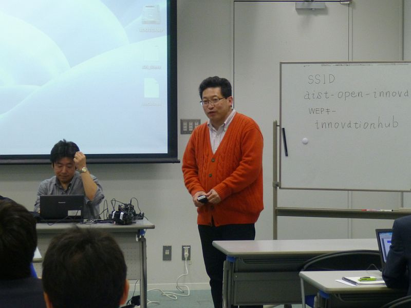
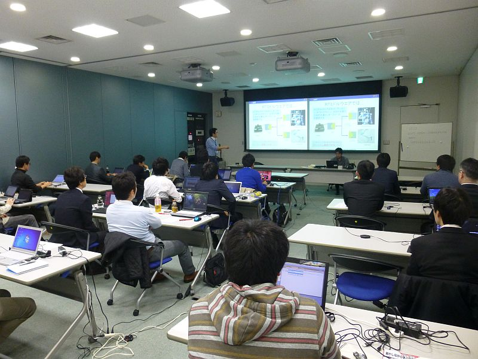
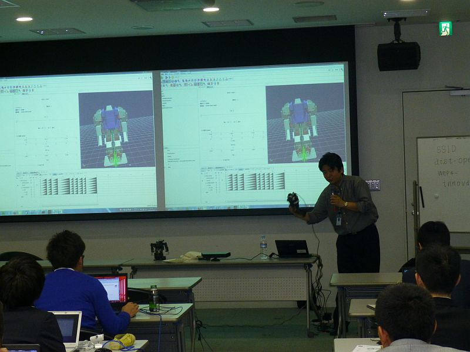
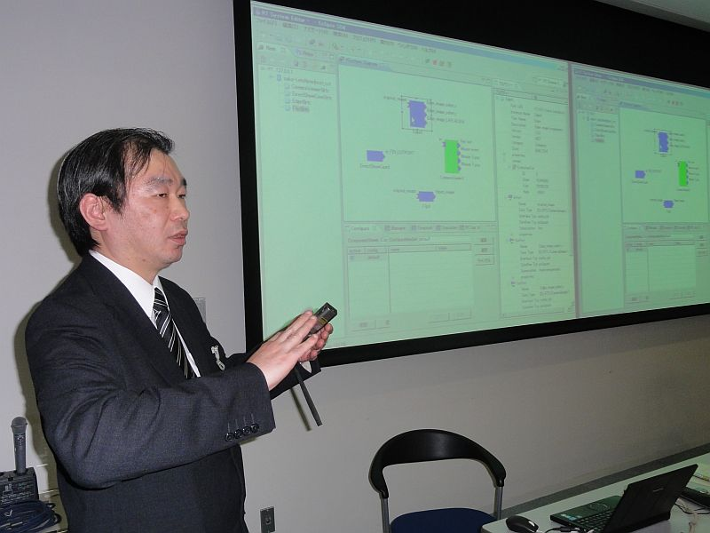
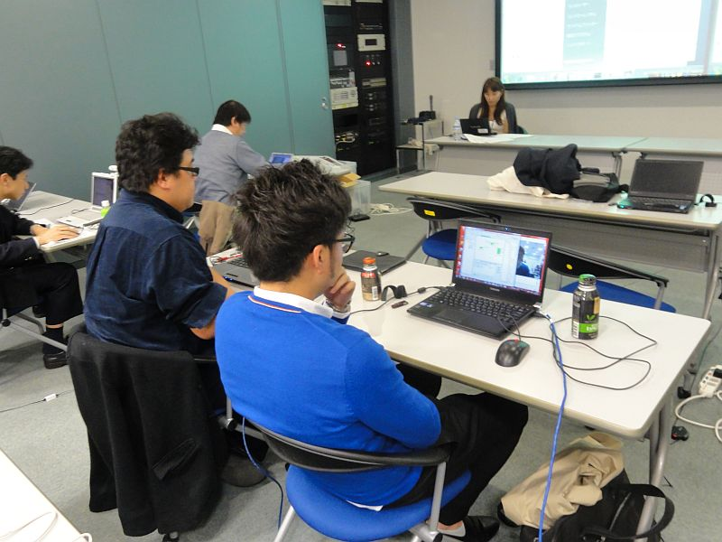

#contents

## RTミドルウエア講習会(2013年3月29日)

2013年3月29日(金)につくば市の産業技術総合研究所においてRTミドルウエア講習会を開催いたしました。

### 日時・場所

- 2013年3月29日（金）
  - 10:00-17:00
- 産業技術総合研究所・本部情報棟・交流会議室１
  - [産業技術総合研究所へのアクセス](http://www.aist.go.jp/aist_j/guidemap/tsukuba/tsukuba_map_main.html)
  - [中央第2・本部情報棟・交流会議室１](http://www.aist.go.jp/aist_j/guidemap/pdf/info_desk.pdf)
  - [連絡バス(TXつくば駅-産総研)時刻表](http://www.aist.go.jp/aist_j/guidemap/tsukuba/tsukuba_c_express.html)
<!-- -- 本部情報棟にて受付を済ませたうえで会場にお越しください。 -->
- 参加者数: 20名

### プログラム

<table class="table-alt">
  <tr>
    <th>CENTER:100</th>
    <th>LEFT:</th>
    <th>LEFT:200</th>
    <th>c</th>
  </tr>
  <tr>
    <td>3月29日(金)</td>
    <td>概要</td>
    <td>講師</td>
  </tr>
  <tr>
    <td>10:00-11:00</td>
    <td>第１部：RTミドルウエア概要　講義資料:<a href="http://openrtm.org/openrtm/sites/default/files/5252/130329_01.pdf">130329_01.pdf</a></td>
    <td>安藤慶昭 (産総研)</td>
  </tr>
  <tr>
    <td>11:00-12:10</td>
    <td>第２部：RTミドルウエアの使い方　講義資料:<a href="http://openrtm.org/openrtm/sites/default/files/5252/130329_02.pdf">130329_02.pdf</a></td>
    <td>原功 (産総研)</td>
  </tr>
  <tr>
    <td>13:00-14:00</td>
    <td>第３部：RTミドルウエアツールの使い方　講義資料:<a href="http://openrtm.org/openrtm/sites/default/files/5252/20130329RTM講習会(第３部">130329_03.pdf</a>.pdf)</td>
    <td>坂本 武志(グローバルアシスト)</td>
  </tr>
  <tr>
    <td>14:00-17:00</td>
    <td>第４部：RTコンポーネント作成実習　講義資料:<a href="http://openrtm.org/openrtm/ja/node/5286">webページ.pdf</a></td>
    <td>宮本晴美 (産総研)</td>
  </tr>
</table>

<!-- ** 講習会に参加される方へ -->
<!-- 実習形式の講習会に参加される方は、以下の準備をお願いいたします。 -->

<!-- ***用意するもの -->

<!-- 実習には以下の準備が必要です。 -->
<!-- - ノートPC -->
<!-- -- OS: Windowsを推奨します。応用コースの方は自分で対処出来る場合はどちらでも結構です -->
<!-- -- Eclipseが動作する程度のスペックが必要です -->
<!-- -- メモリ: 1GB以上 -->
<!-- -- CPU: Core2Duo以上 -->
<!-- -- HDD空き: 5GB以上 (Visual C++ Expressの場合) -->
<!-- - USBカメラ (USBカメラ無しで申込まれた方には貸与いたします) -->
<!-- - Windowsでも、Linuxでも構いませんが、USBカメラがOpenCVからつかえることが前提です。 -->
<!-- - LANケーブル -->

<!-- &aname(instsoftware); -->
<!-- ***ソフトウエアのインストール -->

<!-- あらかじめインストールしておくべきソフトウエアは以下のとおりです。以下のリンクをクリックし、ファイルをダウンロード・インストールしてください。(一部のリンクはダウンロードページへ飛びますので、飛んだ先のページ内で適切なファイルをそれぞれダウンロードしてください。 -->

<!-- Windows推奨ですが、Linuxでも実習可能です。 -->

<!-- |LEFT:200|LEFT:600|c -->
<!-- |>|CENTER: OpenRTM-aist 1.1.0 C++ 関連 | -->
<!-- | [[C++, RELEASE版:/ja/node/5012]] | OpenRTM-aist C++版パッケージ。ダウンロードページに従い、自分の環境に合ったパッケージ、 PythonおよびPyYAML をインストールします。 | -->
<!-- | [[Visual C++ 2010:http://go.microsoft.com/fwlink/?LinkId=190491&clcid=0x411]] または &br; [[Visual C++ 2008:http://go.microsoft.com/?LinkId=9348304]] | C++のコンポーネントをコンパイルするの必要 (Express版でもOK) | -->
<!-- | [[cmake-2.8.8:http://www.cmake.org/files/v2.8/cmake-2.8.8-win32-x86.exe]] | Visual C++のプロジェクトを作成するのに必要 | -->
<!-- | [[doxygen:http://ftp.stack.nl/pub/users/dimitri/doxygen-1.8.1-setup.exe]] | ビルドの過程でドキュメントを整形するのに必要 | -->
<!-- |>|CENTER: Eclipseツール | -->
<!-- | [[Eclipseツール:http://openrtm.org/openrtm/ja/node/30]] | コンポーネントを設計するツール: RTCBUilder, コンポーネントを操作するツール: RTSystemEditor が同梱されています。 最新バージョンのRC4をご利用ください。| -->
<!-- | Java Development Kit6 | Eclipseを動作させるために必要 | -->

<!-- ***USBカメラの動作確認 -->

<!-- USBカメラをお持ちいただく方は、OpenRTM-aistwebページの「[[OpenRTM-aistを10分で始めよう！:http://openrtm.org/openrtm/ja/node/850]]」を行って、 -->
<!-- 事前にカメラの動作確認をしていただきますようお願いいたします。 -->

<!-- *** 配布資料 -->
<!-- - [[第１部資料:http://openrtm.org/openrtm/sites/default/files/5252/20130329_RTM1.pdf]] -->
<!-- - [[第２部資料:http://openrtm.org/openrtm/sites/default/files/5252/20130329_RTM2.pdf]] -->
<!-- - [[第３部資料:http://openrtm.org/openrtm/sites/default/files/5252/20130329RTM講習会(第３部).pdf]] -->
<!-- - [[第４部資料:http://openrtm.org/openrtm/ja/node/5286]] -->

### 実習で必要なファイル

- [RTC.xml](http://www.openrtm.org/openrtm/sites/default/files/4965/RTC.xml)
- [Flipコンポーネントの作成](http://openrtm.org/openrtm/ja/node/5286)

<!-- ***Linuxで必要なソフトウエア -->

<!-- 上記に相当するLinuxのパッケージをインストールしておいてください。 -->
<!-- 加えて、OpenCVが必要になります。 -->

&aname(entry);

### 講習会スライド

#### 第１部：RTミドルウエア概要

<!-- Invalid YouTube URL: http://www.slideshare.net/17981703 -->

#### 第２部：RTミドルウエアの使い方

<!-- Invalid YouTube URL: http://www.slideshare.net/17982172 -->

#### 第３部：RTミドルウエアツールの使い方

<!-- Invalid YouTube URL: http://www.slideshare.net/17983299 -->

#### 第４部：RTコンポーネント作成実習

<!-- Invalid YouTube URL: http://www.slideshare.net/17980381 -->

## 講習会の様子

;

;

;

;

;

<!-- **講習会申し込みフォーム -->

<!-- 以下の申し込みフォームページから講習会へお申し込みください。 -->
<!-- - 参加登録するには当Weサイトへのユーザ登録が必要です。[[ユーザ登録はこちら:http://openrtm.org/openrtm/ja/user/register]] -->
<!-- - 当Webサイトにログイン済みの方は名前の欄にユーザ名が出ますが、氏名に書き換えてください。 -->
<!-- - 講習会で必要なUSBカメラの有無についてもお申し出ください。 -->
<!-- - フォーム送信後、確認メールをお送りいたします。1日たっても確認メールが届かない場合は、[[こちら（support@openrtm.org）:mailto:support@openrtm.org]] までお問い合わせください。 -->
