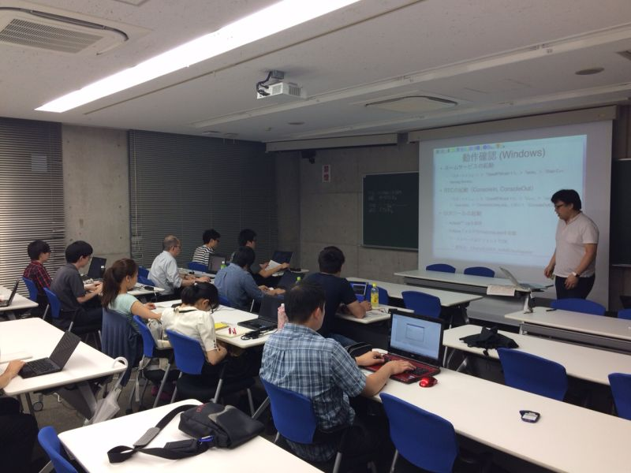

#contents

## RTミドルウェア強化月間(第2弾)：早稲田大学・RTミドルウェア講習会

2015年7月1日(水)に早稲田大学西早稲田キャンパスにおいて，RTミドルウェア講習会を開催いたしました．

<!-- RTミドルウェア強化月間として、2015年7月1日(水)に早稲田大学西早稲田キャンパスにおいて，RTミドルウェア講習会を開催します。&br; -->
<!-- 受講者には各自ノートPCをお持ちいただき、実習形式で実際にRTコンポーネントを作成、既存のコンポーネントなどと組み合わせて簡単なシステムを構築していただきます。&br; -->
<!-- 本講習会を受講することで、RTコンポーネント設計方法、実装の仕方、システムの作り方をマスターすることができます。&br; -->

## 日時・場所
- **日時**: 2015年7月1日(水), 13:00～17:00
- **場所・アクセス**: [早稲田大学　西早稲田キャンパス](http://www.waseda.jp/jp/campus/nishiwaseda.html)、55号館S棟2階第4会議室
<!-- -- [[googleマップ:https://maps.google.co.jp/maps?q=35.705585,139.708339&hl=ja&ll=35.705585,139.708339&spn=0.008956,0.016512&sll=35.705593,139.708436&sspn=0.008956,0.016512&brcurrent=3,0x60188d24cf30335b:0x9cc4ed5b2edeb4a7,0&t=m&z=17]] or http://www.sci.waseda.ac.jp/access/ -->
- **主催**: 産業技術総合研究所
<!-- -''聴講料'': 無料  -->
<!-- -''定員'': 10名程度を予定しております。定員になり次第申し込みは終了させていただきます。 -->
- **参加者**: 12名（+講師3名）
<!-- -''参加登録'': [[参加登録フォームはこちら>#entry]] -->
<!-- -- 参加登録には当Webページのユーザ登録が必要です。[[ユーザ登録はこちら:http://openrtm.org/openrtm/ja/user/register]] -->
<!-- -- [[メーリングリスト:http://www.openrtm.org/mailman/listinfo/openrtm-users]]への登録をお勧めします。必須ではありませんが、Webでご案内する事前準備についてはメーリングリストにてお知らせします。 -->
<!-- -- なお、登録の際に問題が生じた場合は、 [[こちら（support@openrtm.org）:mailto:support@openrtm.org]] までお問い合わせください。 -->

<!-- *** 他の強化月間講習会 -->

<!-- - [[RTミドルウェア強化月間（第1弾）名城大学・RTミドルウェア講習会:/ja/tutorial/meijo2014]] -->
<!-- - [[RTミドルウェア強化月間（第3弾）中央大学・RTミドルウェア講習会:/ja/tutorial/chuo2014]] -->
<!-- - [[RTミドルウェア強化月間（第4弾）大阪大学・RTミドルウェア講習会:/ja/tutorial/osaka2014]] -->

## プログラム

<table class="table-alt">
  <tr>
    <th>CENTER:100</th>
    <th>LEFT:</th>
    <th>c</th>
  </tr>
  <tr>
    <td>13:00 -13:30</td>
    <td>**第1部：RTミドルウエア: OpenRTM-aist概要**   **担当**：安藤慶昭(産総研)  **概要**：RTミドルウエアはロボットシステムをコンポーネント指向で構築するソフトウエアプラットフォームです。RTミドルウエアを利用することで、既存のコンポーネントを再利用し、モジュール指向の柔軟なロボットシステムを構築することができます。RTミドルウエアの産総研による実装であるOpenRTM-aistについてその概要について説明します。   **レジュメ：**

;</td>
  </tr>
  <tr>
    <td>13:30 -14:30</td>
    <td>**第2部: RTコンポーネントの作成入門**  **担当**：菅佑樹(SSR)  **概要**：RTCBuilderを使用したRTコンポーネントの作成方法を説明します。    **レジュメ：**

;</td>
  </tr>
  <tr>
    <td>14:45 -17:00</td>
    <td>**第3部：プログラミング実習**   担当：安藤慶昭・原功(産総研)   **概要**：OpenRTM-aistを利用してコンポーネントを作成し、他のコンポーネントと組み合わせて動作させてみます。  </td>
  </tr>
</table>

### 必要機材
- ノートPC
  - OS: Windowsを推奨します。応用コースの方は自分で対処出来る場合はどちらでも結構です
  - Eclipseが動作する程度のスペックが必要です
  - メモリ: 1GB以上
  - CPU: Core2Duo以上
  - HDD空き: 5GB以上 (Visual C++ Expressの場合)
- USBカメラ (USBカメラ無しで申込まれた方には貸与いたします)

Windowsのファイアウォールは必ず切っておいてください。;

### 必要ソフトウエア

あらかじめインストールしておくべきソフトウエアは以下のとおりです。以下のリンクをクリックし、ファイルをダウンロード・インストールしてください。(一部のリンクはダウンロードページへ飛びますので、飛んだ先のページ内で適切なファイルをそれぞれダウンロードしてください。

- Visual Studio
  - [こちらのページ](https://www.visualstudio.com/ja-jp/downloads/download-visual-studio-vs#DownloadFamilies_2) から無償版の Community 2013 Update 4 をダウンロードできます。   
  - インストールには時間がかかりますので、事前にインストールしておいてください。
  - すでに他のバージョン（2008, 2010, 2012, 2013(Express)）がインストールされている場合は、それをお使い下さい。
- OpenRTM-aist C++ 1.1.1-RELEASE版
  - インストールされているVisual Studioに一致するバージョンをダウンロードしてください。;
  - 上記Visual C++ 2013用のインストーラは[こちら](http://openrtm.org/pub/Windows/OpenRTM-aist/cxx/1.1/OpenRTM-aist-1.1.1-RELEASE_x86_vc12.msi)
  - 他のバージョン用は、[こちらのページ](http://openrtm.org/openrtm/ja/content/openrtm-aist-c-111-release) からダウンロードできます。
  - インストーラは、デフォルトでOpenRTPとJREを一緒にインストールします。デフォルト設定のままインストールして下さい。
  - [OpenRTM-aistを10分で始めよう！](http://openrtm.org/openrtm/ja/content/lets_start) を参考に、事前にサンプルコンポーネントを起動して動作確認を行っておいてください。
- [Python2.7(32bit)](https://www.python.org/ftp/python/2.7.9/python-2.7.9.msi)
  - OpenRTM-aistのPython版やPyYAMLをインストールする前にインストールしてください;
  - OpenRTM-aist Python の64bit版をインストールされる場合は、[Python2.7(64bit)](https://www.python.org/ftp/python/2.7.9/python-2.7.9.amd64.msi) をインストールしてください。　
- OpenRTM-aist Python 1.1.0-RELEASE
  - 32bit版インストーラは、[こちら](http://openrtm.org/pub/Windows/OpenRTM-aist/python/OpenRTM-aist-Python_1.1.0-RELEASE_x86.msi) からダウンロードできます。
  - 64bit版インストーラは、[こちらのページ](http://openrtm.org/openrtm/ja/content/openrtm-aist-python-110-release) からダウンロードできます。　　
- [PyYAML(32bit)](http://pyyaml.org/download/pyyaml/PyYAML-3.11.win32-py2.7.exe)
  - Python2.7(64bit)をインストールされた場合は、[PyYAML(64bit)](http://pyyaml.org/download/pyyaml/PyYAML-3.11.win-amd64-py2.7.exe) をインストールしてください。　
- [CMake](http://www.cmake.org/files/v3.2/cmake-3.2.1-win32-x86.exe)
- [Doxygen](http://ftp.stack.nl/pub/users/dimitri/doxygen-1.8.9.1-setup.exe)
- 使い慣れたエディタ: EclipseやPythonに付属のエディタでも構いませんが、使い慣れたエディタが入っていた方が良いでしょう

#### Linux環境

Ubuntu14.04 x64 の環境へ以下をインストールして下さい。

- OpenRTM-aist C++ 1.1.1-RELEASE版
  - [JVRCオンラインチュートリアル](http://jvrc.github.io/tutorials/html-ja/index.html) にChoreonoidと共にインストールする方法が解説されています。
<!-- - OpenRTM-aist Python 1.1.0-RELEASE -->
<!-- -- 一括インストールスクリプト　[[pkg_install_python_ubuntu.sh >http://svn.openrtm.org/OpenRTM-aist-Python/tags/RELEASE_1_1_0/OpenRTM-aist-Python/installer/install_scripts/pkg_install_python_ubuntu.sh]]　をダウンロード・実行してインストールできます。 -->
<!-- -- インストール手順は、OpenRTM-aist Python の [[Ubuntu/Debianへのインストール:http://openrtm.org/openrtm/ja/node/1182]] のページで解説しています。 -->
<!-- -- [[こちらのページ:http://openrtm.org/openrtm/ja/content/openrtm-aist-python-110-release]] からダウンロードできます。 -->

- OpenRTP
  - [こちらのページ](http://openrtm.org/openrtm/ja/download/openrtp/openrtp-110-rc5-ja) からLinux用の全部入りパッケージをダウンロードできます。
インストール方法も解説しています。
- OpenCV
  - 下記パッケージをインストールして下さい。 
$ sudo apt-get install libopencv-dev libcv2.4 libcvaux2.4 libhighgui2.4
- OpenCVサンプルコンポーネント(ImageProcessing)
  - [こちら](http://openrtm.org/pub/Linux/ubuntu/dists/trusty/main/binary-amd64/imageprocessing-1.1.0.deb) からdebパッケージをダウンロード・インストールして下さい。 
$ sudo dpkg -i imageprocessing-1.1.0.deb

<!-- *** 講義資料 -->

<!-- -- [[講義資料:http://openrtm.org/openrtm/sites/default/files/5633/RTM講習会2014早稲田.pdf]] &color(red){New!!!}; -->

<!-- &aname(entry); -->
<!-- **講習会申し込みフォーム -->

<!-- 以下のフォームから講習会へお申し込みください。 -->
<!-- - 参加登録するまえに当Webページのユーザ登録をお願いします。[[ユーザ登録はこちら:http://openrtm.org/openrtm/ja/user/register]] -->
<!-- - 当Webサイトにログイン済みの方は&color(red){名前の欄のユーザ名を氏名に書き換えてください};。 -->
<!-- - フォーム送信後、確認メールをお送りいたします。1日たっても確認メールが届かない場合は、[[こちら（support@openrtm.org）:mailto:support@openrtm.org]] までお問い合わせください。 -->

### 講義資料
#### 第1部 RTミドルウエア: OpenRTM-aist概要 
- [第1部 講義資料(PDF)](/sites/default/files/5808/150701-01.pdf)

<!-- Invalid YouTube URL: http://www.slideshare.net/51040560 -->

#### 第2部 RTコンポーネントの作成入門 
- [第2部 講義資料(PDF)](/sites/default/files/5808/RTM_ysuga_2015.pdf)

<!-- Invalid YouTube URL: http://www.slideshare.net/50116778 -->

## 講習会の様子

 
