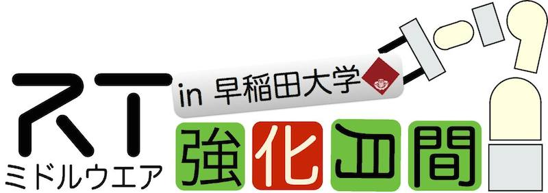
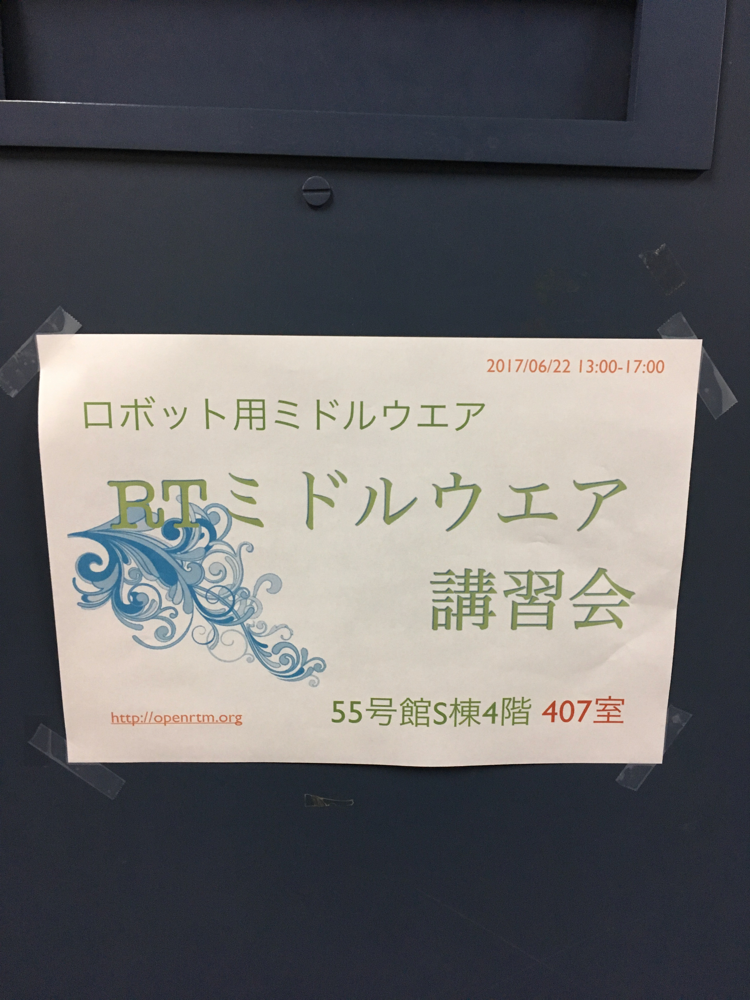
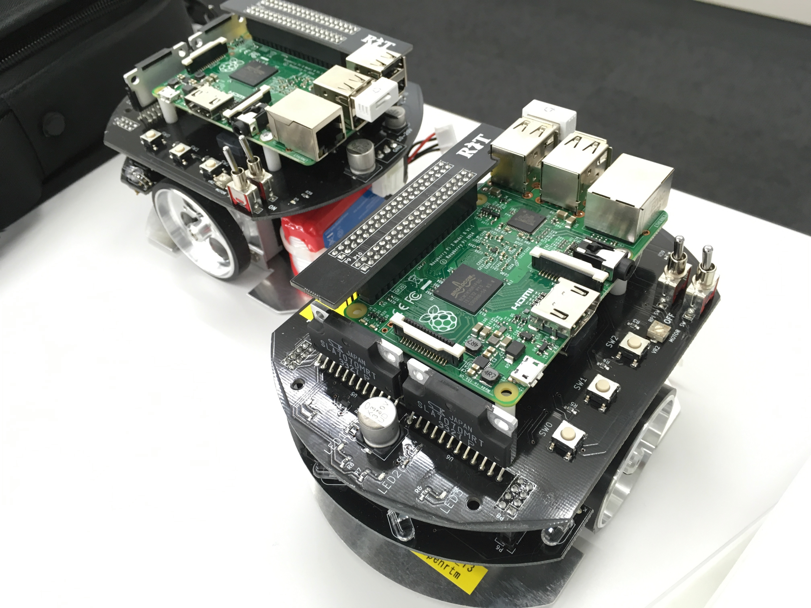
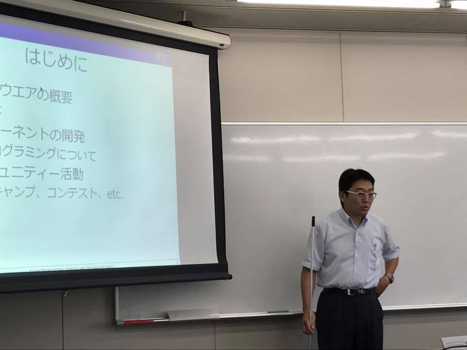
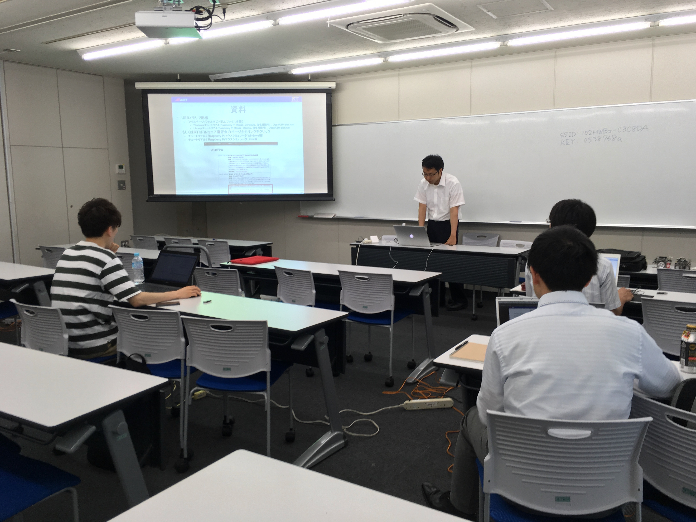

#contents

## RTミドルウェア強化月間(第1弾)：早稲田大学・RTミドルウェア講習会

<!-- RTミドルウェア強化月間として、早稲田大学西早稲田キャンパスにおいて，RTミドルウェア講習会を開催いたしました． -->

RTミドルウェア強化月間として、早稲田大学西早稲田キャンパスにおいて，RTミドルウェア講習会を開催します。 
受講者には各自ノートPCをお持ちいただき、実習形式で実際にRTコンポーネントを作成、既存のコンポーネントなどと組み合わせて簡単なシステムを構築していただきます。 
本講習会を受講することで、RTコンポーネント設計方法、実装の仕方、システムの作り方をマスターすることができます。 

## 日時・場所
- **日時**: 2017年6月22日 (木曜日) 13:00〜17:00
- **場所・アクセス**: [早稲田大学　西早稲田キャンパス](https://www.waseda.jp/fsci/access/)、55号館S棟4階 ゼミ・会議室A（407室）
<!-- -- [[googleマップ:https://maps.google.co.jp/maps?q=35.705585,139.708339&hl=ja&ll=35.705585,139.708339&spn=0.008956,0.016512&sll=35.705593,139.708436&sspn=0.008956,0.016512&brcurrent=3,0x60188d24cf30335b:0x9cc4ed5b2edeb4a7,0&t=m&z=17]] or http://www.sci.waseda.ac.jp/access/ -->
- **主催**: 産業技術総合研究所
- **聴講料**: 無料 
<!-- -''定員'': 10名程度を予定しております。定員になり次第申し込みは終了させていただきます。 -->
- **参加者**: 4名（+講師・スタッフ3名）
<!-- -''参加登録'': [[参加登録フォームはこちら>#entry]] -->
<!-- -- 参加登録には当Webページのユーザ登録が必要です。[[ユーザ登録はこちら:http://openrtm.org/openrtm/ja/user/register]] -->
<!-- -- [[メーリングリスト:http://www.openrtm.org/mailman/listinfo/openrtm-users]]への登録をお勧めします。必須ではありませんが、Webでご案内する事前準備についてはメーリングリストにてお知らせします。 -->
<!-- -- なお、登録の際に問題が生じた場合は、 support(at)openrtm.org までお問い合わせください。 -->

### 他の強化月間講習会

- [RTミドルウェア強化月間（第1弾）早稲田大学・RTミドルウェア講習会](/ja/tutorial/bootcamp_waseda_2017)
- [RTミドルウェア強化月間（第2弾）名城大学・RTミドルウェア講習会](/ja/tutorial/bootcamp_meijo_2017)
- [RTミドルウェア強化月間（第3弾）都産技研・RTミドルウェア講習会](/ja/tutorial/bootcamp_sangiken_2017)

## プログラム

<table class="table-alt">
  <tr>
    <th>CENTER:110</th>
    <th>LEFT:400</th>
    <th>c</th>
  </tr>
  <tr>
    <td>13:00 -14:00</td>
    <td>**第1部：RTミドルウエア: OpenRTM-aist概要**   **担当**：安藤慶昭(産総研)  **概要**：RTミドルウエアはロボットシステムをコンポーネント指向で構築するソフトウエアプラットフォームです。RTミドルウエアを利用することで、既存のコンポーネントを再利用し、モジュール指向の柔軟なロボットシステムを構築することができます。RTミドルウエアの産総研による実装であるOpenRTM-aistについてその概要について説明します。   **講義資料**：<a href="/sites/default/files/filefield_paths/170622-01.pdf">170622-01.pdf </a></td>
  </tr>
  <tr>
    <td>14:15 -17:00</td>
    <td>**第2部: RTコンポーネントの作成入門**  **担当**：宮本信彦(産総研)  **概要**：RTシステムを設計するツールRTSystemEditorおよびRTコンポーネントを作成するツールRTCBuilderの使用方法について解説するとともに、RTCBuilderを使用したRTコンポーネントの作成方法を実習形式で体験していただきます。 <a href="/ja/node/6310">チュートリアル（Raspberry Pi Mouseシミュレータ、Windows編）</a>   <a href="/ja/node/6311">チュートリアル（Raspberry Pi Mouseシミュレータ、 Ubuntu編）</a>   **講義資料**：<a href="/sites/default/files/filefield_paths/170622-02.pdf">170622-02.pdf </a></td>
  </tr>
</table>

### 必要機材
- ノートPC
  - OS: Windowsを推奨します。
  - Eclipseが動作する程度のスペックが必要です
  - メモリ: 1GB以上
  - CPU: Core2Duo以上
  - HDD空き: 5GB以上 (Visual C++ Expressの場合)

Windowsのファイアウォールは必ず切っておいてください。;
セキュリティーソフトにもファイアウォールが設定されている場合がありますので、そちらもOFFにしておいてください。;

### 必要ソフトウエア

あらかじめインストールしておくべきソフトウエアは以下のとおりです。以下のリンクをクリックし、ファイルをダウンロード・インストールしてください。(一部のリンクはダウンロードページへ飛びますので、飛んだ先のページ内で適切なファイルをそれぞれダウンロードしてください。

#### Visual Studio 

<!-- - Visual Studio 2013推奨：[[こちらのページ:https://www.visualstudio.com/ja-jp/downloads/download-visual-studio-vs#DownloadFamilies_2]] から無償版をダウンロードできます。 -->
- Visual Studio 2013推奨：[こちらのページ](/ja/content/openrtm-aist-c-112-release#vc2013_install) の手順で無償版をダウンロードできます。
<!-- -- 左のメニューから「Visual Studio 2013」→「Community 2013」のWebインストーラを選択。 -->
  - インストールには時間がかかりますので、事前にインストールしておいてください。

#### OpenRTM-aist 1.1.2-RELEASE版 (C++版、Python版）

- 1.1.2 からは一つのインストーラですべての言語とVisual Studioのバージョンに対応しいます。32bit/64bitのみ選択してください。（32bit推奨）
  - [Windows用インストーラ(32bit)](/content/openrtm-aist-c-112-release#toc2)
- 1.1.2 は インストールしているVisual Studioのバージョンをシステム環境変数で指定しますので、設定を確認して下さい。デフォルトはvc2013の設定になっています。
  - [Visual Studio のバージョン指定](/content/openrtm-aist-c-112-release#toc4)
- 1.1.2の使用を推奨しますが、1.1.0, 1.1.1でも受講可能です。
- 1.1.1/1.1.0 をお使いの場合は必ず; Visual Studio のバージョンと一致させてください。
<!-- -- 他のバージョン用は、[[こちらのページ:http://openrtm.org/openrtm/ja/content/openrtm-aist-c-112-release]] からダウンロードできます。(非推奨) -->
- デフォルト設定のままインストールして下さい。
- [OpenRTM-aistを10分で始めよう！](http://www.openrtm.org/openrtm/ja/content/openrtm-aist%E3%82%9210%E5%88%86%E3%81%A7%E5%A7%8B%E3%82%81%E3%82%88%E3%81%86%EF%BC%81-0) を参考に、事前にサンプルコンポーネントを起動して動作確認を行っておいてください。

#### Python

- [Python2.7.10](https://www.python.org/ftp/python/2.7.10/python-2.7.10.msi)
<!-- 、または [[Python2.7(64bit):https://www.python.org/ftp/python/2.7.10/python-2.7.10.amd64.msi]] -->
  - Python2.7.11もすでにリリースされていますが非推奨です。;
  - OpenRTM-aistやPyYAMLをインストールする前にインストールしてください;

<!-- -- OpenRTM-aist Python の64bit版をインストールされる場合は、[[Python2.7(64bit):https://www.python.org/ftp/python/2.7.9/python-2.7.9.amd64.msi]] をインストールしてください。　 -->

#### その他

以下のソフトウェアも必須です。忘れずにインストールしてください。

- [PyYAML](http://pyyaml.org/download/pyyaml/PyYAML-3.11.win32-py2.7.exe)
<!-- -- Python2.7(64bit)をインストールされた場合は、[[PyYAML(64bit):http://pyyaml.org/download/pyyaml/PyYAML-3.11.win-amd64-py2.7.exe]] をインストールしてください。　 -->
- [CMake](https://cmake.org/files/v3.5/cmake-3.5.2-win32-x86.msi)
- [Doxygen](http://ftp.stack.nl/pub/users/dimitri/doxygen-1.8.11-setup.exe)
- 使い慣れたエディタ: EclipseやPythonに付属のエディタでも構いませんが、使い慣れたエディタが入っていた方が良いでしょう

 
 

<!-- &aname(entry); -->
<!-- **講習会申し込みフォーム -->

<!-- 以下のフォームから講習会へお申し込みください。 -->
<!-- - 参加登録するまえに当Webページのユーザ登録をお願いします。[[ユーザ登録はこちら:http://openrtm.org/openrtm/ja/user/register]] -->
<!-- - 当Webサイトにログイン済みの方は&color(red){名前の欄のユーザ名を氏名に書き換えてください};。 -->
<!-- - フォーム送信後、確認メールをお送りいたします。1日たっても確認メールが届かない場合は、こちら support(at)openrtm.org までお問い合わせください。 -->

### 講義資料
#### 第1部 RTミドルウエア: OpenRTM-aist概要 

<!-- Invalid YouTube URL: http://www.slideshare.net/77355048 -->

#### 第2部 RTコンポーネントの作成入門 
<!-- - [[第2部 講義資料(PDF):/sites/default/files/6050/160705-w02.pdf]] -->

<!-- Invalid YouTube URL: http://www.slideshare.net/77355720 -->

<!-- **** 第3部 プログラミング実習  -->
<!-- - [[第3部 講義資料(PDF):/sites/default/files/6050/160705-w03.pdf]] -->

<!-- <nowiki> -->
<!-- [video:http://www.slideshare.net/63761419] -->
<!-- </nowiki> -->

## 講習会の様子

 

 

 

 

<!-- #ref(160705-04.JPG,center,nolink) -->
