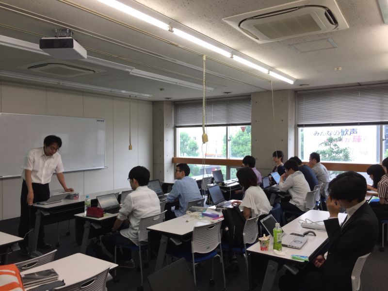
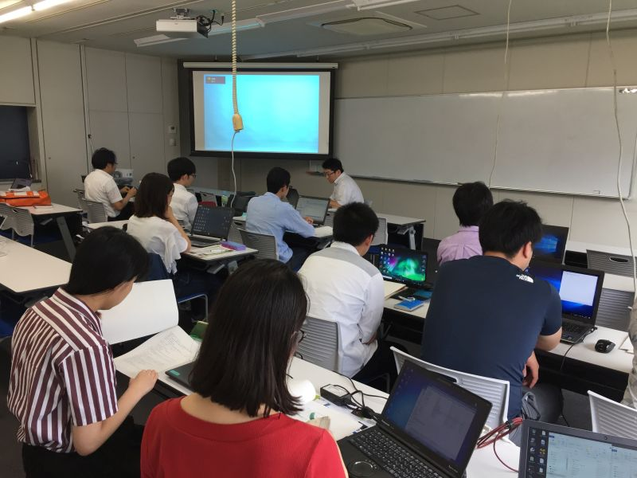
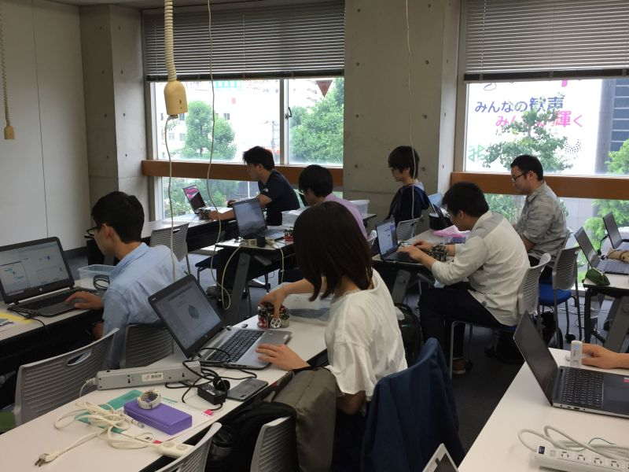

#contents

## RTミドルウェア強化月間 in 早稲田大学・RTミドルウェア講習会

RTミドルウェア強化月間として、早稲田大学西早稲田キャンパスにおいて，RTミドルウェア講習会を開催いたしました．

<!-- RTミドルウェア強化月間として、早稲田大学西早稲田キャンパスにおいて，RTミドルウェア講習会を開催します。&br; -->
<!-- 受講者には各自ノートPCをお持ちいただき、実習形式で実際にRTコンポーネントを作成、既存のコンポーネントなどと組み合わせて簡単なシステムを構築していただきます。&br; -->
<!-- 本講習会を受講することで、RTコンポーネント設計方法、実装の仕方、システムの作り方をマスターすることができます。&br; -->

## 日時・場所
- **日時**: 2019年7月11日 (木) 13:00〜17:00
- **場所・アクセス**: [早稲田大学　西早稲田キャンパス](https://www.waseda.jp/fsci/access/)、55号館S棟4階 ゼミ・会議室A（407室）
<!-- -''場所・アクセス'': [[早稲田大学　西早稲田キャンパス:https://www.waseda.jp/fsci/access/]] -->
<!-- -- [[googleマップ:https://maps.google.co.jp/maps?q=35.705585,139.708339&hl=ja&ll=35.705585,139.708339&spn=0.008956,0.016512&sll=35.705593,139.708436&sspn=0.008956,0.016512&brcurrent=3,0x60188d24cf30335b:0x9cc4ed5b2edeb4a7,0&t=m&z=17]] or http://www.sci.waseda.ac.jp/access/ -->
<!-- -''主催'': 産業技術総合研究所 -->
- **聴講料**: 無料 
<!-- -''定員'': 10名程度を予定しております。定員になり次第申し込みは終了させていただきます。 -->
- **参加者**: 10名（+講師・スタッフ6名）
<!-- -''参加登録'': [[参加登録フォームはこちら>#entry]] -->
<!-- -- 参加登録には当Webページのユーザ登録が必要です。[[ユーザ登録はこちら:http://openrtm.org/openrtm/ja/user/register]] -->
<!-- -- [[メーリングリスト:http://www.openrtm.org/mailman/listinfo/openrtm-users]]への登録をお勧めします。必須ではありませんが、Webでご案内する事前準備についてはメーリングリストにてお知らせします。 -->

### 他の強化月間講習会

<!-- - [[RTミドルウェア強化月間2019 in早稲田大学・RTミドルウェア講習会:/ja/tutorial/bootcamp_waseda_2019]] -->
- [RTミドルウェア強化月間2019 in名城大学・RTミドルウェア講習会](/ja/tutorial/bootcamp_meijo_2019)
- [RTミドルウェア強化月間2019 in都産技研・OpenRTM-aistによるロボット・ソフトウェア開発](https://www.iri-tokyo.jp/seminar/190709.html)

## プログラム(プログラムは変更になる可能性があります）

<table class="table-alt">
  <tr>
    <th>CENTER:110</th>
    <th>LEFT:400</th>
    <th>c</th>
  </tr>
  <tr>
    <td>13:00 -14:00</td>
    <td>**第1部：RTミドルウエア: OpenRTM-aist概要**   **担当**：安藤慶昭(産総研)  **概要**：RTミドルウエアはロボットシステムをコンポーネント指向で構築するソフトウエアプラットフォームです。RTミドルウエアを利用することで、既存のコンポーネントを再利用し、モジュール指向の柔軟なロボットシステムを構築することができます。RTミドルウエアの産総研による実装であるOpenRTM-aistについてその概要について説明します。   **講義資料**：<a href="/sites/default/files/6707/190605-01.pdf">190605-01.pdf</a></td>
  </tr>
  <tr>
    <td>14:15 -17:00</td>
    <td>**第2部: RTコンポーネントの作成入門**  **担当**：宮本信彦(産総研)  **概要**：RTシステムを設計するツールRTSystemEditorおよびRTコンポーネントを作成するツールRTCBuilderの使用方法について解説するとともに、RTCBuilderを使用したRTコンポーネントの作成方法を実習形式で体験していただきます。  <a href="/ja/node/6310">チュートリアル（Raspberry Pi Mouse、Windows編）</a>  <a href="/ja/node/6311">チュートリアル（Raspberry Pi Mouse、Ubuntu編）</a>   **講義資料**： <a href="/sites/default/files/6711/190711-02.pdf">190711-02.pdf</a></td>
  </tr>
</table>

### 必要機材
- ノートPC
  - OS: Windowsを推奨します。
  - Eclipseが動作する程度のスペックが必要です
  - メモリ: 1GB以上
  - CPU: Core2Duo以上
  - HDD空き: 5GB以上 (Visual C++の場合)
- USBカメラ (USBカメラ無しで申込まれた方には貸与いたします)

Windowsのファイアウォールは必ず切っておいてください。;
セキュリティーソフトにもファイアウォールが設定されている場合がありますので、そちらもOFFにしておいてください。;

### 必要ソフトウエア

あらかじめインストールしておくべきソフトウエアは以下のとおりです。以下のリンクをクリックし、ファイルをダウンロード・インストールしてください。(一部のリンクはダウンロードページへ飛びますので、飛んだ先のページ内で適切なファイルをそれぞれダウンロードしてください。

- Visual Studio 2017推奨：[Visual Studio のダウンロード](https://visualstudio.microsoft.com/ja/downloads/?utm_source=mscom&utm_campaign=msdocs) 
  - **Visual C++がインストールされているかは必ず確認してください。**
  - これからダウンロードされる場合、バージョンが2019となります。 [Visual Studio Community 2019のインストール](/ja/vs_install_2019) ページの手順でダウンロードできます。
- [Python 2.7](https://www.python.org/ftp/python/2.7.16/python-2.7.16.amd64.msi)
- [CMake](https://github.com/Kitware/CMake/releases/download/v3.14.1/cmake-3.14.1-win64-x64.msi)
- [Doxygen](http://doxygen.nl/files/doxygen-1.8.14-setup.exe)
- [OpenRTM-aist-1.2.0-RELEASE](https://github.com/OpenRTM/OpenRTM-aist/releases/download/v1.2.0/OpenRTM-aist-1.2.0-RELEASE_x86_64.msi)
  - **Visual Studio 2019を使用する場合は [OpenRTM-aist-1.2.1-RC190514](https://github.com/OpenRTM/OpenRTM-aist/releases/download/v1.2.1-RC190514/OpenRTM-aist-1.2.1-RC190514_x86_64.msi)をインストールしてください。**
  - デフォルト設定のままインストールして下さい。

- [OpenRTM-aistを10分で始めよう！](https://openrtm.org/openrtm/ja/node/6521) を参考に、事前にサンプルコンポーネントを起動して動作確認を行っておいてください。

 

<!-- &aname(entry); -->
<!-- **講習会申し込みフォーム -->

<!-- 追加で若干名のお席をご用意出来ましたので、参加受付再開します。 -->

<!-- 定員に達しましたので受付を終了しました。 -->

<!-- 以下のフォームから講習会へお申し込みください。 -->
<!-- - 参加登録するまえに当Webページのユーザ登録をお願いします。[[ユーザ登録はこちら:http://openrtm.org/openrtm/ja/user/register]] -->
<!-- - 当Webサイトにログイン済みの方は&color(red){名前の欄のユーザ名を氏名に書き換えてください};。 -->
<!-- - フォーム送信後、確認メールをお送りいたします。1日たっても確認メールが届かない場合は、rtm-tutorial(at)aist.go.jp までお問い合わせください。 -->
<!-- - [[参加登録フォーム:https://forms.gle/cEgtfQ8HUuTUCoL4A]] -->
<!-- - フォーム送信後、確認メールをお送りいたします。1日たっても確認メールが届かない場合は、rtm-tutorial(at)aist.go.jp までお問い合わせください。 -->
<!-- (at)を＠におきかえてください。 -->

### 講義資料
#### 第1部 RTミドルウエア: OpenRTM-aist概要 
- [第1部 講義資料(PDF)](/sites/default/files/6707/190605-01.pdf )

<!-- Invalid YouTube URL: https://www.slideshare.net/149148327 -->

#### 第2部 RTコンポーネントの作成入門 
- [第2部 講義資料(PDF)](/sites/default/files/6711/190711-02.pdf )

<!-- Invalid YouTube URL: http://www.slideshare.net/156215551 -->

<!-- **** 第3部 プログラミング実習  -->
<!-- - [[第3部 講義資料(PDF):/sites/default/files/6301/RTミドルウェア講習会_第3部資料_配布版.pdf]] -->

<!-- <nowiki> -->
<!-- [video:http://www.slideshare.net/78647624] -->
<!-- </nowiki> -->

## 講習会の様子

 

 

