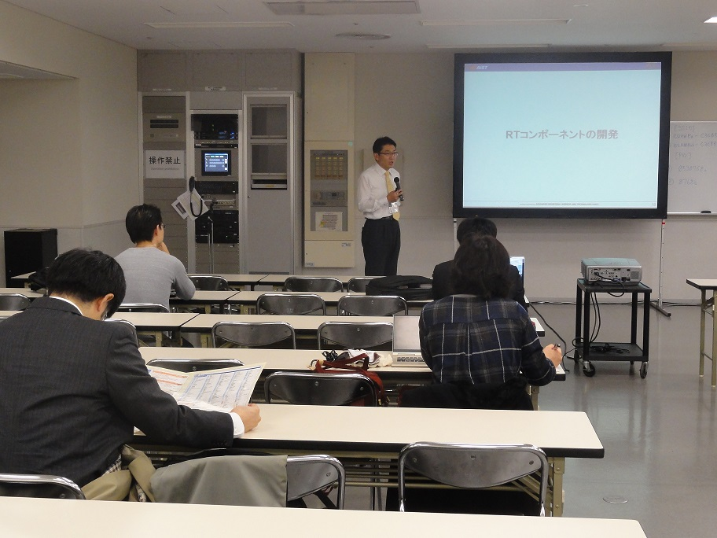
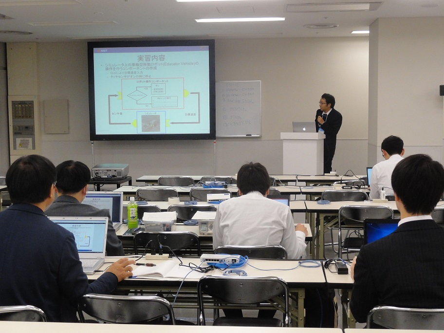
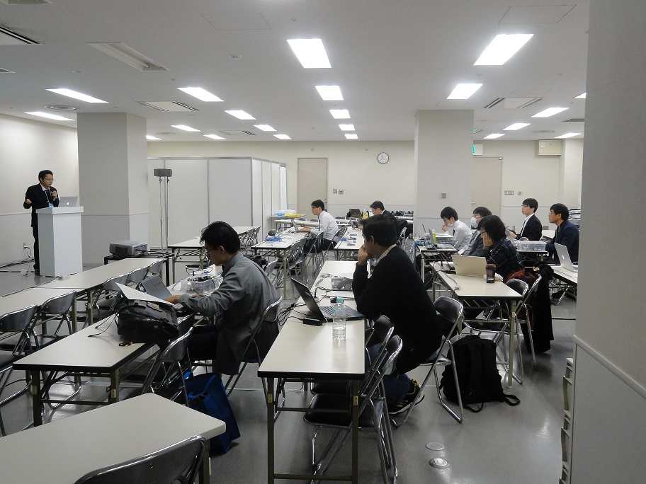
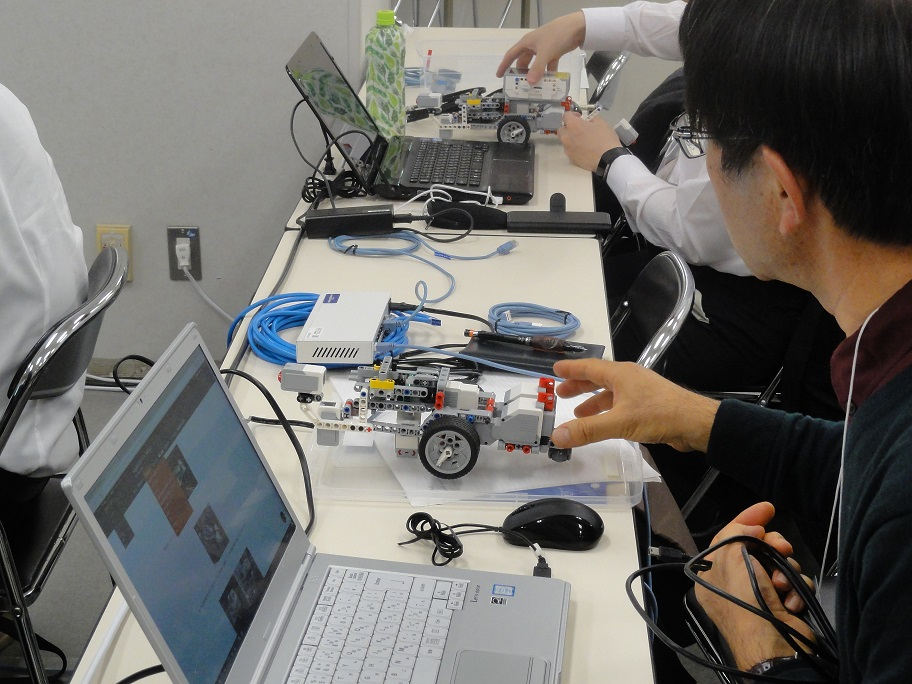
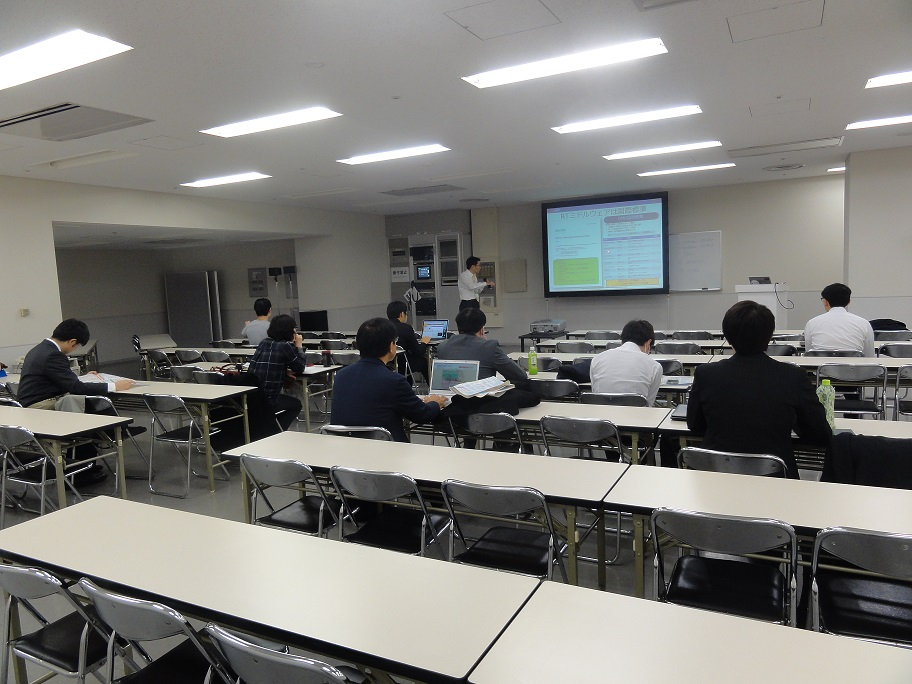

<!-- #ref(http://biz.nikkan.co.jp/eve/irex/_images/_common/logo-irex.jpg,1150%,right,margin=10,around) -->
<!-- 国際ロボット展のサイトにアクセスできないため一時的にコメントアウト -->

#contents(4)

## 開催案内
<!-- ** 開催報告 -->

2017年11月29日(水)に東京ビックサイトにおいて、国際ロボット展－RTミドルウエア講習会を開催いたしました。

<!-- iREX2017 （国際ロボット展）において、RTミドルウエア講習会を開催いたします。&br; -->
RTミドルウエアはロボットシステムの構築を効率化するソフトウエアプラットフォームです。RTコンポーネントと呼ばれるモジュール化されたソフトウエアを多数組わせてロボットシステムを構築するため、システムの変更、拡張がしやすいだけでなく、既存のソフトウエア資産をの継承や他人が作ったコンポーネントとの組み合わせも容易になります。講習会では、RTミドルウエアの概要、RTコンポーネントの作成方法について解説します。受講者には各自ノートPCをお持ちいただき、実習形式で実際にRTコンポーネントを作成、既存のコンポーネントなどと組み合わせて簡単なシステムを構築していただきます。本講習会を受講することで、RTコンポーネント設計方法、実装の仕方、システムの作り方をマスターすることができます。

## 日時・場所

- **日時**: 2017年11月29日(水), 10時00分～16時30分
- **場所**: [東京ビックサイト](http://www.bigsight.jp/) 東6ホール　ワークショップ会場C
  - [交通アクセス](http://www.bigsight.jp/general/access/index.html)
- **主催**: [産業技術総合研究所](http://www.aist.go.jp)
- **共催**: [日本ロボット工業会・ロボットビジネス推進協議会 RTミドルウェアWG](http://www.jara.jp/)
<!-- -''定員''：実習 30名, 聴講 30名（先着順で定員になり次第締め切り） -->
- **参加者**：実習 7名, 聴講のみ 3名（＋講師・スタッフ6名）
- **参加費**: 無料
<!-- -''申し込み'':[[NEDO Webページ:http://www.nedo.go.jp/events/CA_100005.html]] にて [[ユーザアカウント発行:https://app3.infoc.nedo.go.jp/gyouji/mypage/customer_join_form]] の上 [[こちら:https://app3.infoc.nedo.go.jp/gyouji/events/CA/nedoevent.2011-10-17.0557580387/mypage/customer_login]] よりお申し込みください。 -->
<!-- -''申し込み'':&color(red){実習を希望される方のみ}; 本ページの下の登録フォームからお申し込みください。 -->
<!-- -- 前半の座学のみの聴講、実習の見学は登録不要です。 -->
<!-- -- &color(red){''「KobukiとRaspberryPiコース」'', ''「G-ROBOTとChoreonoidコース」''は定員となりましたので締め切らせていただきました。}; -->
<!-- -- お申込みになる場合、''「KobukiとRaspberryPiコース」'', ''「G-ROBOTとChoreonoidコース」'', ''「聴講のみ」''のいずれかをご選択ください。 -->
<!-- -- ''「KobukiとRaspberryPiコース」'', ''「G-ROBOTとChoreonoidコース」''ではノートPCをご持参のうえ、下記の事前準備をお願いしております。 -->
<!-- -- &color(red){定員が限られておりますので、ご欠席される場合は当Webページからお申込みの削除お願いいたします。}; -->

<!-- &ref(irex2013_button.png,80%,left,url=#entry); -->

## プログラム

<table class="table-alt">
  <tr>
    <th>CENTER:150</th>
    <th>LEFT:</th>
    <th>c</th>
  </tr>
  <tr>
    <td>10:00 -10:50</td>
    <td>**第1部：RTミドルウエアで始めるロボットプログラミング**  **担当**：安藤慶昭氏 (産業技術総合研究所)   **概要**：国際標準準拠のロボット用ミドルウエアであるOpenRTM-aistの概要について説明します。OpenRTM-aistを使うと何が出来るのか、何が便利になるのか、また実際にどのように開発するのかといった基本的内容から、コンポーネントの基本機能や開発の実際、各種ツールの利用方法など技術的内容について解説します。</td>
  </tr>
  <tr>
    <td>11:00 -11:50</td>
    <td>**第2部：RTコンポーネント作成入門**   **担当**：宮本信彦氏 (産業技術総合研究所)  **概要**：RTコンポーネント設計ツールRTCBuilderとRTシステム構築ツールRTSystemEditorの利用方法を解説するとともに、移動ロボットシミュレータを用いた実習によりRTコンポーネントの開発手順、動作確認手順を学習します。   <a href="/ja/node/6381">チュートリアル(第2部、Windows)</a>   <a href="/ja/node/6382">チュートリアル(第2部、Ubuntu)</a></td>
  </tr>
  <tr>
    <td>11:50 -12:00</td>
    <td>質疑応答・意見交換</td>
  </tr>
  <tr>
    <td>12:00 -12:30</td>
    <td>RTミドルウェア普及貢献賞授賞式</td>
  </tr>
  <tr>
    <td>12:00 -13:00</td>
    <td>昼食</td>
  </tr>
  <tr>
    <td>13:00 -16:30</td>
    <td>**第3部：RTシステム構築実習**   **担当**：宮本信彦氏 (産業技術総合研究所)    **概要**：移動ロボット実機を複数台用いたシステムの構築実習により、ネットワークに複数接続されたロボットを用いたRTシステムの構築方法を学習します。   <a href="/ja/node/6384">チュートリアル(第3部)</a></td>
  </tr>
</table>

<!-- &br; [[第1, 2部講義資料（PDF）:/sites/default/files/5931/151202-01.pdf]] -->
<!-- &br; [[チュートリアル（画像処理コンポーネントの作成 Windows編）:/ja/node/5022]] &br; [[チュートリアル（画像処理コンポーネントの作成 Linux編）:/ja/node/430 -->

<!-- ** コース概要 -->
<!-- ** プログラミング実習概要 -->

<!-- 未定。 -->

<!-- *** Kobuki & Raspberry Piコース -->

<!-- ARMプロセッサを搭載した小型のシングルボードコンピュータRaspberry Piを使用して、移動ロボット Kobukiを動かしたり、Raspberry Pi用IOボードを利用したジョイスティックを作成したりします。 -->
<!-- これらを組み合わせてKobukiを遠隔操作したり、自律走行させたりすることを目標にします。 -->

<!-- こちらのコースをご希望の方は、以下の申し込みフォームにて「KobukiとRaspberryPiコース」をチェックしてお申し込みください。 -->

<!-- - &ref(131106-03.pdf,講義資料); -->

<!-- #br -->

<!-- &ref(http://www.rt-shop.jp/images/Yujin/Kobuki.jpg,67%); -->
<!-- &ref(http://upload.wikimedia.org/wikipedia/commons/thumb/3/3d/RaspberryPi.jpg/800px-RaspberryPi.jpg,45%); -->

<!-- *** G-ROBOT & Choreonoidコース -->

<!-- G-ROBOTを操作するインターフェースを実際に作ってみたり、産総研で開発されたロボットのモーションエディタ・シミュレータ Choreonoid 上のG-ROBOTを動かしたりします。 -->

<!-- こちらのコースをご希望の方は、以下の申し込みフォームにて「G-ROBOTとChoreonoidコース」をチェックしてお申し込みください。 -->

<!-- #br -->

<!-- &ref(http://www.hpirobot.jp/image/gr-001/product/introduction/s/gr001.jpg,60%); -->
<!-- &ref(http://www.openrtp.jp/wiki/images/_default/Software/Choreonoid/ChoreonoidView.png,40%); -->

<!-- *** 聴講のみ -->

<!-- 実習には参加せず、前半の概要説明などの聴講のみの参加も可能です。 -->
<!-- 聴講は前半の講義だけではなく、実習をご覧になることもできます。お気軽にお申し込みください。 -->

<!-- 以下の申し込みフォームにて「聴講のみ」をチェックの上お申し込みください。 -->

<!-- &aname(document); -->
<!-- **資料 -->

<!-- **講習会に参加される方へ -->
## 講習会参加に必要な環境

実習形式の講習会に参加される方は、以下の準備をお願いいたします。

- ノートPC
  - OS: Windowsを推奨します。応用コースの方は自分で対処出来る場合はどちらでも結構です
  - Eclipseが動作する程度のスペックが必要です
  - メモリ: 1GB以上
  - CPU: Core2Duo以上
  - HDD空き: 5GB以上 (Visual C++ Expressの場合)
- USBカメラ (ない場合には貸与いたします)

Windowsのファイアウォールは必ず切っておいてください。;

### 事前にインストールするソフトウエア

#### Visual Studio 

<!-- - Visual Studio Express 2013推奨：[[こちらのページ:https://www.microsoft.com/ja-jp/download/details.aspx?id=44914]] から無償版をダウンロードできます。 -->
- Visual Studio Express 2013推奨：[こちらのページ](/ja/content/openrtm-aist-c-112-release#vc2013_install) の手順で無償版をダウンロードできます。
  - インストールには時間がかかりますので、事前にインストールしておいてください。

サポートされるVisual Studioは2015までで、Visual Studio 2017 はサポートされていません。;
<!-- - Visual Studio 2017推奨 -->
<!-- -- インストールには時間がかかりますので、「[[VisualStudio2017インストール方法::http://www.openrtm.org/openrtm/ja/content/how_to_install_VS2017]]」を参考に事前にインストール・初回起動を完了しておこしください。 -->

<!-- - Visual Studio 2013推奨：[[こちらのページ:https://www.visualstudio.com/ja-jp/downloads/download-visual-studio-vs#DownloadFamilies_2]] から無償版をダウンロードできます。 -->
<!-- -- 左のメニューから「Visual Studio 2013」→「Community 2013」のWebインストーラを選択。 -->
<!-- -- インストールには時間がかかりますので、事前にインストールしておいてください。 -->

念のためにVisual C++のプロジェクトが作成できるかの確認をお願いします。

- [Visual C++が正常にインストールできたかの確認](http://openrtm.org/openrtm/ja/node/6034#toc8)

#### OpenRTM-aist 1.1.2-RELEASE版 (C++版、Python版）

- 1.1.2 からは一つのインストーラですべての言語とVisual Studioのバージョンに対応しいます。32bit/64bitのみ選択してください。（32bit推奨）
  - [Windows用インストーラ(32bit)](/content/openrtm-aist-c-112-release#toc2)
- 1.1.2 は インストールしているVisual Studioのバージョンをシステム環境変数で指定しますので、設定を確認して下さい。デフォルトはvc2013の設定になっています。
  - [Visual Studio のバージョン指定](/content/openrtm-aist-c-112-release#toc4)
<!-- - 1.1.2の使用を推奨しますが、1.1.0, 1.1.1でも受講可能です。 -->
<!-- - 1.1.1/1.1.0 をお使いの場合は&color(red){必ず}; Visual Studio のバージョンと一致させてください。 -->
<!-- -- 他のバージョン用は、[[こちらのページ:http://openrtm.org/openrtm/ja/content/openrtm-aist-c-112-release]] からダウンロードできます。(非推奨) -->
- デフォルト設定のままインストールして下さい。
- [OpenRTM-aistを10分で始めよう！](http://openrtm.org/openrtm/ja/node/6026) を参考に、事前にサンプルコンポーネントを起動して動作確認を行っておいてください。

#### Python

- [Python2.7.14](https://www.python.org/ftp/python/2.7.14/python-2.7.14.msi)
<!-- 、または [[Python2.7(64bit):https://www.python.org/ftp/python/2.7.10/python-2.7.10.amd64.msi]] -->
<!-- -- &color(red){Python2.7.11もすでにリリースされていますが非推奨です。}; -->
  - OpenRTM-aistやPyYAMLをインストールする前にインストールしてください;

<!-- -- OpenRTM-aist Python の64bit版をインストールされる場合は、[[Python2.7(64bit):https://www.python.org/ftp/python/2.7.9/python-2.7.9.amd64.msi]] をインストールしてください。　 -->

#### その他

以下のソフトウェアも必須です。忘れずにインストールしてください。

- [PyYAML](http://pyyaml.org/download/pyyaml/PyYAML-3.11.win32-py2.7.exe)
<!-- -- Python2.7(64bit)をインストールされた場合は、[[PyYAML(64bit):http://pyyaml.org/download/pyyaml/PyYAML-3.11.win-amd64-py2.7.exe]] をインストールしてください。　 -->
- [CMake](https://cmake.org/files/v3.5/cmake-3.5.2-win32-x86.msi)
- [Doxygen](http://ftp.stack.nl/pub/users/dimitri/doxygen-1.8.11-setup.exe)
- 使い慣れたエディタ: EclipseやPythonに付属のエディタでも構いませんが、使い慣れたエディタが入っていた方が良いでしょう

<!-- &aname(entry); -->
<!-- **講習会申し込みフォーム -->

<!-- 以下のフォームから講習会へお申し込みください。（国際ロボット展への参加は別途お申し込みください。） -->
<!-- - &color(red){実習に参加される場合のみ申し込みが必要です。}; (前半の座学のみの聴講、実習の見学への参加は登録不要です。) -->
<!-- - 参加登録する前に当Webページのユーザ登録をお願いします。[[ユーザ登録はこちら:http://openrtm.org/openrtm/ja/user/register]] -->
<!-- - 当Webサイトにログイン済みの方は名前の欄にユーザ名が出ますが、氏名に書き換えてください。 -->
<!-- - フォーム送信後、確認メールをお送りいたします。1日たっても確認メールが届かない場合は、support(at)openrtm.org までお問い合わせください。 -->

<!-- - &color(red){''「KobukiとRaspberryPiコース」'', ''「G-ROBOTとChoreonoidコース」''は定員となりましたので締め切らせていただきました。}; -->

<!-- &color(red){Kobuki+RaspberryPiコースは定員に達しましたので申し込みを締め切らせていただきました。G-ROBOT+Choreonoidコースおよび聴講のみコースは申し込み可能です。}; -->

<!-- &color(red){定員に達しましたので申し込みを締め切らせていただきました。ありがとうございました。なお、見学だけであれば参加可能ですので、当日、会場までお越しください。}; -->

## 講義資料

#### 第1部 RTミドルウエアで始めるロボットプログラミング
- [講義資料(PDF))](/sites/default/files/171129-irex2017.pdf)

<!-- Invalid YouTube URL: http://www.slideshare.net/83033353 -->

#### 第2部
- 講義資料(PDF)は準備中です。
<!-- - [[講義資料(PDF)):/sites/default/files/151202-01.pdf]] -->

<!-- <nowiki> -->
<!-- [video:http://www.slideshare.net/83033353] -->
<!-- </nowiki> -->

#### 第3部 
- 講義資料(PDF)は準備中です。
<!-- - &ref(131106-03.pdf,講義資料(PDF)); -->

<!-- <nowiki> -->
<!-- [video:http://www.slideshare.net/28178571] -->
<!-- </nowiki> -->

<!-- **** 第3部 G-ROBOT & Choreonoidコース -->
<!-- - &ref(131106-04.pdf,講義資料(PDF)); -->

<!-- <nowiki> -->
<!-- [video:http://www.slideshare.net/28144373] -->
<!-- </nowiki> -->

## 講習会の様子

 

 

 

 

 
