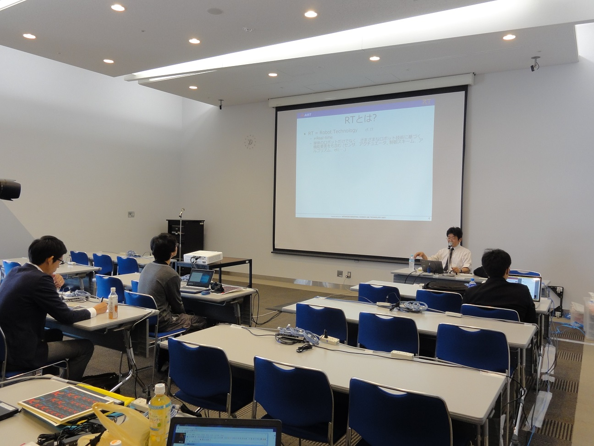
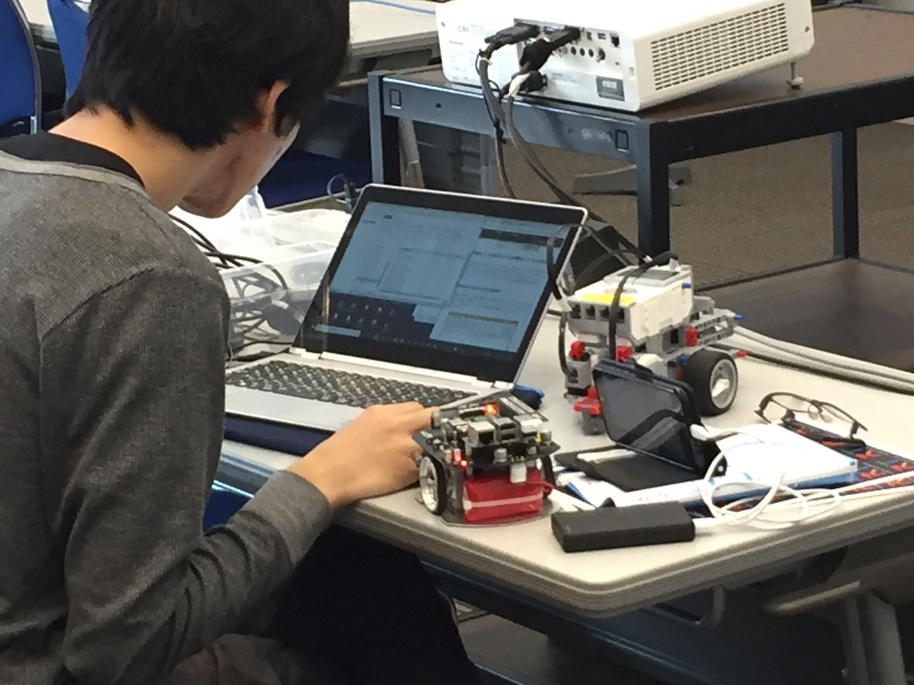

<!-- #ref(dl_logo_wrob.jpg,60%,right,margin=10,around,url=http://biz.nikkan.co.jp/eve/s-robot/index.html) -->
<!-- #ref(DSC_0025.png,50%,right,margin=10,around,url=http://biz.nikkan.co.jp/eve/s-robot/index.html) -->


#contents(4)

<!-- ** 開催案内 -->
## 開催報告

2018年10月18日(木)に東京ビックサイトにおいて、Japan Robot Week 2018－RTミドルウエア講習会を開催いたしました。

<!-- Japan Robot Week 2018でのRTミドルウエア講習会を開催いたします。&br; -->
<!-- RTミドルウエアはロボットシステムの構築を効率化するソフトウエアプラットフォームです。RTコンポーネントと呼ばれるモジュール化されたソフトウエアを多数組わせてロボットシステムを構築するため、システムの変更、拡張がしやすいだけでなく、既存のソフトウエア資産をの継承や他人が作ったコンポーネントとの組み合わせも容易になります。講習会では、RTミドルウエアの概要、RTコンポーネントの作成方法について解説します。受講者には各自ノートPCをお持ちいただき、実習形式で実際にRTコンポーネントを作成、既存のコンポーネントなどと組み合わせて簡単なシステムを構築していただきます。本講習会を受講することで、RTコンポーネント設計方法、実装の仕方、システムの作り方をマスターすることができます。 -->

## 日時・場所

- **日時**: 2018年10月18日(木), 10時00分～16時30分
- **場所**: [東京ビックサイト](http://www.bigsight.jp/) 会議棟6F 601会議室
  - [交通アクセス](http://www.bigsight.jp/general/access/index.html)
<!-- -''主催'': [[産業技術総合研究所:http://www.aist.go.jp]], （一社）日本ロボット工業会・ロボットビジネス推進協議会 -->
<!-- -''定員''：実習 30名, 聴講 30名（先着順で定員になり次第締め切り） -->
- **参加者**：実習 2名,（＋講師・スタッフ3名）
- **参加費**: 無料
<!-- -''申し込み'':&color(red){実習を希望される方のみ}; こちらの[[フォーム:https://openrtm.org/jrw2018]]からお申し込みください。 -->
<!-- -''申し込み'':&color(red){受付開始まで、もうしばらくお待ちください。};  -->
<!-- -- 前半の座学のみの聴講、実習の見学は登録不要です。 -->
<!-- -- 参加登録には当Webページのユーザ登録が必要です。[[ユーザ登録はこちら:http://openrtm.org/openrtm/ja/user/register]] -->
<!-- -- [[メーリングリスト:http://www.openrtm.org/mailman/listinfo/openrtm-users]]への登録をお勧めします。必須ではありませんが、Webでご案内する事前準備についてはメーリングリストにてお知らせします。 -->
<!-- -- なお、登録の際に問題が生じた場合は、 [[こちら（support@openrtm.org）:mailto:support@openrtm.org]] までお問い合わせください。 -->

<!-- &ref(irex2013_button.png,80%,left,url=#entry); -->


## プログラム
<!-- *** 未定 -->

<table class="table-alt">
  <tr>
    <th>CENTER:100</th>
    <th>LEFT:</th>
    <th>c</th>
  </tr>
  <tr>
    <td>10:30 -11:30</td>
    <td>**第1部：RTミドルウエア: OpenRTM-aist概要**<br> **担当**：原 功 氏 (産総研) <br> **概要**：RTミドルウエアはロボットシステムをコンポーネント指向で構築するソフトウエアプラットフォームです。RTミドルウエアを利用することで、既存のコンポーネントを再利用し、モジュール指向の柔軟なロボットシステムを構築することができます。RTミドルウエアの産総研による実装であるOpenRTM-aistについてその概要について説明します。</td>
  </tr>
  <tr>
    <td>11:30 -12:30</td>
    <td>昼食</td>
  </tr>
  <tr>
    <td>12:00 -12:30</td>
    <td>RTミドルウェア普及貢献賞授賞式</td>
  </tr>
  <tr>
    <td>12:30 -15:00</td>
    <td>**第2部：RTコンポーネントの作成入門** <br> **担当**：宮本信彦 氏(産総研)<br> **概要**：RTシステムを設計するツールRTSystemEditorおよびRTコンポーネントを作成するツールRTCBuilderの使用方法について解説するとともに、RTCBuilderを使用したRTコンポーネントの作成方法を実習形式で体験していただきます。 <br> <a href="/ja/node/6550">チュートリアル(第2部、Windows)</a><br> <a href="/ja/node/6551">チュートリアル(第2部、Ubuntu)</a></td>
  </tr>
  <tr>
    <td>15:00 -16:30</td>
    <td>**第3部：RTシステム構築実習** <br> **担当**：宮本信彦 氏(産総研)<br> **概要**：OpenRTM-aistを利用してロボットを制御するプログラムを実際に作成します。<br> <a href="/ja/node/6552">チュートリアル(第3部)</a></td>
  </tr>
</table>

<!-- | 13:00 -16:30 | ''第3部：プログラミング実習'' &br; 担当：Geoffrey Biggs 氏 (産総研)、原功 氏 (産総研)、安藤慶昭 氏 (産総研) &br; ''概要''：OpenRTM-aistを利用してコンポーネントを作成し実際にロボットを動かしていただきます。&br; 今回は2つのコース (Kobuki & Raspberry Piコース ( &ref(131106-03.pdf,講義資料); ), G-ROBOT & Choreonoidコース ( &ref(131106-04.pdf,講義資料); )) を用意しました。 | -->

<br>

### 事前準備
### 講習会参加に必要な環境
- ノートPC
  - 第2部ではノートPCを用いた実習を行うため、ノートPCの用意をお願いします。 ノートPCが用意できない場合は貸し出します。当日申し出てください。
  - ノートPCにウイルス対策ソフトをインストールしている場合は、教材ロボットと通信できなくなる場合があるため無効にしてください。 無効にできない場合はこちらで用意したノートPCを貸し出します。
- 資料
  - 説明資料等を講習会当日にUSBメモリで配布する予定ですが、何らかの理由によりUSBメモリを利用できない場合は以下のZIPファイルをダウンロードしてください。
    - [RTM_Tutorial_JapanRobotWeek2018.zip](https://github.com/OpenRTM/RTM_Tutorial_JapanRobotWeek2018/raw/master/RTM_Tutorial_JapanRobotWeek2018.zip)

- インストールするソフトウェア
  - OS: Windowsの場合
    - 以下のソフトウェアをインストールしてください。
      - [Visual Studio 2017](https://openrtm.org/vs_install)
        - Visual C++がインストールされているかは必ず確認してください。
      - [Python 2.7](https://www.python.org/ftp/python/2.7.15/python-2.7.15.amd64.msi)
      - [CMake](https://cmake.org/files/v3.11/cmake-3.11.4-win64-x64.msi)
      - [Doxygen](http://ftp.stack.nl/pub/users/dimitri/doxygen-1.8.11-setup.exe)
      - ~~OpenRTM-aist-1.2.0-RC1~~
      - [OpenRTM-aist-1.2.0-RELEASE](https://github.com/OpenRTM/OpenRTM-aist/releases/download/v1.2.0/OpenRTM-aist-1.2.0-RELEASE_x86_64.msi)

  - OS: Ubuntuの場合
    - OpenRTM-aist

      - 下記のインストール手順は古い情報です。　必要なdebパッケージとインストールスクリプトをまとめたtar.gzファイルを用意しています。
[こちら ](http://openrtm.org/#linux_packages) のページをご覧ください。

```
 $ git clone https://github.com/n-ando/xenial_package.git
 
 ubuntu 16.04 (64bit) の場合
 $ cd xenial_package/xenial/main/binary-amd64/
 
 C++版のインストール
 $ sudo dpkg -i openrtm-aist_1.1.2-0_amd64.deb
 $ sudo dpkg -i openrtm-aist-example_1.1.2-0_amd64.deb
 $ sudo dpkg -i openrtm-aist-dev_1.1.2-0_amd64.deb
 
 Python版のインストール
 $ sudo dpkg -i openrtm-aist-python_1.1.2-1_amd64.deb
 $ sudo dpkg -i openrtm-aist-python-example_1.1.2-1_amd64.deb
 
 RTSystemEditor/RTCBuilderのインストール
 $ sudo dpkg -i openrtp_1.2.0-0_amd64.deb
```

    - g++

```
 $ sudo apt-get install gcc g++
```

    - omniORB

```
 $ sudo apt-get install libomniorb4-dev omniidl omniorb-nameserver
 $ sudo apt-get install python-omniorb-omg omniidl-python
```

    - CMake

```
 $ sudo apt-get install cmake
```

    - Doxygen

```
 $ sudo apt-get install doxygen
```

    - JDK

```
 $ sudo apt-get install default-jdk
```

    - Premake

```
 $ sudo apt-get install premake4
```

    - RaspberryPiMouseSimulator コンポーネント

```
 $ wget https://raw.githubusercontent.com/OpenRTM/RTM_Tutorial_Waseda2018/master/script/install_raspimouse_simulator.sh
 $ sudo sh install_raspimouse_simulator.sh
```

    - Code::Blocks(任意)

```
 $ sudo apt-get install codeblocks
```

<!-- ** 資料 -->

<!-- *** 第１部：OpenRTM-aistおよび␋RTコンポーネントプログラミングの概要 -->
<!-- <nowiki> -->
<!-- [video:http://www.slideshare.net/67352401] -->
<!-- </nowiki> -->

<!-- *** 第２部：RTコンポーネントの作成入門  -->
<!-- <nowiki> -->
<!-- [video:http://www.slideshare.net/67432411] -->
<!-- </nowiki> -->

<!-- *** 第３部：プログラミング実習 -->
<!-- <nowiki> -->
<!-- [video:http://www.slideshare.net/67432445] -->
<!-- </nowiki> -->


<!-- &aname(entry); -->
<!-- **講習会申し込みフォーム -->

<!-- 以下の手順に従って、下記フォームから講習会へお申し込みください。 -->
<!-- //&br; -->
<!-- //#ref(reg_flow.png,60%,left,nolink) -->
<!-- //&br; -->
<!-- &color(red){このサイトにログイン後、下方に参加登録フォームが現れます。}; -->

<!-- #ref(registration_scheme.png,60%,left,nolink) -->

<!-- + ''ユーザ登録:'' 参加登録するまえに当Webページのユーザ登録をお願いします。[[ユーザ登録はこちら:http://openrtm.org/openrtm/ja/user/register]] -->
<!-- -- 当Webサイトにログイン済みの方は名前の欄にユーザ名が出ますが、氏名に書き換えてください。 -->
<!-- + ''ログイン:'' ユーザ登録後 openrtm.org のサイトにログインします。 -->
<!-- + ''参加登録:'' 下記の登録フォームに必要事項を記入し登録してください。 -->
<!-- //-- 申し込み内容はコースも含めて5日前まで変更できます。 -->
<!-- -- 申し込み内容は5日前まで変更できます。 -->
<!-- -- フォーム送信後、確認メールをお送りいたします。1日たっても確認メールが届かない場合は、[[こちら（tutorial@openrtm.org）:mailto:tutorial@openrtm.org]] までお問い合わせください。 -->

<!-- &color(red){定員に達しましたので申し込みを締め切らせていただきました。ありがとうございました。なお、見学だけであれば参加可能ですので、当日、会場までお越しください。}; -->
<!-- &color(red){第1部のみの聴講は申込不要です。}; -->

## 講習会の様子
<div align="center"><a href="181019-01re.jpg"></a></div>
<br>

<div align="center"><a href="181019-02re.jpg"></a></div>
<br>

