
<a href="/ja/tutorial/robomech2015">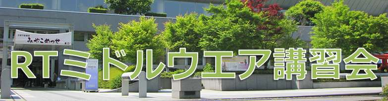</a>

#contents

<!-- ** 開催案内: ROBOMEC2015講習会 -->
## ROBOMEC2015講習会

毎年恒例となりました、ROBOMECHでのRTミドルウエア講習会を今年も開催いたします。RTミドルウエアはロボットシステムの構築を効率化するソフトウエアプラットフォームです。RTコンポーネントと呼ばれるモジュール化されたソフトウエアを多数組わせてロボットシステムを構築するため、システムの変更、拡張がしやすいだけでなく、既存のソフトウエア資産をの継承や他人が作ったコンポーネントとの組み合わせも容易になります。講習会では、RTミドルウエアの概要、RTコンポーネントの作成方法について解説します。受講者には各自ノートPCをお持ちいただき、実習形式で実際にRTコンポーネントを作成、既存のコンポーネントなどと組み合わせて簡単なシステムを構築していただきます。本講習会を受講することで、RTコンポーネント設計方法、実装の仕方、システムの作り方をマスターすることができます。

<!-- 2015年5月17日(日) に京都市勧業館「みやこめっせ」において、ROBOMECでのRTミドルウエア講習会を開催いたしました。 -->

## 日時・場所
- **主催**: 国立研究開発法人 産業技術総合研究所
- **協賛**: ROBOMECH2015, (公社)計測自動制御学会システムインテグレーション部門
- **日時**: 2015年5月17日(日), 10:00～16:45   [ROBOMEC2015チュートリアルとして開催](http://robomech.org/2015/%E9%96%8B%E5%82%AC%E8%A1%8C%E4%BA%8B/)
- **場所**: [京都市勧業館「みやこめっせ」](http://www.miyakomesse.jp) 工芸実技室
  - アクセス: [交通アクセス](http://www.miyakomesse.jp/access/)
  - 詳細は[ROBOMEC2015 Webページ](http://robomech.org/2015/)をご覧ください。
<!-- -''聴講料'': 無料 -->
<!-- -- &color(red){可能な限りROBOMECH2015への参加登録をお願いします。}; -->
<!-- -''定員'': 第1部50名, 実習（第2, 3部）30名程度を予定しております。定員になり次第申し込みは終了させていただきます。第1部のみご参加の方は申し込み不要です。 -->
- **参加者**: 第1部74名、実習（第2, 3部）34名（+講師・スタッフ12名）
<!-- - ''参加登録'': 参加登録は4月上旬ごろから受け付けます -->
<!-- -''参加登録'': [[参加登録フォームはこちら>#entry]] -->
<!-- -- 参加登録には当Webページのユーザ登録が必要です。[[ユーザ登録はこちら:http://openrtm.org/openrtm/ja/user/register]] -->
<!-- -- [[メーリングリスト:http://www.openrtm.org/mailman/listinfo/openrtm-users]]への登録をお勧めします。必須ではありませんが、Webでご案内する事前準備についてはメーリングリストにてお知らせします。 -->
<!-- -- 講習会のみの参加の場合ROBOMEC2013への参加登録は不要です。 -->
<!-- -- なお、登録の際に問題が生じた場合は、 [[こちら（support@openrtm.org）:mailto:support@openrtm.org]] までお問い合わせください。 -->

<!-- &br; -->
<!-- #ref(robomech2015_button2.png,left,url=#entry) -->

<!-- ** 過去の講習会 -->

<!-- こちらから、過去の講習会の資料および写真などがご覧いただけます。 -->

<!-- - [[ROBOMEC2014:/tutorial/robomech2014]] -->
<!-- - [[ROBOMEC2013:/tutorial/robomec2013]] -->
<!-- - [[ROBOMEC2012:/tutorial/robomec2012]] -->

## プログラム

<table class="table-alt">
  <tr>
    <th>CENTER:30</th>
    <th>LEFT:150</th>
    <th>LEFT:150</th>
    <th>c</th>
  </tr>
  <tr>
    <td>10:00 -10:50</td>
    <td>></td>
    <td>**第1部(その1)：OpenRTM-aistおよびRTコンポーネントプログラミングの概要**   **担当**：安藤慶昭 氏 (産総研)  **概要**：RTミドルウェア(OpenRTM-aist)はロボットシステムをコンポーネント指向で構築するソフトウェアプラットフォームです。RTミドルウェアを利用することで、既存のコンポーネントを再利用し、モジュール指向の柔軟なロボットシステムを構築することができます。RTミドルウエアについて、その概要およびRTコンポーネントの機能やプログラミングの流れについて説明します。  **講義資料**:<a href="/sites/default/files/5784/150517-01.pdf">150517-01.pdf</a></td>
  </tr>
  <tr>
    <td>11:00 -11:50</td>
    <td>></td>
    <td>**第1部(その2)：インターネットを利用したロボットサービスとRSiの取り組み2015**  **担当**：成田雅彦 氏（産業技術大学院大学）  **概要**：IOTのキーワードが広まりつつあります．本講演では，これに呼応したRSi（ロボットサービスイニシアティブ）の取り組みとして，ロボットサービスシミュレータ，SLAMモジュール，T型ロボットとの連携，ラズベリパイでの利用，ベイエリアおもてなしロボット研究会の活動などを紹介し，今後を展望したいと思います．  **講義資料**:<a href="/sites/default/files/5784/150517-02.pdf">150517-02.pdf</a></td>
  </tr>
  <tr>
    <td>11:50 -12:00</td>
    <td>></td>
    <td>質疑応答・意見交換</td>
  </tr>
  <tr>
    <td>12:00 -13:00</td>
    <td>></td>
    <td>昼食</td>
  </tr>
  <tr>
    <td>13:00 -14:30</td>
    <td>></td>
    <td>**第2部: RTコンポーネントの作成入門**  **担当**：原功氏、安藤慶昭氏（産業技術総合研究所）坂本武志 氏 (株式会社グローバルアシスト)  **概要**：RTシステムを設計するツールRTSystemEditorおよびRTコンポーネントを作成するツールRTCBuilderの使用方法について解説するとともに、RTCBuilderを使用したRTコンポーネントの作成方法を実習形式で体験していただきます。  <a href="/ja/node/5022">チュートリアル（画像処理コンポーネントの作成 Windows編）</a>   <a href="/ja/node/430">チュートリアル（画像処理コンポーネントの作成 Linux編）</a></td>
  </tr>
  <tr>
    <td>14:45 -16:45</td>
    <td>**第3部：プログラミング実習(ロボット制御コース)**   担当：原功 氏 (産総研)、Geoffrey Biggs 氏 (産総研)   **概要**：OpenRTM-aistを利用してHIDセンサー「LeapMotion」とロボットシミュレータ「Choreonoid」をつなぎ、オペレータの異図に対してバーチャルロボットの制御するコンポーネントを作成します。  **講義資料**:<a href="/sites/default/files/5784/150517-03.pdf">150517-03.pdf</a>  <a href="/ja/node/5794">オンラインチュートリアル</a></td>
    <td>**第3部：プログラミング実習(JVRC参加コース)**   担当： 木村哲也先生（長岡技科大）、松坂要佐氏（MID Academic Promotions Inc.）   **概要**：災害対応ロボットのシミュレーションによる競技会、ジャパンバーチャルロボティクスチャレンジ（JVRC）の概要説明、JVRCで公式シミュレータとして用いられるChoreonoidのシミュレータとしての利用方法について体験していただきます。  **講義資料**:<a href="/sites/default/files/5784/150517-04.pdf">150517-04.pdf</a>  <a href="http://jvrc.github.io/tutorials/html-ja/index.html">オンラインチュートリアル</a></td>
  </tr>
</table>

 
今回は2つのコース (ロボット制御コース, JVRC参加コース) を用意しました。;

<!-- ** 講習会に参加される方へ -->

<!-- 第2,3部の実習には以下の準備が必要です。 -->

### 必要機材
- ノートPC
  - OS: Windowsをご用意下さい
    - JVRC参加コースはUbuntu Linuxを使用しますので、環境をご用意ください（virtualboxなどの仮想環境で大丈夫です）。 
    - チュートリアルを参照してChoreonoidのインストール作業を済ませておいていただけると講習がスムーズに始められます（http://jvrc.github.io/tutorials/html-ja/install.html#installation-of-choreonoid）。
<!-- 第2部の講習もLinuxで受講される場合は、Linuxで使用できるUSBカメラのご用意と、あらかじめOpenRTMとOpenCVをLinuxにインストールする必要があります。 -->
<!-- -- OS: Windowsを推奨します。応用コースの方は自分で対処出来る場合はどちらでも結構です -->
  - Eclipseが動作する程度のスペックが必要です
  - メモリ: 1GB以上
  - CPU: Core2Duo以上
  - HDD空き: 5GB以上 (Visual C++ Expressの場合)

Windowsのファイアウォールは必ず切っておいてください。;

<!-- *** 事前にインストールするソフトウエア -->
### 必要ソフトウエア

<!-- あらかじめインストールしておくべきソフトウエアは以下のとおりです。以下のリンクをクリックし、ファイルをダウンロード・インストールしてください。&br; -->
<!-- 一部のリンクはダウンロードページへ飛びますので、飛んだ先のページ内で適切なファイルをそれぞれダウンロードしてください。 -->

**【注意】** 第2部は原則Windowsで実施します。第3部のJVRC参加コースはLinuxで実施しますので、JVRC参加コースの方はWindows/Linux両方の環境を用意いただくか、第2部をLinuxで受講していただきます。;

#### Windows環境

- Visual Studio
  - [こちらのページ](https://www.visualstudio.com/ja-jp/downloads/download-visual-studio-vs#DownloadFamilies_2) から無償版の Community 2013 Update 4 をダウンロードできます。   
  - インストールには時間がかかりますので、事前にインストールしておいてください。
  - すでに他のバージョン（2008, 2010, 2012, 2013(Express)）がインストールされている場合は、それをお使い下さい。
- OpenRTM-aist C++ 1.1.1-RELEASE版
  - インストールされているVisual Studioに一致するバージョンをダウンロードしてください。;
  - 上記Visual C++ 2013用のインストーラは[こちら](http://openrtm.org/pub/Windows/OpenRTM-aist/cxx/1.1/OpenRTM-aist-1.1.1-RELEASE_x86_vc12.msi)
  - 他のバージョン用は、[こちらのページ](http://openrtm.org/openrtm/ja/content/openrtm-aist-c-111-release) からダウンロードできます。
  - インストーラは、デフォルトでOpenRTPとJREを一緒にインストールします。デフォルト設定のままインストールして下さい。
  - [OpenRTM-aistを10分で始めよう！](http://openrtm.org/openrtm/ja/content/lets_start) を参考に、事前にサンプルコンポーネントを起動して動作確認を行っておいてください。
- [Python2.7(32bit)](https://www.python.org/ftp/python/2.7.9/python-2.7.9.msi)
  - OpenRTM-aistのPython版やPyYAMLをインストールする前にインストールしてください;
  - OpenRTM-aist Python の64bit版をインストールされる場合は、[Python2.7(64bit)](https://www.python.org/ftp/python/2.7.9/python-2.7.9.amd64.msi) をインストールしてください。　
- OpenRTM-aist Python 1.1.0-RELEASE
  - 32bit版インストーラは、[こちら](http://openrtm.org/pub/Windows/OpenRTM-aist/python/OpenRTM-aist-Python_1.1.0-RELEASE_x86.msi) からダウンロードできます。
  - 64bit版インストーラは、[こちらのページ](http://openrtm.org/openrtm/ja/content/openrtm-aist-python-110-release) からダウンロードできます。　　
- [PyYAML(32bit)](http://pyyaml.org/download/pyyaml/PyYAML-3.11.win32-py2.7.exe)
  - Python2.7(64bit)をインストールされた場合は、[PyYAML(64bit)](http://pyyaml.org/download/pyyaml/PyYAML-3.11.win-amd64-py2.7.exe) をインストールしてください。　
- [CMake](http://www.cmake.org/files/v3.2/cmake-3.2.1-win32-x86.exe)
- [Doxygen](http://ftp.stack.nl/pub/users/dimitri/doxygen-1.8.9.1-setup.exe)
- 使い慣れたエディタ: EclipseやPythonに付属のエディタでも構いませんが、使い慣れたエディタが入っていた方が良いでしょう

#### Linux環境

Ubuntu14.04 x64 の環境へ以下をインストールして下さい。

- OpenRTM-aist C++ 1.1.1-RELEASE版
  - [JVRCオンラインチュートリアル](http://jvrc.github.io/tutorials/html-ja/index.html) にChoreonoidと共にインストールする方法が解説されています。
<!-- - OpenRTM-aist Python 1.1.0-RELEASE -->
<!-- -- 一括インストールスクリプト　[[pkg_install_python_ubuntu.sh >http://svn.openrtm.org/OpenRTM-aist-Python/tags/RELEASE_1_1_0/OpenRTM-aist-Python/installer/install_scripts/pkg_install_python_ubuntu.sh]]　をダウンロード・実行してインストールできます。 -->
<!-- -- インストール手順は、OpenRTM-aist Python の [[Ubuntu/Debianへのインストール:http://openrtm.org/openrtm/ja/node/1182]] のページで解説しています。 -->
<!-- -- [[こちらのページ:http://openrtm.org/openrtm/ja/content/openrtm-aist-python-110-release]] からダウンロードできます。 -->

- OpenRTP
  - [こちらのページ](http://openrtm.org/openrtm/ja/download/openrtp/openrtp-110-rc5-ja) からLinux用の全部入りパッケージをダウンロードできます。
インストール方法も解説しています。
- OpenCV
  - 下記パッケージをインストールして下さい。 
$ sudo apt-get install libopencv-dev libcv2.4 libcvaux2.4 libhighgui2.4
- OpenCVサンプルコンポーネント(ImageProcessing)
  - [こちら](http://openrtm.org/pub/Linux/ubuntu/dists/trusty/main/binary-amd64/imageprocessing-1.1.0.deb) からdebパッケージをダウンロード・インストールして下さい。 
$ sudo dpkg -i imageprocessing-1.1.0.deb

<!-- *** 必要ソフトウエア -->
<!-- あらかじめインストールしておくべきソフトウエアは以下のとおりです。以下のリンクをクリックし、ファイルをダウンロード・インストールしてください。(一部のリンクはダウンロードページへ飛びますので、飛んだ先のページ内で適切なファイルをそれぞれダウンロードしてください。 -->

<!-- - Visual C++ 2010 -->
<!-- -- 無料のExpress版が [[こちら:http://www.microsoft.com/visualstudio/jpn/downloads#d-2010-express]] からダウンロードできます。 -->
<!-- -- インストールには時間がかかりますので、ご注意ください。 -->
<!-- -- VC2012, VC2013には対応していません。また、VC2008は少々古いのでお勧めいたしません。 -->
<!-- - [[OpenRTM-aist-1.1.0 C++版:http://www.openrtm.org/openrtm/ja/node/5012]] -->
<!-- -- &color(red){インストールされているVCに一致するバージョンをダウンロードしてください。}; -->
<!-- -- 64bit版はPythonとの相性が悪いので、32bit版をお勧めします。 -->
<!-- - [[OpenRTM-aist-1.1.0-RC1 Python:http://www.openrtm.org/pub/Windows/OpenRTM-aist/python/OpenRTM-aist-Python-1.1.0-RC1.msi]] -->
<!-- - [[Python 2.6(32bit):http://www.python.org/ftp/python/2.6.6/python-2.6.6.msi]] -->
<!-- - [[PyYAML:http://pyyaml.org/download/pyyaml/PyYAML-3.10.win32-py2.6.exe]] -->
<!-- - [[CMake:http://www.cmake.org/files/v2.8/cmake-2.8.8-win32-x86.exe]] -->
<!-- - [[Doxygen:http://ftp.stack.nl/pub/users/dimitri/doxygen-1.8.1-setup.exe]] -->
<!-- - [[JDK:http://www.oracle.com/technetwork/java/javase/downloads/jdk7-downloads-1880260.html]] -->
<!-- -- 32bit版をお勧めします。 -->
<!-- - [[Eclipse全部入り:http://www.openrtm.org/openrtm/ja/node/30]] -->
<!-- -- [[Windows用32bit版全部入り:http://openrtm.org/pub/openrtp/packages/1.1.0.rc4v20130216/eclipse381-openrtp110rc4v20130216-ja-win32.zip]]を推奨します。 -->
<!-- -- インストール後、メニューの「ヘルプ」→「新規ソフトウエアのインストール」を選択、更新サイトに http://openrtm.org/pub/openrtp/releases/updates を入力してRTSystemEditorとRTCBuilderをアップデートしておくことをお勧めします。 -->
<!-- - [[TeraTerm:http://sourceforge.jp/projects/ttssh2/downloads/58215/teraterm-4.77.exe/]] -->
<!-- - Bonjour: インストール方法については[[こちら:http://openrtm.org/openrtm/ja/node/266#toc8]] -->
<!-- -- [[iTunes:http://www.apple.com/jp/itunes/download/]]や[[Bonjour Print Services for Windows:http://support.apple.com/kb/DL999?viewlocale=ja_JP]]がインストールされていれば不要です。 -->
<!-- - 使い慣れたエディタ: EclipseやPythonに付属のエディタでも構いませんが、使い慣れたエディタが入っていた方が良いでしょう -->
<!-- - [[RTC.xml:http://www.openrtm.org/openrtm/sites/default/files/5235/RTC.xml]] 第2部で使用します。 -->

<!-- ** 講習 (第3部) の詳細 -->
## 講習 (第3部) の概要

<!-- **** 実習で必要なファイル -->
<!-- - [[RTC.xml:http://www.openrtm.org/openrtm/sites/default/files/5235/RTC.xml]] -->

### ロボット制御コース

<a href="ChoreonoidView.png">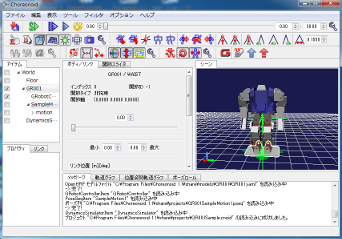</a>

このコースでは、センサーデータに応じてロボットの動きを制御するコンポーネントの作成を経験します。LeapMotionセンサーを利用し手の動きを図って、その動きに対して産総研で開発されたロボットのモーションエディタ・シミュレータChoreonoid 上のG-ROBOTを動かしたりします。LeapMotionセンサー、Choreonoidシミュレータ及びそれぞれのコンポーネントを提供します。参加者はロボットの動きを決めるコンポーネントを作成します。

<!-- &color(red){''【注意】''Apple MacBook Air等のようにLANポートがないパソコンの利用者は必ずLANにつなげる準備（アダプターの用意等）をしてご参加ください。}; -->

<!-- **** オンラインチュートリアル -->

<!-- [[オンラインチュートリアル:/ja/node/5794]]に従って実習を行います。 -->
<!-- - [[チュートリアル:/ja/node/5794]] &color(red){2015/05/12更新された}; -->

 
 
 
 
 
 

### JVRC参加コース

「ジャパンバーチャルロボティクスチャレンジ（Japan Virtual Robotics Challenge）」（略称JVRC）は[NEDO](http://www.nedo.go.jp) が実施中の [プロジェクト](http://www.nedo.go.jp/koubo/CD2_100004.html) の一環として実施する災害対応ロボットのコンピュータシミュレーションによる競技会です。 JVRCでは、災害現場での作業を想定したタスクをシミュレータChoreonoid上でロボットに実行させその性能を競い合います。

このコースは、JVRCに参加を検討している方々に対して、本競技会の趣旨・想定タスクなどについて解説するとともに、Choreonoidを使用したシミュレーションの実行の仕方について実習をしながら学ぶことができます。

- JVRC ホームページ: http://www.jvrc.org/
- NEDO ホームページ: http://www.nedo.go.jp
  - プロジェクト（参考）:http://www.nedo.go.jp/koubo/CD2_100004.html

<!-- **** オンラインチュートリアル -->

<!-- [[オンラインチュートリアル:http://jvrc.github.io/tutorials/html-ja/index.html]] に従って実習を行います。 -->

<!-- - チュートリアル: http://jvrc.github.io/tutorials/html-ja/index.html -->

 
 

### 講義資料
#### 第1部（その１） OpenRTM-aistおよびRTコンポーネントプログラミングの概要 
- [第1部（その１） 講義資料(PDF)](/sites/default/files/5784/150517-01.pdf)

<!-- Invalid YouTube URL: http://www.slideshare.net/48418082 -->

#### 第1部（その２） インターネットを利用したロボットサービスとRSiの取り組み2015
- [第1部（その２） 講義資料(PDF)](/sites/default/files/5784/150517-02.pdf)

<!-- Invalid YouTube URL: http://www.slideshare.net/48591329 -->

<!-- **** 第2部 RTコンポーネントの作成入門 -->
<!-- - [[第2部 講義資料(PDF):http://openrtm.org/openrtm/sites/default/files/5586/140525-03.pdf]] -->
<!-- <nowiki> -->
<!-- [video:http://www.slideshare.net/35243586] -->
<!-- </nowiki> -->
#### 第3部 プログラミング実習
- [第3部（ロボット制御コース） 講義資料(PDF)](/sites/default/files/5784/150517-03.pdf)

<!-- Invalid YouTube URL: http://www.slideshare.net/48419860 -->

- [第3部（JVRC参加コース） 講義資料(PDF)](/sites/default/files/5784/150517-04.pdf)

<!-- Invalid YouTube URL: http://www.slideshare.net/48238532 -->

<!-- &aname(entry); -->
<!-- **講習会申し込みフォーム -->

<!-- 以下の手順に従って、下記フォームから講習会へお申し込みください。 -->
<!-- &br; -->
<!-- &color(red){このサイトにログイン後、下方に参加登録フォームが現れます。}; -->

<!-- #ref(registration_scheme.png,60%,left,nolink) -->

<!-- + ''ユーザ登録:'' 参加登録するまえに当Webページのユーザ登録をお願いします。[[ユーザ登録はこちら:http://openrtm.org/openrtm/ja/user/register]] -->
<!-- -- 当Webサイトにログイン済みの方は名前の欄にユーザ名が出ますが、氏名に書き換えてください。 -->
<!-- + ''ログイン:'' ユーザ登録後 openrtm.org のサイトにログインします。 -->
<!-- + ''参加登録:'' 下記の登録フォームに必要事項を記入し登録してください。 -->
<!-- -- 申し込み内容はコースも含めて5日前まで変更できます。 -->
<!-- -- フォーム送信後、確認メールをお送りいたします。1日たっても確認メールが届かない場合は、[[こちら（support@openrtm.org）:mailto:support@openrtm.org]] までお問い合わせください。 -->

<!-- &color(red){定員に達しましたので申し込みを締め切らせていただきました。ありがとうございました。なお、見学だけであれば参加可能ですので、当日、会場までお越しください。}; -->

<!-- **講習会の様子 -->

<a href="150517-1.jpg">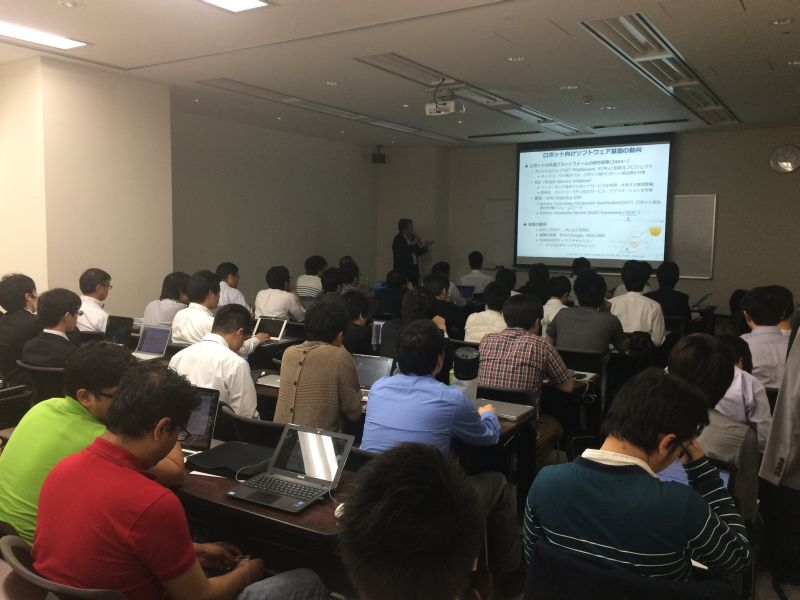</a>

 

<a href="150517-2.jpg">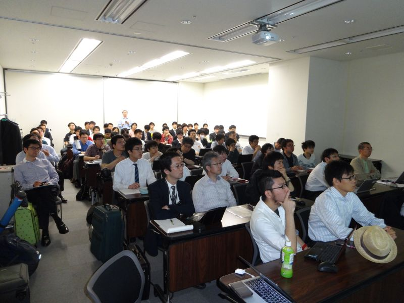</a>

 

<a href="150517-3.jpg">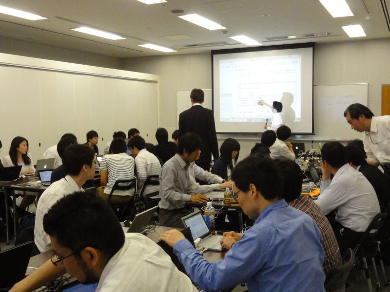</a>

 

<a href="150517-4.jpg">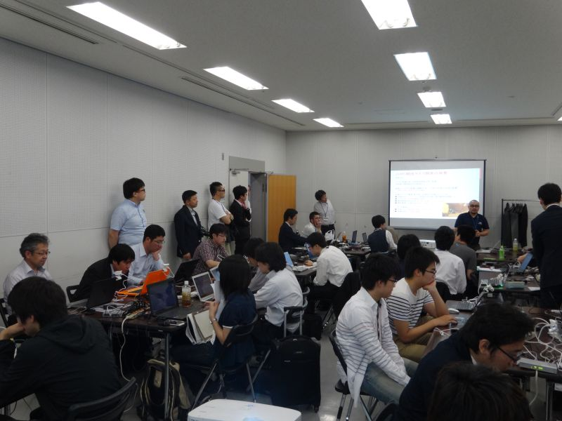</a>

 

<a href="150517-5.jpg">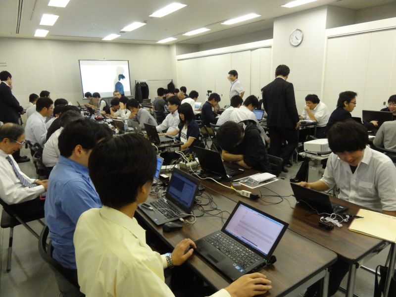</a>

 

<a href="150517-6.jpg">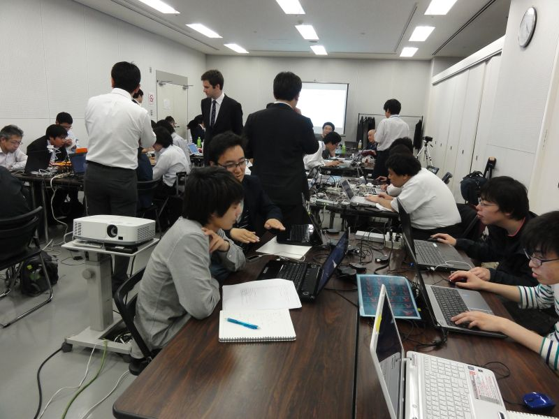</a>

 

<a href="150517-7.jpg">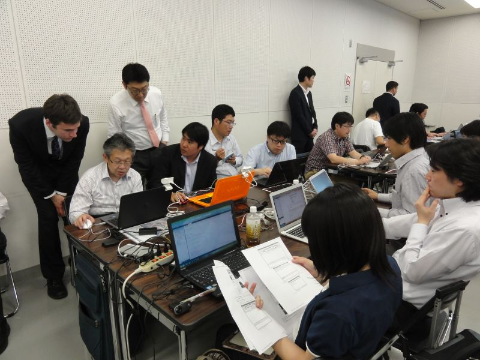</a>

 

<a href="150517-8.jpg">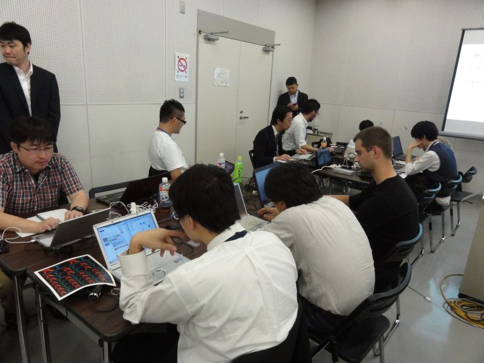</a>

 

<a href="150517-9.jpg">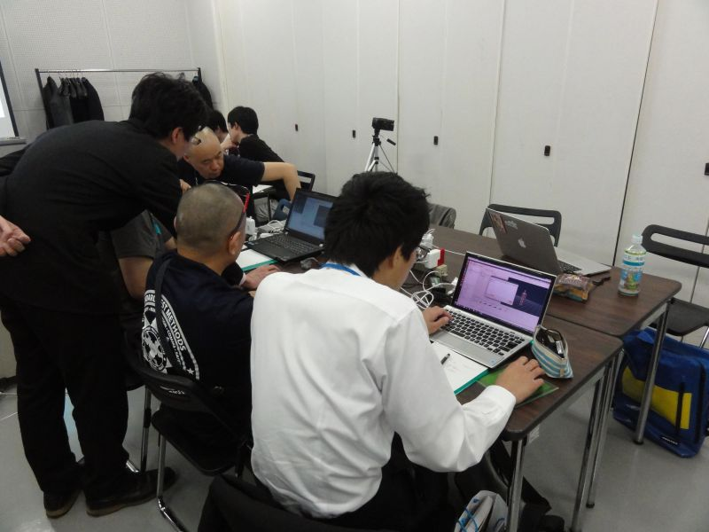</a>

 

