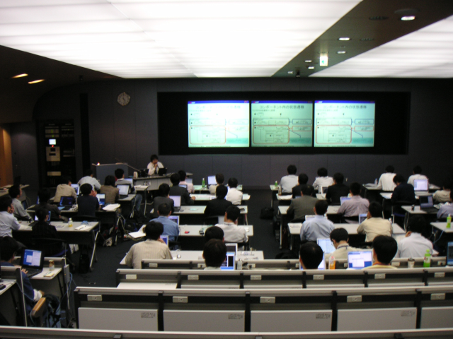
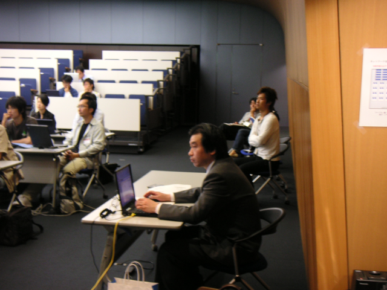
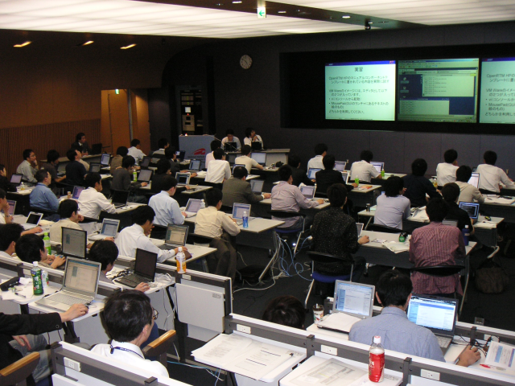
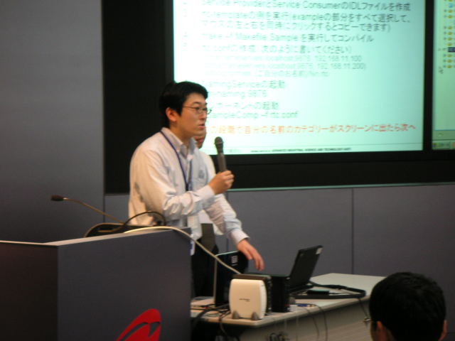

#contents

## 参加人数 
48名

## 資料
- [第1部：OMG標準準拠ミドルウェアOpenRTM-aist-0.4.0について](http://www.openrtm.org/OpenRTM-aist/download/resume/070523/070523-01.pdf)(PDF)
- [第2部：OpenRTM-aist-0.4.0の環境構築](http://www.openrtm.org/OpenRTM-aist/download/resume/070523/070523-02.pdf)(PDF)
- [第3部：RTミドルウェアの各種ツール群について](http://www.openrtm.org/OpenRTM-aist/download/resume/070523/070523-03.pdf)(PDF)
- [第4部：OpenRTM-aist-0.4.0の使い方](http://www.openrtm.org/OpenRTM-aist/download/resume/070523/070523-04.pdf)(PDF)
## 開催案内
- **日時**: 2007年5月23日, 13:30`17:30`
- **場所**: [産総研 本部・情報棟1F ネットワーク会議室](http://www.aist.go.jp/aist_j/guidemap/tsukuba/center/tsukuba_map_c02.html)
  - 予め情報棟で受付を済ませ名札を受け取ってから会議室にお越しください。
- **産総研へのアクセス**
  - [つくばセンターアクセスマップ](http://www.aist.go.jp/aist_j/guidemap/tsukuba/tsukuba_map_main.html)
  - [つくばエクスプレス+連絡バス](http://www.aist.go.jp/aist_j/guidemap/tsukuba/tsukuba_express.html)
  - [高速バス](http://www.aist.go.jp/aist_j/guidemap/tsukuba/tsukuba_highwaybus.html)
- **定員**： 約25名（ノートPCによる実習)
- **聴講料**：無料
- **申込方法**：産総研 安藤<n-ando@aist.go.jp> までメールにてお申し込みください。
- **プログラム**:

<table class="table-alt">
  <tr>
    <th>**13:30-13:50**</th>
    <th>**第1部：OMG標準準拠ミドルウェアOpenRTM-aist-0.4.0について**</th>
  </tr>
  <tr>
    <td>`</td>
    <td>担当：安藤慶昭` (産総研)</td>
  </tr>
  <tr>
    <td>`</td>
    <td>概要：2006年11月にOMG` (Object Management Group) で採択された RTコンポーネント標準仕様のおよび、 これに準拠したRTミドルウエアの 新しいリリース OpenRTM-aist-0.4.0の概要を解説します。</td>
  </tr>
  <tr>
    <td>**14:00-15:00**</td>
    <td>**第2部：OpenRTM-aist-0.4.0の環境構築**</td>
  </tr>
  <tr>
    <td>`</td>
    <td>担当：安藤慶昭(産総研)</td>
    <td>`</td>
  </tr>
  <tr>
    <td>`</td>
    <td>概要：OpenRTM-aist-0.4.0` の環境構築方法や、 サンプルコンポーネントの実行操作ツールRtcLinkによる 基本的な操作方法について実習形式で解説します。</td>
  </tr>
  <tr>
    <td>**15:15-16:15**</td>
    <td>**第3部：RTミドルウェアの各種ツール群について**</td>
  </tr>
  <tr>
    <td>`</td>
    <td>担当：坂本武志(テクノロジックアート)</td>
    <td>`</td>
  </tr>
  <tr>
    <td>`</td>
    <td>概要：OpenRTM-aist-0.2.0` に付属していたシステム開発ツールRtcLinkをEclipseに移植したRtcLink on Eclipseおよび、コードジェネレータ rtc-template のインストール方法、基本的操作方法、およびコンポーネント 開発方法について解説します。</td>
  </tr>
  <tr>
    <td>**16:30-17:30**</td>
    <td>**第4部：OpenRTM-aist-0.4.0の使い方**</td>
  </tr>
  <tr>
    <td>`</td>
    <td>担当：大原賢一(産総研)</td>
    <td>`</td>
  </tr>
  <tr>
    <td>`</td>
    <td>概要：実際に簡単なコンポーネントを参加者に作成していただき、` OpenRTM-aistによるコンポーネント開発を体験していただきます。</td>
  </tr>
</table>

## 講習会の様子

 

 

 

