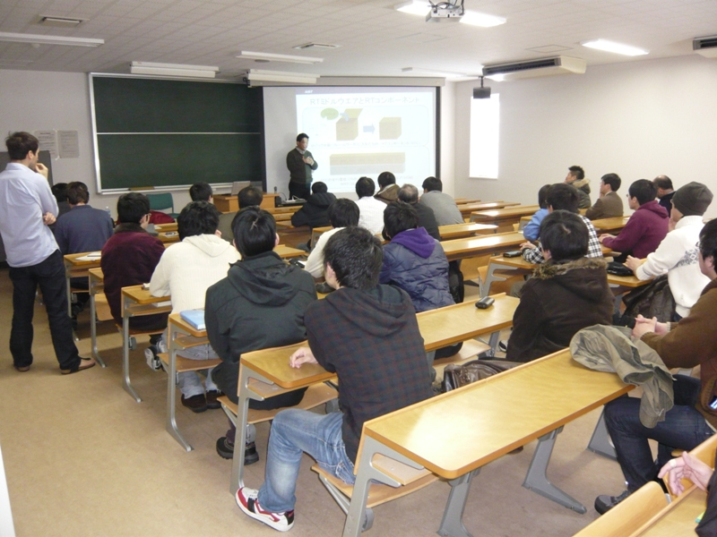
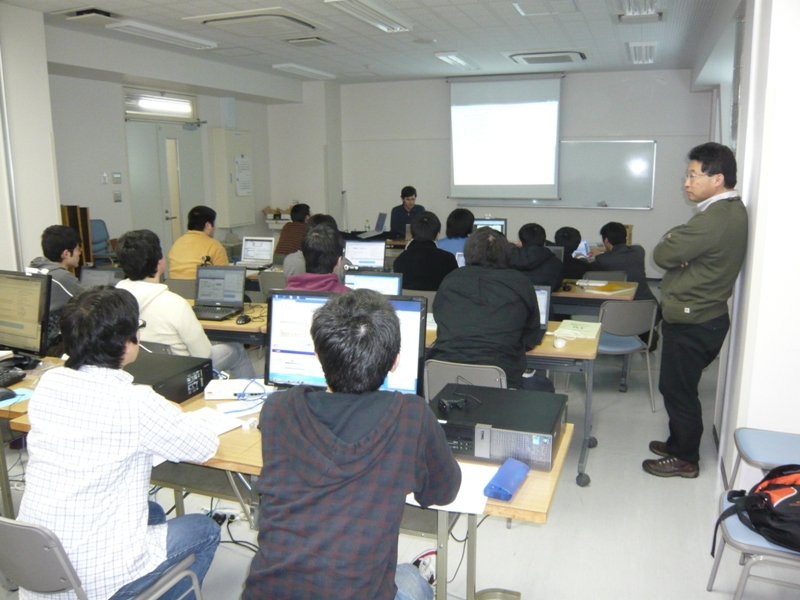
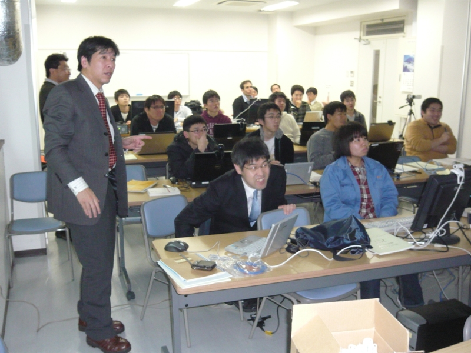

#contents

山形大学 次世代ロボットデザインセンターにてRTミドルウエア講習会を行いました。

## 資料
- [第1部：RTミドルウエアの現状と今後の展望について(PDF)](http://www.openrtm.org/openrtm/sites/default/files/1485/20110121YamagatadaiWorkshop_2up.pdf)
- [第2,3部：OpenRTM-aist開発支援ツールの紹介とその利用法(PDF)](http://www.openrtm.org/openrtm/sites/default/files/1485/RTMworkshopTools.pdf)
- [第4部:コンポーネント開発実習資料](/ja/node/1486)

## 開催案内: 山形大学RTミドルウェア講習会(2011年1月21日)
<!-- RTミドルウエア講習会を開催いたします。  -->
<!-- 詳細は未定ですが、新たにリリースされたOpenRTM-aist-1.0の機能紹介や、コンポーネントを実際に作成するうえで役に立つ技術を紹介いたします。 -->

- **日時**: 2011年1月21日(金),11:00～17:00
- **会場**: [山形大学 次世代ロボットデザインセンター](http://rdcenter.yz.yamagata-u.ac.jp/index.html)
  - アクセス: [交通アクセス](http://www.yz.yamagata-u.ac.jp/access/)
<!-- -''聴講料'': 無料 -->
- **定員**: 15名程度を予定しております。
- **参加人数**: 32名(実習形式：18名)
<!-- -''参加登録'': -->
<!-- ++ メールでの申し込みをお願いいたします。 -->
<!-- --- [[こちら:mailto:openrtm-tutorial@m.aist.go.jp]]宛てに下記内容をお送りください。 -->
<!-- ・氏名 -->
<!-- ・所属 -->
<!-- ・メールアドレス -->
<!-- ・USBカメラの有無 (実習で使用します。) -->

- **プログラム**:  
<table class="table-alt">
  <tr>
    <th>CENTER:80</th>
    <th>LEFT:800</th>
    <th>c</th>
  </tr>
  <tr>
    <td>**11:00 -12:00**</td>
    <td>**第1部：RTミドルウエアの現状と今後の展開について(5号館3Fの5-301教室)**</td>
  </tr>
  <tr>
    <td>`</td>
    <td>担当：` 神徳徹雄 (産総研)</td>
  </tr>
  <tr>
    <td>`</td>
    <td>概要：RTミドルウェアの現状および、今後の展望について。</td>
    <td>`</td>
  </tr>
  <tr>
    <td>**13:00 -13:45**</td>
    <td>**第2部：OpenRTM-aist サンプルコンポーネントの紹介とその利用法(6号館5Fの6－508号室)**</td>
  </tr>
  <tr>
    <td>`</td>
    <td>担当：栗原眞二` (産総研)</td>
  </tr>
  <tr>
    <td>`</td>
    <td>概要：開発実習にて作成するRTCに関するサンプルコンポーネントについて紹介し、RTCの便利さ，面白さを体感して頂きます。</td>
    <td>`</td>
  </tr>
  <tr>
    <td>**14:00 -15:00**</td>
    <td>**第3部：OpenRTM-aist開発支援ツールの紹介とその利用法(6号館5Fの6－508号室)**</td>
  </tr>
  <tr>
    <td>`</td>
    <td>担当：Geoffrey` Biggs (産総研)</td>
  </tr>
  <tr>
    <td>`</td>
    <td>概要：RTコンポーネントを作成するツールRTCBuilder、およびRTシステムを設計するツールRTSystemEditer（GUI版）、rtshell（CUI版）の使い方について解説します。</td>
    <td>`</td>
  </tr>
  <tr>
    <td>**15:15 -17:00**</td>
    <td>**第4部：コンポーネント開発実習(6号館5Fの6－508号室)**</td>
  </tr>
  <tr>
    <td>`</td>
    <td>担当：栗原眞二` (産総研)</td>
  </tr>
  <tr>
    <td>`</td>
    <td>概要：OpenRTMのインストール方法やテスト方法を解説します。OpenRTM-aistでのコンポーネント作成方法を実際に体験していただきます。RTCBuilderを使用したRTコンポーネントの設計とRTSystemEditerでのRTシステム作成を行います。</td>
    <td>`</td>
  </tr>
</table>

<!-- **資料 -->
<!-- -[[第1部：RTミドルウエアの現状と今後の展望について(PDF):http://www.openrtm.org/OpenRTM-aist/download/RTMWorkshop2011/20110121YamagatadaiWorkshop_2up.pdf]] -->
<!-- -[[第2,3部：OpenRTM-aist開発支援ツールの紹介とその利用法(PDF):http://www.openrtm.org/OpenRTM-aist/download/RTMWorkshop2011/RTMworkshopTools.pdf]] -->
<!-- -[[第4部:コンポーネント開発実習資料>/ja/node/1486]] -->

## 講習会の様子

 

 

 

<!-- #ref(IMG_1304.JPG,center,nolink,40%) -->
<!-- #br -->

<!-- **&aname(preparation){講習会に参加される方へ}; -->
<!-- 実習形式の講習会に参加される方は、以下の準備をお願いいたします。 -->

<!-- ***用意するもの  -->
<!-- 第3部の実習には以下の準備が必要です。 -->
<!-- -ノートPC -->
<!-- -USBカメラ -->
<!-- --Windowsでも、Linuxでも構いませんが、USBカメラがOpenCVからつかえることが前提です。 -->
<!-- -あらかじめLANにつながるように設定しておいてください。 -->

### ソフトウエアのインストール 
あらかじめ下記のソフトウエアをインストールしておいてください。
Windows推奨ですが、Linuxでも実習可能です。

- OpenRTM-aist-1.0.0-RELEASE
  - C++版
<!-- --Python版 -->
- Eclipseおよび、RTSystemEditor, RTCBUilder
- 開発環境
  - C++: WindowsではVisual C++ 2008 (Express版でもOK、2010は未対応)
<!-- --Python: Python 2.6 推奨 -->

<!-- 詳細は、[[ダウンロード]]ページをご覧ください。 -->

#### Windowsで必要なソフトウエア
あらかじめ下記のソフトウエアを下記の順番でダウンロードし、インストールしておいてください。;

<!-- -Python版で必要なもの -->
<!-- --[[Python2.6:http://www.python.org/ftp/python/2.6.2/python-2.6.2.msi]] -->
<!-- --[[Python版, Win32:http://www.openrtm.org/pub/Windows/OpenRTM-aist/python/OpenRTM-aist-Python-1.0.0.msi]] -->

- C++版で必要なもの
  - [Visual C++ Express](http://www.microsoft.com/japan/msdn/vstudio/2008/product/express/)
  - [OpenCV1.0](http://downloads.sourceforge.net/opencvlibrary/OpenCV_1.0.exe?modtime=1161287502&big_mirror=1)
  - [OpenCV2.1(VC2008用)](http://sourceforge.net/projects/opencvlibrary/files/opencv-win/2.1/OpenCV-2.1.0-win32-vs2008.exe/download)
 ※ OpenCV2.1のインストールの途中で、環境変数PathにOpenCV2.1のパスを設定するかの確認がでますので、２番目の"Add OpenCV to the system PATH for all users"を選択してください。;
<!-- --[[PyYAML(rtc-templateで使用):http://pyyaml.org/download/pyyaml/PyYAML-3.09.win32-py2.6.exe]] -->
  - [OpenRTM-aist-1.0.0-RELEASE(C++版), Win32 VC2008](http://www.openrtm.org/pub/Windows/OpenRTM-aist/cxx/OpenRTM-aist-1.0.0-RELEASE_vc9_100212.msi)

OpenCV1.0とOpenCV2.1は共存可能です。OpenRTMに付属しているサンプルを動作させるのにOpenCV1.0が必要になります。実習では、OpenCV2.1ベースのコンポーネント群を使用します。;

- RTSystemEditor,RTCBuilder
 下記のツールについては、ダウンロード後にデスクトップに解凍しておいてください。;
  - [Eclipse3.4.2+RTSE(1.0.0-RELEASE)+RTCB(1.0.0-RELEASE)Windows用全部入り](http://www.openrtm.org/pub/OpenRTM-aist/tools/1.0.0/eclipse342_rtmtools100release_win32_ja.zip)
 Eclipseでは、Javaが必要です。下記よりJDKをダウンロード後、インストーラに従ってインストールを行って下さい。（2010/11/25 追記）;
  - [Java Development Kit 6](http://java.sun.com/javase/ja/6/download.html)

- Doxygen
 作成するRTコンポーネントのhtml形式のドキュメントをDoxygenを用いて生成するために使用します。
  - [Doxygen 1.7.3 Windows用インストーラ](http://ftp.stack.nl/pub/users/dimitri/doxygen-1.7.3-setup.exe)
- サンプルRTC群
 OpenCV用RTC群は、インストーラに従ってインストールを行って下さい。;

  - [OpenCV用RTC群(新しいデータタイプを使用)](http://www.openrtm.org/pub/OpenRTM-aist/components/OpenCV/OpenCV-RTC-0.0.1.msi)
  - [ARToolKitRTC](http://www.openrtm.org/pub/OpenRTM-aist/components/ARToolKit-RTC/ARToolKit_RTC.zip)

#### Linuxで必要なソフトウエア
講習会でLinux PCを使用される方向けの情報ですので、Windows PCをご使用の方は、ここは読み飛ばして下さい。;

基本的に、[ダウンロード](http://www.openrtm.org/OpenRTM-aist/html/E38380E382A6E383B3E383ADE383BCE38389.html)ページを参照して、必要なソフトウエアをダウンロードしてください。
Ubuntu, Fedora などメジャーなディストリビューション用のパッケージが用意されています。
また、これ等の加えてOpenCV2.0をインストールしてください。

  - [OpenCV用RTCのソースファイル群(新しいデータタイプを使用)](http://www.openrtm.org/pub/OpenRTM-aist/components/OpenCV/OpenCV_RTC_0.0.1.tar.gz)

<!-- ***第2部：「OpenRTM-aist開発支援ツールの紹介とその利用法」 で使用するファイル -->
<!-- -[[rtc.conf:http://www.openrtm.org/OpenRTM-aist/download/ROBOMEC2010/rtc.conf]]  -->
<!-- -[[configsample.conf:http://www.openrtm.org/OpenRTM-aist/download/ROBOMEC2010/configsample.conf]] -->
