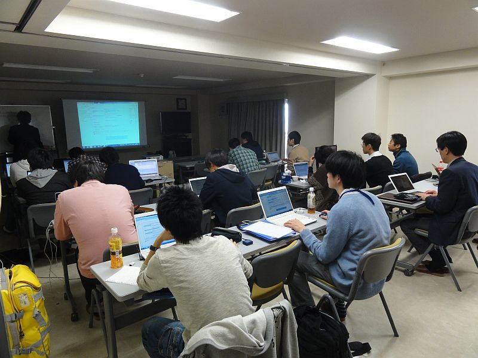
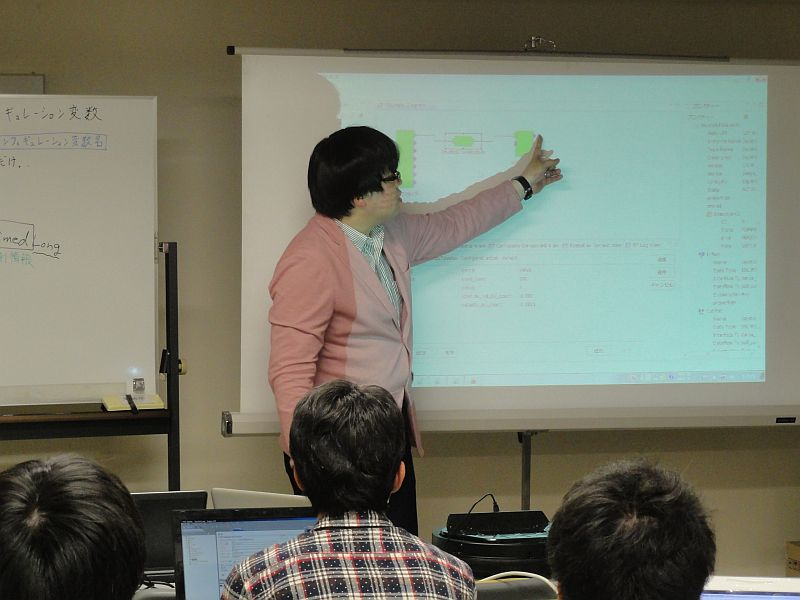
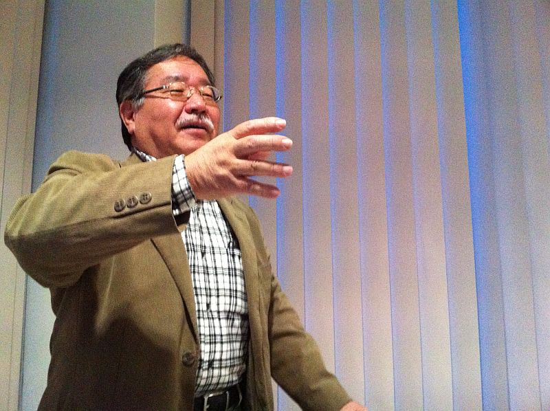
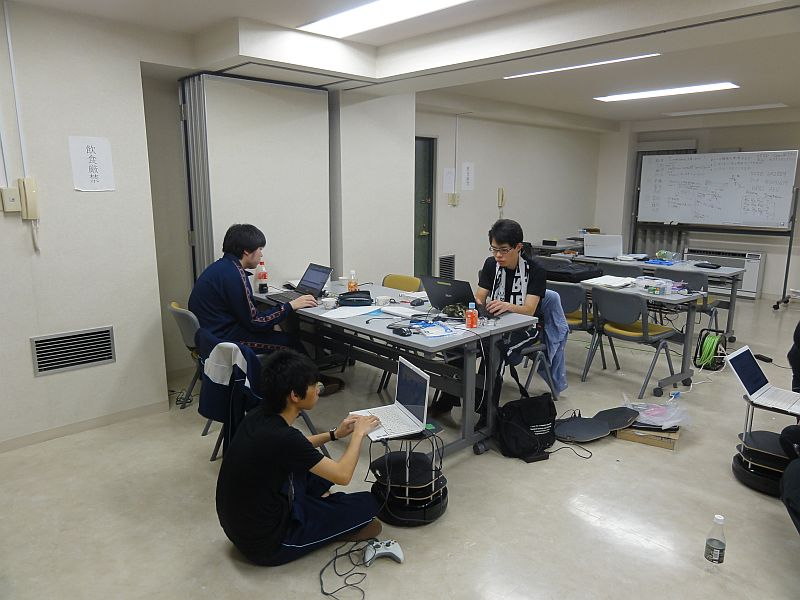
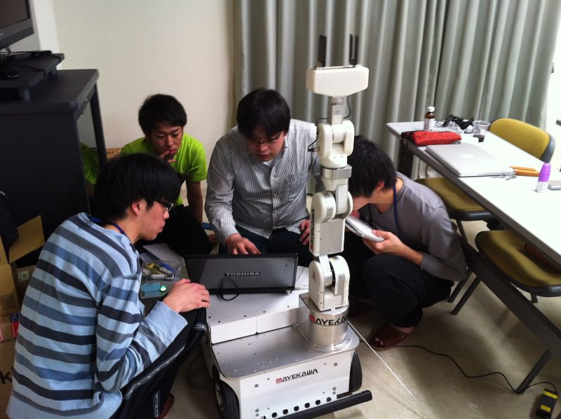
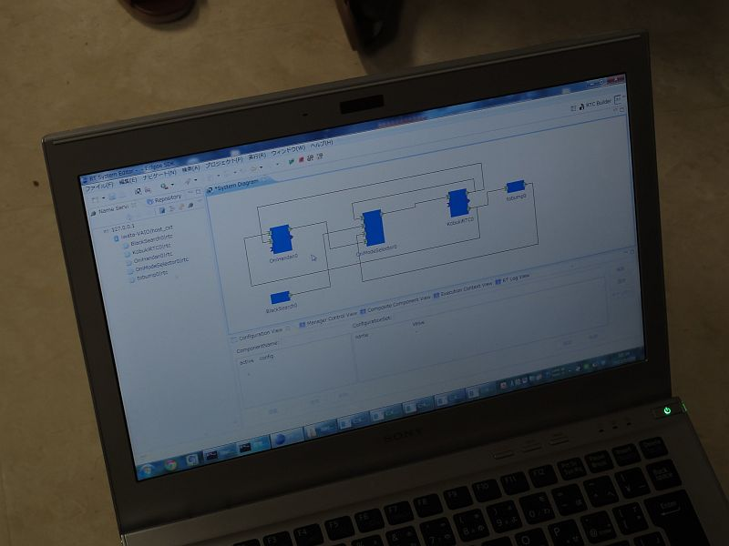
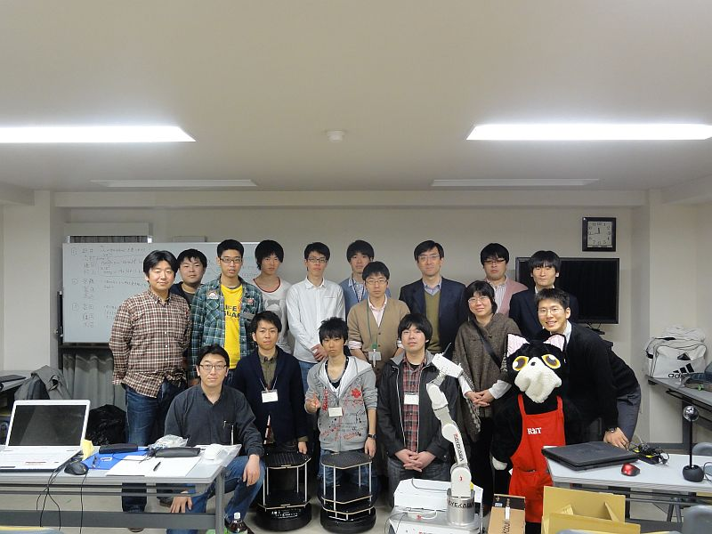

#contents

## RTミドルウエアスプリングキャンプ

芝浦工業大学葉山セミナーハウスにて、学生を対象としたRTミドルウエアスプリングキャンプが開催されました。
3日間にわたり、RTミドルウエアを利用したロボットシステム構築を体験しました。
プログラミング初心者も多かったですが、既存のRTコンポーネントをうまく再利用してそれぞれユニークなロボットシステムを構築しました。

### 主催・共催

- 主催：芝浦工業大学
- 共催：産業技術総合研究所

### 概要・日時

- 内容：RTミドルウエアの基本的な使い方の講習とプロジェクト課題による実習
- 日時：2013年3月26日（火）～3月28日（木）
- 場所：葉山セミナーハウス
  - 〒240-0112 神奈川県三浦郡葉山町堀内162-1
  - TEL: 0468(75)3522
  - http://www.shibaura-it.ac.jp/about/campus/facilities.html#hayama
- 参加費：無料（ただし、交通費、宿泊費、食事代は参加者負担）

### スケジュール

<table class="table-alt">
  <tr>
    <th>LEFT:50</th>
    <th>LEFT:300</th>
    <th>c</th>
  </tr>
  <tr>
    <td>></td>
    <td>CENTER:  **3月26日**</td>
  </tr>
  <tr>
    <td>13:50</td>
    <td>集合</td>
  </tr>
  <tr>
    <td>14:30-17:00</td>
    <td>RTミドルウエア講習</td>
  </tr>
  <tr>
    <td>></td>
    <td>CENTER: **3月27日**</td>
  </tr>
  <tr>
    <td>9:00-17:00</td>
    <td>グループワーク</td>
  </tr>
  <tr>
    <td>></td>
    <td>CENTER: **3月28日**</td>
  </tr>
  <tr>
    <td>9:00-12:00</td>
    <td>成果発表会</td>
  </tr>
  <tr>
    <td>12:00</td>
    <td>解散</td>
  </tr>
</table>

## 開発成果

### 1班

- **課題**: 甘えん坊ロボット
- URGセンサを使って、近くにいる人を追従するロボット。別のPCに接続されたジョイスティックをつかって割り込み操作も可能。ロボットに搭載されたカメラの画像を遠隔から監視しながらジョイスティックで操作します。
- プロジェクトページ: http://www.openrtm.org/openrtm/ja/project/following_robot

<iframe width="560" height="315" src="https://www.youtube.com/embed/bmIF1q_0aHU" frameborder="0" allowfullscreen></iframe>

<!-- Invalid YouTube URL: http://www.slideshare.net/17833341 -->

### 2班

- **課題**: かくれんぼロボット
- ロボットに搭載されたカメラが黒い物体を認識して追跡、もう1台のKobukiを見つけるまで探し回ります。オニKobukiが子Kobukiにタッチするとオニと子が入れ替わります。
- プロジェクトページ: http://www.openrtm.org/openrtm/ja/project/kakurenbo

<iframe width="560" height="315" src="https://www.youtube.com/embed/155PkMl8iN4" frameborder="0" allowfullscreen></iframe>

<!-- Invalid YouTube URL: http://www.slideshare.net/18956360 -->

### 3班

- **課題**: OROCHIとKobukiの連携システム
- OROCHIがピックアップした荷物をKobukiに積み、Kobukiが届けてくれるシステム。お使いをした後、KobukiはOROCHIのところに戻ってきて、OROCHIに荷物を返します。バンパーのセンサを工夫して、位置決め精度を上げています。
- プロジェクトページ: http://www.openrtm.org/openrtm/ja/project/orochi_and_kobuki

<iframe width="560" height="315" src="https://www.youtube.com/embed/tSL3BOCOp6A" frameborder="0" allowfullscreen></iframe>

## 講習会の様子

;

;

;

;

;

;

;

