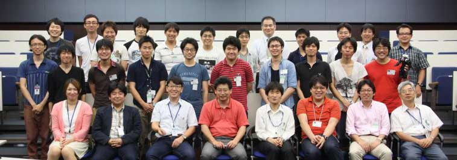

<div align="left"><a href="/ja/node/5048"></a></div>

#contents

## 開催報告
大阪大学の大原先生のご尽力と多くの特別講師やサポートスタッフのご支援のおかげで、個性的な22名の参加者（内、合宿17名、一部日程参加5名）と共に、今年も、サマーキャンプを作り上げて行くことが出来ました。皆さまに御礼申し上げます。
この合宿研修の成果を、RTミドルウエアコンテストで発表いただけることを、期待しております。
<div align="center"><a href="20120803SummerCamp2012.jpg"></a></div>

### 参加者の声
- 普段、RTM開発者がこんなに集まることなんてほとんど無いようなすばらしい環境で、先生方も深夜遅く（寝てない？）まで付き合ってくれて、RTMを習得するのにこれ以上の環境は無いくらい刺激的でモチベーションの保てる場であった。こんなにも整いすぎると、寝る時間さえもったいなく感じて（実際あまり寝てないが）がむしゃらに頑張れた。（社会人）
- RTミドルウエアはサンプルを動かす程度のことしかできませんでしたが，多くの講師の方々に教えていただきながら使い方を身に付けていくことができました．やっと本格的に使えるようになってきたので，研究や趣味に活用していければと思います．（M1）
- 1週間集中して、勉強できるよい機会になりました。 RTミドルを詳しく知ることができたと共に、 どのような人がRTミドルに関わっているのか、人とその思いを知ることができたのは大変よかったと思います。 また宿泊先で他の参加者と一緒に朝まで実装検討できたのは、 とても新鮮で楽しかったです。 （社会人）
- 私はRTM初心者でしたが先生方や講師の皆様のサポートのおかげで、自分でコンポーネントを作成して物を動かすところまでできました。 また、参加者の方達とキャンプの課題以外にも研究や私生活についての話をすることもできたので非常に良い刺激になりました。 一石二鳥にも三鳥にもなるキャンプになったと思います。ありがとうございました!! （牧野慎一郎＠神奈川大学　B4）
- 5日間のRTミドルウェアサマーキャンプ，とても楽しかったです． 結局何も下準備していない状態からでしたが，5日間でロボットシステムを構築できるまでになりました． もしわからないことがあっても講師の皆様方にすぐ助けて頂ける環境でしたので，安心して開発することができました． 少し大変でしたが，一人で開発していたのでは到底得られない体験ができました． 本当にありがとうございました． （高橋直希＠埼玉大　M1）	
- 本当に濃い内容の合宿でした． 始まる前は長いと思っていた5日間ですが，気がづけばあっという間に終わっていました． この合宿に参加するまでOpenRTMの存在すら知らない状態でしたが，講師陣の方々の手厚いご指導もあり（深夜に講師の方の部屋に押しかけて助け舟を出していただいたり…），最終日には無事成果発表を終えることができました．寝る間も惜しくなるような熱い5日間をありがとうございました!! （横尾勇樹＠早稲田大学　M1）
- 第2回目を迎えたRTミドルウェアサマーキャンプで，まだまだ運営側も手探りなところがありますが， それでもロボット系のイベントでこういった物は少ないことから，参加者含め運営側も楽しめるイベントだと思います． 次年度も開催する予定の用ですので，参加者として，運営側として皆様ご参加ください！ （運営スタッフ）

## 開催要旨
本サマーキャンプではRTミドルウエアコンテストへの参加が望まれる学部４年生や大学院生の参加を期待して，RTミドルウェアに精通する講師陣の元で，RTミドルウェアを用いたロボット開発を行う機会を提供する。この企画により、奨励賞（ビギナー限定）を設けたRTミドルウエアコンテストの新規参加者増加につなげることを目的とする。~

### 共同開催
- 産業技術総合研究所　知能システム研究部門
- 計測自動制御学会ＳＩ部門　ＲＴシステムインテグレーション部会
- ロボットビジネス推進協議会

### 協力企業
<div align="center"><a href="rt.png"></a></div>
<div align="center"><a href="ga.png"></a></div>
<div align="center"><a href="sec.png"></a></div>

### 日時・場所
- 2012年7月30日（月）～8月3日（金）
- 産業技術総合研究所　つくばセンター中央第二　
本部・情報棟１階　[ネットワーク会議室](http://www.aist.go.jp/aist_j/guidemap/tsukuba/center/tsukuba_map_c.html)

### 参加人数
- 最大10名程度（グループでの参加を推奨）
- スタッフ側のボランティアも随時募集

### 参加費
無料（ただし，宿泊費や食事代は参加者の自己負担．産総研の宿泊施設を安価で提供できる予定です）

### 実施概要
参加者各自がそれぞれの目的意識を持ち、その目的に向けた開発の初期工程の支援を本サマーキャンプの目的とする。~
本サマーキャンプで利用するRTコンポーネントは、NEDO知能化プロジェクトの成果，過去のRTミドルウェアコンテストの作品，さらには有志により開発されたRTコンポーネントを再利用することを基本とし，適宜各自の目的にあったRTコンポーネントの開発を促すことで，RTコンポーネントの開発，およびRTミドルウェアを用いたロボットシステム開発を行う．~
開発だけでなく，RTミドルウェアに見識のある講師を依頼し，RTミドルウェアによるロボットシステムの開発方法，RTミドルウェアでの開発を支援するツール群の利用方法からRTミドルウェアを用いたシステム事例の紹介まで行い，幅広くRTミドルウェアについての知識提供の機会を設ける。サマーキャンプ最終日には成果発表会を行う．~

（参考）[サマーキャンプ2011](http://www.openrtm.org/openrtm/ja/node/3850)

## プログラム（＆講演資料）
（注意）
- 参加者のレベルに応じて，スケジュールを適宜変更します．
- なお，毎日午前中に開催されます講演については，サマーキャンプ参加者以外でもご参加いただけます．
  - ご参加の場合は大原(k-oohara(at)arai-lab.sys.es.osaka-u.ac.jp)までご連絡下さい．

<table class="table-alt">
  <tr>
    <th>CENTER:100</th>
    <th>LEFT:</th>
    <th>LEFT:200</th>
    <th>c</th>
  </tr>
  <tr>
    <td>7月30日(月)</td>
    <td>第1日目</td>
    <td>-</td>
  </tr>
  <tr>
    <td>13:00-13:10</td>
    <td>RTミドルウェアサマーキャンプ開会の挨拶</td>
    <td>神徳徹雄（産総研）</td>
  </tr>
  <tr>
    <td>13:10-14:10</td>
    <td>自己紹介（決意表明。スライド２枚程度）</td>
    <td>各参加者</td>
  </tr>
  <tr>
    <td>14:10-14:30</td>
    <td><a href="http://www.openrtm.org/openrtm/sites/default/files/5048/Guidance.pdf">ガイダンス</a></td>
    <td>大原賢一（阪大）</td>
  </tr>
  <tr>
    <td>14:30-14:45</td>
    <td>休憩</td>
    <td>-</td>
  </tr>
  <tr>
    <td>14:45-17:00</td>
    <td><a href="http://www.openrtm.org/openrtm/sites/default/files/5048/ROBOSSA_2up.pdf">ROBOSSA紹介</a>、産総研見学会</td>
    <td>原功、神徳徹雄（産総研)</td>
  </tr>
  <tr>
    <td>17:00-18:00</td>
    <td>さくら館移動</td>
    <td>-</td>
  </tr>
  <tr>
    <td>18:00-20:00</td>
    <td>懇親会</td>
    <td>カフェピクニック（所内）</td>
  </tr>
</table>

<table class="table-alt">
  <tr>
    <th>CENTER:100</th>
    <th>LEFT:</th>
    <th>LEFT:200</th>
    <th>c</th>
  </tr>
  <tr>
    <td>7月31日（火）</td>
    <td>第2日目</td>
    <td>-</td>
  </tr>
  <tr>
    <td>09:00-10:00</td>
    <td>自習</td>
    <td>-</td>
  </tr>
  <tr>
    <td>10:00-11:15</td>
    <td><a href="http://www.openrtm.org/openrtm/sites/default/files/5048/Ando.pdf">RTコンポーネントの開発手順について</a></td>
    <td>安藤慶昭（産総研）</td>
  </tr>
  <tr>
    <td>11:15-11:45</td>
    <td><a href="http://www.openrtm.org/openrtm/sites/default/files/5048/Sakamoto.pdf">RTM開発ツール群の紹介</a> 第1部</td>
    <td>坂本武志（グローバルアシスト）</td>
  </tr>
  <tr>
    <td>11:45-12:50</td>
    <td>休憩</td>
    <td>-</td>
  </tr>
  <tr>
    <td>12:50-13:30</td>
    <td>RTM開発ツール群の紹介 第2部</td>
    <td>坂本武志（グローバルアシスト）</td>
  </tr>
  <tr>
    <td>13:30-16:00</td>
    <td>グループ実習1</td>
    <td>-</td>
  </tr>
  <tr>
    <td>16:00-16:30</td>
    <td><a href="http://openhri.net/doc/tutorial/index-ja.html">OpenHRIの使い方</a></td>
    <td>松坂要佐（MIDアカデミックプロモーションズ）</td>
  </tr>
  <tr>
    <td>16:30-18:00</td>
    <td>グループ実習1</td>
    <td>-</td>
  </tr>
</table>

<table class="table-alt">
  <tr>
    <th>CENTER:100</th>
    <th>LEFT:</th>
    <th>LEFT:200</th>
    <th>c</th>
  </tr>
  <tr>
    <td>8月1日（水）</td>
    <td>第３日目</td>
    <td>-</td>
  </tr>
  <tr>
    <td>09:00-10:00</td>
    <td>自習</td>
    <td>-</td>
  </tr>
  <tr>
    <td>10:00-10:30</td>
    <td><a href="http://www.openrtm.org/openrtm/sites/default/files/5048/Geoffrey.pdf">rtshell入門</a></td>
    <td>ジェフ ビグズ（産総研）</td>
  </tr>
  <tr>
    <td>10:30-12:30</td>
    <td><a href="http://www.openrtm.org/openrtm/sites/default/files/20120801-okada-openrtm.pdf">RTM/ROS相互運用プログラミング環境について</a></td>
    <td>岡田慧（東京大）</td>
  </tr>
  <tr>
    <td>12:30-13:30</td>
    <td>休憩</td>
    <td>-</td>
  </tr>
  <tr>
    <td>13:30-17:00</td>
    <td>グループ実習2</td>
    <td>-</td>
  </tr>
</table>

<table class="table-alt">
  <tr>
    <th>CENTER:100</th>
    <th>LEFT:</th>
    <th>LEFT:200</th>
    <th>c</th>
  </tr>
  <tr>
    <td>8月2日（木）</td>
    <td>第4日目</td>
    <td>-</td>
  </tr>
  <tr>
    <td>09:00-10:00</td>
    <td>自習</td>
    <td>-</td>
  </tr>
  <tr>
    <td>10:00-11:00</td>
    <td><a href="/sites/default/files/5048/RTMSummerCamp2012_SEC_20120802.pdf">様々なRTミドルウェア実装によるロボットシステムの構築</a>~</td>
  </tr>
</table>
～RTミドルウェア搭載スマホでロボット制御＆安心・安全のための機能安全対応RTミドルウェア～|中本啓之（セック）|
<table class="table-alt">
  <tr>
    <th>11:00-12:00</th>
    <th><a href="http://www.openrtm.org/openrtm/sites/default/files/5048/Hara.pdf">ChoreonoidとG-robotを用いたロボットモーション作成</a></th>
    <th>原功（産総研）</th>
  </tr>
  <tr>
    <td>12:00-13:00</td>
    <td>昼休み</td>
    <td>-</td>
  </tr>
  <tr>
    <td>13:00-17:00</td>
    <td>グループ実習・成果発表会準備</td>
    <td>-</td>
  </tr>
</table>

<table class="table-alt">
  <tr>
    <th>CENTER:100</th>
    <th>LEFT:</th>
    <th>LEFT:200</th>
    <th>c</th>
  </tr>
  <tr>
    <td>8月3日(金)</td>
    <td>第５日目</td>
    <td>-</td>
  </tr>
  <tr>
    <td>09:00-10:00</td>
    <td>自習</td>
    <td>-</td>
  </tr>
  <tr>
    <td>10:00-10:30</td>
    <td><a href="http://www.openrtm.org/openrtm/sites/default/files/5048/Suga.pdf">RTミドルウェアコンテスト必勝法1</a></td>
    <td>菅佑樹（早稲田大）</td>
  </tr>
  <tr>
    <td>10:30-11:00</td>
    <td><a href="http://www.openrtm.org/openrtm/sites/default/files/5048/Sasaki_2up.pdf">RTミドルウェアコンテスト必勝法2</a></td>
    <td>佐々木毅（芝浦工大）</td>
  </tr>
  <tr>
    <td>11:00-11:30</td>
    <td><a href="http://www.openrtm.org/openrtm/sites/default/files/5048/HOkada_2up.pdf">ロボカップ＠ホームについて</a></td>
    <td>岡田浩之（玉川大）</td>
  </tr>
  <tr>
    <td>11:30-12:00</td>
    <td>成果発表会準備</td>
    <td>-</td>
  </tr>
  <tr>
    <td>12:00-13:00</td>
    <td>昼休み</td>
    <td>-</td>
  </tr>
  <tr>
    <td>13:00-15:30</td>
    <td>成果発表会・記念写真</td>
    <td>-</td>
  </tr>
  <tr>
    <td>15:30-16:00</td>
    <td>片付け</td>
    <td>-</td>
  </tr>
  <tr>
    <td>16:00-19:00</td>
    <td>RTミドルウェアBOFミーティング</td>
    <td>M207会議室（所内）</td>
  </tr>
  <tr>
    <td>19:00-</td>
    <td>有志交流会(スタッフ打ち上げ）</td>
    <td>-</td>
  </tr>
</table>

### 産総研見学会
- [知能ロボットプラットフォームROBOSSA概要](http://www.openrtm.org/openrtm/sites/default/files/5048/ROBOSSA_2up.pdf)（原功）~
以下、2班に分かれて見学
- 作業知能とタスクビジョン研究（原田）
- 移動知能とサービスロボット研究（阪口、田中）
- 生活支援RTルーム（梶谷、山口、橋川）

## 課題について
基本的には各参加者に課題を持ち寄っていただき，講師陣は参加者のサポートを行う形態を取ります．~
ただし，RTミドルウエア初心者でテーマ設定に悩む場合は，下記のような課題も考えております．~

### 課題例
<table class="table-alt">
  <tr>
    <th>人型ロボット(G-Robot)を使ったモーション生成</th>
  </tr>
  <tr>
    <td>ルンバ/Pioneerを用いた課題自律移動ロボットの制御</td>
  </tr>
  <tr>
    <td>共通カメラインタフェースを用いたカメラコンポーネントを用いた物体認識</td>
  </tr>
  <tr>
    <td>RTミドルウェアリファレンスハードウェア「OROCHI」を用いた物体把持</td>
  </tr>
  <tr>
    <td>OpenHRIを用いた音声認識を用いた課題</td>
  </tr>
  <tr>
    <td>RTスペース操作用コンポーネントの開発</td>
  </tr>
  <tr>
    <td>レーザレンジファインダを用いた環境認識</td>
  </tr>
  <tr>
    <td>AR Toolkitを用いた拡張現実感</td>
  </tr>
</table>

（注）変更する可能性もございますことご了承下さい．

## 講習会申し込みフォーム
以下のフォームからRTミドルウェアサマーキャンプ2012にお申し込み下さい．
- 参加登録するまえに当Webページのユーザ登録をお願いします。[ユーザ登録はこちら](http://openrtm.org/openrtm/ja/user/register)
- 当Webサイトにログイン済みの方は名前の欄にユーザ名が出ますが、必ず、氏名に書き換えてください。

<!-- &color(red){申し込みは間もなく開始いたします。今しばらくお待ちください。}; -->

## 実行委員会
<table class="table-alt">
  <tr>
    <th>委員長</th>
    <th>神徳　徹雄</th>
    <th>産総研</th>
  </tr>
  <tr>
    <td>幹事</td>
    <td>大原　賢一</td>
    <td>大阪大学</td>
  </tr>
  <tr>
    <td>委員</td>
    <td>原　功</td>
    <td>産総研</td>
  </tr>
  <tr>
    <td>委員</td>
    <td>安藤　慶昭</td>
    <td>産総研</td>
  </tr>
  <tr>
    <td>委員</td>
    <td>ジェフ　ビグス</td>
    <td>産総研</td>
  </tr>
  <tr>
    <td>委員</td>
    <td>菅　佑樹</td>
    <td>フリーランスエンジニア</td>
  </tr>
  <tr>
    <td>委員</td>
    <td>和田　一義</td>
    <td>首都大学東京</td>
  </tr>
  <tr>
    <td>委員</td>
    <td>新妻　実保子</td>
    <td>中央大学</td>
  </tr>
  <tr>
    <td>委員</td>
    <td>佐々木　毅</td>
    <td>芝浦工業大学</td>
  </tr>
  <tr>
    <td>委員</td>
    <td>坂本　武志</td>
    <td>グローバルアシスト</td>
  </tr>
  <tr>
    <td>委員</td>
    <td>中本　啓之</td>
    <td>セック</td>
  </tr>
  <tr>
    <td>委員</td>
    <td>岡田　浩之</td>
    <td>玉川大学</td>
  </tr>
  <tr>
    <td>委員</td>
    <td>岡田　慧</td>
    <td>東京大学</td>
  </tr>
  <tr>
    <td>委員</td>
    <td>松坂　要佐</td>
    <td>MIDアカデミックプロモーションズ</td>
  </tr>
</table>

### サポート＆協力スタッフ
<table class="table-alt">
  <tr>
    <th>原田　研介</th>
    <th>産総研（見学対応御礼）</th>
  </tr>
  <tr>
    <td>阪口　健</td>
    <td>産総研（見学対応御礼）</td>
  </tr>
  <tr>
    <td>田中　秀幸</td>
    <td>産総研（見学対応御礼）</td>
  </tr>
  <tr>
    <td>谷川　民生</td>
    <td>産総研</td>
  </tr>
  <tr>
    <td>宮本　晴美</td>
    <td>産総研</td>
  </tr>
  <tr>
    <td>韓 越興</td>
    <td>産総研</td>
  </tr>
  <tr>
    <td>橋川　史崇</td>
    <td>産総研[明治大]</td>
  </tr>
  <tr>
    <td>山口　渡</td>
    <td>産総研[筑波大]</td>
  </tr>
  <tr>
    <td>江崎　伸明</td>
    <td>産総研[首都大学東京]</td>
  </tr>
  <tr>
    <td>尾形　仁子</td>
    <td>産総研</td>
  </tr>
  <tr>
    <td>山下　智輝</td>
    <td>前川製作所</td>
  </tr>
  <tr>
    <td>森岡　拓雄</td>
    <td>ウイン電子工業（差入御礼）</td>
  </tr>
  <tr>
    <td>片見　剛人</td>
    <td>ウイン電子工業（差入御礼）</td>
  </tr>
  <tr>
    <td>平井　成興</td>
    <td>千葉工大（差入御礼）</td>
  </tr>
</table>

## お問い合わせ
基本的な情報はホームページから提供いたします。参加申込みいただいた方は連絡したメールに返信ください。
```
 RTミドルウエアサマーキャンプ実行委員会
 〒305-8568 茨城県つくば市梅園１－１－１
 産業技術総合研究所　知能システム研究部門
 神徳徹雄（尾形）
 Tel: 029-861-5952　FAX：029-861-5971
```

[.](/ja/node/5082), [.](/ja/node/5083)
