<div align="left"><a href="/tutorial/summercamp2013"></a></div>

#contents

## 開催報告

名城大学の大原先生のご尽力と多くの特別講師やサポートスタッフのご支援のおかげで、個性的な19名の参加者と共に、今年も、サマーキャンプを作り上げて行くことが出来ました。皆さまに御礼申し上げます。
この合宿研修の成果を、RTミドルウエアコンテストで発表いただけることを、期待しております。
<div align="center"><a href="summercamp2013.jpg">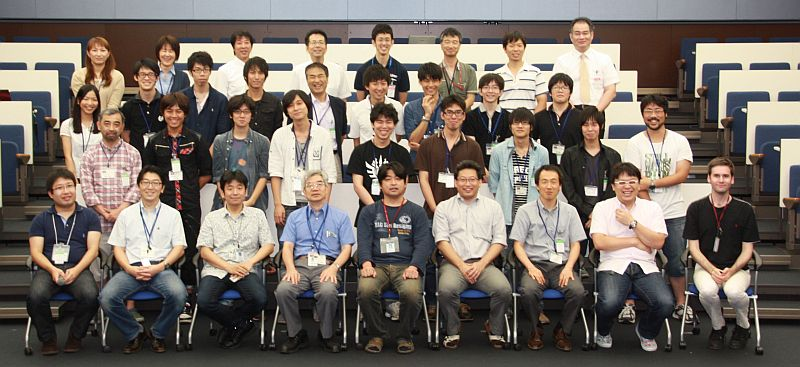</a></div>

<!-- **開催のご案内 -->

<!-- 今年で3回目となりました、RTミドルウエアキャンプを7月29日から8月2日の5日間、茨城県つくば市の(独)産業技術総合研究所において開催いたします。 -->
<!-- RTミドルウエアやロボット開発に精通する講師陣のもとで、RTミドルウエアを用いた様々なロボットシステム開発を体験する機会を5日間にわたり提供します。RTミドルウエアを用いたプログラミングの方法や、実践的なロボットシステムへの応用、RTミドルウエアコンテストでの必勝法等、様々な講義を予定しています。宿泊施設として産総研のさくら館(要実費)を提供することを予定しており、一緒に参加した仲間とともに密度の濃い開発経験を通して、より実践的なロボットシステム構築方法を身に付けることができます。 -->

<!-- ''参加資格は、少なくとも1回以上RTミドルウエア講習会を受講した経験があるか、同等以上のプログラミングスキルを身に着けていることを条件とします。また、参加者は12月に行われるRTミドルウエアコンテストへの参加が期待されています。'' -->

### 参加者の声

- 短期間で恐ろしく技術が身に付いたと思います．トラブル耐性もつきました．その要因として，周りには常に講師陣がいるので困ったことがればすぐに聞くことができます．参加する前には2,3日躓いていた問題があっという間に解決することもありました．更に，インターネット上のどこにも載っていない情報にも数多く身に付けることができました．その他に，グループワークになるので一人だとこの程度でいいだろうと思うところよりさらに1段階高いところを目指すことになります．参加していて思ったのは受け身でいることは勿体無いです．受け身でも多少は技術は身に付きますが，積極的に聞きに行った人と比べれば大きな違いが生じていると見ていて思いました．（高橋城志＠早稲田大学　D1）
- OpenRTMを利用している、興味があるけれどサマーキャンプに参加していない学生の方に、是非とも参加していただきたい行事だと思いました。ぎゅっと内容が詰まっています。ビッグな、そして親切な講師の先生方から教えてもらえる機会もめったにないと思います。（社会人）
- チームメンバーやスタッフの方々から、沢山の刺激を得ることができた５日間でした。RTミドルウェアに関する様々な知識を学べただけでなく、普段の研究に対するモチベーションも上がり、参加して本当によかったです。ありがとうございました。(M2)
- 日々行っている個人の研究活動ではできないような体験ができました。1つのシステムをRTコンポーネントごとに分担して作り、つなげてはデバックの繰り返しをしている内に打ち解け互い、自然に教え合いながら開発をしていました。講師陣に困ったことがあればすぐに相談でき、かなり濃い5日間になりました。（佐々木一磨＠早稲田大　M1）
- この１週間は寝るのがもったいないぐらいに，中身の詰まった濃い１週間でした．また参加したいぐらいです．(M1)

## 開催要旨

本サマーキャンプでは、RTミドルウエアやロボット開発に精通する講師陣のもとで、RTミドルウエアを用いた様々なロボットシステム開発を体験する機会を提供します。この企画により、一緒に参加した仲間とともに密度の濃い開発経験を通して、より実践的なロボットシステム構築方法を身に付けることを目的としています。

### 共同開催
- 産業技術総合研究所　知能システム研究部門
  - 計測自動制御学会ＳＩ部門　ＲＴシステムインテグレーション部会
  - ロボットビジネス推進協議会

<!-- *** 協力企業 -->
<!-- #ref(rt.png) -->
<!-- #ref(ga.png) -->
<!-- #ref(sec.png) -->

### 日時・場所
- 2013年7月29日（月）～8月2日（金）
- 産業技術総合研究所　つくばセンター中央第二　
本部・情報棟１階　[ネットワーク会議室](http://www.aist.go.jp/aist_j/guidemap/tsukuba/center/tsukuba_map_c.html)
<!-- -- [[google map:https://maps.google.com/maps/ms?msid=202092058111064603321.0004e2699244f546ec525&msa=0&ll=36.05949,140.134263&spn=0.009098,0.011297]] -->
<!-- - アクセス -->
<!-- -- 東京駅から並木2丁目:[[高速バス時刻表:http://www.kantetsu.co.jp/bus/highway/center/timetable.pdf]] -->
<!-- --- 東京駅八重洲南口高速バス乗り場からつくばセンター・筑波大学行きに乗り、並木2丁目停留所にて下車してください。 -->
<!-- --- 東京駅から1時間：下りは渋滞が少なくほぼ時間通り到着します。 -->
<!-- -- 秋葉原駅からTXつくば駅経由:[[産総研連絡バス時刻表:http://www.aist.go.jp/aist_j/guidemap/pdf/tsukuba_c_iki.pdf]] -->
<!-- --- つくばエクスプレス秋葉原駅から終点つくば駅(快速：45分)まで乗車し、つくば駅から産総研連絡バスに乗車、つくば中央第1にて下車してください。 -->
<!-- --- 連絡バス所用時間：20分から25分程度。 -->
<!-- -- 常磐線荒川沖駅から路線バス:[[荒川沖バス時刻表:http://www.kantetsu.co.jp/bus/rosen/timetable/timetable/tc/08.pdf]] -->
<!-- --- 常磐線荒川沖駅にて降りていただき、関東鉄道バス西４乗り場筑波大学中央・筑波大学病院行きのバスに乗車し、並木2丁目で下車してください。 -->
<!-- --- バスの所要時間は15分程度です。 -->
- 参加者: 19名（+講師・スタッフ21名）


### 参加資格
- RTミドルウェア講習会に参加したことがある，もしくは同等程度の経験を有していること．

または，

- 下記のサマーキャンプ受講希望者向けの講習会に参加する意思があること．
  - [RTミドルウェア強化月間(第1弾)：中央大学・RTミドルウェア講習会(2013年7月10日)](/ja/tutorial/chuo2013)
  - [RTミドルウェア強化月間(第2弾)：大阪大学・RTミドルウェア講習会(2013年7月11日)](/ja/tutorial/osaka2013)
  - [RTミドルウェア強化月間(第2弾)：名城大学・RTミドルウェア講習会(2013年7月19日)](/ja/tutorial/meijo2013)
  - [RTミドルウェア強化月間(第3弾)：早稲田大学・RTミドルウェア講習会(2013年7月24日)](/ja/tutorial/waseda2013)

<!-- *** 参加人数 -->
<!-- - 最大10名程度（グループでの参加を推奨） -->
<!-- - スタッフ側のボランティアも随時募集 -->


### 参加費
無料（ただし，宿泊費や食事代は参加者の自己負担．産総研の宿泊施設を安価で提供できる予定です）

<!-- *** 実施概要 -->
<!-- 参加者各自がそれぞれの目的意識を持ち、その目的に向けた開発の初期工程の支援を本サマーキャンプの目的とする。~ -->
<!-- 本サマーキャンプで利用するRTコンポーネントは、NEDO知能化プロジェクトの成果，過去のRTミドルウェアコンテストの作品，さらには有志により開発されたRTコンポーネントを再利用することを基本とし，適宜各自の目的にあったRTコンポーネントの開発を促すことで，RTコンポーネントの開発，およびRTミドルウェアを用いたロボットシステム開発を行う．~ -->
<!-- 開発だけでなく，RTミドルウェアに見識のある講師を依頼し，RTミドルウェアによるロボットシステムの開発方法，RTミドルウェアでの開発を支援するツール群の利用方法からRTミドルウェアを用いたシステム事例の紹介まで行い，幅広くRTミドルウェアについての知識提供の機会を設ける。サマーキャンプ最終日には成果発表会を行う．~ -->

（参考）
- [サマーキャンプ2011](http://www.openrtm.org/openrtm/ja/node/3850)
- [サマーキャンプ2012](http://www.openrtm.org/openrtm/ja/node/5048)

## プログラム

<!-- （注意） -->
<!-- -参加者のレベルに応じて，スケジュールを適宜変更します． -->
<!-- -なお，毎日午前中に開催されます講演については，サマーキャンプ参加者以外でもご参加いただけます． -->
<!-- --ご参加の場合は大原(k-oohara(at)arai-lab.sys.es.osaka-u.ac.jp)までご連絡下さい． -->

<table class="table-alt">
  <tr>
    <th>CENTER:100</th>
    <th>LEFT:</th>
    <th>LEFT:200</th>
    <th>c</th>
  </tr>
  <tr>
    <td>7月29日(月)</td>
    <td>第1日目</td>
    <td>-</td>
  </tr>
  <tr>
    <td>12:30-13:00</td>
    <td>受付開始</td>
    <td>-</td>
  </tr>
  <tr>
    <td>13:00-13:10</td>
    <td>RTミドルウェアサマーキャンプ開会の挨拶</td>
    <td>RTミドルウェアサマーキャンプ2013実行委員長 谷川　民生(産総研)</td>
  </tr>
  <tr>
    <td>13:10-14:30</td>
    <td>自己紹介、決意表明。（各自5分程度）</td>
    <td>各参加者</td>
  </tr>
  <tr>
    <td>13:30-14:45</td>
    <td>休憩</td>
    <td>-</td>
  </tr>
  <tr>
    <td>14:45-15:00</td>
    <td>RTミドルウェアサマーキャンプガイダンス</td>
    <td>大原　賢一（名城大）</td>
  </tr>
  <tr>
    <td>15:00-16:00</td>
    <td>コンポーネント開発のためのモデリング手法</td>
    <td>坂本　武志（グローバルアシスト）</td>
  </tr>
  <tr>
    <td>16:00-17:30</td>
    <td>産総研見学会</td>
    <td>-</td>
  </tr>
  <tr>
    <td>17:30-18:00</td>
    <td>さくら館移動</td>
    <td>-</td>
  </tr>
  <tr>
    <td>18:00-20:00</td>
    <td>懇親会</td>
    <td>未定（所内）</td>
  </tr>
</table>

<table class="table-alt">
  <tr>
    <th>CENTER:100</th>
    <th>LEFT:</th>
    <th>LEFT:200</th>
    <th>c</th>
  </tr>
  <tr>
    <td>7月30日（火）</td>
    <td>第2日目</td>
    <td>-</td>
  </tr>
  <tr>
    <td>9:00-10:00</td>
    <td>自習時間</td>
    <td>-</td>
  </tr>
  <tr>
    <td>10:00-10:20</td>
    <td>**ChoreonoidとOpenHRIを用いた対話型ロボットのRTC群について**<br> コミュニケーション知能RTC群であるOpenHRIとヒューマノイド動作設計シミュレーションツールであるChoreonoidの概要と、これらを使った対話型ロボットシステムを構築するためのRTC群について説明を行います。 <br> **講義資料**:<a href="http://openrtm.org/openrtm/sites/default/files/5308/2013SummerCamp-01.pdf">2013SummerCamp-01.pdf</a></td>
    <td>原　功（産総研）</td>
  </tr>
  <tr>
    <td>10:20-10:40</td>
    <td>**Orochiを用いるRTC, Rtno, Pioneer …使えるRTC**<br> MobileRobotRTC (移動ロボットPioneer3)、OROCHI (ロボットアームOROCHI)について解説します。 <br> **講義資料**:<a href="http://openrtm.org/openrtm/sites/default/files/5308/2013SummerCamp-02.pdf">2013SummerCamp-02.pdf</a></td>
    <td>菅　祐樹（SSR)</td>
  </tr>
  <tr>
    <td>10:40-11:00</td>
    <td>**RaspberryPiを用いたKobuki制御RTC**<br> RaspberryPiを利用した移動ロボットKobukiの制御およびPiRT-Unitを利用した各種センサ等の取り扱い方法についてレクチャーします。 <br> **講義資料**:<a href="http://openrtm.org/openrtm/sites/default/files/5308/2013SummerCamp-03.pdf">2013SummerCamp-03.pdf</a></td>
    <td>安藤　慶昭（産総研）</td>
  </tr>
  <tr>
    <td>11:00-11:20</td>
    <td>RTM on Androidの紹介  <br> **講義資料**:<a href="http://openrtm.org/openrtm/sites/default/files/5308/2013SummerCamp-04.pdf">2013SummerCamp-04.pdf</a></td>
    <td>川口　仁（セック）</td>
  </tr>
  <tr>
    <td>11:30-12:30</td>
    <td>昼休み</td>
    <td>-</td>
  </tr>
  <tr>
    <td>12:30-18:00</td>
    <td>グループ実習</td>
    <td>-</td>
  </tr>
</table>

<table class="table-alt">
  <tr>
    <th>CENTER:100</th>
    <th>LEFT:</th>
    <th>LEFT:200</th>
    <th>c</th>
  </tr>
  <tr>
    <td>7月31日（水）</td>
    <td>第３日目</td>
    <td>-</td>
  </tr>
  <tr>
    <td>9:00-10:00</td>
    <td>**構築するシステムに関する発表会**<br> グループごとに作成するシステムの概要について発表していただきます。また、作成予定のシステムをOpenRTM-aistのWebページにプロジェクトとして登録する方法について解説します。</td>
    <td>安藤　慶昭</td>
  </tr>
  <tr>
    <td>10:00-10:20</td>
    <td>ROSとRTMの連携について  <br> **講義資料**:<a href="http://openrtm.org/openrtm/sites/default/files/5308/2013SummerCamp-05.pdf">2013SummerCamp-05.pdf</a></td>
    <td>岡田　慧（東大）</td>
  </tr>
  <tr>
    <td>10:20-12:00</td>
    <td>グループ実習</td>
    <td>-</td>
  </tr>
  <tr>
    <td>12:00-13:00</td>
    <td>昼休み</td>
    <td>-</td>
  </tr>
  <tr>
    <td>13:00-18:00</td>
    <td>グループ実習</td>
    <td>-</td>
  </tr>
</table>

<table class="table-alt">
  <tr>
    <th>CENTER:100</th>
    <th>LEFT:</th>
    <th>LEFT:200</th>
    <th>c</th>
  </tr>
  <tr>
    <td>8月1日（木）</td>
    <td>第4日目</td>
    <td>-</td>
  </tr>
  <tr>
    <td>9:00-9:30</td>
    <td><a href="http://www.openrtm.org/openrtm/sites/default/files/5048/Geoffrey.pdf">rtshell入門</a><br>rtshellはシェルでRTコンポーネントとRTシステムの管理をするためのスクリプトです。RTSystemEditorを使わずにコンポーネントをactivate/deactivateしたり、コンポーネント同士を接続する方法などについて紹介します。  <br> **講義資料**:<a href="http://openrtm.org/openrtm/sites/default/files/5308/2013SummerCamp-06.pdf">2013SummerCamp-06.pdf</a></td>
    <td>ジェフ　ビグス(産総研)</td>
  </tr>
  <tr>
    <td>9:30-10:30</td>
    <td>作成するシステムモデルの発表</td>
    <td>各グループ</td>
  </tr>
  <tr>
    <td>10:30-12:00</td>
    <td>グループ実習</td>
    <td>-</td>
  </tr>
  <tr>
    <td>12:00-13:00</td>
    <td>昼休み</td>
    <td>-</td>
  </tr>
  <tr>
    <td>13:00-13:20</td>
    <td>**RTミドルウェアで挑戦するロボカップ**<br> ロボカップでは、西暦2050年「サッカーの世界チャンピオンチームに勝てる、自律型ロボットのチームを作る」という夢の実現を目指し、大規模災害への応用としてレスキューリーグ、ジュニアリーグなども実施されています。中でも近年注目されているリーグが＠ホームです。ロボカップ＠ホームは家庭用サービスロボットの実用化を念頭に様々なサービスの実現を競います。RTミドルウェアを使用した世界大会で出場の様子をご紹介します。  <br> **講義資料**:<a href="http://openrtm.org/openrtm/sites/default/files/5308/2013SummerCamp-07.pdf">2013SummerCamp-07.pdf</a></td>
    <td>岡田　浩之（玉川大）</td>
  </tr>
  <tr>
    <td>13:20-13:40</td>
    <td>RTミドルウェアコンテスト必勝法<br>RTミドルウェアコンテストはRTミドルウエアを用いて作成されたコンポーネントやRTミドルウエア技術を利用したツールを対象として毎年12月に開催されているコンテストです。この講演では、RTミドルウェアコンテストの必勝法として、コンテストに参加するうえで注意すべき点を講演者の経験を基に説明します。  <br> **講義資料**:<a href="http://openrtm.org/openrtm/sites/default/files/5308/2013SummerCamp-08.pdf">2013SummerCamp-08.pdf</a></td>
    <td>佐々木　毅（芝浦工大）</td>
  </tr>
  <tr>
    <td>13:40-18:00</td>
    <td>グループ実習</td>
    <td>-</td>
  </tr>
</table>

<table class="table-alt">
  <tr>
    <th>CENTER:100</th>
    <th>LEFT:</th>
    <th>LEFT:200</th>
    <th>c</th>
  </tr>
  <tr>
    <td>8月2日(金)</td>
    <td>第５日目</td>
    <td>-</td>
  </tr>
  <tr>
    <td>9:00-12:00</td>
    <td>グループ実習</td>
    <td>-</td>
  </tr>
  <tr>
    <td>12:00-13:00</td>
    <td>昼休み</td>
    <td>-</td>
  </tr>
  <tr>
    <td>13:00-16:00</td>
    <td>成果報告会・記念撮影</td>
    <td>-</td>
  </tr>
  <tr>
    <td>16:00-16:10</td>
    <td>RTミドルウェアサマーキャンプ2013閉会の挨拶</td>
    <td>平井　成興（千葉工大）</td>
  </tr>
  <tr>
    <td>16:10-16:30</td>
    <td>片付け</td>
    <td>-</td>
  </tr>
  <tr>
    <td>16:30-20:00</td>
    <td>RTミドルウェア有志交流会</td>
    <td>-</td>
  </tr>
</table>

### 産総研見学会

２班に分かれて見学
- 高精度な姿勢検出が可能な視覚マーカ（田中）
- 移動知能とフィールドロボット研究（横塚）
- 生活支援RTルーム（谷川、関山）

## rtshellの環境構築について
Windows上でrtshellを動かすためには，下記のソフトも必要になりますので，インストールを行ってください．
[rtctree・rtcprofile](http://openrtm.org/openrtm/ja/node/1323)

なお，Pythonにパスを通す必要があるので，環境変数に下記を追加してください．
(Pythonが下記にインストールされている場合．)

```
  c:¥python26
```

パスを通す前にOpenRTM-aist-1.1.0のPython版を入れた場合は，一度アンインストールし，パスを通した後で，インストールしなおしてください．
加えて，下記の２つのパスを環境変数に追加してください．

<table class="table-alt">
  <tr>
    <th>変数名</th>
    <th>PYTHONPATH</th>
  </tr>
  <tr>
    <td>変数</td>
    <td>c:¥python26¥Scripts;</td>
  </tr>
</table>

<table class="table-alt">
  <tr>
    <th>変数名</th>
    <th>PATH</th>
  </tr>
  <tr>
    <td>変数</td>
    <td>c:¥python26¥Lib¥site-packages</td>
  </tr>
</table>
あと，MSVCR71.dllとMSVCP71.dllが必要になりますので，下記よりダウンロードしてください．

[MSVCなどのダウンロード](http://www.vector.co.jp/soft/win95/util/se435079.html)

ダウンロードしてから，MSVCP71.dllとMSVCR71.dllを

- 32bit Windows: c:¥Windows¥system32
- 64bit Windows: C:\Windows\SysWOW64

にコピーして，再起動してください．

## 課題について
基本的には各参加者に課題を持ち寄っていただき，講師陣は参加者のサポートを行う形態を取ります．~
ただし，RTミドルウエア初心者でテーマ設定に悩む場合は，下記のような課題も考えております．~

### 課題例
<table class="table-alt">
  <tr>
    <th>人型ロボット(G-Robot)を使ったモーション生成</th>
  </tr>
  <tr>
    <td>ルンバ/Pioneer/Kobukiを用いた課題自律移動ロボットの制御</td>
  </tr>
  <tr>
    <td>共通カメラインタフェースを用いたカメラコンポーネントを用いた物体認識</td>
  </tr>
  <tr>
    <td>RTミドルウェアリファレンスハードウェア「OROCHI」を用いた物体把持</td>
  </tr>
  <tr>
    <td>OpenHRIを用いた音声認識を用いた課題</td>
  </tr>
  <tr>
    <td>RTスペース操作用コンポーネントの開発</td>
  </tr>
  <tr>
    <td>レーザレンジファインダを用いた環境認識</td>
  </tr>
  <tr>
    <td>AR Toolkitを用いた拡張現実感</td>
  </tr>
</table>

（注）変更する可能性もございますことご了承下さい．

<!-- **講習会申し込みフォーム -->

<!-- 以下のフォームからRTミドルウェアサマーキャンプ2013にお申し込み下さい． -->
<!-- - 参加登録するまえに当Webページのユーザ登録をお願いします。[[ユーザ登録はこちら:http://openrtm.org/openrtm/ja/user/register]] -->
<!-- - 当Webサイトにログイン済みの方は名前の欄にユーザ名が出ますが、必ず、氏名に書き換えてください。 -->

<!-- ** 実行委員会 -->
<!-- |委員長|神徳　徹雄|産総研| -->
<!-- |幹事|大原　賢一|大阪大学| -->
<!-- |委員|原　功|産総研| -->
<!-- |委員|安藤　慶昭|産総研| -->
<!-- |委員|ジェフ　ビグス|産総研| -->
<!-- |委員|菅　佑樹|フリーランスエンジニア| -->
<!-- |委員|和田　一義|首都大学東京| -->
<!-- |委員|新妻　実保子|中央大学| -->
<!-- |委員|佐々木　毅|芝浦工業大学| -->
<!-- |委員|坂本　武志|グローバルアシスト| -->
<!-- |委員|中本　啓之|セック| -->
<!-- |委員|岡田　浩之|玉川大学| -->
<!-- |委員|岡田　慧|東京大学| -->
<!-- |委員|松坂　要佐|MIDアカデミックプロモーションズ| -->

<!-- *** サポート＆協力スタッフ -->
<!-- |原田　研介|産総研（見学対応御礼）| -->
<!-- |阪口　健|産総研（見学対応御礼）| -->
<!-- |田中　秀幸|産総研（見学対応御礼）| -->
<!-- |谷川　民生|産総研| -->
<!-- |宮本　晴美|産総研| -->
<!-- |韓 越興|産総研| -->
<!-- |橋川　史崇|産総研[明治大]| -->
<!-- |山口　渡|産総研[筑波大]| -->
<!-- |江崎　伸明|産総研[首都大学東京]| -->
<!-- |尾形　仁子|産総研| -->
<!-- |山下　智輝|前川製作所| -->
<!-- |森岡　拓雄|ウイン電子工業（差入御礼）| -->
<!-- |片見　剛人|ウイン電子工業（差入御礼）| -->
<!-- |平井　成興|千葉工大（差入御礼）| -->

<!-- ** 参加者の方へ -->


<!-- *** 自己紹介スライドの準備 -->

<!-- 参加されるかたは、以下の自己紹介用スライドのテンプレートに従って自己紹介を作成して camp2013@openrtm.org までお送りください。&color(red){(〆切: 7月19日) -->

<!-- - 自己紹介用スライドテンプレート: &ref(2013.ppt); -->


<!-- ** お問い合わせ -->

<!-- 基本的な情報はホームページから提供いたします。参加申込みいただいた方は連絡したメールに返信ください。 -->

<!-- RTミドルウエアサマーキャンプ実行委員会 -->
<!-- 〒305-8568 茨城県つくば市梅園１－１－１ -->
<!-- 産業技術総合研究所　知能システム研究部門 -->
<!-- 安藤慶昭（鈴木） -->
<!-- Tel: 029-861-5981　FAX：029-861-5971 -->

<!-- [[.:/ja/node/5082]], [[.:/ja/node/5083]] -->

### 講義資料

#### ChoreonoidとOpenHRIを用いた対話型ロボットのRTC群について
- [講義資料(PDF)](http://openrtm.org/openrtm/sites/default/files/5308/2013SummerCamp-01.pdf)

<!-- Invalid YouTube URL: http://www.slideshare.net/25107867 -->


<iframe width="560" height="315" src="https://www.youtube.com/embed/1HtIQbL7_q0" frameborder="0" allowfullscreen></iframe>


#### Orochiを用いるRTC, Rtno, Pioneer …使えるRTC
- [講義資料(PDF)](http://openrtm.org/openrtm/sites/default/files/5308/2013SummerCamp-02.pdf)

<!-- Invalid YouTube URL: http://www.slideshare.net/25107915 -->


<iframe width="560" height="315" src="https://www.youtube.com/embed/Yv0ECEPxfC0" frameborder="0" allowfullscreen></iframe>


#### RaspberryPiを用いたKobuki制御RTC
- [講義資料(PDF)](http://openrtm.org/openrtm/sites/default/files/5308/2013SummerCamp-03.pdf)

<!-- Invalid YouTube URL: http://www.slideshare.net/25107955 -->


<iframe width="560" height="315" src="https://www.youtube.com/embed/h8EX3Md8aY4" frameborder="0" allowfullscreen></iframe>


#### RTM on Androidの紹介
- [講義資料(PDF)](http://openrtm.org/openrtm/sites/default/files/5308/2013SummerCamp-04.pdf)

<!-- Invalid YouTube URL: http://www.slideshare.net/25107964 -->


<iframe width="560" height="315" src="https://www.youtube.com/embed/TrZ1gWwGUZM" frameborder="0" allowfullscreen></iframe>


#### ROSとRTMの連携について
- [講義資料(PDF)](http://openrtm.org/openrtm/sites/default/files/5308/2013SummerCamp-05.pdf)

<!-- Invalid YouTube URL: http://www.slideshare.net/25107974 -->


<iframe width="560" height="315" src="https://www.youtube.com/embed/FMj5KpCz1I8" frameborder="0" allowfullscreen></iframe>


#### rtshell入門
- [講義資料(PDF)](http://openrtm.org/openrtm/sites/default/files/5308/2013SummerCamp-06.pdf)

<!-- Invalid YouTube URL: http://www.slideshare.net/25107982 -->


<iframe width="560" height="315" src="https://www.youtube.com/embed/TH0WBBqUw3M" frameborder="0" allowfullscreen></iframe>


#### RTミドルウェアで挑戦するロボカップ
- [講義資料(PDF)](http://openrtm.org/openrtm/sites/default/files/5308/2013SummerCamp-07.pdf)

<!-- Invalid YouTube URL: http://www.slideshare.net/25107996 -->


<iframe width="560" height="315" src="https://www.youtube.com/embed/oE9MitNJ898" frameborder="0" allowfullscreen></iframe>


#### RTミドルウェアコンテスト必勝法
- [講義資料(PDF)](http://openrtm.org/openrtm/sites/default/files/5308/2013SummerCamp-08.pdf)

<!-- Invalid YouTube URL: http://www.slideshare.net/25108008 -->


<iframe width="560" height="315" src="https://www.youtube.com/embed/TT7iS9yqtQg" frameborder="0" allowfullscreen></iframe>


## 開発成果

### グループ１

- **課題**: PenKobukiの制作
- ペンタブレット描かれた軌跡の通りにKobukiを移動させる
  - 軌跡を表示させることができる
  - 移動できない場合はKobukiが停止する
- プロジェクトページ: http://openrtm.org/openrtm/ja/project/PenKobuki


<iframe width="560" height="315" src="https://www.youtube.com/embed/m2Begnvcz2E" frameborder="0" allowfullscreen></iframe>


<iframe width="560" height="315" src="https://www.youtube.com/embed/LVfDg6-_v5Q" frameborder="0" allowfullscreen></iframe>


### グループ２

- **課題**: SHIWAKEロボット
- このプロジェクトは大きく分けてロボット台車とロボットアームの制御の2つから構成されています． ～ロボット台車～ 　台車にはKobukiを使用します．Kobukiへの移動指令は，音声による入力とゲームパッドによる入力の2種類が用意されています．音声入力では，入力デバイスとしてAndroid端末を使用します．Android on RTMの音声認識アプリケーションにより，特定の音声が認識されるとそれに対応した目標座標がKobukiへ入力されます．Kobukiは目標座標へ車輪からのオドメトリ情報を参照しながら自律的に移動することができます．また，ゲームパッドによる入力では，ジョイスティックからのアナログ値の入力により，人間が直接Kobukiを操作できるようになっています．
- プロジェクトページ: http://openrtm.org/openrtm/ja/project/SIWAKE

<!-- Invalid YouTube URL: http://www.slideshare.net/26250770 -->


<iframe width="560" height="315" src="https://www.youtube.com/embed/eMwwlLfY-gg" frameborder="0" allowfullscreen></iframe>


<iframe width="560" height="315" src="https://www.youtube.com/embed/cBpP4_YS_xc" frameborder="0" allowfullscreen></iframe>


### グループ３

- **課題**: カフェテリアロボット


<iframe width="560" height="315" src="https://www.youtube.com/embed/4aKJCTNojcw" frameborder="0" allowfullscreen></iframe>


<iframe width="560" height="315" src="https://www.youtube.com/embed/9yp32qWgWCw" frameborder="0" allowfullscreen></iframe>


### グループ４

- **課題**: DROCHI
- このプロジェクトは機能的に大きく２つに分かれています． １つはOROCHIの手先に固定したKinectを使用してOROCHI正面に座っている人の顔を検出してOROCHIがその人の顔を追うように動きます． もう１つの機能は，Bluetoothモジュールを備えた車型ロボットの頭部にARマーカーを付け，その上方に設置されたもう一台のKinectを使用して車型のロボットの位置を検出し，ロボットの動きを制御するというものです． 最終的に，OROCHIで検出した顔の輪郭に沿うように車型ロボットが走行することを目標とします．
- プロジェクトページ: http://openrtm.org/openrtm/ja/project/drochi

<!-- Invalid YouTube URL: http://www.slideshare.net/26007625 -->


<iframe width="560" height="315" src="https://www.youtube.com/embed/Vi243M68N0s" frameborder="0" allowfullscreen></iframe>


<iframe width="560" height="315" src="https://www.youtube.com/embed/rOyLRJGqeKM" frameborder="0" allowfullscreen></iframe>


## 講習会の様子
<div align="center"><a href="201307camp-01.jpg">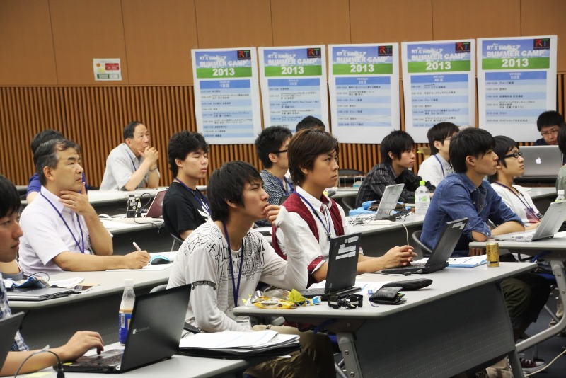</a></div>
<br>

<div align="center"><a href="201307camp-02.jpg">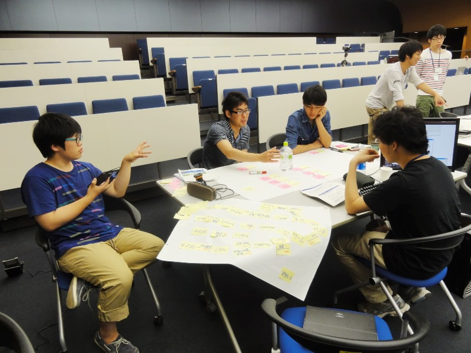</a></div>
<br>

<div align="center"><a href="201307camp-03.jpg">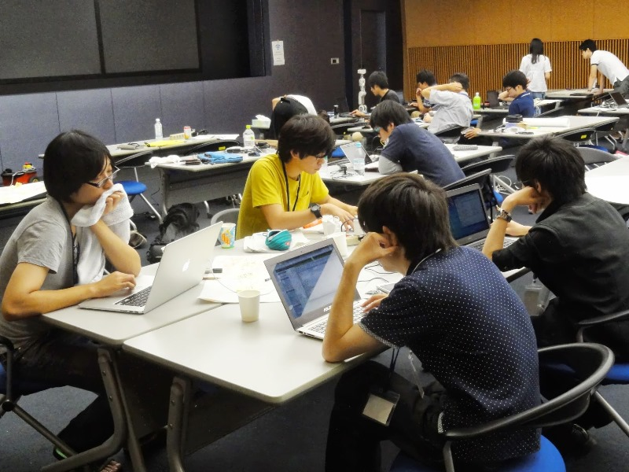</a></div>
<br>

<div align="center"><a href="201307camp-04.jpg">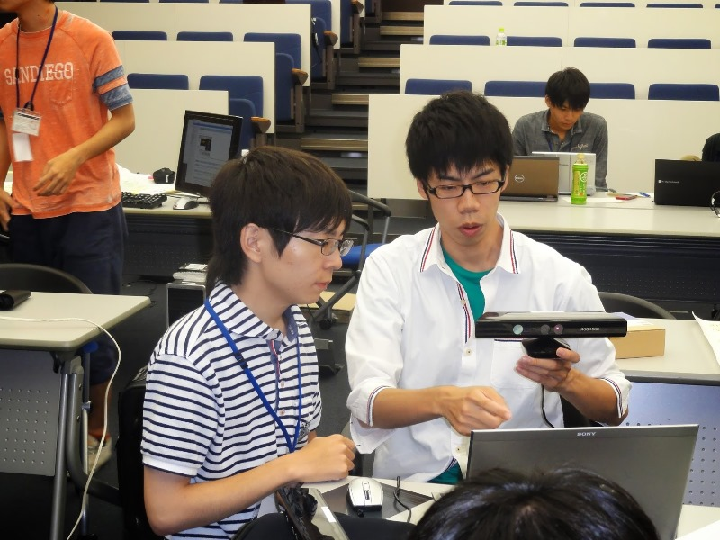</a></div>
<br>

<div align="center"><a href="201307camp-05.jpg">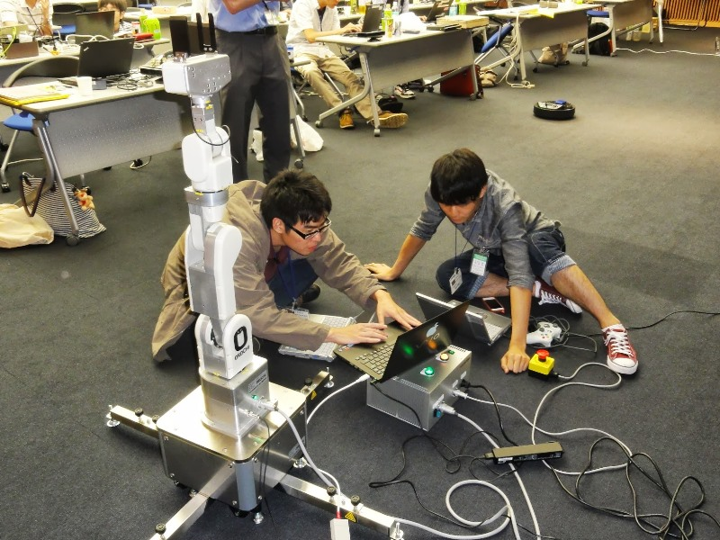</a></div>
<br>

<div align="center"><a href="201307camp-06.jpg">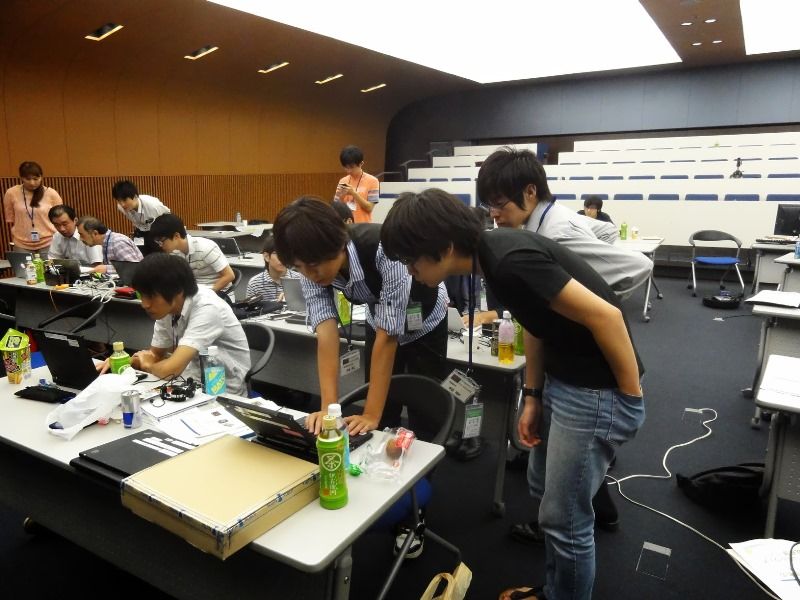</a></div>
<br>

<div align="center"><a href="201307camp-07.jpg">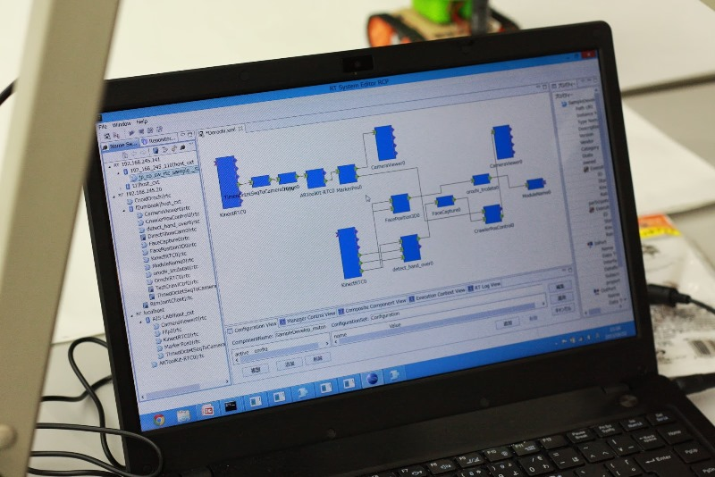</a></div>
<br>

<div align="center"><a href="201307camp-08.jpg">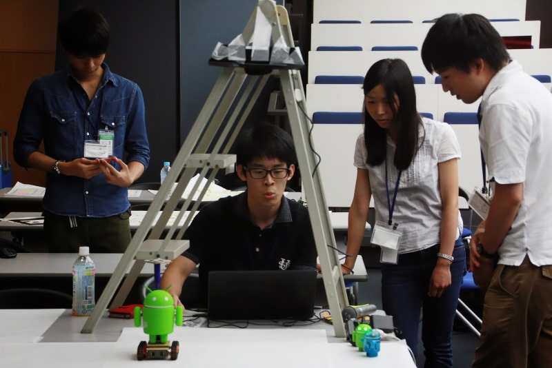</a></div>
<br>

<div align="center"><a href="201307camp-09.jpg">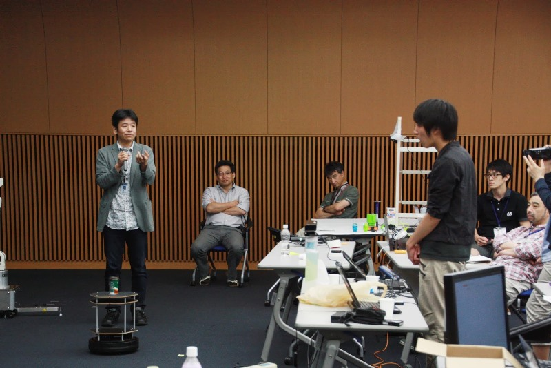</a></div>
<br>

<div align="center"><a href="201307camp-10.jpg">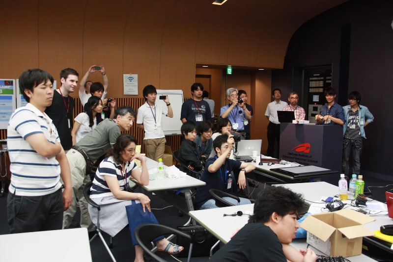</a></div>
<br>

&aname(comment);
