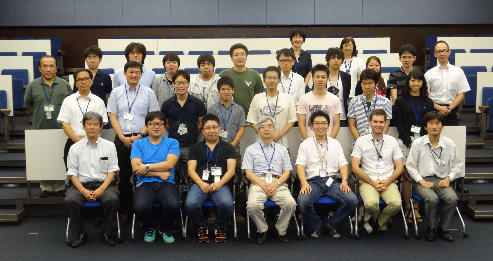
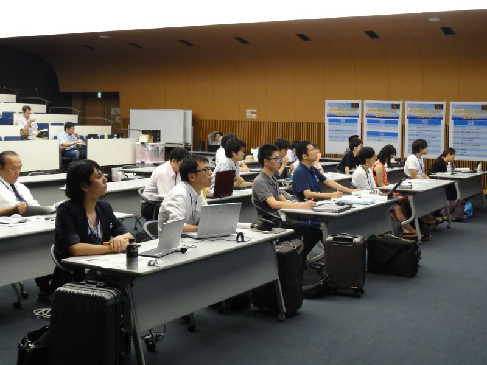
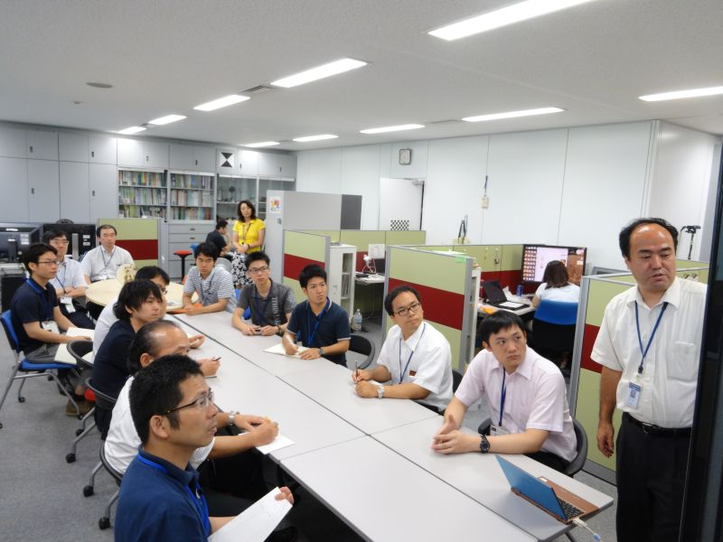
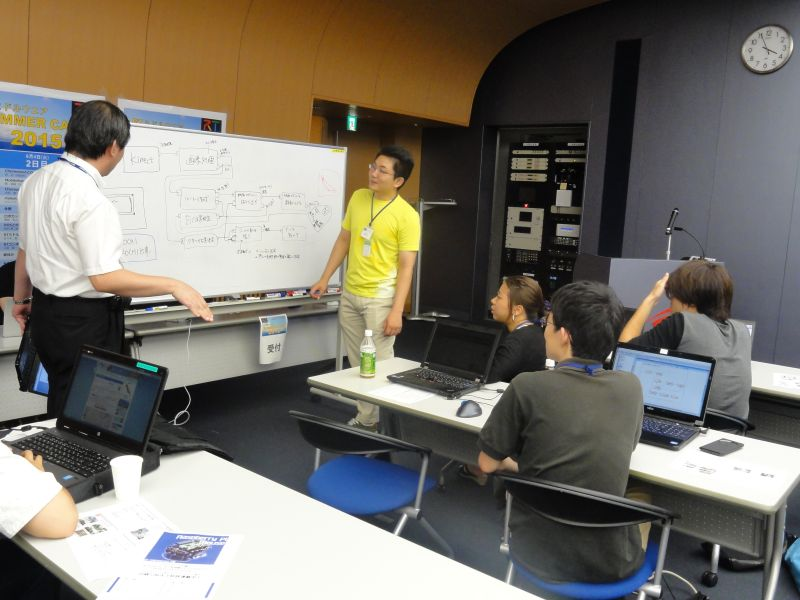
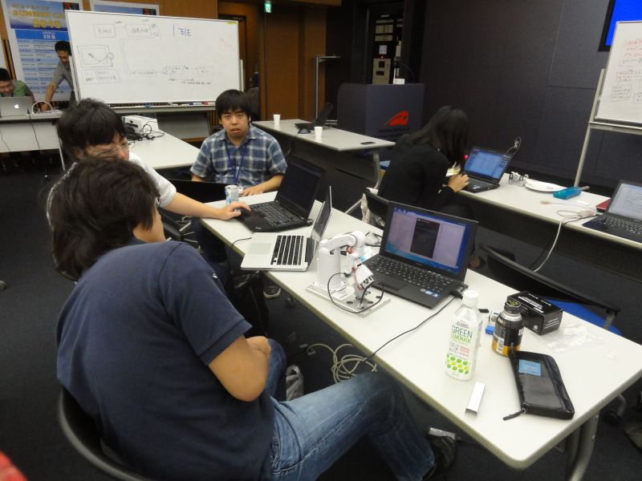
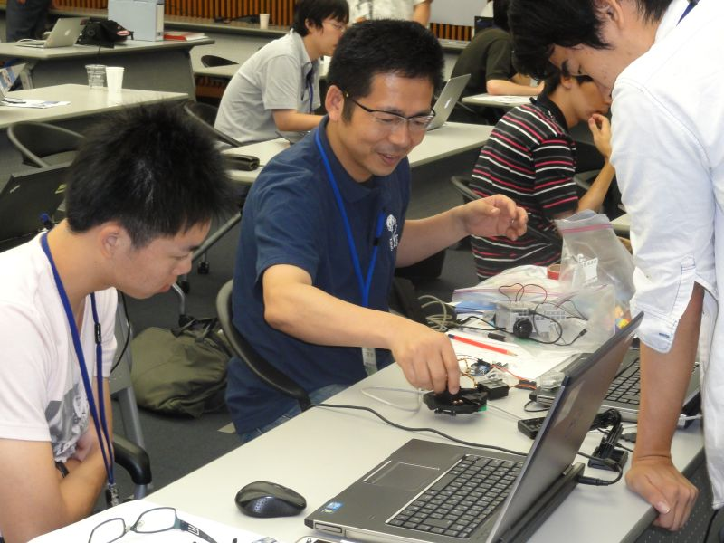
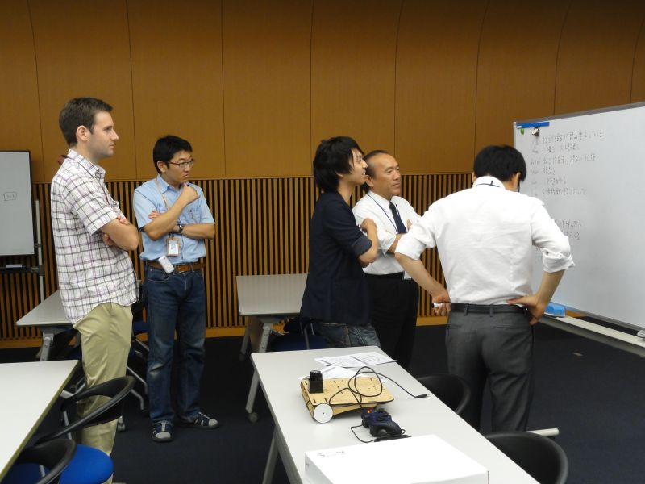
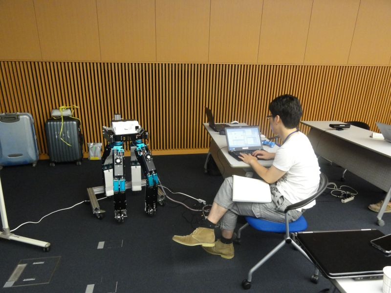
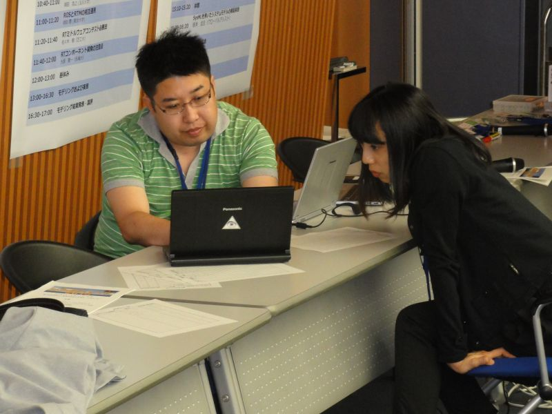
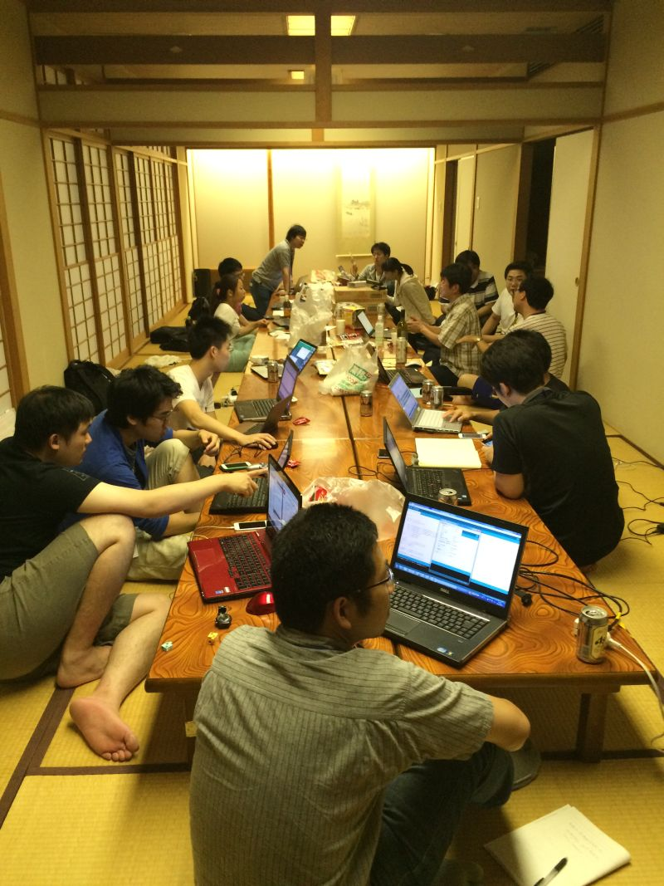

#contents

## 開催報告

名城大学の大原先生のご尽力と多くの特別講師やサポートスタッフのご支援のおかげで、社会人7名を含む20名の参加者と共に、今年も、サマーキャンプを作り上げて行くことが出来ました。皆さまに御礼申し上げます。
この合宿研修の成果を、RTミドルウエアコンテストで発表いただけることを、期待しております。

<!-- **開催のご案内 -->
<!--  -->
<!-- 今年で5回目となりました、RTミドルウエアキャンプを8月3日から8月7日の5日間、茨城県つくば市の産業技術総合研究所において開催いたします。 -->
<!-- RTミドルウエアやロボット開発に精通する講師陣のもとで、RTミドルウエアを用いた様々なロボットシステム開発を体験する機会を5日間にわたり提供します。RTミドルウエアを用いたプログラミングの方法や、実践的なロボットシステムへの応用、RTミドルウエアコンテストでの必勝法等、様々な講義を予定しています。宿泊施設として産総研のさくら館(要実費)を提供することを予定しており、一緒に参加した仲間とともに密度の濃い開発経験を通して、より実践的なロボットシステム構築方法を身に付けることができます。 -->

<!-- ''参加資格は、少なくとも1回以上RTミドルウエア講習会を受講した経験があるか、同等以上のプログラミングスキルを身に着けていることを条件とします。また、参加者は12月に行われるRTミドルウエアコンテストへの参加が期待されています。'' -->

### 参加者の声

- OpenRTMを学び始めたばかりで最初不安がありましたが、問題が発生したら講師陣にすぐに聞くことができるので安心して課題に取り組めました。
学び始めた人や一人で学んでいる人たちこそ、参加すれば多くのことを学べると思います。(社会人)
- ロボットを動かすなんて、やけに難しそうに思えていましたが、サマーキャンプに参加してRTMのすごさを知りました。
実際に、ソフトをさわり、ハードを動かすという一連の流れがワンパックになっていて、ロボットが動いたときは感動しました。
また、RTMはオープンソースで、だれでも利用でき、サンプルが豊富で、ネットですぐ手にすることができるところは、初心者にとって大変ありがたいことです。
RTMは、これからロボットを始めてみようとするロボットファンの多くの人に知ってもらいたいですね。（社会人）
- RTミドルウェアサマーキャンプでは，非常に充実した5日間を過ごすことができました．スタッフの皆様，参加者の皆様に感謝申し上げます．
RTMに興味を持っている方々に，サマーキャンプへの参加を，お勧め致します．（社会人）
- RTミドルウェアを学ぼうとしている人たちが集まり、5日間それに皆が向かっているため講習の時はもちろん、それ以外でも非常に多くのことを学ぶことができました。
また、参加前までは5日間は長いな、と思っていましたが作業に取り組んでいるとすぐに終わってしまいました。時間が短く感じるほどRTミドルウェアに取り組むことができる環境を提供してくださった講師陣、参加者に心より感謝を申し上げます。
今回東海地方より参加させていただきましたが宿泊施設もとてもきれいに整っていたため遠方の方でも参加をお勧めします。(社会人)
## 開催要旨

本サマーキャンプでは、RTミドルウエアやロボット開発に精通する講師陣のもとで、RTミドルウエアを用いた様々なロボットシステム開発を体験する機会を提供します。この企画により、一緒に参加した仲間とともに密度の濃い開発経験を通して、より実践的なロボットシステム構築方法を身に付けることを目的としています。

### 共同開催
- 産業技術総合研究所　知能システム研究部門
  - 計測自動制御学会SI部門　RTシステムインテグレーション部会
  - ロボットビジネス推進協議会

<!-- *** 協力企業 -->
<!-- #ref(rt.png) -->
<!-- #ref(ga.png) -->
<!-- #ref(sec.png) -->

### 日時・場所
- 2015年8月3日（月）～8月7日（金）
- 産業技術総合研究所　つくばセンター中央第二　
[本部・情報棟１階　ネットワーク会議室](http://www.aist.go.jp/aist_j/guidemap/tsukuba/center/tsukuba_map_c.html)
  - [google map](https://maps.google.com/maps/ms?msid=202092058111064603321.0004e2699244f546ec525&msa=0&ll=36.05949,140.134263&spn=0.009098,0.011297)
<!-- - アクセス -->
<!-- -- 東京駅から並木2丁目:[[高速バス時刻表:http://www.kantetsu.co.jp/bus/highway/center/timetable.pdf]] -->
<!-- --- 東京駅八重洲南口高速バス乗り場からつくばセンター・筑波大学行きに乗り、並木2丁目停留所にて下車してください。 -->
<!-- --- 東京駅から1時間：下りは渋滞が少なくほぼ時間通り到着します。 -->
<!-- -- 秋葉原駅からTXつくば駅経由:[[産総研連絡バス時刻表:http://www.aist.go.jp/aist_j/guidemap/pdf/tsukuba_c_iki.pdf]] -->
<!-- --- つくばエクスプレス秋葉原駅から終点つくば駅(快速：45分)まで乗車し、つくば駅から産総研連絡バスに乗車、つくば中央第1にて下車してください。 -->
<!-- --- 連絡バス所用時間：20分から25分程度。 -->
<!-- -- 常磐線荒川沖駅から路線バス:[[荒川沖バス時刻表:http://www.kantetsu.co.jp/bus/rosen/timetable/timetable/tc/08.pdf]] -->
<!-- --- 常磐線荒川沖駅にて降りていただき、関東鉄道バス西４乗り場筑波大学中央・筑波大学病院行きのバスに乗車し、並木2丁目で下車してください。 -->
<!-- --- バスの所要時間は15分程度です。 -->
- 参加者: 20名（+講師・スタッフ 延べ27名）

### 参加資格
- RTミドルウェア講習会に参加したことがある，もしくは同等程度の経験を有していること．

または，

- 下記のサマーキャンプ受講希望者向けの講習会に参加する意思があること
  - [ROBOMECH2015講習会](http://openrtm.org/openrtm/ja/node/5784)(終了)
  - RTM強化月間：6月下旬から7月の間に東京（2回）、名城大（1回）講習会を開催予定
    - [RTミドルウェア強化月間(第1弾)：名城大学・RTミドルウェア講習会(2015年6月29日)](http://www.openrtm.org/openrtm/ja/node/5810)(終了)
    - [RTミドルウェア強化月間(第2弾)：早稲田大学・RTミドルウェア講習会(2015年7月1日)](http://www.openrtm.org/openrtm/ja/node/5808)(終了)
    - [RTミドルウェア強化月間(第3弾)：中央大学・RTミドルウェア講習会(2015年7月24日)](http://www.openrtm.org/openrtm/ja/node/5841)(終了)

<!-- *** 参加人数 -->
<!-- - 最大20名程度（グループでの参加を推奨） -->
<!-- - スタッフ側のボランティアも随時募集 -->

### 参加費
無料（ただし，宿泊費や食事代は参加者の自己負担．産総研の宿泊施設を安価で提供）

<!-- *** 実施概要 -->
<!-- 現在実施内容を詰めておりますので，少々お待ちください． -->

<!-- 参加者各自がそれぞれの目的意識を持ち、その目的に向けた開発の初期工程の支援を本サマーキャンプの目的とする。~ -->
<!-- 本サマーキャンプで利用するRTコンポーネントは、NEDO知能化プロジェクトの成果，過去のRTミドルウェアコンテストの作品，さらには有志により開発されたRTコンポーネントを再利用することを基本とし，適宜各自の目的にあったRTコンポーネントの開発を促すことで，RTコンポーネントの開発，およびRTミドルウェアを用いたロボットシステム開発を行う．~ -->
<!-- 開発だけでなく，RTミドルウェアに見識のある講師を依頼し，RTミドルウェアによるロボットシステムの開発方法，RTミドルウェアでの開発を支援するツール群の利用方法からRTミドルウェアを用いたシステム事例の紹介まで行い，幅広くRTミドルウェアについての知識提供の機会を設ける。サマーキャンプ最終日には成果発表会を行う．~ -->

（参考）
- [サマーキャンプ2011](http://www.openrtm.org/openrtm/ja/node/3850)
- [サマーキャンプ2012](http://www.openrtm.org/openrtm/ja/node/5048)
- [サマーキャンプ2013](http://www.openrtm.org/openrtm/ja/tutorial/summercamp2013)
- [サマーキャンプ2014](http://www.openrtm.org/openrtm/ja/tutorial/summercamp2014)

## プログラム
<table class="table-alt">
  <tr>
    <th>CENTER:100</th>
    <th>LEFT:</th>
    <th>LEFT:200</th>
    <th>c</th>
  </tr>
  <tr>
    <td>8月3日(月)</td>
    <td>第1日目</td>
    <td>-</td>
  </tr>
  <tr>
    <td>12:30 - 13:00</td>
    <td>受付</td>
    <td>-</td>
  </tr>
  <tr>
    <td>13:00 - 13:10</td>
    <td>開催の挨拶</td>
    <td>原 功 (産業技術総合研究所)</td>
  </tr>
  <tr>
    <td>13:10 - 14:30</td>
    <td>自己紹介・決意表明</td>
    <td>-</td>
  </tr>
  <tr>
    <td>14:30 - 14:40</td>
    <td>RTミドルウェアサマーキャンプガイダンス</td>
    <td>大原 賢一 (名城大学)</td>
  </tr>
  <tr>
    <td>14:40 - 14:50</td>
    <td>RTミドルウェアサマーキャンプの過ごし方   **講義資料**:<a href="/sites/default/files/5786/2015SummerCamp-01.pdf">2015SummerCamp-01.pdf</a></td>
    <td>二井見博文（産業技術短期大学）</td>
  </tr>
  <tr>
    <td>14:50 - 15:10</td>
    <td>RTミドルウェアの産業応用   **講義資料**:<a href="/sites/default/files/5786/2015SummerCamp-02.pdf">2015SummerCamp-02.pdf</a></td>
    <td>琴坂信哉（埼玉大学）</td>
  </tr>
  <tr>
    <td>15:10 - 15:20</td>
    <td>休憩</td>
    <td>-</td>
  </tr>
  <tr>
    <td>15:20 - 16:20</td>
    <td>SysMLを用いたシステムモデルの構築実習</td>
    <td>坂本 武志 (グローバルアシスト)</td>
  </tr>
  <tr>
    <td>16:20 - 17:50</td>
    <td>産総研見学会</td>
    <td>原 功 (産業技術総合研究所)</td>
  </tr>
  <tr>
    <td>18:00 -</td>
    <td>懇親会＠さくら館</td>
    <td>-</td>
  </tr>
</table>

<table class="table-alt">
  <tr>
    <th>CENTER:100</th>
    <th>LEFT:</th>
    <th>LEFT:200</th>
    <th>c</th>
  </tr>
  <tr>
    <td>8月4日(火)</td>
    <td>第2日目</td>
    <td>-</td>
  </tr>
  <tr>
    <td>09:00 - 9:20</td>
    <td>ChoreonoidとOpenHRIを用いたシステム構築   **講義資料**:<a href="/sites/default/files/5786/2015SummerCamp-03.pdf">2015SummerCamp-03.pdf</a></td>
    <td>原 功(産業技術総合研究所)</td>
  </tr>
  <tr>
    <td>9:20 - 9:40</td>
    <td>MobileRobotNavigationFrameworkの紹介   **講義資料**:<a href="/sites/default/files/5786/2015SummerCamp-04.pdf">2015SummerCamp-04.pdf</a></td>
    <td>菅佑樹(SugarSweetRobotics)</td>
  </tr>
  <tr>
    <td>9:40 - 10:00</td>
    <td>DARPA Robotics Challenge におけるChoreonoidとRT-Middlewareの活用   **講義資料**:<a href="/sites/default/files/5786/2015SummerCamp-05.pdf">2015SummerCamp-05.pdf</a></td>
    <td>中岡慎一郎 (産業技術総合研究所)</td>
  </tr>
  <tr>
    <td>10:00 - 10:20</td>
    <td>rtshell入門   **講義資料**:<a href="/sites/default/files/5786/2015SummerCamp-06.pdf">2015SummerCamp-06.pdf</a></td>
    <td>ジェフ ビグス (産業技術総合研究所)</td>
  </tr>
  <tr>
    <td>10:20 - 10:40</td>
    <td>休憩</td>
    <td>-</td>
  </tr>
  <tr>
    <td>10:40 - 11:00</td>
    <td>ロボカップにおけるRTミドルウェアの運用事例   **講義資料**:<a href="/sites/default/files/5786/2015SummerCamp-07.pdf">2015SummerCamp-07.pdf</a></td>
    <td>岡田浩之 (玉川大学)</td>
  </tr>
  <tr>
    <td>11:00 - 11:20</td>
    <td>ROSとRTMの相互運用   **講義資料**:<a href="/sites/default/files/5786/2015SummerCamp-08.pdf">2015SummerCamp-08.pdf</a></td>
    <td>岡田 慧 (東京大学)</td>
  </tr>
  <tr>
    <td>11:20 - 11:40</td>
    <td>RTミドルウェアコンテスト必勝法   **講義資料**:<a href="/sites/default/files/5786/2015SummerCamp-09.pdf">2015SummerCamp-09.pdf</a></td>
    <td>佐々木毅（芝浦工業大学）</td>
  </tr>
  <tr>
    <td>11:40 - 12:00</td>
    <td>RTコンポーネント開発の注意点   **講義資料**:<a href="/sites/default/files/5786/2015SummerCamp-10.pdf">2015SummerCamp-10.pdf</a></td>
    <td>大原 賢一 (名城大学)</td>
  </tr>
  <tr>
    <td>12:00 - 13:00</td>
    <td>昼休み</td>
    <td>-</td>
  </tr>
  <tr>
    <td>13:00 - 16:30</td>
    <td>モデリングおよび実習</td>
    <td>-</td>
  </tr>
  <tr>
    <td>16:30 - 17:00</td>
    <td>モデリング結果発表・講評</td>
    <td>-</td>
  </tr>
</table>

<table class="table-alt">
  <tr>
    <th>CENTER:100</th>
    <th>LEFT:</th>
    <th>LEFT:200</th>
    <th>c</th>
  </tr>
  <tr>
    <td>8月5日(水)</td>
    <td>第3日目</td>
    <td>-</td>
  </tr>
  <tr>
    <td>09:00 - 16:30</td>
    <td>実習</td>
    <td>-</td>
  </tr>
  <tr>
    <td>16:30 - 17:00</td>
    <td>各チームの進捗報告</td>
    <td>-</td>
  </tr>
</table>

<table class="table-alt">
  <tr>
    <th>CENTER:100</th>
    <th>LEFT:</th>
    <th>LEFT:200</th>
    <th>c</th>
  </tr>
  <tr>
    <td>8月6日(木)</td>
    <td>第4日目</td>
    <td>-</td>
  </tr>
  <tr>
    <td>09:00 - 16:30</td>
    <td>実習</td>
    <td>-</td>
  </tr>
  <tr>
    <td>16:30 - 17:00</td>
    <td>各チームの進捗報告</td>
    <td>-</td>
  </tr>
</table>

<table class="table-alt">
  <tr>
    <th>CENTER:100</th>
    <th>LEFT:</th>
    <th>LEFT:200</th>
    <th>c</th>
  </tr>
  <tr>
    <td>8月7日(金)</td>
    <td>第5日目</td>
    <td>-</td>
  </tr>
  <tr>
    <td>9:00 - 12:00</td>
    <td>実習</td>
    <td>-</td>
  </tr>
  <tr>
    <td>13:00 - 16:00</td>
    <td>成果報告会</td>
    <td>-</td>
  </tr>
  <tr>
    <td>16:00 - 16:10</td>
    <td>閉会の挨拶</td>
    <td>-</td>
  </tr>
  <tr>
    <td>16:10 - 17:00</td>
    <td>片付け</td>
    <td>-</td>
  </tr>
  <tr>
    <td>17:00 - 20:00</td>
    <td>RTミドルウェア情報交換会（BOFミーティング）</td>
    <td>-</td>
  </tr>
</table>

<!-- *** 産総研見学会 -->

<!-- - 生活支援RTルーム（阪口、鍛冶、関山） -->
<!-- - 高精度な姿勢検出が可能な視覚マーカ（田中） -->
<!-- - アンドロイドを用いたコミュニケーション支援（松本(吉)） -->
<!-- - 移動知能とフィールドロボット研究（松本(治)、横塚） -->
<!-- - 全方向ステレオシステム（佐藤） -->

## 課題について
基本的には各参加者に課題を持ち寄っていただき，講師陣は参加者のサポートを行う形態を取ります．~
<!-- ただし，RTミドルウエア初心者でテーマ設定に悩む場合は，下記のような課題も考えております．~ -->

<!-- ***課題例 -->
<!-- |CENTER:200|LEFT:100|c -->
<!-- |Robocup@Homeの競技|[[資料>http://www.openrtm.org/openrtm/sites/default/files/rulehome2015.pdf]]| -->
<!-- |MobileRobotiNavigationFrameworkを用いたアプリケーション開発|[[資料>http://ogata-lab.jp/ja/technology_ja/mobile_nav_rtcs_ja.html]]| -->

<!-- ***課題例 -->
<!-- |人型ロボット(G-Robot)を使ったモーション生成| -->
<!-- |ルンバ/Pioneer/Kobukiを用いた課題自律移動ロボットの制御| -->
<!-- |共通カメラインタフェースを用いたカメラコンポーネントを用いた物体認識| -->
<!-- |RTミドルウェアリファレンスハードウェア「OROCHI」を用いた物体把持| -->
<!-- |OpenHRIを用いた音声認識を用いた課題| -->
<!-- |RTスペース操作用コンポーネントの開発| -->
<!-- |レーザレンジファインダを用いた環境認識| -->
<!-- |AR Toolkitを用いた拡張現実感| -->

<!-- （注）変更する可能性もございますことご了承下さい． -->

<!-- **講習会申し込みフォーム -->
<!-- 以下のフォームからRTミドルウェアサマーキャンプ2015にお申し込み下さい． -->
<!-- - 参加登録するまえに当Webページのユーザ登録をお願いします．[[ユーザ登録はこちら:http://openrtm.org/openrtm/ja/user/register]] -->
<!-- - 当Webサイトにログイン済みの方は名前の欄にユーザ名が出ますが、必ず、氏名に書き換えてください． -->

<!-- **講演会のみのご参加について -->
<!-- 講演会のみご参加される方は，RTミドルウェアサマーキャンプ実行委員会幹事の~ -->
<!-- 名城大学大原(kohara(at)meijo-u.ac.jp)までご連絡ください． -->

## 実行委員会
<table class="table-alt">
  <tr>
    <th>実行委員長</th>
    <th>原　功</th>
    <th><a href="http://hara.jpn.com">産業技術総合研究所ロボットイノベーション研究センター　ロボットソフトウェア研究ラボ　ラボ長</a></th>
  </tr>
  <tr>
    <td>幹事</td>
    <td>大原　賢一</td>
    <td><a href="http://mechatronics.meijo-u.ac.jp/study/ohara.html">名城大学理工学部メカトロニクス工学科　准教授</a></td>
  </tr>
  <tr>
    <td>委員</td>
    <td>安藤　慶昭</td>
    <td><a href="https://staff.aist.go.jp/n-ando/index-j.html">産業技術総合研究所ロボットイノベーション研究センター　ロボットソフトウェア研究ラボ　主任研究員</a></td>
  </tr>
  <tr>
    <td>委員</td>
    <td>菅　佑樹</td>
    <td><a href="http://sugarsweetrobotics.com/">株式会社SUGAR SWEET ROBOTICS</a></td>
  </tr>
  <tr>
    <td>委員</td>
    <td>ジェフ　ビグス</td>
    <td><a href="http://staff.aist.go.jp/geoffrey.biggs/">産業技術総合研究所ロボットイノベーション研究センター　ロボットソフトウェア研究ラボ　主任研究員</a></td>
  </tr>
  <tr>
    <td>委員</td>
    <td>平井　成興</td>
    <td><a href="http://www.furo.org/ja/member/hirai.html">千葉工業大学未来ロボット技術研究センターfuro副所長</a></td>
  </tr>
  <tr>
    <td>委員</td>
    <td>神徳　徹雄</td>
    <td><a href="https://staff.aist.go.jp/t.kotoku/">産業技術総合研究所イノベーション推進本部</a></td>
  </tr>
  <tr>
    <td>委員</td>
    <td>坂本　武志</td>
    <td><a href="http://globalassist.co.jp">株式会社グローバルアシスト</a></td>
  </tr>
  <tr>
    <td>委員</td>
    <td>岡田　慧</td>
    <td><a href="http://www.jsk.t.u-tokyo.ac.jp/`k-okada/">東京大学大学院情報理工学系研究科知能機械情報学専攻准教授</a></td>
    <td>`</td>
  </tr>
  <tr>
    <td>委員</td>
    <td>岡田　浩之</td>
    <td><a href="http://www.tamagawa.ac.jp/teachers/okada/index.html">玉川大学工学部機械システム学科教授</a></td>
  </tr>
  <tr>
    <td>委員</td>
    <td>琴坂　信哉</td>
    <td><a href="http://design.mech.saitama-u.ac.jp/people/staff/kotosaka.html">埼玉大学理工学研究科人間支援・生産科学部門准教授</a></td>
  </tr>
  <tr>
    <td>委員</td>
    <td>佐々木　毅</td>
    <td><a href="http://www.sic.shibaura-it.ac.jp/`sasaki-t/">芝浦工業大学デザイン工学部エンジニアリングデザイン領域准教授</a></td>
    <td>`</td>
  </tr>
  <tr>
    <td>委員</td>
    <td>中岡　慎太郎</td>
    <td><a href="https://staff.aist.go.jp/s.nakaoka/">産業技術総合研究所知能システム研究部門ヒューマノイド研究グループ主任研究員</a></td>
  </tr>
</table>
<!-- |委員|中本　啓之|[[株式会社セック:http://www.sec.co.jp]]| -->
<!-- |委員|山下　智輝|[[株式会社前川製作所:http://www.mayekawa.co.jp/ja/]]| -->

<!-- *** サポート＆協力スタッフ -->
<!-- |原田　研介|産総研（見学対応御礼）| -->
<!-- |阪口　健|産総研（見学対応御礼）| -->
<!-- |田中　秀幸|産総研（見学対応御礼）| -->
<!-- |谷川　民生|産総研| -->
<!-- |宮本　晴美|産総研| -->
<!-- |韓 越興|産総研| -->
<!-- |橋川　史崇|産総研[明治大]| -->
<!-- |山口　渡|産総研[筑波大]| -->
<!-- |江崎　伸明|産総研[首都大学東京]| -->
<!-- |尾形　仁子|産総研| -->

<!-- ** 参加者の方へ -->
<!-- *** 自己紹介スライドの準備 -->

<!-- 参加されるかたは、以下の自己紹介用スライドのテンプレートに従って自己紹介を作成してください． -->
<!-- 送付方法は事務局より連絡させていただきます． -->

<!-- - 自己紹介用スライドテンプレート: &ref(2015.ppt); -->

<!-- ** お問い合わせ -->

<!-- 基本的な情報はホームページから提供いたします． -->
<!-- 参加申込みいただいた方は連絡したメールに返信ください． -->

<!-- RTミドルウエアサマーキャンプ実行委員会~ -->
<!-- summercamp2015(at)openrtm.org~ -->
<!-- (at)を＠におきかえてください．~ -->

<!-- &aname(comment); -->

## 講義資料

### RTミドルウェアサマーキャンプの過ごし方
- [講義資料(PDF)](/sites/default/files/5786/2015SummerCamp-01.pdf)

<!-- Invalid YouTube URL: http://www.slideshare.net/51291455 -->

### RTミドルウェアの産業応用
- [講義資料(PDF)](/sites/default/files/5786/2015SummerCamp-02.pdf)

<!-- Invalid YouTube URL: http://www.slideshare.net/51291592 -->

### ChoreonoidとOpenHRIを用いたシステム構築
- [講義資料(PDF)](/sites/default/files/5786/2015SummerCamp-03.pdf)

<!-- Invalid YouTube URL: http://www.slideshare.net/51291667 -->

### MobileRobotNavigationFrameworkの紹介
- [講義資料(PDF)](/sites/default/files/5786/2015SummerCamp-04.pdf)

<!-- Invalid YouTube URL: http://www.slideshare.net/51291721 -->

### DARPA Robotics Challenge におけるChoreonoidとRT-Middlewareの活用
- [講義資料(PDF)](/sites/default/files/5786/2015SummerCamp-05.pdf)

<!-- Invalid YouTube URL: http://www.slideshare.net/51291759 -->

### rtshell入門
- [講義資料(PDF)](/sites/default/files/5786/2015SummerCamp-06.pdf)

<!-- Invalid YouTube URL: http://www.slideshare.net/51291811 -->

### ロボカップにおけるRTミドルウェアの運用事例
- [講義資料(PDF)](/sites/default/files/5786/2015SummerCamp-07.pdf)

<!-- Invalid YouTube URL: http://www.slideshare.net/51291909 -->

### ROSとRTMの相互運用
- [講義資料(PDF)](/sites/default/files/5786/2015SummerCamp-08.pdf)

<!-- Invalid YouTube URL: http://www.slideshare.net/51291954 -->

### RTミドルウェアコンテスト必勝法
- [講義資料(PDF)](/sites/default/files/5786/2015SummerCamp-09.pdf)

<!-- Invalid YouTube URL: http://www.slideshare.net/51291987 -->

### RTコンポーネント開発の注意点
- [講義資料(PDF)](/sites/default/files/5786/2015SummerCamp-10.pdf)

<!-- Invalid YouTube URL: http://www.slideshare.net/51292002 -->

## 開発成果

&aname(summercamp2015_group1);
### グループ１

- **課題**: 拭き掃除ロボット
  - 机の上の任意の位置にある汚れをKinectを用いて検知して，ロボットアームOROCHIを制御して拭き掃除を行う．
  - 入力画像に対して画像処理を施し，アームを基準とした汚れ位置の相対座標を出力する画像処理RTC群．
  - 受け取った汚れ位置の座標までアームを移動させ，そこで机を拭く動作をさせるアーム制御RTC群．
- プロジェクトページ: http://openrtm.org/openrtm/ja/project/SummerCamp2015_group1

<!-- Invalid YouTube URL: http://www.slideshare.net/51480356 -->

<iframe width="560" height="315" src="https://www.youtube.com/embed/VPZWK4BCkWE" frameborder="0" allowfullscreen></iframe>

<iframe width="560" height="315" src="https://www.youtube.com/embed/CyXdoZ2LJew" frameborder="0" allowfullscreen></iframe>

&aname(summercamp2015_group2);
### グループ２

- **課題**: パスタ巻きロボット
  - ミドルウェアサマーキャンプ2015で製作した作品
  - パスタ用食事支援ロボット
  - フォークの付いたアームでパスタをすくい取り，スプーンの上で巻き，口元まで運ぶシステム
- プロジェクトページ: http://openrtm.org/openrtm/ja/project/SummerCamp2015_group2

<!-- Invalid YouTube URL: http://www.slideshare.net/51480411 -->

<iframe width="560" height="315" src="https://www.youtube.com/embed/LkmUw4ms8Mc" frameborder="0" allowfullscreen></iframe>

<iframe width="560" height="315" src="https://www.youtube.com/embed/9X7pO37Wf-I" frameborder="0" allowfullscreen></iframe>

&aname(summercamp2015_group3);
### グループ３

- **課題**: Ball Chaser
  - 遠隔操縦ロボット：ジョイスティックの操作により、独立2二輪型台車による移動とグリッパーの開閉ができる
  - カメラからの画像入力により、ボールの認識ができる
- プロジェクトページ: http://openrtm.org/openrtm/ja/project/SummerCamp2015_group3

<!-- Invalid YouTube URL: http://www.slideshare.net/51480416 -->

<iframe width="560" height="315" src="https://www.youtube.com/embed/RJgThmpxDhY" frameborder="0" allowfullscreen></iframe>

<iframe width="560" height="315" src="https://www.youtube.com/embed/DViLDkycyFA" frameborder="0" allowfullscreen></iframe>

&aname(summercamp2015_group4);
### グループ４

- **課題**: 配送ロボット
  - レーザーレンジファインダを用いた地図作成および経路生成
  - 再利用性の高いデータ型変換コンポーネント
- プロジェクトページ: http://openrtm.org/openrtm/ja/project/SummerCamp2015_group4

<!-- Invalid YouTube URL: http://www.slideshare.net/51480418 -->

<iframe width="560" height="315" src="https://www.youtube.com/embed/HvPJPnsS9Rc" frameborder="0" allowfullscreen></iframe>

<iframe width="560" height="315" src="https://www.youtube.com/embed/VdQsEzK8k_U" frameborder="0" allowfullscreen></iframe>

&aname(summercamp2015_group5);
### グループ５

- **課題**: SEED用遠隔操作システム
  - SEED(ロボット)を仮想ジョイスティックで遠隔操作する
  - Kinectから人を認識しその人のもとに移動する。
- プロジェクトページ: http://openrtm.org/openrtm/ja/project/SummerCamp2015_group5

<!-- Invalid YouTube URL: http://www.slideshare.net/51480419 -->

<iframe width="560" height="315" src="https://www.youtube.com/embed/0B950cDwen0" frameborder="0" allowfullscreen></iframe>

<iframe width="560" height="315" src="https://www.youtube.com/embed/a6yktD4udPc" frameborder="0" allowfullscreen></iframe>

## 講習会の様子

 

 

 

 

 

 

 

 

 
