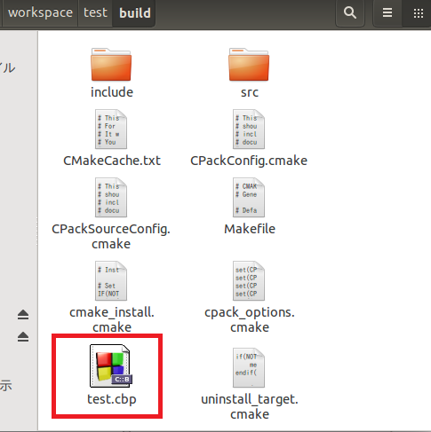
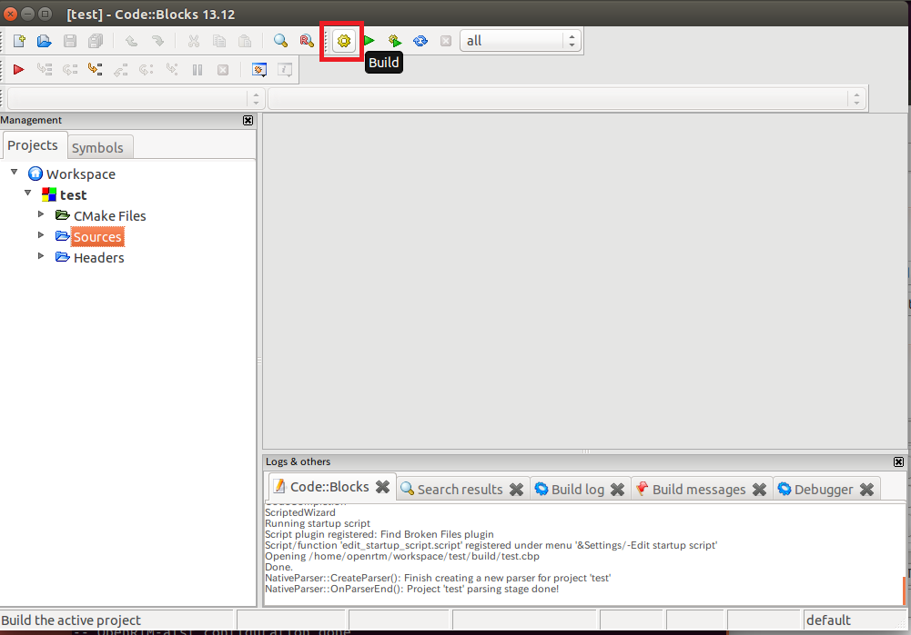

<!-- Title: How to Compile (Ubuntu, CMake, Code::Blocks) -->
This page explains how to build using Code::Blocks on Ubuntu.

#contents

## Environment Setup
Code::Blocks can be installed with the following command.

```
 sudo apt-get install codeblocks
```

If Doxygen and CMake are not already installed, install them with the following command.

```
 sudo apt-get install doxygen cmake
```

## Build Procedure

### CMake

Move to the folder containing the code generated by RTC Builder, and run the following commands to generate various files in the build folder.

```
 mkdir build
 cd build
 cmake . -G "CodeBlocks - Unix Makefiles"
```


### Running Code::Blocks

Open the `.cbp` file in the build folder.

<div align="center"><a href="codeblocks2.png"></a></div>
<br>

Click the [Build] button (or press Ctrl+F9) to start the build process.

<div align="center"><a href="codeblocks1.png"></a></div>
<br>

The executable files and shared libraries will then be generated in the build/src folder.
