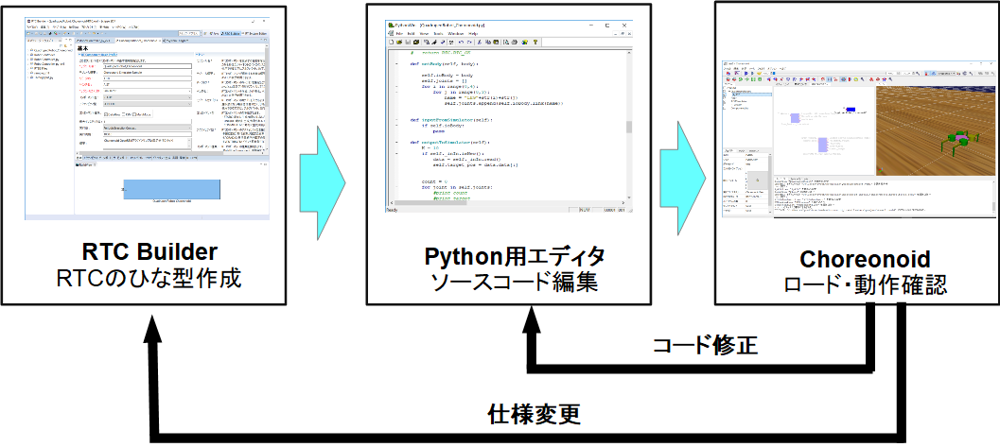
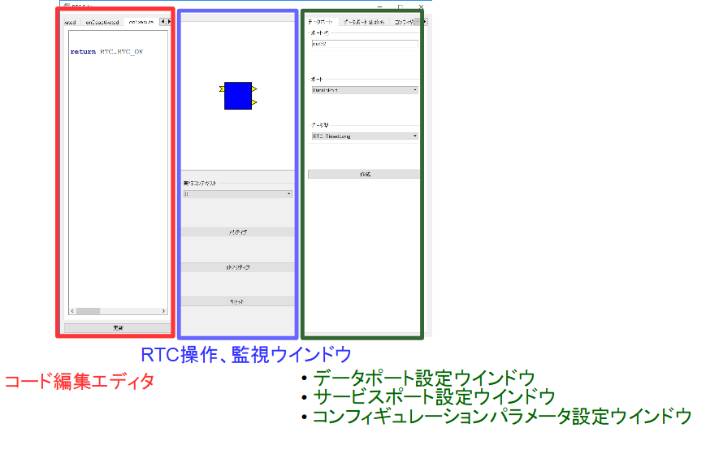
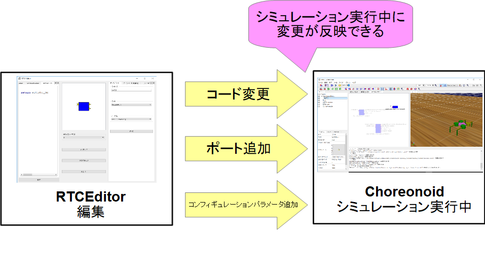
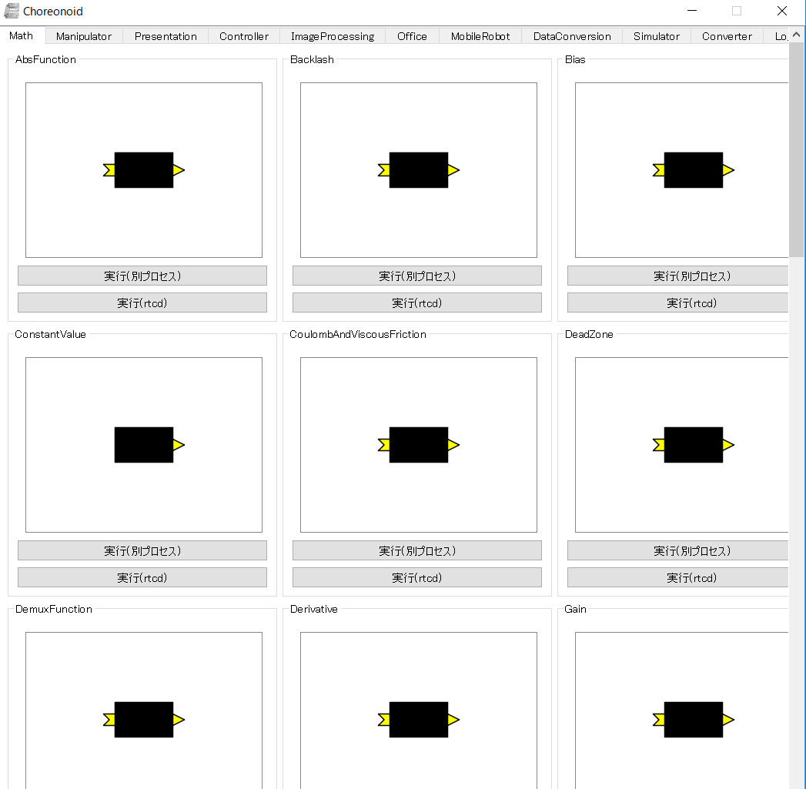

#contents


Choreonoid OpenRTM連携プラグイン Python版は[Choreonoid](http://choreonoid.org/ja/)上のロボットとPythonで開発したRTCを連携させるためのプラグインです。
主に以下の機能が利用可能です。

## Pythonにより効率的にChoreonoid上のシミュレータと連携するRTCを開発可能

Choreonoidに標準で付属しているOpenRTM連携プラグインはC++によるRTCの開発ができるようになっていますが、ビルド環境の構築が難しく、またコンパイルに時間を要するため効率的ではないという問題がありました。
そこでビルド済みのChoreonoid+OpenRTM連携プラグイン Python版を配布することで、ダウンロードしてすぐにChoreonoid上のシミュレータと連携するRTCが開発可能です。

<br>

<div align="center"><a href="cnoid-rtm-py1.png"></a></div>
<br>


## Pythonコードの動的編集ツールによる高速な開発

本プラグインにはChoreonoid上で動作するPythonエディタが付属しています。

<br>

<div align="center"><a href="cnoid-rtm-py2-2.png"></a></div>
<br>

Pythonエディタ上でコードを編集して保存するだけで、即座にRTCに変更が反映されます。
またデータポート、サービスポート、コンフィギュレーションパラメータの設定も可能になっており、ChoreonoidとPythonのみでRTCの開発、動作確認を可能にしています。


<br>

<div align="center"><a href="cnoid-rtm-py4.png"></a></div>
<br>


## RTCランチャー

RTCを一覧に表示してボタン一つで起動化可能なランチャーがChoreonoid上で動作します。
本プラグインにはサンプルコンポーネントとして73種類のRTCが付属しており、Choreonoid上で様々なRTシステムを開発できます。


<br>

<div align="center"><a href="cnoid-rtm-py3.png"></a></div>
<br>


### RTCの登録手順
Choreonoidインストールディレクトリの**share/rtc**以下に適当な名前のフォルダ(例：TestRTC)を作成します。

その下に**RTC.xml**とRTCを実行するためのPythonファイル、もしくは実行ファイル、dllを置くと完了です。
Pythonファイル、実行ファイル、dllについては、TestRTCフォルダ直下でなくとも検索で見つけることができます。

※C++のRTCを登録する場合、本プラグインがVisual Studio 2015(64bit)で開発しているため、dllは同じVisual Studioでビルドしたものでないとロードできません。実行ファイルからの起動はできますが、その場合は必要なdll(RTC120_vc12.dll等)のフォルダをPATHに追加する必要があります。

```
 choreonoid
    |-share
      |-rtc
        |-TestRTC
          |-RTC.xml
            |-TestRTC.py(もしくはTestRTCComp.exe、TestRTC.dll)
```


## インストール手順、チュートリアル
インストール手順やチュートリアルは以下のページに記載してあります。

- [Choreonoid用OpenRTM連携プラグイン Python版 インストール手順]({{ site.baseurl }}/ja/content/choreonoid_openrtm_python_install)
- [Choreonoid用OpenRTM連携プラグイン Python版 チュートリアル(TankJoystick)]({{ site.baseurl }}/ja/content/choreonoid_openrtm_python_tutorial1)
- [Choreonoid用OpenRTM連携プラグイン Python版 チュートリアル(四足歩行ロボット)]({{ site.baseurl }}/ja/content/choreonoid_openrtm_python_tutorial2)
- [Choreonoid用OpenRTM連携プラグイン Python版 トラブルシューティング]({{ site.baseurl }}/ja/content/choreonoid_openrtm_python_troboleshooting)
- [Choreonoid用OpenRTM連携プラグイン Python版(備考)]({{ site.baseurl }}/ja/content/choreonoid_openrtm_python_note)
