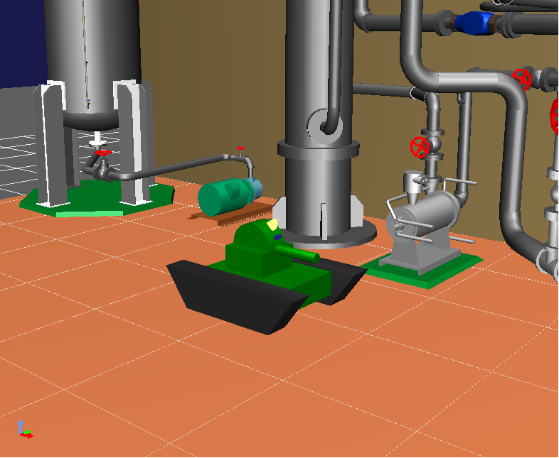
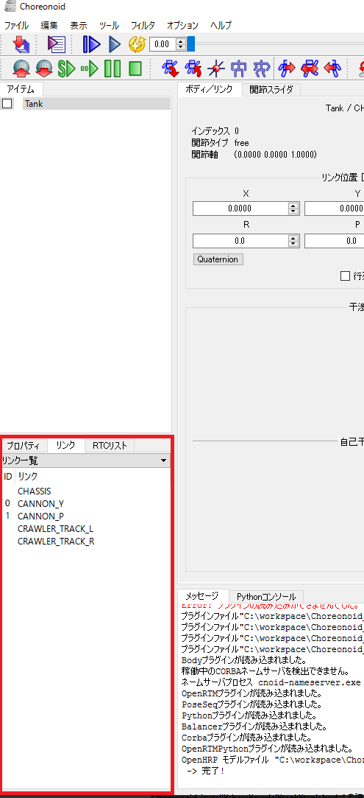
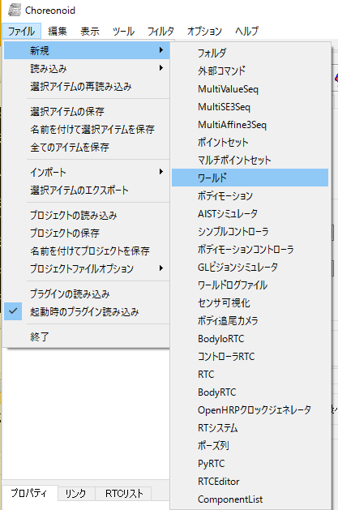
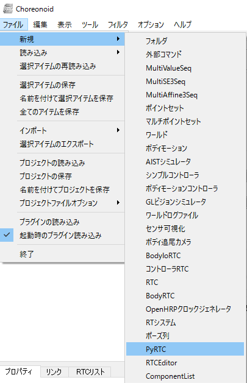
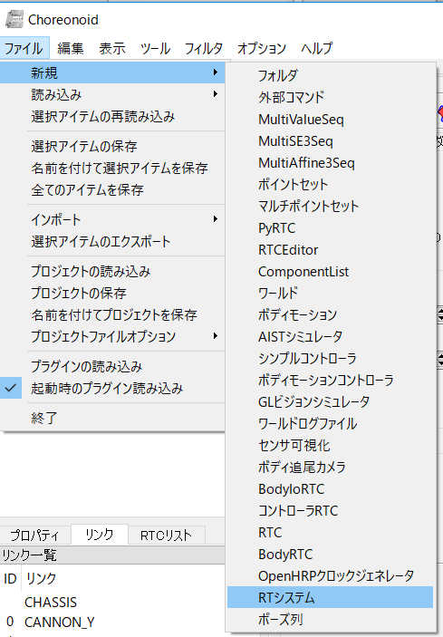
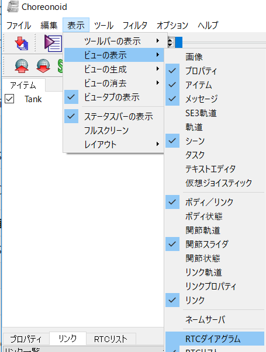
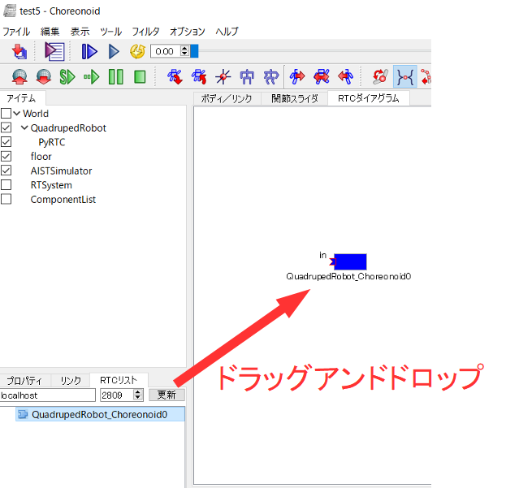

No English version available.

このページではChoreonoid OpenRTM連携プラグイン Python版でTankモデルをゲームパッドで操作するまでの手順を説明します。
使用するモデル、作成するRTCは[Choreonoid公式ページのチュートリアル](https://choreonoid.org/ja/manuals/1.7/openrtm/tank-joystick-project.html)とほぼ同じです。


<br>

<div align="center"><a href="choreonoid-openrtm-py60.png"></a></div>
<br>


#contents

## RTC作成

この章ではシミュレータ上のアクチュエータ、センサなどの入出力を行うRTCの開発手順を説明します。

### RTC Builder起動

まずはRTC Builderでソースコードのひな型を作成します。
RTC Builder利用のために、OpenRTM-aistをインストールしてください。

- [OpenRTM-aist.2.0.1-RELEASE]({{ site.baseurl }}/ja/download/openrtm-aist-cpp/openrtm-aist-cpp_1_1_2_release)


インストールが完了したらRTC Builderを起動してひな型を作成してください。
Windows 8.1の場合は「スタート」>「アプリビュー(右下矢印)」>「OpenRTM-aist 2.0.1」>「OpenRTP」をクリックすると起動できます。


作成手順は以下が参考になります。

- [RTCBuilder-1.1.0]({{ site.baseurl }}/ja/doc/toolmanuals/rtcbuilder-1_1_0/)


### RTCひな型作成

作成するRTCの仕様は以下のようになっています。言語は**Python**を選択してください。

<br>

<div align="center"><a href="https://cloud.githubusercontent.com/assets/6216077/25479366/8b893cd4-2b7f-11e7-958c-8ba2052c448d.png"></a></div>
<br>

<table class="table-alt">
  <tr>
    <th>コンポーネント名称</th>
    <th>**TankIoRTC_Py**</th>
  </tr>
  <tr>
    <td colspan="2">CENTER: **InPort**</td>
  </tr>
  <tr>
    <td>ポート名</td>
    <td>velocities</td>
  </tr>
  <tr>
    <td>型</td>
    <td>TimedVelocity2D</td>
  </tr>
  <tr>
    <td>説明</td>
    <td>車体の目標速度</td>
  </tr>
  <tr>
    <td colspan="2"> **InPort**</td>
  </tr>
  <tr>
    <td>ポート名</td>
    <td>torques</td>
  </tr>
  <tr>
    <td>型</td>
    <td>TimedDoubleSeq</td>
  </tr>
  <tr>
    <td>説明</td>
    <td>砲塔部分の関節トルク</td>
  </tr>
  <tr>
    <td colspan="2">**InPort**</td>
  </tr>
  <tr>
    <td>ポート名</td>
    <td>lightSwitch</td>
  </tr>
  <tr>
    <td>型</td>
    <td>TimedBooleanSeq</td>
  </tr>
  <tr>
    <td>説明</td>
    <td>ライトのオンオフ</td>
  </tr>
  <tr>
    <td colspan="2">**OutPort**</td>
  </tr>
  <tr>
    <td>ポート名</td>
    <td>angles</td>
  </tr>
  <tr>
    <td>型</td>
    <td>PanTiltAngles</td>
  </tr>
  <tr>
    <td>説明</td>
    <td>砲塔部分の関節角度</td>
  </tr>
  <tr>
    <td colspan="2"> **言語**</td>
  </tr>
  <tr>
    <td colspan="2">Python</td>
  </tr>
</table>


### ソースコード編集

生成したソースコードにRTCのモジュール名のクラス(TankIoRTC_Pyならばclass TankIoRTC_Py)が記述されているので、そのクラスに以下の関数を追加してください。

<table class="table-alt">
  <tr>
    <th>関数名</th>
    <th>引数</th>
    <th>内容</th>
  </tr>
  <tr>
    <td>setBody</td>
    <td>body</td>
    <td>Bodyオブジェクトを設定する関数</td>
  </tr>
  <tr>
    <td>inputFromSimulator</td>
    <td></td>
    <td>センサの計測値などをアウトポートから出力する処理等を記述する関数。シミュレーションステップ後に実行される</td>
  </tr>
  <tr>
    <td>outputToSimulator</td>
    <td></td>
    <td>アクチュエータのトルクなどをインポートから入力する処理等を記述する関数。シミュレーションステップ前に実行される</td>
  </tr>
</table>


具体的には以下のソースコードを記載します。


```
 class TankIoRTC_Py(OpenRTM_aist.DataFlowComponentBase):
 	(省略)
 
 	#ボディオブジェクト設定関数
 	def setBody(self, body):
 		
 		self.ioBody = body
 		
 		#Linkオブジェクト取得
 		self.cannonY = self.ioBody.link("CANNON_Y")
 		self.cannonP = self.ioBody.link("CANNON_P")
 		self.crawlerL = self.ioBody.link("CRAWLER_TRACK_L")
 		self.crawlerR = self.ioBody.link("CRAWLER_TRACK_R")
 		
 		#Lightオブジェクト取得
 		self.light = self.ioBody.getLight("MainLight")
 		
 		
 	#センサの計測値などをアウトポートから出力する処理等を記述する関数
 	#シミュレーションステップ後に実行される
 	def inputFromSimulator(self):
 		if self.ioBody:
 			#砲台の角度取得、格納
 			self._d_angles.pan = self.cannonY.q
 			self._d_angles.tilt = self.cannonP.q
 
 			#砲台の角度出力
 			OpenRTM_aist.setTimestamp(self._d_angles)
 			self._anglesOut.write()
 
 
 	#アクチュエータのトルクなどをインポートから入力する処理等を記述する関数
 	#シミュレーションステップ前に実行される
 	def outputToSimulator(self):
 		if self.ioBody:
 			#砲台のトルク入力
 			if self._torquesIn.isNew():
 				data = self._torquesIn.read()
 				self.cannonY.u = data.data[0]
 				self.cannonP.u = data.data[1]
 			#車体の速度入力
 			if self._velocitiesIn.isNew():
 				data = self._velocitiesIn.read()
 				vx = data.data.vx
 				va = data.data.va
 				
 				rms = (vx + va*self._wheel_distance[0])/self._wheel_radius[0]
 				lms = (vx - va*self._wheel_distance[0])/self._wheel_radius[0]
 				
 				#クローラーの速度入力
 				self.crawlerL.dq = lms
 				self.crawlerR.dq = rms
 			#ライトのオンオフ入力
 			if self._lightSwitchIn.isNew():
 				data = self._lightSwitchIn.read()
 				
 				self.light.on(data.data[0])
 				self.light.notifyStateChange()
 
 
```
まず、setBody関数内で制御対象のLinkオブジェクト、Lightオブジェクトを取得しています。
Link、Lightオブジェクトは名前で取得できます。

Link名はモデルに対応するアイテムを選択後、左下のビューから""リンク""タブを表示すれば確認できます。


<br>

<div align="center"><a href="choreonoid-openrtm-py33.png"></a></div>
<br>


Light名の確認方法は分からないのでChoreonoid公式サイトを確認してください。


```
 	def setBody(self, body):
 		self.ioBody = body
 
 		self.cannonY = self.ioBody.link("CANNON_Y")
 		
 		(省略)
 		
 		self.light = self.ioBody.getLight("MainLight")
```


関節の角度の取得**q**変数により取得できます。

```
 self._d_angles.pan = self.cannonY.q
```


関節の速度の入力は**dq**、トルクの入力は**u**変数に格納することでシミュレータに反映できます。

```
 self.crawlerL.dq = lms
```

```
 self.cannonY.u = data.data[0]
```


ライトのオンオフは**on**変数にbool変数を格納します。

```
 self.light.on =  data.data[0]
```


## RTシステム作成

### Choreonoid起動

#### Windows

Windowsの場合はChoreonoidを展開したフォルダの**bin/chorenoid.exe**をダブルクリックしてください。

#### Ubuntu

Ubuntuの場合はコマンドから**choreonoid**と入力してください。


### アイテム追加

#### ワールド、シミュレータ

まずはワールドアイテム、シミュレータアイテムを追加します。 ファイル、新規から**ワールド**と**AISTシミュレータ**を選択して追加してください。
※表示されるアイテムの順番が変わることがあるため、この画像と違う画面になる可能性があります。

<br>

<div align="center"><a href="choreonoid-openrtm-py31.png"></a></div>
<br>


この時点でアイテムツリーは以下のようになります。

```
 World(ワールドアイテム)
    |-AISTSimulator(AISTシミュレータ)
```

アイテムツリーの概要、アイテムの移動方法は以下のページを参考にしてください。

- [プロジェクトとアイテム — Choreonoid 開発版 ドキュメント](https://choreonoid.org/ja/documents/latest/basics/item.html#basics-item-tree)


#### モデル


次に環境、タンクのモデルを追加します。

ファイル、読み込みから**OpenHRP モデルファイル**を選択後、以下のファイルを読み込んでください。

- {Choreonoidインストールディレクトリ}/share/model/tank/tank.wrl
- {Choreonoidインストールディレクトリ}/share/model/Labo1/Labo1.wrl


<br>

<div align="center"><a href="https://cloud.githubusercontent.com/assets/6216077/25477833/cf26b56c-2b79-11e7-9cb9-7c3844c4508b.png"></a></div>
<br>


この時点でアイテムツリーは以下のようになります。

```
 World(ワールドアイテム)
    |-AISTSimulator(AISTシミュレータ)
    |-Tank(model/tank/tank.wrl)
    |-Labo1(model/Labo1/Labo1.wrl)
```


#### RTコンポーネント

RTコンポーネントを追加します。 ファイル、新規から**PyRTC**を選択して追加してください。

<br>

<div align="center"><a href="choreonoid-openrtm-py32.png"></a></div>
<br>


Tankアイテムの下に3つのアイテムを追加して、**TankIO**、**Controller**、**Joystick**と名前を付けてください。

この時点でアイテムツリーは以下のようになります。

```
 World(ワールドアイテム)
    |-AISTSimulator(AISTシミュレータ)
    |-Tank(model/tank/tank.wrl)
      |-TankIO(PyRTC)
      |-Controller(PyRTC)
      |-Joystick(PyRTC)
    |-Labo1(model/Labo1/Labo1.wrl)
```

#### Pythonファイルの設定

**TankIO**、**Controller**、**Joystick**のプロパティから**RTC module**という項目を設定してください。


<br>

<div align="center"><a href="https://cloud.githubusercontent.com/assets/6216077/25478203/2c301ca2-2b7b-11e7-8ca8-25a7a17a73c1.png"></a></div>
<br>


各アイテムで以下のファイルを設定します。

<table class="table-alt">
  <tr>
    <th>アイテム名</th>
    <th>ファイル名</th>
  </tr>
  <tr>
    <td>TankIO</td>
    <td>TankIoRTC_Py.py</td>
  </tr>
  <tr>
    <td>Controller</td>
    <td>TankJoystickControllerRTC_Py.py</td>
  </tr>
  <tr>
    <td>Joystick</td>
    <td>JoystickPySDL2.py</td>
  </tr>
</table>


Pythonファイルを設定するとRTCが起動します。
※本プラグインではChoreonoidに付属しているC++版OpenRTMプラグインのようにControllerRTC、BodyIoRTC、RTCという区別はありません。RTCのソースコードにシミュレータ上のロボットの制御、センサ値の取得等の処理を書けばそれでBodyIoRTCと同じ動作ができます。


#### RTシステム構築

RTシステムを追加します。 ファイル、新規から**RTシステム**を選択して追加してください。

<br>

<div align="center"><a href="cnoid-rtm-py6.png"></a></div>
<br>

表示、ビューの表示から、**RTCダイアグラム**を表示してください。


**'RTCリスト**が表示されていない場合は同様に表示してください。


<br>

<div align="center"><a href="cnoid-rtm-py7.png"></a></div>
<br>


RTCダイアグラム表示後、左下のRTCリストからドラッグアンドドロップすることで、RTCダイアグラム上にRTCを表示できます。


<br>

<div align="center"><a href="cnoid-rtm-py8.png"></a></div>
<br>


RTCダイアグラム上で以下のように接続してください。

<br>

<div align="center"><a href="https://cloud.githubusercontent.com/assets/6216077/25478523/5d02cf18-2b7c-11e7-8221-3e60171d65fd.png"></a></div>
<br>


#### シミュレーション実行

シミュレーションを開始する前に、時間分解能を1000fpsに設定してください。 これでシミュレーションを開始するとゲームパッドのジョイスティックでシミュレータ上のクローラー、アームの操作、ボタンでライトのオンオフを操作できるようになります。

### RTCの仕様
基本はChoreonoid付属のOpenRTMプラグインのサンプルと同じですが、一部データ型の変更、コンフィギュレーションパラメータの追加を行っています。

#### TankJoystickControllerRTC_Py

Tankロボットの制御を行うためのRTCです。

<br>

<div align="center"><a href="https://cloud.githubusercontent.com/assets/6216077/25479368/8e0862be-2b7f-11e7-9a44-b553218fe3c9.png"></a></div>
<br>


<table class="table-alt">
  <tr>
    <th>コンポーネント名称</th>
    <th>**TankJoystickControllerRTC_Py**</th>
  </tr>
  <tr>
    <td colspan="2">**InPort**</td>
  </tr>
  <tr>
    <td>ポート名</td>
    <td>angles</td>
  </tr>
  <tr>
    <td>型</td>
    <td>PanTiltAngles</td>
  </tr>
  <tr>
    <td>説明</td>
    <td>砲塔部分の関節角度</td>
  </tr>
  <tr>
    <td colspan="2">**InPort**</td>
  </tr>
  <tr>
    <td>ポート名</td>
    <td>axes_1</td>
  </tr>
  <tr>
    <td>型</td>
    <td>TimedVector2D</td>
  </tr>
  <tr>
    <td>説明</td>
    <td>右アナログスティックの状態。傾けると0.0～1.0の範囲で値を出力する。傾けた方向で右が正、左が負、下が正、上が負の値になります。</td>
  </tr>
  <tr>
    <td colspan="2">**InPort**</td>
  </tr>
  <tr>
    <td>ポート名</td>
    <td>axes_2</td>
  </tr>
  <tr>
    <td>型</td>
    <td>TimedVector2D</td>
  </tr>
  <tr>
    <td>説明</td>
    <td>左アナログスティックの状態</td>
  </tr>
  <tr>
    <td colspan="2">**InPort**</td>
  </tr>
  <tr>
    <td>ポート名</td>
    <td>buttons</td>
  </tr>
  <tr>
    <td>型</td>
    <td>TimedBooleanSeq</td>
  </tr>
  <tr>
    <td>説明</td>
    <td>ボタンのオンオフ</td>
  </tr>
  <tr>
    <td colspan="2">**OutPort**</td>
  </tr>
  <tr>
    <td>ポート名</td>
    <td>velocities</td>
  </tr>
  <tr>
    <td>型</td>
    <td>TimedVelocity2D</td>
  </tr>
  <tr>
    <td>説明</td>
    <td>車体の目標速度</td>
  </tr>
  <tr>
    <td colspan="2">**OutPort**</td>
  </tr>
  <tr>
    <td>ポート名</td>
    <td>torques</td>
  </tr>
  <tr>
    <td>型</td>
    <td>TimedDoubleSeq</td>
  </tr>
  <tr>
    <td>説明</td>
    <td>砲塔部分の関節トルク</td>
  </tr>
  <tr>
    <td colspan="2">**OutPort**</td>
  </tr>
  <tr>
    <td>ポート名</td>
    <td>lightSwitch</td>
  </tr>
  <tr>
    <td>型</td>
    <td>TimedBooleanSeq</td>
  </tr>
  <tr>
    <td>説明</td>
    <td>ライトのオンオフ</td>
  </tr>
  <tr>
    <td colspan="2">**Configuration**</td>
  </tr>
  <tr>
    <td>パラメーター名</td>
    <td>timeStep</td>
  </tr>
  <tr>
    <td>型</td>
    <td>double</td>
  </tr>
  <tr>
    <td>デフォルト値</td>
    <td>0.001</td>
  </tr>
  <tr>
    <td>説明</td>
    <td>シミュレーションのステップ時間</td>
  </tr>
  <tr>
    <td colspan="2">CENTER: **Configuration**</td>
  </tr>
  <tr>
    <td>パラメーター名</td>
    <td>KP</td>
  </tr>
  <tr>
    <td>型</td>
    <td>double</td>
  </tr>
  <tr>
    <td>デフォルト値</td>
    <td>200.0</td>
  </tr>
  <tr>
    <td>説明</td>
    <td>比例ゲイン</td>
  </tr>
  <tr>
    <td colspan="2">**Configuration**</td>
  </tr>
  <tr>
    <td>パラメーター名</td>
    <td>KD</td>
  </tr>
  <tr>
    <td>型</td>
    <td>double</td>
  </tr>
  <tr>
    <td>デフォルト値</td>
    <td>50.0</td>
  </tr>
  <tr>
    <td>説明</td>
    <td>微分ゲイン</td>
  </tr>
</table>

#### JoystickPySDL2

ゲームパッドのアナログスティック、ボタン等の状態を出力するRTCです。

<br>

<div align="center"><a href="https://cloud.githubusercontent.com/assets/6216077/25479372/8fa43300-2b7f-11e7-9fed-0deb4988cfdd.png"></a></div>
<br>


<table class="table-alt">
  <tr>
    <th>コンポーネント名称</th>
    <th>**TankJoystickControllerRTC_Py**</th>
  </tr>
  <tr>
    <td colspan="2">**OutPort**</td>
  </tr>
  <tr>
    <td>ポート名</td>
    <td>axes_1</td>
  </tr>
  <tr>
    <td>型</td>
    <td>TimedVector2D</td>
  </tr>
  <tr>
    <td>説明</td>
    <td>右アナログスティックの状態。傾けると0.0～1.0の範囲で値を出力する。傾けた方向で右が正、左が負、下が正、上が負の値になります。</td>
  </tr>
  <tr>
    <td colspan="2">**OutPort**</td>
  </tr>
  <tr>
    <td>ポート名</td>
    <td>axes_2</td>
  </tr>
  <tr>
    <td>型</td>
    <td>TimedVector2D</td>
  </tr>
  <tr>
    <td>説明</td>
    <td>左アナログスティックの状態</td>
  </tr>
  <tr>
    <td colspan="2">**OutPort**</td>
  </tr>
  <tr>
    <td>ポート名</td>
    <td>buttons</td>
  </tr>
  <tr>
    <td>型</td>
    <td>TimedBooleanSeq</td>
  </tr>
  <tr>
    <td>説明</td>
    <td>ボタンのオンオフ</td>
  </tr>
  <tr>
    <td colspan="2">**OutPort**</td>
  </tr>
  <tr>
    <td>ポート名</td>
    <td>hats</td>
  </tr>
  <tr>
    <td>型</td>
    <td>TimedBooleanSeq</td>
  </tr>
  <tr>
    <td>説明</td>
    <td>十字キーの状態</td>
  </tr>
  <tr>
    <td colspan="2">**OutPort**</td>
  </tr>
  <tr>
    <td>ポート名</td>
    <td>balls</td>
  </tr>
  <tr>
    <td>型</td>
    <td>TimedVector2D</td>
  </tr>
  <tr>
    <td>説明</td>
    <td>ジョイボールの移動量</td>
  </tr>
  <tr>
    <td colspan="2">**Configuration**</td>
  </tr>
  <tr>
    <td>パラメーター名</td>
    <td>index</td>
  </tr>
  <tr>
    <td>型</td>
    <td>int</td>
  </tr>
  <tr>
    <td>デフォルト値</td>
    <td>0</td>
  </tr>
  <tr>
    <td>説明</td>
    <td>ゲームパッドのID</td>
  </tr>
</table>


