This page explains how to use RTCEditor items and ComponentList items, using the creation of a quadruped robot simulator as an example.


<br>

<div align="center"><a href="choreonoid-openrtm-py345.png">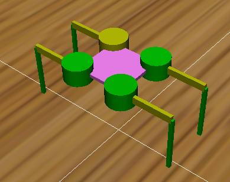</a></div>
<br>


#contents


## Adding Items

### World and Simulator

First, add a world item and a simulator item. From File > New, select World and AIST Simulator and add them.

At this point, the item tree is as follows.
```
 World(World item)
    |-AISTSimulator(AIST Simulator)
```


### Model

Next, add the ground and quadruped robot models.

From File > Import, select **OpenHRP Model File**, and then load the following files.

- {Choreonoid installation directory}/share/model/QuadrupedRobot/QuadrupedRobot.yaml
- {Choreonoid installation directory}/share/model/house/floor.body


Then the 3D model will be displayed as follows.
If it is not displayed, turn on the checkbox of the corresponding item in the item tree.

<br>

<div align="center"><a href="cnoid-rtm-py14.png">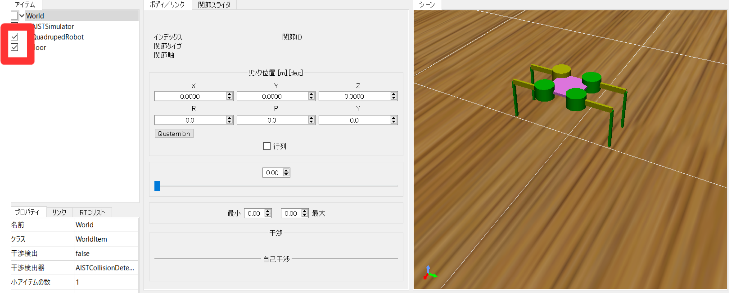</a></div>
<br>


At this point, the item tree is as follows.

```
 World(World item)
    |-AISTSimulator(AIST Simulator)
    |-QuadrupedRobot(model/QuadrupedRobot/QuadrupedRobot.yaml)
    |-floor(model/house/floor.body)
```


### RT Components

#### PyRTC Item
Add an RT Component. From File > New, select and add **PyRTCItem**.

Add the item under the QuadrupedRobot item, and name it **QuadrupedRobotIO**.

At this point, the item tree is as follows.

```
 World(World item)
    |-AISTSimulator(AIST Simulator)
    |-QuadrupedRobot(model/QuadrupedRobot/QuadrupedRobot.yaml)
      |-QuadrupedRobotIO(PyRTCItem)
    |-floor(model/house/floor.body)
```

##### Setting the Python File
Set the item named **RTC module** from the properties of **QuadrupedRobotIO**.

Set **QuadrupedRobot_Choreonoid.py** as the file name.
This starts the input/output RTC for the quadruped robot.


#### ComponentList Item
Start the RTC launcher. From File > Item, select and add **ComponentListItem**.


<br>

<div align="center"><a href="cnoid-rtm-py9.png">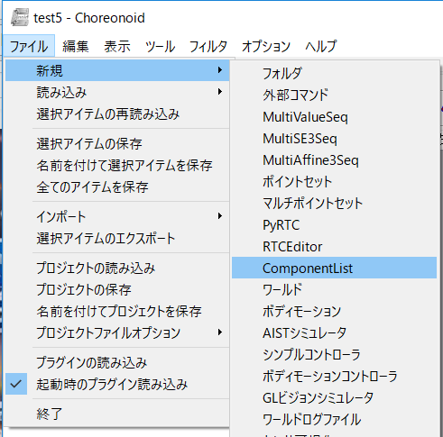</a></div>
<br>


Next, select **ComponentList** from Show View.

<br>

<div align="center"><a href="choreonoid-openrtm-py30.png">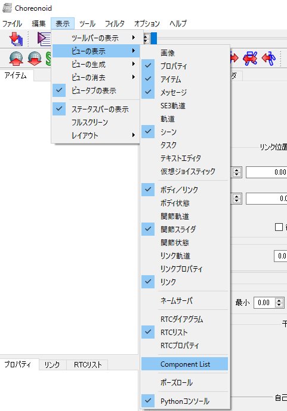</a></div>
<br>


Then the following window will be displayed.


<br>

<div align="center"><a href="cnoid-rtm-py10.png">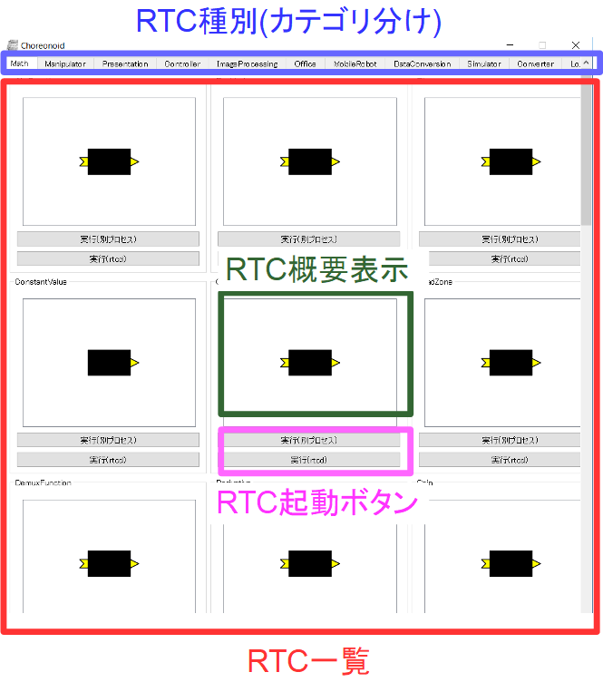</a></div>
<br>


RTCs are classified by category, and you can display RTCs in other categories by switching tabs.
Open the **Controller** tab and start the following two RTCs.

- Foot_Position_Controller (quadruped robot foot position control component)
- Intermittent_Crawl_Gait_Controller (quadruped robot intermittent crawl gait component)

You can start them simply by pressing the **Run (rtcd, periodic execution)** button.


* Originally, we would like to use a trigger-driven execution context, but this has not been realized due to a bug in the OpenRTM-aist C++ version.

<br>

<div align="center"><a href="cnoid-rtm-py48.png">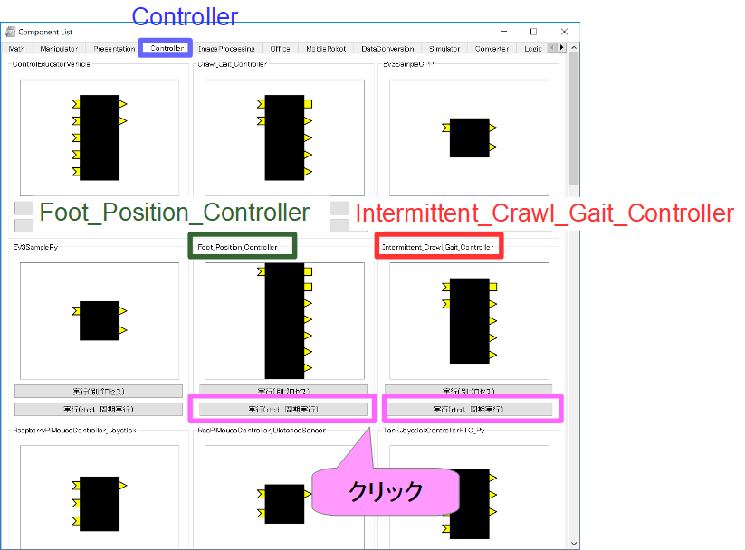</a></div>
<br>


At this point, if you update the RTC list view, it will be displayed as follows.

<br>

<div align="center"><a href="cnoid-rtm-py12.png">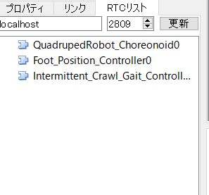</a></div>
<br>


#### RTCEditor Item

Start the RTC editor. From File > Item, select **RTCEditorItem** and add it under the world item.


<br>

<div align="center"><a href="cnoid-rtm-py13.png">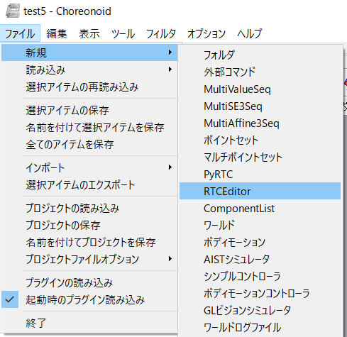</a></div>
<br>


Then the following window will be displayed.

<br>

<div align="center"><a href="cnoid-rtm-py2-2.png"></a></div>
<br>


##### Adding a Data Port
Add an outport for setting the target velocity of the quadruped robot.
Configure the following settings from the window on the right.

<table class="table-alt">
  <tr>
    <th>Port Name</th>
    <th>out</th>
  </tr>
  <tr>
    <td>Port</td>
    <td>DataOutPort</td>
  </tr>
  <tr>
    <td>Data Type</td>
    <td>RTC::TimedVelocity2D</td>
  </tr>
</table>


Press the Create button to create the data port.

<br>

<div align="center"><a href="cnoid-rtm-py15.png">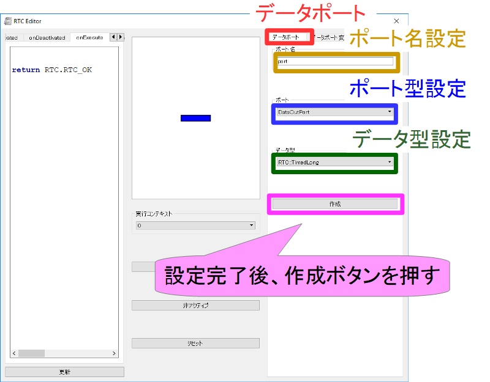</a></div>
<br>


#### Editing Code
Edit the source code.

##### Data Port Variable Names
The variable names related to the data port you just created can be copied from the **Data Port Variable Names** tab on the right.


<br>

<div align="center"><a href="cnoid-rtm-py16.png">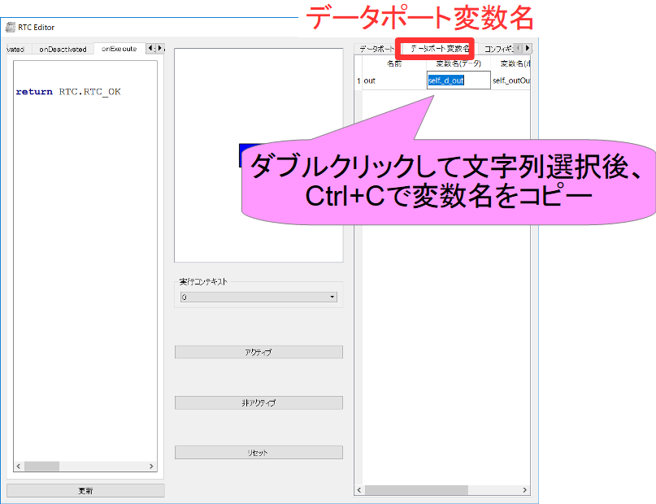</a></div>
<br>


##### Writing Code

In the code editing window on the left, you can write processing to be executed in each activity + α (setBody, inputFromSimulator, outputToSimulator, global).

Write the following in the processing of the **onExecute** function.

```
 self._d_out.data.vx = 0.03
 self._d_out.data.va = 0
 self._outOut.write()
 
 return RTC.RTC_OK
```


The changes are reflected when you press the Update button.

<br>

<div align="center"><a href="cnoid-rtm-py17.png">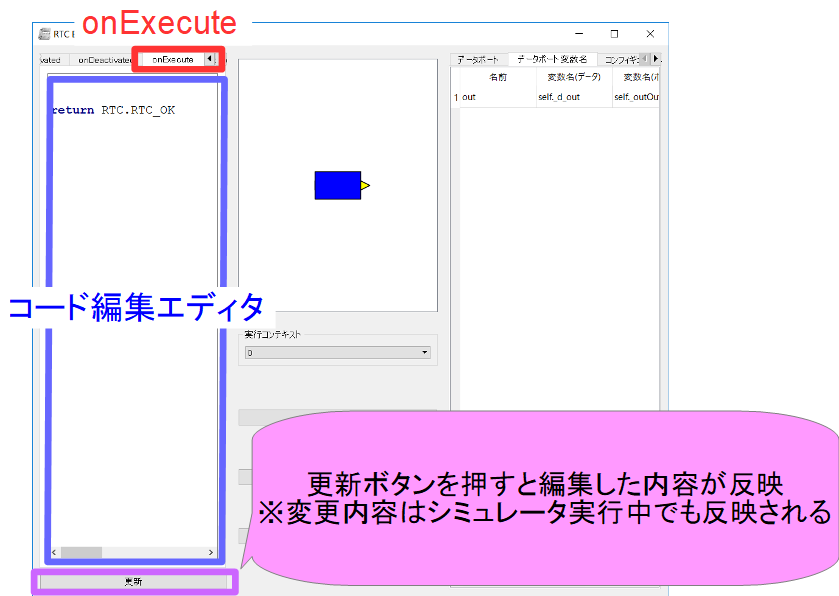</a></div>
<br>


At this point, the item tree is as follows.

```
 World(World item)
    -AISTSimulator(AIST Simulator)
    -QuadrupedRobot(model/QuadrupedRobot/QuadrupedRobot.yaml)
    -QuadrupedRobotIO(PyRTCItem)
    -floor(model/house/floor.body)
    -ComponentList
    -RTCEditor
```

### Building the RT System
After adding the **RT System** item, display **RTC Diagram** from View > Show View.

Connect each RTC port as follows.


<br>

<div align="center"><a href="cnoid-rtm-py18.png">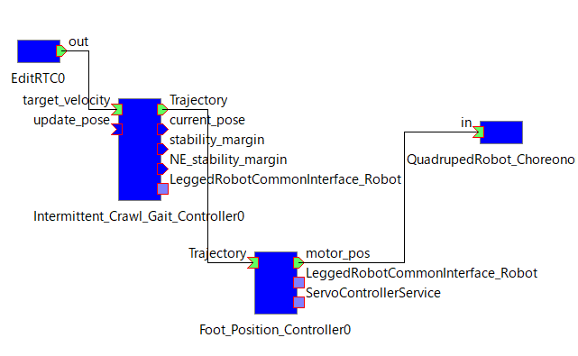</a></div>
<br>


At this point, the item tree is as follows.

```
 World(World item)
    |-AISTSimulator(AIST Simulator)
    |-QuadrupedRobot(model/QuadrupedRobot/QuadrupedRobot.yaml)
      |-QuadrupedRobotIO(PyRTCItem)
    |-floor(model/house/floor.body)
    |-ComponentList
    |-RTCEditor
    |-RTSystem
```

### Starting the Simulator

Finally, when you start the simulation, the quadruped robot moves forward.


#### Changing Code During Execution

For example, while the simulator is running, if you change the code of the RTCEditor onExecute function as follows and press the Update button, you can confirm that the quadruped robot changes its motion from moving forward to turning during simulation execution.


```
 self._d_out.data.vx = 0
 self._d_out.data.va = 0.8
 self._outOut.write()
 
 return RTC.RTC_OK
```
