
></a>

#contents

#clear

## 開催概要

- 会期：2012年10月25,26日
  - 25日（木）　10：00～17：00（受付開始は9:30）
  - 26日（金）　10：00～16：30（受付開始は9:30）
- 場所：
  - 独立行政法人 産業技術総合研究所 つくばセンター
- 対象：
  - 産業界、大学、公的研究機関等の皆様
- 参加費：
  - 無料
- 事前登録：(9月10日から受け付け開始)(終了)
  - **ホームページ[http](http://www.aist-openlab.jp:http://www.aist-openlab.jp)からの事前来場登録（来場申し込み）とラボ事前予約が必要となります。**
- 交通機関：
  - つくばエクスプレス「つくば駅」（秋葉原から快速45分）より無料バスを運行予定
- 公式Webページ
  - [http](//www.aist-openlab.jp:http://www.aist-openlab.jp)

<nowiki></nowiki>

<!-- div align="left"></div-->

### 主な当部門(知能システム研究部門)の展示：

RTミドルウエア関連の展示は**太字**にて示してあります。
**(ラボ見学有)**と記載のある展示は、個別の展示があります(予約制)。それ以外は、メイン会場でのパネル展示のみとなります。
当日でもラボ見学予約は可能ですが、定員がありますので事前のご予約をおすすめします。

- L-81 次世代医療機器の迅速な社会導入を目的としたガイドラインの策定 (つくば・関西・四国)　[東会場] 
- I-01 変形部品の組み立て作業の効率化 　[第２会場] 
- **I-02 双腕ロボットによるピックアンドプレース作業** (ラボ見学有)　[第２会場] 
- **I-03 ロボットソフトウエア基盤：ＲＴミドルウエア（ＲＯＢＯＳＳＡ）** (ラボ見学有)　[第２会場] 
- **I-04 認証可能なロボットソフトウェア開発技術** 　[第２会場] 
- I-05 生活支援ロボット安全検証センター 　[第２会場] 
- I-06 生活支援ロボットアームのベネフィット評価 　[第２会場] 
- I-07 ヒューマノイドを用いたアシスト機器の設計支援 　[第２会場] 
- I-08 BCIによるヒューマノイドの操作 (ラボ見学有)　[第２会場] 
- I-09 広視野視覚によるヒューマノイドの未知環境移動 (ラボ見学有)　[第２会場] 
- I-10 コミュニケーションを支援するアンドロイドの実証実験 　[第２会場] 
- I-11 音響センサを用いた独居高齢者の見守りシステム 　[第２会場] 
- I-12 生活見守りやQOLの向上のための住環境RTシステム (ラボ見学有)　[第２会場] 
- I-13 気仙沼～絆～プロジェクト (つくば・臨海副都心)　[第２会場] 
- I-14 モビリティロボット (ラボ見学有)　[第２会場] 
- I-15 小型移動検査ロボットDIR-3 　[第２会場] 
- I-16 ロボット用IRコミュニケータ 　[第２会場] 
- I-17 高速形状計測 (ラボ見学有)　[第２会場] 
- I-18 ２次元ヒストグラムと時系列情報に基づく画像からの変化検出 　[第２会場] 
- I-19 高精度な姿勢推定のためのARマーカ 　[第２会場] 
- I-20 遠隔行動誘導システム (ラボ見学有)　[第２会場] 
- I-21 集合的標準化 　[第２会場] 

<!-- **展示内容 -->
<!-- RTミドルウエア関連の展示は以下のとおりです。 -->
<!-- - I-07 ロボットソフトウエア基盤：ＲＴミドルウエア [[概要(PDF):http://www.aist-openlab.jp/lab/I-07.pdf]] [[見学予約:https://www.aist-openlab.jp/regist/lab_rsrv.php?lab_id=I-07]] -->
<!-- - I-06 認証可能なロボットソフトウェア開発技術 [[概要(PDF):http://www.aist-openlab.jp/lab/I-06.pdf]] [[見学予約:https://www.aist-openlab.jp/regist/lab_rsrv.php?lab_id=I-06]] -->
<!-- - I-25 住宅のRT化 [[概要(PDF):http://www.aist-openlab.jp/lab/I-25.pdf]] [[見学予約:https://www.aist-openlab.jp/regist/lab_rsrv.php?lab_id=I-25]] -->
<!-- - I-31 OpenHRI-SoarRTCを用いた学習的ロボット対話制御 [[概要(PDF):http://www.aist-openlab.jp/lab/I-31.pdf]] -->

## 展示募集

RTミドルウエア、RTコンポーネントに関する展示を募集いたします。
パネルおよびデモ展示の形でご協力いただける場合、間口1.6m程度のスペースを提供させていただきます。
例年、RTミドルウエアに興味のある来場者および他の展示協力者との情報交換や議論ができるよい機会となっております。

<!-- div align="left"></div-->

## 一般展示

### RTミドルウエア：OpenRTM-aist

- **出展者**: 産業技術総合研究所 知能システム研究部門

#### 展示概要

RTミドルウエア（OpenRTM-aist）はロボットシステムを容易に構築するためのソフトウエアプラットフォームです。ロボットの機能要素（センサ、アクチュエータ、アルゴリズム等）を、RTコンポーネントと呼ばれる単位でモジュール化し、その組み合わせでシステムを構成します。ミドルウエアには、モジュール化とその再利用を容易にするための機能が備わっており、ロボットシステムの開発期間の短縮、コストの削減に貢献します。
RTコンポーネントは、言語（C++、Java、Python）、OS（UNIX、Windows、MacOS X等）を問わず作成・動作が可能で、異言語・OS上のRTコンポーネント同士をネットワーク経由で容易に連携させることができます。RTミドルウエア（OpenRTM-aist）のインターフェース仕様は、産総研が中心となって策定されたOMG（Object Management Group）の国際標準：RTC (Robotic Technology Component)仕様に準拠しています。OpenRTM-aistは今年のロボット大賞2007 ソフトウエア・部品部門優秀賞受賞ソフトウエアです。

**特徴**
- ロボットをモジュール単位で容易に構築するソフトウエアプラットフォーム
- モジュール化と再利用によって開発期間の短縮、コスト削減が可能
- ロボット特有なソフトウエア機能、異言語・異OS間で連携する機能を提供

### OpenRTM-aistツール(RTCBuilder・RTSystemEditor) 

- **出展者**: 産業技術総合研究所 知能システム研究部門

#### 展示概要

現在、NEDO「次世代ロボット知能化技術開発プロジェクト(通称：知能化プロジェクト)」(2007-2011)において、ロボットシステム開発のための統合開発プラットフォーム **OpenRT Platform** が開発されています。このソフトウエアプラットフォームは、OpenRTMをベースとし、多くのツール群(ツールチェーン)によりロボットの開発効率の向上を目指しています。
旧OpenRTMツール(RtcTemplate・RtcLink)も、OpenRT Platform ツールチェーンに取り込まれ、様々な機能追加・改良を行った RTCBuilder・RTCSystemEditor として新たにリリースされました。
本展示では、新しいツールの新機能・改良点などをご紹介します。

#### 特徴

- **RTCBuilder**
  - わかりやすいGUIで、コンポーネントの設計をより簡単に
  - C++、Java、Python、C#のひな型コードを自動生成
- **RTSystemEditor**
  - RTコンポーネントシステムを簡単に設計・操作可能
  - 新機能・オフラインエディタ

<strong>RTCBuilder</strong>

 

### OpenRTM-aistシェルツール(rtshell)
- **出展者**: 産業技術総合研究所 知能システム研究部門

#### 展示概要

OpenRTM-aist用のシステム構築ツールセットです。コマンドラインで個々のRTコンポーネントやRTシステムが制御でき、使い方によっては以下のような事も可能です。

- 通信中のDataPortに対してデータを読み書きし、オンラインデバッグを行う
- シェルスクリプトでのコンポーネントの管理を行う
- コンポーネントAの起動が終わったことを確認してからコンポーネントBを起動する
- 送信データのログを記録して再生する

以下のような理由で今までRTSystemEditorを使用する事ができなかった方にお勧めします。
- ロボットに搭載されたコンピュータのリソースが少ない
- リモートからRTSystemEditorで接続することができない

 

;

 

### 知能ロボットソフトウエア開発プラットフォーム：Robossa

- **出展者**: 産業技術総合研究所 知能システム研究部門

#### 展示概要
ROBOSSAは、知能ロボットのソフトウェア開発を効率よく実施するための開発プラットフォームです。
知能ロボットに必要な様々な機能をRTコンポーネントと呼ばれるソフトウェアモジュール化するためのミドルウエア、開発ツール群および、次世代ロボットの基本的な機能の知能モジュール群とそのシステム例をオープンソースにて提供することで、次世代知能ロボットの研究開発基盤を簡便かつ低コストでの実現と、新技術への早期取り組みが可能な開発プラットフォームを目指しています。

<a href="robossa.png">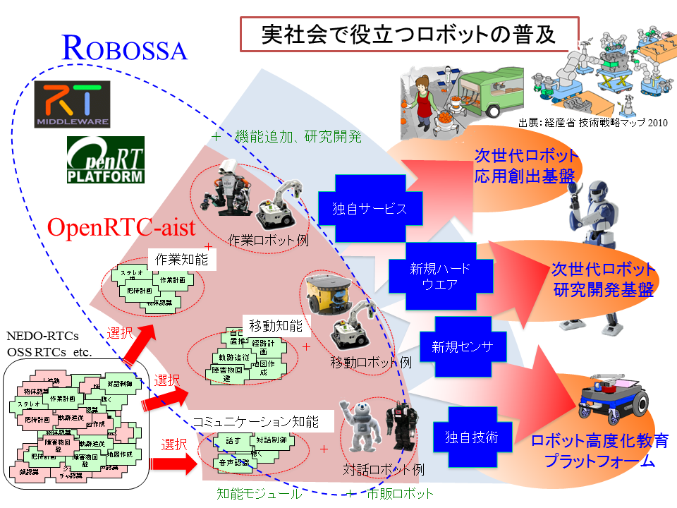</a>

<strong>知能ロボットソフトウエア開発プラットフォーム：Robossa</strong>

ROBOSSAは、RTミドルウェア(OpenRTM-aist)とその開発ツール(OpenRTP-aist)、オープンソースライセンスによる「作業知能」、「移動知能」、「コミュニケーション知能」の各知能モジュール群(OpenRTC-aist)の総称です。

:**OpenRTM-aist**|分散オブジェクト指向に基づくモジュール型ソフトウェア開発環境とその実行環境。
:**OpenRTP-aist**|RTコンポーネントの開発ツール群、ロボットアプリケーション開発におけるロボット動作の生成するツールおよび動作検証のためのシミュレータ等の開発ツール群
:**OpenRTC-aist**|次世代ロボットの基本的な機能である「作業知能」、「移動知能」、「コミュニケーション知能」のRTコンポーネント群およびそれらの知能モジュールと市販ロボットを使った基本システム例。　このシステム構成に独自サービスや新規機能を付加することで次世代ロボットの応用基盤を容易に作成することが可能。

#### 特徴
- ミドルウエア、開発ツール、コンポーネントのロボットソフトウエア開発基盤
- ロボットの機能別にオープンソース知能モジュールとシステム例をパッケージ化
- 次世代ロボットの研究開発における低コスト化と開発期間の短縮化に期待

## 協力展示

### RTC-CANopen

- **出展者**: 芝浦工業大学 水川研究室

RTC-CANopenとは、安全バスシステムとして広く使用されているCANopenの特徴を取り入れた組込み向けのRT-Middlewareです。
RTC-CANopenは、ネイティブバスであるCANを介して接続される各種デバイスと汎用PC上のEthernetで接続されるデバイスやアルゴリズムと相互に接続することが可能となっているうえに、PnP機能をサポートしており柔軟なロボットシステムの構築が可能です。
RTC-CANopenはRenesas社製のSHシリーズ、H8SXといったマイコンやMaxon社製EPOSなどのCANopen準拠製品に適用することが可能です。

<a href="RTC-CANopen.png">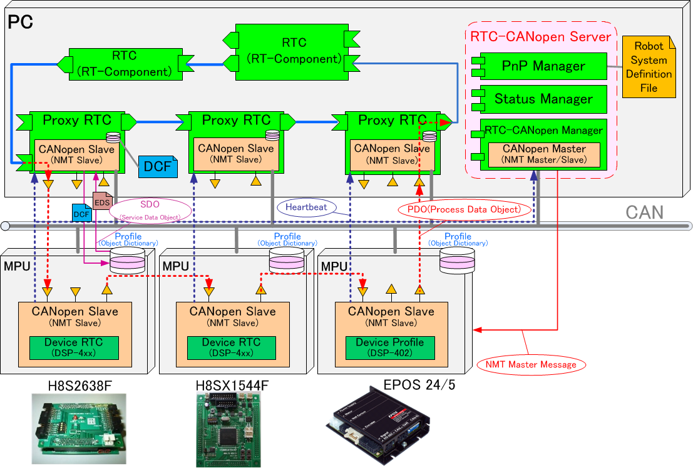</a>

<strong>RTC-CANOpen アーキテクチャ</strong>

#### 特徴
- 既存のCANopen製品が使用可能
- ハードウェアとソフトウェアの再利用性が向上
- PnP機能をサポート
- CANバスを利用した安全バスシステム
- 組込み向けRT-Middleware

### DAQ-Middleware

- **出展者**: 大学共同利用機関法人 高エネルギー加速器研究機構
<!-- - 担当者: 千代浩司、井上栄二 -->

#### 展示概要
DAQ-MiddlewareはOpenRTM-aistを基盤とした高エネルギー加速器研究機構(KEK)
や大強度陽子加速器施設(J-PARC)等の実験データ収集システム(DAQシステム)で
使用するためのソフトウェアフレームワークです。
RTコンポーネントを拡張したDAQコンポーネントによる汎用で柔軟なDAQシステム
構築をめざしています。
現在J-PARCの物質・生命科学実験施設(MLF)の複数の実験装置で稼働中の他、
各種検出器テストベンチとして使われています。

<a href="daqmw-aist-openlab-2012-1.png">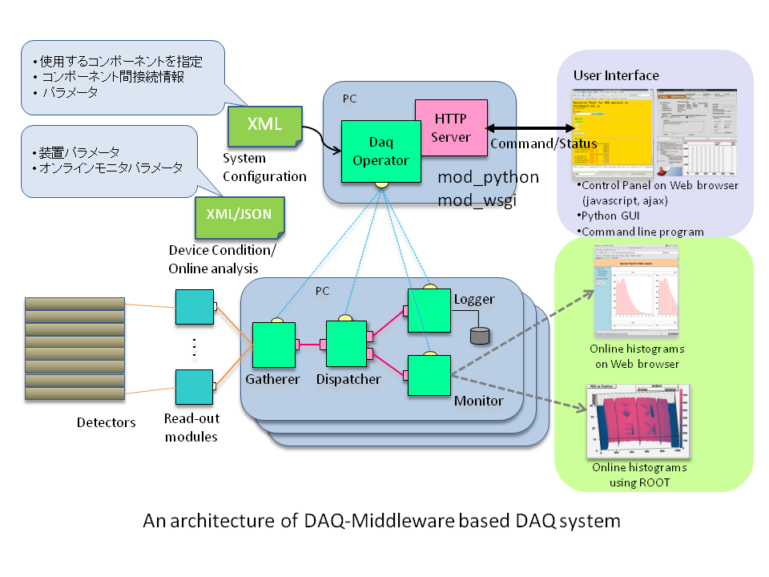</a>

<strong>DAQ-Middlewareアーキテクチャ</strong>

<a href="daqmw-aist-openlab-2012-2.png">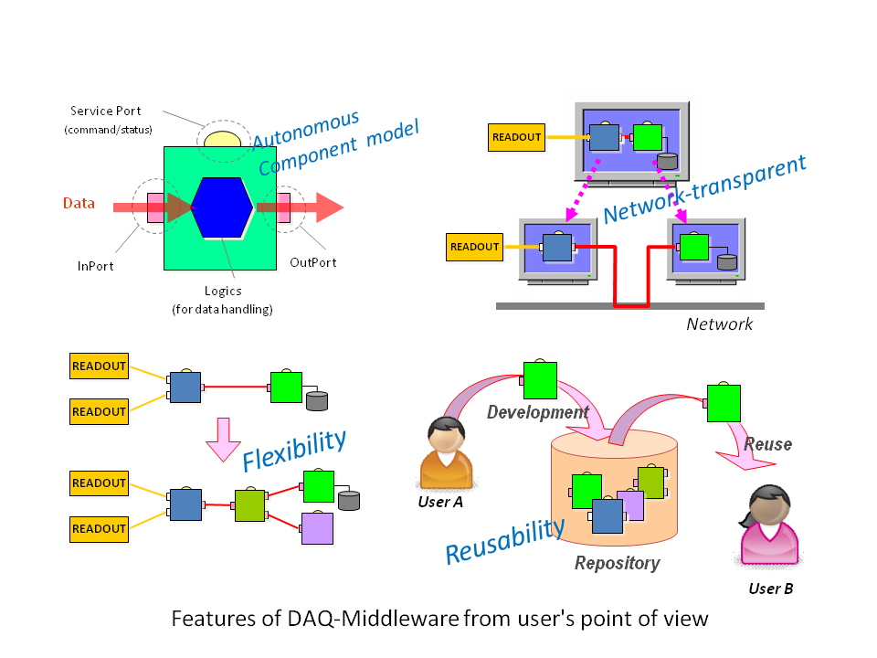</a>

<strong>DAQ-Middlewareの特長</strong>

#### 特徴
- RTコンポーネントに実験データ収集機能を追加したDAQコンポーネントを開発
- DAQオペレータコンポーネントによりDAQコンポーネントを制御
- XMLによるDAQシステム構成を記述
- Webブラウザによるラン制御、モニター

### OpenRTM版MobileSEM

- **出展者**: 大阪大学 大学院工学研究科 マテリアル生産科学専攻

#### 展示概要

MobileSEMを制御するソフトウェアをRTコンポーネント化しました。
Android版のOpenRTMを使用しているため、顕微鏡画像の表示や設定操作等を
Android端末から行えます。Android端末を使用することにより、ユーザの使い
勝手が良くなることを期待しています。
現状では試作の段階ですので、制御ソフトウェアの一部分のみRTコンポーネント化を
行っておりますが，将来的には、MobileSEMの制御ソフトウェアを全てRTコンポーネント化
する予定です。

**MobileSEM**小型軽量の走査型電子顕微鏡。新日本電工株式会社製作。
（詳しくは、http://www.snd.co.jp/mobileSem/index.htmlを参照。）

<a href="mobilesem1.png">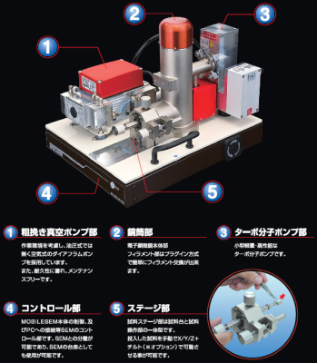</a>
;
<a href="mobilesem2.png">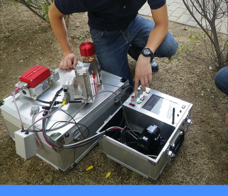</a>
;

<strong>新日本電工株式会社製 MobileSEMと使用イメージ</strong>

#### 特徴
- MobileSEMのソフトウェアをRTコンポーネント化
- Android版OpenRTMを使用
- ユーザインターフェースにAndroidを使用

### 組み込み用CPUボード(BeagleBoard)で動作するOpenRTM

- **出展者**: 有限会社ウィン電子工業

#### 展示概要
組み込みシステムを製作するのに最適(小電力で低コスト)な組み込み用
CPUボード(BeagleBoard)にUSBカメラを接続し、画像を無線LAN経由にて
別PCの画面に映し出す事により、遠隔監視システムを実現しています。
RTミドルウエアを用いOpenCVコンポーネントの再利用により開発工数を短縮し、
また一般でも入手可能なCPUボード、ハードウェアを
使う事によって、ロボット製作の窓口を広げます。

#### 特徴

- 一般の市販機器を使用することで、入手性の向上。
- ハードウェア専用プログラムの製作を、RTミドルウェアに置き換える事により開発期間の短縮と多様なコンポーネントが選べる。
- 省電力、小スペースのCPUボードを使う事により、小型の移動プラットフォームに搭載可能になる。

### iPhoneSensorComponent

- **出展者**: アイ・テー・シー株式会社

#### 展示概要
iPhoneに搭載されているセンサーからの情報をコンポーネント出力として得る事ができます。
本コンポーネントを利用して得る事のできるセンサー情報は以下になります。

**加速度センサー**

iPhoneの加速度を取得する事ができ、iPhoneの移動速度を検出する事ができます。また、iPhoneの傾きを求める際にも利用する事ができます。

**ジャイロセンサー**

iPhoneの傾きを取得する事ができます。X軸、Y軸、Z軸の傾きはそれぞれピッチ角、ロール角、ヨー角としてラジアン単位で求められます。

**地磁気センサー**

iPhoneの地磁気を取得する事ができます。

**GPS**

衛星により得られた座標を取得する事ができます。

**音声**

iPhoneに内蔵されているマイクからの音声情報を取得する事ができます。

**カメラ映像**

iPhoneのカメラからのカメラ映像を取得する事ができます。

iPhoneは使いやすいインターフェイスおよび多くのセンサーを搭載していますが、Objective-CというiOSでのみ用いられるプログラム言語を習得する必要がありました。しかし、本コンポーネントを利用すれば、その手間を省略する事ができ、コンポーネント開発に必要な情報を簡単に取得する事ができます。
iPhoneから得られるセンサー情報はUDP通信を用いてコンポーネントへと伝達されます。カメラ映像を用いる場合には通信に必要な帯域にご注意ください。

### モデルベース・ロボット開発環境「ZIPC-RT」

- **出展者**: キャッツ株式会社

#### 展示概要

高品質なロボットを開発するための設計手法とツールを紹介します。

<a href="CATS-1.jpg">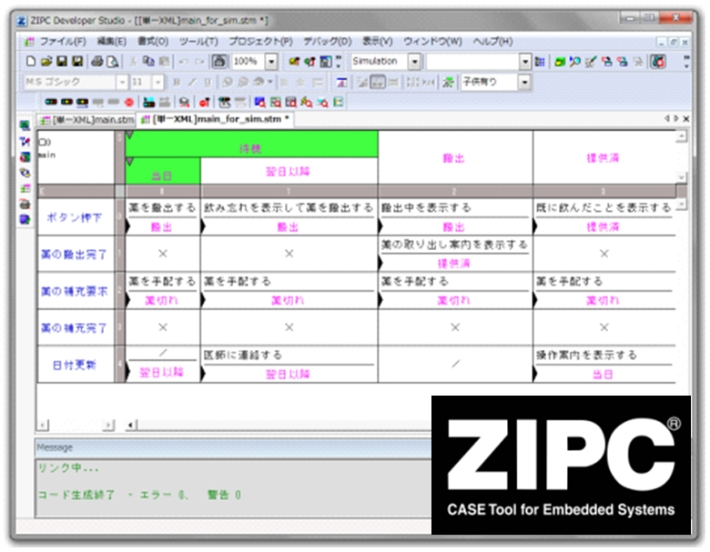</a>
;

;

<strong>ZIPC-RT</strong>

#### 特徴
- 高品質なロボットを開発するためのモデルベース開発環境
- 状態遷移表設計で「いつ・何が起きたら・どうする」を網羅
- シミュレーション検証で仕様の妥当性をレビュー
- 状態遷移表からＣコードを自動生成
- RTMミドルウェアと連携して実機で設計網羅を確認

### タスク制御コンポーネントを用いた遠隔ロボットのためのシステムアーキテクチャ

- **出展者**: 中央大学 國井研究室

#### 展示概要

本アーキテクチャは、主に環境調査を目的とした遠隔ロボットにおける種々の問
題（状況把握の困難さ、制限された通信回線やリソース、不測の事態へ の対応
など）を解決するために設計されています。
特徴しては、ソフトウェア層が仮想接続を司る第一層、実接続を司る第二層の二
つに分かれており、これにより柔軟な動作ロジックの変更を実現させて います。
また、タスク制御コンポーネントであるデータベースノードモジュール（DNM）
を用いて、データの透過性を向上させています。
展示では、このアーキテクチャにより実装されたロボットシステムの簡単なデモ
ンストレーションを行います。

<a href="kuniilab.png">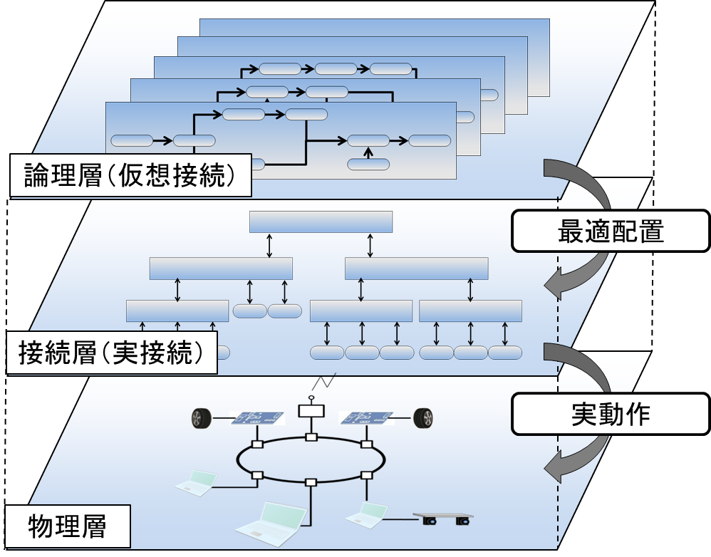</a>

<strong>タスク制御コンポーネントを用いた遠隔ロボットのためのシステムアーキテクチャ</strong>

#### 特徴
- RTミドルウェアを用いてロボットシステムの各機能要素をソフトウェアモジュール化
- 論理層ではユーザビリティを考慮し柔軟に動作ロジックの構築を行う事ができる
- 接続層ではデータベースノードモジュールを用いてデータ透過性や効率的なモジュール管理を実現
- 物理層では各ハードウェアがネットワークを介し接続され、これらは物理的制限なしにソフトウェアによって変更できる
- 共有メモリを用いた高速なコンポーネント間通信が可能

### RTによるプレゼンテーション支援

- **出展者**: 芝浦工業大学 デザイン工学部デザイン工学科 佐々木研究室

#### 展示概要

自身のアイディアや自社製品の魅力、研究成果の意義などを伝える上でプレゼンテーションは欠かせない手段となっています。プレゼンテーションはスライドを用いて行うことが一般的となっていますが、スタイルが画一化されていることもあり、注目を集めたり印象を残したりすることは容易ではありません。
本展示では、RTを利用することで、より効果的・魅力的なプレゼンテーションを実現するためのプレゼンテーション支援コンポーネント群を紹介します。
なお、本アプリケーションは、RTミドルウエアを用いた、コンポーネント指向のロボットシステム構築技術の教育にも用いられています。

<a href="lp_detection_pointing.png">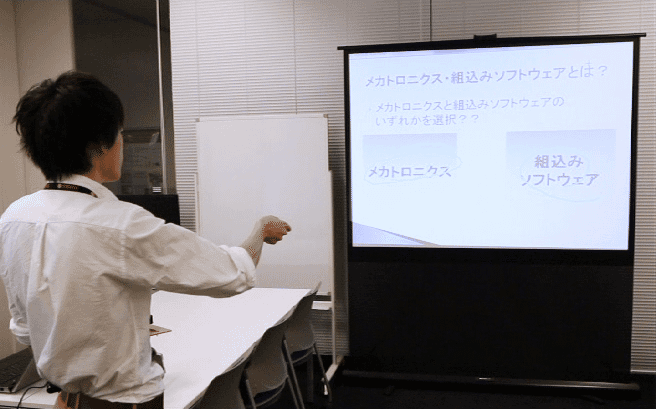</a>
;
<a href="lp_detection_small.png">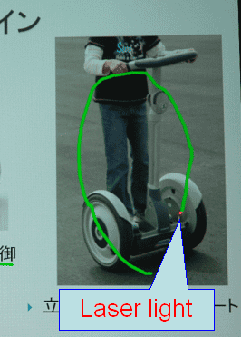</a>
;

<strong>RTによるプレゼンテーション支援</strong>

#### 特徴
- RTを用いた、効果的・魅力的なプレゼンテーション手段を提供
- 基本的な操作を提供するコンポーネント群により、キーボードやマウスによる従来のプレゼンテーションと同様の操作も可能
- コンポーネントの追加により、多様なアイディアを実現可能
- ガイドロボット、プレゼンテーションロボットなど、他のアプリケーションへも展開可能
- RTミドルウエアを用いた教育の効果的な学習素材として利用可能

### ロボカップ＠ホームのオープンプラットフォーム化

- **出展者**: 玉川大学、株式会社セック

#### 展示概要

ロボカップ＠ホームリーグでは家庭において，人とコミュニケーションを取りながら働くロボットの実現を目指している。純粋にロボット技術だけを競うのではなく，実用性を重視した競技であり，動作の信頼性・安全性も評価の対象となるため，競技は新規環境でも基本的に一発勝負であり，再試行は減点の対象となる。ロボットシステムの開発には，開発環境や制御技術などの面で大変な労力が必要となる．そこで，我々は，共通化，効率化を実現する手段として，RTミドルウェアに注目した。RTC
を再利用して組み合わせることで，タスクに対応したロボットシステムを容易に構築できることを示し、RoboCup2013世界大会（メキシコシティ）において準優勝を獲得した。

<a href="okadalab1.png">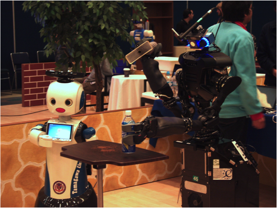</a>
;
<a href="okadalab2.png">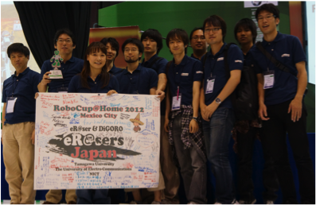</a>
;

<strong>ロボカップ＠ホームのオープンプラットフォーム化</strong>

#### 特徴
- ロボカップ＠ホームのタスクに対応したシステムの容易な構築
- ロボット競技におけるシステムの安定性の確認
- 開発チーム内における資産の継承が容易
- 日本国内のロボカップコミュニティへの普及

### RTMSafety - 機能安全対応RTミドルウェア

- **出展者**: 株式会社セック

#### 展示概要

RTMSafety（RTMセーフティ）は、ロボットの安全関連系への実装を想定し、機能安全の国
際規格であるIEC 61508の認証を取得した世界初のロボット用ミドルウェアです。高い信
頼性や安全性が要求されるロボットにおいて、開発コストの低減や、開発期間の短縮に貢
献します。

<a href="RTMSafety.png">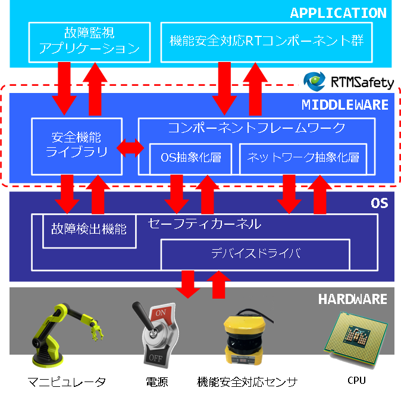</a>

<strong>RTMSafety - 機能安全対応RTミドルウェア</strong>

#### 特徴
- 世界初の安全コンセプトをもったロボット用ミドルウェア
- IEC 61508 SIL3 Capableの認証取得
- 高い信頼性と安全性が要求されるロボット開発において、コストの低減と期間の短縮に貢献

### RTM on Android - Android対応RTミドルウェア

- **出展者**: 株式会社セック

#### 展示概要

RTM on Androidは、Android OSに対応したRTミドルウェアです。
RTM on Android を用いることで、ロボットやセンサがAndroid端末と連携するシステムを
迅速かつ安価に作成することが可能になります。

<a href="RTMonAndroid.png">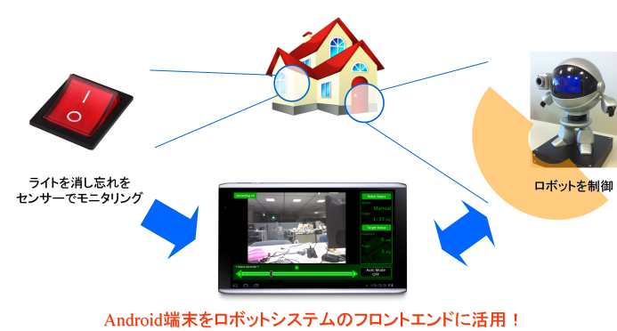</a>

<strong>RTM on Android - Android対応RTミドルウェア</strong>

#### 特徴
- Android OSに対応したRTミドルウェア実装
  - Android上でRTコンポーネントを開発することができます。
  - コンポーネント指向開発によりシステムの保守性、再利用性、拡張性が向上します。
- OMGの国際標準規格であるRTC Specificationに準拠
  - OpenRTM-aist-1.0と連携することが可能です。
  - RTミドルウェアを使用した既存ロボット／センサが利用できるため、開発コストを下げ、開発期間を短くすることができます

### 看護ケアスキル　教育支援システム

- **出展者**: 株式会社ゴビ

#### 展示概要

RFIDタグを活用した看護ケアスキルの教育支援システムを提案する。今回は特に、体位変換(患者の寝ている方向を変えるなど)の学習を題材にする。学習者がウェアラブルRFIDリーダ『TECCO』を装着し、タグが縫い込まれたパジャマを練習相手が着ることにより、学習者が練習相手のどの部位に触れたかが検知可能となる。この情報をもとに、学習者の動作と動画教材を連動させることで、インタラクティブな学習が可能となる。今回、TECCOと動画教材の連動の部分をRT-ミドルウェアにて実現した。

<a href="gobi.jpg">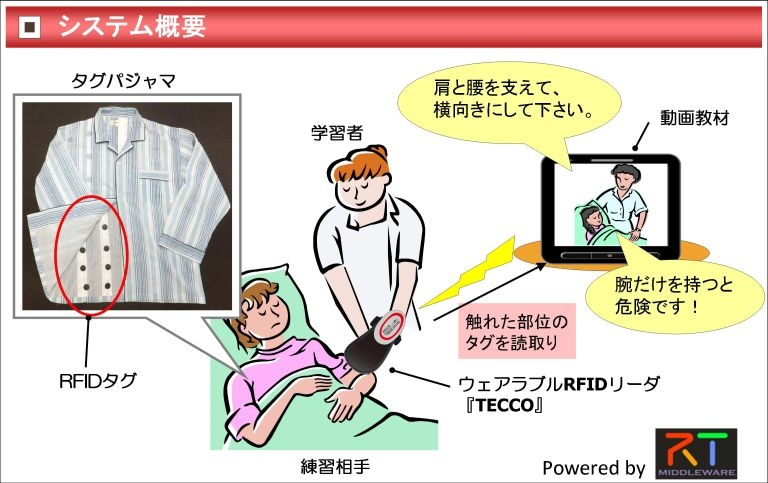</a>

<strong>看護ケアスキル　教育支援システム</strong>

#### 特徴
- TECCO + タグパジャマで、学習者が練習相手のどの部位に触れているかを検知
- 間違った部位によるケア動作を行った場合は、システムがすぐに指摘・アドバイス
- 学習者の動作と動画教材がインタラクティブに連動
- 動画教材を受動的に視聴するだけではなく、能動的な看護ケアスキルの演習が可能
- 指導者がいなくても、効果的に自己学習可能

### RTミドルウェアによるアプリケーション開発

- **出展者**: 株式会社 安川電機

#### 展示概要

ロボットシステムに必要とされる環境認識やヒューマンインターフェース，作
業計画といった機能を持つ作業知能モジュール（RTコンポーネント）群を再利用
可能な部品として開発し，これらのRTコンポーネントを組み合わせて社会・生活
分野向けのロボットシステムを構築しました．
更に，このロボットシステムを用いて，人からの音声や指差しによる指示でペッ
トボトル等の日用品の取り寄せや片付けの作業を行うアプリケーションを開発
し，これらの作業を行えることを確認しました．

<a href="yasukawa1.png">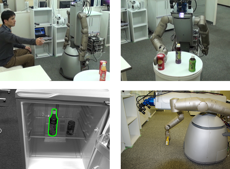</a>
;
<a href="yasukawa2.png">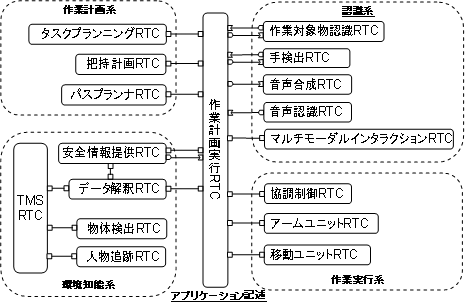</a>
;

<strong>RTミドルウェアによるアプリケーション開発</strong>

#### 特徴
- 複数の組織によって作製された約40のRTコンポーネントを利用しています．
- 作業指示に情報の欠落が有る場合でも情報を補完して作業を実行します．
- 作業途中での作業中断や停止，作業計画を変更しての作業再開が可能です．

### 移動ロボットと環境設置センサの地図情報共有システム

- **出展者**: 明治大学・森岡研究室

#### 展示概要

移動ロボットと環境に固定配置したセンサが情報共有を行ない、高精度な地図の生成と環境センサの設置位置の推定を行なうシステムを提案する。環境センサとして環境中の任意の位置に固定設置した、正確な設置位置姿勢が未知のレーザーセンサを用いる。移動ロボットのSLAMコンポーネントと環境センサコンポーネントにより生成された地図情報をコンポーネント間で共有する。SLAMコンポーネントで双方の位置推定のためにスキャンデータと共有した地図情報を照合することで、双方の観測結果にマッチする地図情報及び位置姿勢が推定される。これにより知能化空間の容易な構築と移動ロボットナビゲーションのための地図生成を同時に可能にする。

<a href="hashikawa.jpg">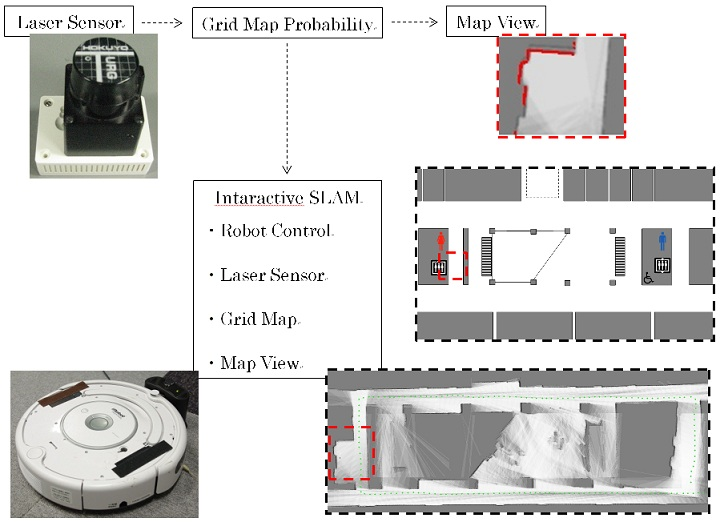</a>
;

<strong>移動ロボットと環境設置センサの地図情報共有システム</strong>

#### 特徴
- 車輪型移動ロボットによるFastSLAMと環境設置センサの地図情報の共有。
- 共有システムにコンポーネントを利用する。
- 様々な場所に設置できるように環境センサをArmadilloでの制御にする。

