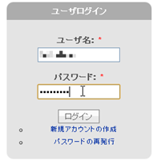

#contents

# Comment Guide

You can try out the submitted entries by actually running them and provide feedback to the authors by posting information on each entry's project page, such as the environment in which it worked or did not work, information about bugs and patches for fixing them, and comments or impressions about the entry.
Please help the applicants improve their entries based on this feedback so that they can present even better work at the presentation session.

## Comment Etiquette

Applicants are happy to receive comments on their work. Such comments provide strong motivation for future development, and requests and bug reports can also help improve the quality of the entries.
We appreciate your cooperation in helping the community develop these entries together.

### Feel Free to Share Information

We appreciate information that may be useful to other users in the community, such as your impressions of the entry, the systems on which you were or were not able to install it, the level of performance you achieved, and how you were able to use it.

### Make Requests That Help Improve the Entry

User requests help an entry grow. We welcome comments such as, "It would be helpful if it could do this."
When making such a request, please remember to explain why the feature is needed. This will also help motivate the author.

### Keep Comments Concise and as Self-Contained as Possible

Long comments are not necessarily bad, but users of submitted entries often want to determine whether an entry is suitable for them without reading a lengthy description.
Try to keep your comments as concise and self-contained as possible. Please focus on one topic at a time, and report multiple bugs in separate comments.

### Report Bugs

If you encounter a bug while using an entry, it is helpful to report it in a comment. This will improve the quality of the entry.
Pointing out a bug is not the same as criticizing the entry. It can help others who are encountering the same problem.
Although authors appreciate reports describing only the issue, it is even more helpful if you can also suggest a solution.

### Include Links to Related Information

If there is a page that can help others better understand the entry, it is helpful to include a link to it.

### Inappropriate Comments

Please do not post comments such as the following:

- Personal information, such as another person's name or address
- Comments that mention only negative points without suggesting improvements
- Comments that may make others uncomfortable

If you find such a comment, please contact us at the following address:

- Email address: contact@openrtm.org

## How to Post a Comment

To enter a comment, you must first [register as a user](http://www.openrtm.org/openrtm/ja/user/register) at http://www.openrtm.org/.
After logging in and visiting a project page, a comment section will appear at the bottom of the page. It is not displayed unless you are logged in. Please enter your comment there.
We look forward to receiving your comments.

### Procedure

1. Log in
1. Enter a comment
1. Review and post the comment using Preview

#### Log In

Log in with your username and password.

#### Enter a Comment

- Open the project page of the entry on which you want to post a comment.
- Enter your comment in the "Comment" field under "Post new comment," complete the "CAPTCHA," and press the "Preview" button.

<table class="table-alt">
  <tr>
    <th>①</th>
    <th>Comment</th>
    <th>Enter your comment. Please observe proper etiquette.</th>
  </tr>
  <tr>
    <td>②</td>
    <td>CAPTCHA</td>
    <td>Enter the letters and numbers shown in the image.</td>
  </tr>
  <tr>
    <td>③</td>
    <td>Preview</td>
    <td>After entering ① and ②, press this button.</td>
  </tr>
</table>

#### Review and Post the Comment Using Preview

<table class="table-alt">
  <tr>
    <td>①</td>
    <td>Comment</td>
    <td>Edit your comment. Please observe proper etiquette.</td>
  </tr>
  <tr>
    <td>②</td>
    <td>Save</td>
    <td>After reviewing the contents of your comment, press this button. The comment will then be posted.</td>
  </tr>
  <tr>
    <td>③</td>
    <td>Preview</td>
    <td>Press this button if you want to edit and review the comment again.</td>
  </tr>
</table>

