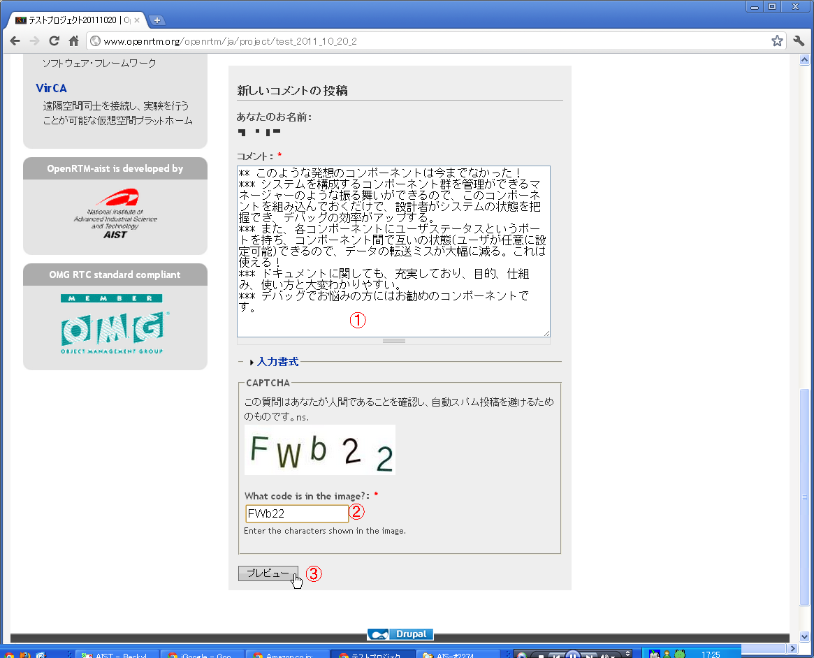
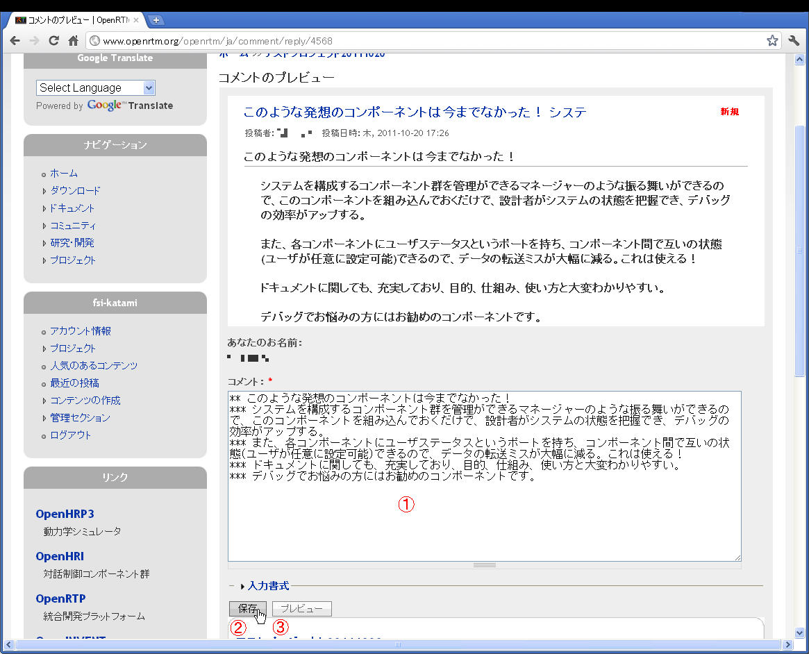

#contents

# コメントガイド
応募作品を実際に動かしてみるなどして試していただき、どのような環境で動作したか/しなかったか、バグやその修正のためのパッチ情報、作品に対するコメントや感想を作品のプロジェクトページに書き込み、作者にフィードバックすることが出来ます。
これらのフィードバックを元に応募者が改良を加え、成果発表会でのプレゼンテーションまでに、より良い作品になるようご協力ください。

## コメントのマナー

応募者にとって、自分の作品にコメントをもらうのはうれしいものです。今後の大きなモチベーションになりますし、要望、バグ報告などは、作品の品質向上にもつながります。コミュニティの皆さんで作品を育てる気持ちでご協力お願いいたします。

### 気軽に情報を共有しよう。

作品の感想、どのようなシステム上でインストール出来たか／できなかったか、こんなパフォーマンスが出た、こんな使い方が出来た等、コミュニティの他の利用者に役立つ情報を提供いただけると助かります。

### より良い作品にするための要望を

作品を育てるのは、利用者の皆さんの要望です。こんな事出来ると助かるのにというようなコメントを期待しています。その際に、どうしてその機能が必要になるのかを忘れずに説明いただけるとモチベーションも上がります。

### 長すぎず、できるだけ完結にまとめる

長いコメントが悪いわけではないのですが、応募作品を利用するユーザは、長文を読まずに、自分に合うのか合わないのかを判断したがります。できるだけ完結に、まとめて書くように心がけましょう。トピックはひとつに絞り、複数のバグの報告などは、それぞれ別のコメントにまとめるようにお願いいたします。

### バグを報告をする

作品を使用してバグがあった場合は、コメントで報告すると親切です。これにより作品の品質が向上します。
バグを指摘することは、作品にケチをつけることではありません。同じところで道に迷っている仲間を救うことができます。
作者にとっては、現象だけの報告でも嬉しいのですが、解決策も同時に提案いただけると助かります。

### 関連項目のリンクを貼る

作品を理解を深めるために手助けになるページがあれば、リンクを貼ってあげると親切です。

### NGなコメント

以下のようなコメントの投稿はやめましょう。

- 相手の名前や住所などの個人情報
- 作品の改善提案を伴わない、マイナス点だけの感想
- 人に不快感を与えるコメント

このようなコメントを見つけた場合は、以下へご連絡をお願いいたします。

- メールアドレス:contact@openrtm.org

## コメントの書き方

コメントを入力するためには、まず、http://www.openrtm.org/の[ユーザ登録](http://www.openrtm.org/openrtm/ja/user/register)が必要です。
ログイン後にプロジェクトページを訪問すると、ページの最後にコメント欄が表示される（ログインしないと表示されない）のでここにコメントを書き込んでください。皆さんのコメントをお待ちしております。

### 手順

1. ログイン
1. コメントの入力
1. プレビューでコメントの確認と投稿

#### ログイン

ユーザ名とパスワードでログインします。

#### コメントの入力
- コメントを投稿したい作品のプロジェクトページを開きます。
- 「新しいコメントの投稿」の「コメント」欄と「CAPTCHA」を入力して「プレビュー」ボタンを押します。

<table class="table-alt">
  <tr>
    <th>①</th>
    <th>コメント</th>
    <th>コメントを書き込みます。マナーに注意してください。</th>
  </tr>
  <tr>
    <td>②</td>
    <td>CAPTCHA</td>
    <td>画像に記されている文字や数字を入力します。</td>
  </tr>
  <tr>
    <td>③</td>
    <td>プレビュー</td>
    <td>①、②を入力してから、このボタンを押します。</td>
  </tr>
</table>

#### プレビューでコメントの確認と投稿

<table class="table-alt">
  <tr>
    <th>①</th>
    <th>コメント</th>
    <th>コメントを編集します。マナーに注意してください。</th>
  </tr>
  <tr>
    <td>②</td>
    <td>保存</td>
    <td>コメントに内容を確認したら、このボタンを押します。これによりコメントが投稿されます。</td>
  </tr>
  <tr>
    <td>③</td>
    <td>プレビュー</td>
    <td>コメントを編集して再度確認したい場合はこのボタンを押します。</td>
  </tr>
</table>

