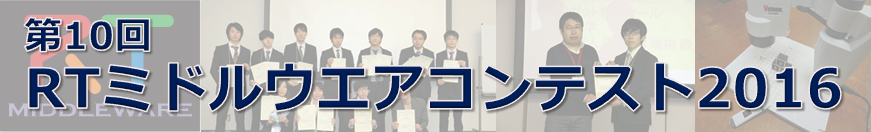

No English version available.

 
 
 

#contents

皆さんから寄せられた質問を共有するために、ここにまとめてみました。参考にしていただければ幸いです。

## 参加資格について

### Q: 趣味でパソコンのプログラムを作っている個人です。参加できますか？
学生さんだけでなく、個人参加も大歓迎です。

### Q: 学生でなく社会人です。参加できますか？
趣旨に賛同いただき、技術の共有を図っていただけるのであれば、学生さんだけでなく、大学教員やソフトウエアベンダーの方も大歓迎です。

### Q: 企業から自社製品をRTコンポーネント化して提供しても良いですか？
参加資格として誰でも参加可能ですのでOKです。技術の共有にご協力ください。 自社製品をお持ちの企業さんであれば、宣伝効果も考えて自社製品のRTコンポーネント化 に対する冠賞を提供して、教育のために自社製品を貸与して学生さんや個人的に趣味で開発 している人々に開発を促すという手段もあります。ご検討いただければ幸いです。

### Q: ソフトハウスに勤めています。会社の規則としてソース公開ができませんが参加できないでしょうか？
会社の持つ売り物のデバイスドライバ等のライブラリのソースコードまで公開を求めているわけではありません。 一般に入手可能な無償また は有償のライブラリをRTコンポーネント化するソフトウエアとしてご参加ください。非公開のライブラリや非常識的な価格のライブラリを使ったエントリは認 められません。宣伝効果も兼ねた冠賞の提供という手段もご検討ください。

## ライセンスについて

### Q: 公開するソフトのライセンスはどうなるのですか？
基本的にソフトウエアを提供する側で設定ください。基本的にはBSD, LGPL等のオープンソース ライセンスを期待しておりますが、デュアルライセンスにして商用利用に関して別途規定いただくようなことを考えていただいても良いと思います。

### Q: 提供後にバグなどで責任問題を問われないでしょうか？
商用利用として別途ライセンスを規定した場合を除いて、基本的に、使用者責任でのソースコードの利用をお願いしております。

## 成果発表プレゼンテーションと表彰式について

### Q: 発表時間およびその内訳(質疑応答等)は？
成果発表は、講演申込みいただいた、SICEシステムインテグレーション
部門講演会の特別OSとして行います。　
発表時間や会場案内に関しては、講演会のホームページを参照ください。
ひとつの講演に割り当てられた時間のなかで成果発表と質疑応答が行われます。

例えば、15分の発表時間であれば、10分で1鈴、12分で2鈴、15分で3鈴の合図が
あると思いますので、プレゼンテーションは10分、質疑応答を5分を
目処にしてください。

### Q: 学術講演会の会場にて成果発表プレゼンテーションと表彰式が予定されていますが、参加費の割引がありませんか？
計測自動制御学会のシステムインテグレーション部門講演会の特別オーガナイズドセッションとして開催させていただきます。そのために、発表者に関しては、講演会への参加費が必要となることと、プレゼンテーションが必須となることをあらかじめご了解ください。聴講者に関しては、特別公開セッションとしてどなたでも無料で参加できる予定です。しかし、折角の機会なので講演会にも参加していろいろなセッションの議論に参加いただくことをお勧めいたします。開催日の約一ヶ月前が〆切りとなるお得な早期参加申込割引がございますので、ご活用ください。

### Q: 旅費がないので／都合がつかないので、12月の成果発表に対応できません。失格でしょうか？
今年も計測自動制御学会のシステムインテグレーション部門講演会の特別オーガナイズドセッションとして開催させていただく予定です。そのためにプレゼンテーションが必須となることをあらかじめご了解ください。代理発表でもかまいませんので、どなたかにプレゼンテーションを依頼いただくようお願いいたします。

### Q: 代理発表をお願いしてよいですか？
プレゼンテーションもひとつの重要な評価項目です。審査に影響があることをあらかじめご了承ください。しかし、開発成果を宣伝する手段としての代理発表はむしろ大歓迎です。 学生さんの開発成果を指導した先生が発表されるのも構いません。 コンテストの趣旨に賛同いただき、コンテストに参加して技術の共有と蓄積に協力いただくようお願いいたします。

## 評価について

### 作品へのコメントは発表や審査にどのように使われるのか？
応募作品のプロジェクトページへのコメント内容は、審査員への印象に
大きく影響すると思われます。成果発表に際しても、こんなフィードバックを
もらったと紹介するもの良いと思います。また、コメント内容に対する
レスポンスに関しては、評価項目の｢期間内に報告されたバグへの対応状況｣
というユーザサポートとして評価されます。

## RTミドルウエアについて

### Q: そもそもRTミドルウエアって何ですか？
[RTミドルウエア(OpenRTM-aist)のホームページ](http://www.openrtm.org/openrtm/ja/content/openrtm-aist%E3%81%A8%E3%81%AF%EF%BC%9F)を参照ください。

### Q: RTミドルウエアのユーザメーリングリストに登録するには？
[RTミドルウエアのメーリングリスト](http://www.openrtm.org/openrtm/ja/content/%E3%83%A1%E3%83%BC%E3%83%AA%E3%83%B3%E3%82%B0%E3%83%AA%E3%82%B9%E3%83%88-0)のページを参照ください。

### Q: RTミドルウエアを使った開発で使用するプログラム言語は何ですか？
コンセプトとしては、いろいろな言語をサポートしたいと考えております。現時点で産総研からご提供可能なC++ 版、Java版、Python版を利用することができます。詳細は、[OpenRTM-aist諸元のページ](http://www.openrtm.org/openrtm/ja/content/openrtm-aist-%E8%AB%B8%E5%85%83)、[プロジェクトのＲＴミドルウエアページ](http://www.openrtm.org/openrtm/ja/content/rt%E3%83%9F%E3%83%89%E3%83%AB%E3%82%A6%E3%82%A7%E3%82%A2)を参照ください。

### Q: コンポーネント化って具体的にはどうするの？
講習会資料を参考にしてください。 また、少し古い情報ですが、学習推論ライブラリを RTミドルウエアを使ってコンポーネント化した[学習推論コンポーネントの例](http://www.openrtm.org/OpenRTM-aist/html/E382B3E383B3E3839DE383BCE3838DE383B3E38388/E5ADA6E7BF92E383BBE68EA8E8AB96E382B3E383B3E3839DE383BCE3838DE383B3E38388.html)を公開しております。参考にしていただければ幸いです。また、[過去のコンテスト作品](http://www.openrtm.org/openrtm/ja/node/230)を参考にしてください。

### Q: すでに開発されているRTコンポーネントは？
[OpenRTM-aistのコンポーネントページ](http://www.openrtm.org/openrtm/ja/node/1546)を探してみてください。また、過去の資料も参考にしてください。

- [RTミドルウエア技術カタログ2010](http://www.openrtm.org/rt/RTMcatalog2010_v2.pdf)　（産総研）
- [NEDO国際ロボット展2009：知能化モジュール集](http://www.nedo.go.jp/library/pamphlets/ZZ_pamphlets_02kikai_chinou.html) (NEDO)
- [RTミドルウエア技術カタログ2009](http://www.openrtm.org/rt/RTMcatalog2009.pdf)　（産総研）

### Q: RTミドルウエアを勉強するには？
まずは、[OpenRTM-aistを10分で始めよう！](http://www.openrtm.org/openrtm/ja/node/850)を体験してみてください。
毎年春のロボティクス・メカトロニクス講演会にて一日講習会を、夏には産総研つくばセンターにて
合宿制のサマーキャンプを開催しておりますので、是非、ご参加下さい。
ある程度の人数を集めていただき、講師の旅費を工面いただければ、出張講習も可能です。
ご相談ください。

過去の講習会情報や資料が**[講習会ページ](http://www.openrtm.org/openrtm/ja/node/130)**にまとめてありますので、自習も可能です。

### Q: RTミドルウエアの公式ホームページ以外のユーザの立場からの有益な情報は？
以下のアクティブユーザのホームページを参考にしてください。

- [RTミドルウエア入門](http://ysuga.net/robot/rtm)（菅＠早稲田）
- [けんちょの部屋](http://www44.atwiki.jp/kencyo/pages/19.html)　（大原＠阪大）
- [ロボットインテリジェンス原論](http://rbintelligence.hide-yoshi.net/)　（Nobu＠立命館）
- [OpenINVENT: 自律移動コンポーネント群](http://www.openrtp.jp/INVENT/)　（喜多＠産総研）
- [OpenHRI: コミュニケーションコンポーネント群](http://openhri.net/) （松坂＠産総研）

