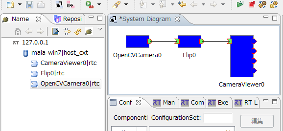
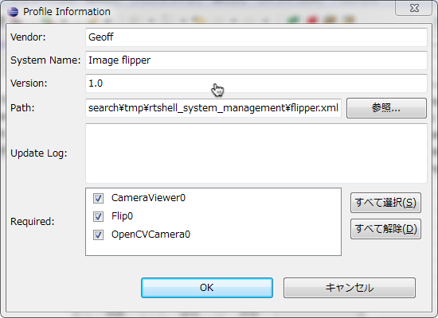
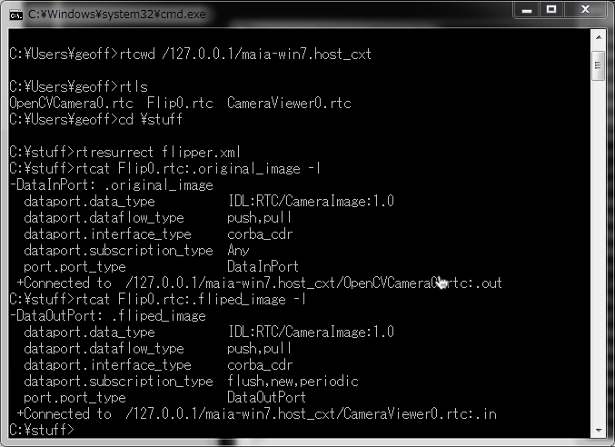
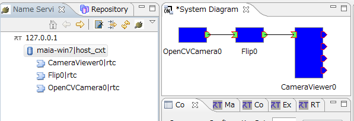

#contents

## Introduction

This case study introduces how to manage an RT system using rtshell. By using an existing camera component, image processing component, and image viewer component, the system can be automatically restored and started.
By designing the system with RTSystemEditor and using rtshell together with shell scripts for restoration and startup, you can efficiently build and operate RT systems.

### What is rtshell?

[rtshell](http://www.openrtm.org/openrtm/ja/node/1005) is a tool that allows you to manage RT Components registered with a Naming Service from the command line. You can activate, deactivate, and reset components, as well as connect their ports.
In addition, it can manage an entire RT system.

### Workflow

- Create the system with RTSystemEditor
- Save the system as an RTSProfile
- Create RT Component instances using rtshell and rtcd (RT Component Manager)
- Restore the system connections using the rtshell `rtresurrect` command
- Start the system using the rtshell `rtstart` command
- Stop the system using the rtshell `rtstop` command
- Remove the system using the rtshell `rtteardown` command

## Creating the System

First, start the Naming Service.

Next, start the following components.

- OpenCVCameraComp
- FlipComp
- CameraViewerComp

Launch RTSystemEditor and create the following system.

<div align="center"><a href="rtsystemeditor_make_system.png"></a></div>

The default connection properties between ports are sufficient.

## Saving the System as an RTSProfile

### What is an RTSProfile?

An RTSProfile is a file format used to describe an RT system. It can store information such as the components used, configuration parameters, and connections.
Using an RTSProfile, you can save the system configuration created with RTSystemEditor and use it with other tools (or vice versa).

### Saving the System

Click the background (the white area) of the system editor and select **[Save As]**.

<div align="center"><a href="rtsystemeditor_save_system.png"></a></div>

Enter the system information.

<div align="center"><a href="rtsystemeditor_save_system_info.png"></a></div>

Click the **[OK]** button to create and save the RTSProfile file.

Finally, terminate the components.

## Preparing to Use rtshell

Open a Windows Command Prompt.

<div align="center"><a href="start_command_prompt.png"></a></div>

Set the environment variable by executing the following command.
`RTCTREE_NAMESERVERS` is an environment variable used by **rtctree**, the support library for rtshell. It specifies the Naming Service that rtshell can access.

```
  set RTCTREE_NAMESERVERS=127.0.0.1
```

## Restoring the RT System

Restore the RT system by recreating the connections between the components.
Start the following components.

- OpenCVCameraComp
- FlipComp
- CameraViewerComp

Use rtshell to move to the folder on the Naming Service where the components are registered.

```
  rtcwd /127.0.0.1/maia-win7.host_cxt
```

`maia-win7.host_cxt` is the name of the Naming Service.

Move to the directory containing the RTSProfile file and execute the following command.

```
  rtresurrect flipper.xml
```

`flipper.xml` is the name of the RTSProfile file.

<div align="center"><a href="rtresurrect_success.png"></a></div>

You can verify the command execution results in Eclipse. The ports of the components should now be connected.

<div align="center"><a href="rtresurrect_success_eclipse.png"></a></div>

You can also confirm that the system has been reconstructed by using the `rtcat` command.

<div align="center"><a href="rtresurrect_success_rtcat.png"></a></div>

## Starting the RT System

The `rtstart` command activates all components that make up the system, allowing you to start the entire RT system.

```
  rtstart flipper.xml
```

You can verify the result in Eclipse, where all components should become active (shown in green).

<div align="center"><a href="rtstart_success_eclipse.png"></a></div>

You can also verify this using the `rtls` command.

<div align="center"><a href="rtstart_success_rtls.png"></a></div>

## Stopping the RT System

The `rtstop` command deactivates all components that make up the system, allowing you to stop the entire RT system.

```
  rtstop flipper.xml
```

You can verify the result in Eclipse, where all components should return to the inactive state (shown in blue).

<div align="center"><a href="rtstop_success_eclipse.png"></a></div>

You can also verify this using the `rtls` command.

<div align="center"><a href="rtstop_success_rtls.png"></a></div>

## Removing the RT System

Finally, use the `rtteardown` command to remove the system by deleting all connections.

```
  rtteardown flipper.xml
```

You can verify the result in Eclipse, where the connections between components should be disconnected.

<div align="center"><a href="rtteardown_success_eclipse.png"></a></div>

You can also confirm this using the `rtcat` command.

<div align="center"><a href="rtteardown_success_rtcat.png"></a></div>


## Saving an RT System with rtshell

Like Eclipse, rtshell can also save the configuration of an RT system.
First, create a simple system.

Start the **EdgeComp** component and connect the ports using the following commands.

```
  rtresurrect flipper.xml
  rtdis CameraViewer0.rtc
  rtcon Flip0.rtc:.fliped_image Edge0.rtc:.original_image
  rtcon Edge0.rtc:.Edge_image_sobel_x CameraViewer0.rtc:.in
```

These commands restore the previously saved system, remove one connection, and add a new component to the processing pipeline.

<div align="center"><a href="extended_system.png"></a></div>

You can verify the updated system configuration in Eclipse.

<div align="center"><a href="extended_system_eclipse.png"></a></div>

The `rtcryo` command in rtshell saves the current RT system.
Use the following command to save the current system.

```
  rtcryo -n "Flipped edge detector" -v 2 -e Geoff -o edge.xml 127.0.0.1
```

The saved file can be opened in the Eclipse System Editor for further editing.
The options are as follows.

- `-n` System name
- `-v` System version
- `-e` Author
- `-o` Output file name

## Simple System Management with Scripts

By using script files (batch files on Windows, or shell scripts such as Bash on Linux and macOS), you can use the commands introduced above to easily start and stop complex RT systems.

First, remove the system you created.

```
  rtteardown edge.xml
```

Save the following contents in a file named `run_system.bat`.

```
  @echo off
  echo "Starting system"
  call rtresurrect edge.xml
  call rtstart edge.xml
  echo "Press any key to shut down"
  pause
  call rtstop edge.xml
  call rtteardown edge.xml
```

Run:

```
 run_system.bat
```

The RT system will start.

When the user presses the **Enter** key, the system is stopped, removed, and the script exits.

