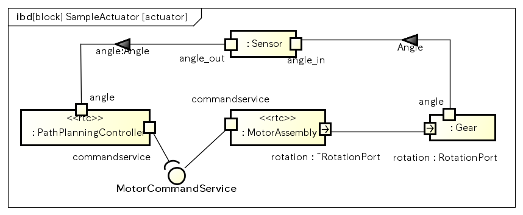
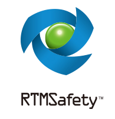
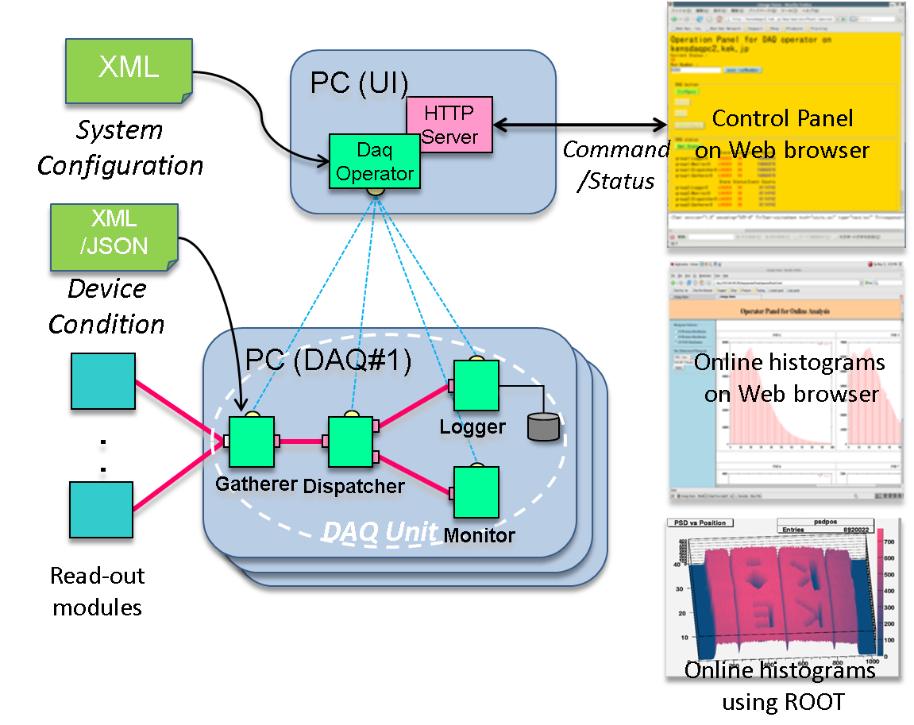
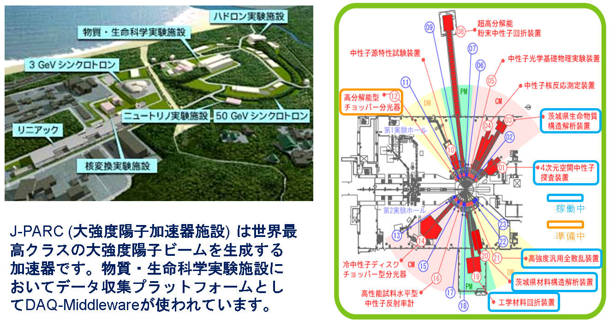

<div align="right"><a href="software_package.png"></a></div>

Japan's National Institute of Advanced Industrial Science and Technology (AIST) is promoting the transfer of various technologies, know-how and software licenses owned by AIST.
If you are interested in technology transfer of OpenRTM-aist and its related technologies, please contact the following person or the [Technology License Office of AIST](http://unit.aist.go.jp/intelprop/ci/index.htm).
<!--break-->
## Contact Information

```
 National Institute of Advanced Industrial Science and Technology
 Industrial CPS Research Center, Software Platform Research Team
 Noriaki Ando
 AIST Tsukuba Central 2, Tsukuba, Ibaraki 305-8568, Japan
 TEL: +81-29-861-5981 FAX: +81-29-861-5971
 email: n-ando <at> aist.go.jp
```

## Licensable Software List

<table class="table-alt">
  <tr>
    <th>Name</th>
    <th>License Number</th>
    <th>Date</th>
  </tr>
  <tr>
    <td colspan="3" style="text-align: center;">''OpenRTM-aist-1.1 software</td>
  </tr>
  <tr>
    <td>OpenRTM-aist-1.1</td>
    <td>H26PRO-1624</td>
    <td>H26.02.19</td>
  </tr>
  <tr>
    <td>OpenRTM-aist-Java-1.1</td>
    <td>H26PRO-1625</td>
    <td>H26.02.19</td>
  </tr>
  <tr>
    <td>OpenRTM-aist-Python-1.1</td>
    <td>H26PRO-1626</td>
    <td>H26.02.19</td>
  </tr>
  <tr>
    <td>RTCBuilder 1.1</td>
    <td>H26PRO-1627</td>
    <td>H26.02.19</td>
  </tr>
  <tr>
    <td>RTSystemEditor 1.1</td>
    <td>H26PRO-1628</td>
    <td>H26.02.19</td>
  </tr>
  <tr>
    <td>OpenRTM-aist-1.1 C++ test program</td>
    <td>H29PRO-2127</td>
    <td>H29.10.16</td>
  </tr>
  <tr>
    <td>OpenRTM-aist-1.1 Python test program</td>
    <td>H29PRO-2128</td>
    <td>H29.10.16</td>
  </tr>
  <tr>
    <td>OpenRTM-aist-1.1 installer builder</td>
    <td>H29PRO-2129</td>
    <td>H29.10.16</td>
  </tr>
  <tr>
    <td>rtshell 4.0</td>
    <td>H28PRO-1977</td>
    <td>H28.4.28</td>
  </tr>
  <tr>
    <td>></td>
    <td>></td>
    <td>OpenRTM-aist-1.0 software</td>
  </tr>
  <tr>
    <td>OpenRTM-aist-1.0</td>
    <td>H22PRO-1089</td>
    <td>H22.02.05</td>
  </tr>
  <tr>
    <td>OpenRTM-aist-Java-1.0</td>
    <td>H22PRO-1164</td>
    <td>H22.07.13</td>
  </tr>
  <tr>
    <td>OpenRTM-aist-Python-1.0</td>
    <td>H22PRO-1163</td>
    <td>H22.07.13</td>
  </tr>
  <tr>
    <td>RTCBuilder 1.0</td>
    <td>H22PRO-1161</td>
    <td>H22.07.13</td>
  </tr>
  <tr>
    <td>RTSystemEditor 1.0</td>
    <td>H22PRO-1162</td>
    <td>H22.07.13</td>
  </tr>
  <tr>
    <td>></td>
    <td>></td>
    <td>OpenRTM-aist-0.4 software</td>
  </tr>
  <tr>
    <td>OpenRTM-aist-0.4.0 for Java</td>
    <td>H20PRO-819</td>
    <td>H20.01.31</td>
  </tr>
  <tr>
    <td>RtcTemplate on Eclipse</td>
    <td>H19PRO-696</td>
    <td>H19.05.30</td>
  </tr>
  <tr>
    <td>OpenRTM-aist-0.4.0</td>
    <td>H19PRO-693</td>
    <td>H19.05.09</td>
  </tr>
  <tr>
    <td>RtcLink on Eclipse</td>
    <td>H19PRO-627</td>
    <td>H18.12.18</td>
  </tr>
  <tr>
    <td>RtcLink on Eclipse 0.3.0</td>
    <td>H19PRO-623</td>
    <td>H19.01.26</td>
  </tr>
</table>


## Examples of Technology Transfer

<div align="right"><a href="https://astah.change-vision.com/ja/"></a></div>
### astah* SysML-RTM linkage 

- Transfered Organization: [Change Vision, Inc. ](https://www.change-vision.com/)
- Product Name: [astah* SysML-RTM linkage plug-in](https://www.sec.co.jp/ja/rd/rtmsafety.html)

The astah* SysML-RTM linkage plug-in generates OpenRTM-aist's RT-Component design specifications (RTCProfile) and system design specifications (RTSProfile) from SysML model designs modeled using the SysML tool ``astah*`` by Change Vision, Inc.

By generating RTCProfile and RTSProfile from the parts existing on the SysML internal block diagram and linking with OpenRTP provided by OpenRTM-aist, it is possible to create a template of the source code of the RT-Component and the robot systems. It realizes the restoration of the components included in and their connection relationships.

- [astah* SysML-RTM linkage plug-in](http://changevision.github.io/sysml4rtm/index.html)

<div align="center"><a href="astah_rtm.png"></a></div>

<br>
<br>

<div align="right"><a href="http://www.sec.co.jp/business/rtmsafety/index.html"></a></div>
### RTMSafety

- Transfered Organization: [SEC Co. Ltd.](https://www.sec.co.jp/ja/index.html)
- Product Name:[RTMSafety](https://www.sec.co.jp/ja/rd/rtmsafety.html)


RTMSafety is the world's first middleware for robots that has acquired IEC 61508 certification, which is an international standard for functional safety, assuming implementation in robot safety-related systems. For robots that require high reliability and safety, it contributes to the reduction of development cost and shortening of the development period. (From the above web page.)

RTMSafety is an implementation in C language that meets the Lightweight RTC standard among the OMG RTC standards and is a highly reliable implementation that complies with the software development standards set by the functional safety standard IEC61508. There are functional restrictions compared to OpenRTM-aist in order to meet functional safety standards, and there is no direct compatibility with OpenRTM-aist. However, by using a bridge, it is possible to build a system by using RTMSafety for safety-related implementation and OpenRTM-aist for non-safety-related implementation. For complex robot applications that require reliability, it is possible to ensure reliability with RTMSafety and build a highly flexible system with OpenRTM-aist.

<br>
<br>


### Pattern Weaver for RT-Middleware
- Transfered Organization: [Technologic Arts Inc.](http://www.tech-arts.co.jp/)
- Product Name: [**Pattern Weaver for RT-Middleware**](http://pw.tech-arts.co.jp/pw/rt_middleware/index.html)

[**Pattern Weaver for RT-Middleware**](http://pw.tech-arts.co.jp/pw/rt_middleware/index.html) is the first UML modeling tool that supports RT-Middleware officially.
RT-Components, which are executed on RT-Middleware, can be designed seamlessly through the UML modeling tools. Many features for robot system development are provided.

<div align="center"><a href="http://pw.tech-arts.co.jp/pw/rt_middleware/images/component_s.jpg"></a></div>
<div align="center"><strong>System design in Pattern Weaver for RTM.</strong></div>


### KEK High Energy Accelerator Organization's DAQ system
- Transfered Organization: [KEK High Energy Accelerator Organization](https://www.kek.jp/)
- Product Name: [**DAQ-Middleware**](https://daqmw.kek.jp/)

DAQ-Middleware is a generic framework for networked distributed data acquisition system development. It provides a set of components and a tool chain to realise easy development of data acquisition from sensors, data gathering through networks, data analysis and data visualization.

<div align="center"><a href="daq-middleware.png"></a></div>
<div align="center"><strong>DAQ-Middleware architecture.</strong></div>

<div align="center"><a href="jparc.png"></a></div>
<div align="center"><strong>J-PARC (Japan Photon Accelerator Research Complex).</strong></div>
