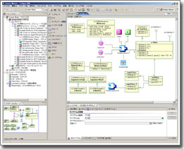

<div align="right"><a href="software_package.png"></a></div>

独立行政法人産業技術総合研究所では、研究所が保有する技術、ノウ・ハウ、ソフトウエア等の技術移転推進しております。
RTミドルウエア関連の技術移転を希望される場合は、下記担当者までご連絡をいただくか、[産総研イノベーション推進本部・知的財産部](https://unit.aist.go.jp/intpro/)へご連絡ください。

## 連絡先

```
 国立研究開発法人産業技術総合研究所
 インダストリアルCPS研究センター ソフトウェアプラットフォーム研究チーム
 安藤 慶昭
 〒305-8568 茨城県つくば市梅園1-1-1 中央第2
 TEL: 029-861-5981 FAX: 029-861-5971
 email: n-ando <at> aist.go.jp
```

## 特許

1. 特許第4910122号
  - 発明の名称：コンポーネント化制御システム
  - 特許権者：東京都千代田区霞が関１－３－１ 独立行政法人産業技術総合研究所
  - 発明者：末廣尚士、北垣高成、神徳徹雄、尹祐根、安藤慶昭
  - 出願番号：特願2004-001562
  - 出願日：平成16年1月7日
  - 登録日：平成24年1月27日

## 技術移転対象ソフトウエア

<table class="table-alt">
  <tr>
    <th>名称</th>
    <th>管理番号</th>
    <th>登録日</th>
  </tr>
  <tr>
    <td colspan="3" style="text-align: center;">OpenRTM-aist-2.0系ソフトウエア</td>
  </tr>
  <tr>
    <td>OpenRTM-aist-2.0</td>
    <td>2023PRO-2940</td>
    <td>2023/04/07</td>
  </tr>
  <tr>
    <td>OpenRTM-aist-Java-2.0</td>
    <td>2023PRO-2944</td>
    <td>2023/04/07</td>
  </tr>
  <tr>
    <td>OpenRTM-aist-Python-2.0</td>
    <td>2023PRO-2951</td>
    <td>2023/04/18</td>
  </tr>
  <tr>
    <td>RTCBuilder 2.0</td>
    <td>2023PRO-2945</td>
    <td>2023/04/07</td>
  </tr>
  <tr>
    <td>RTSystemEditor 2.0</td>
    <td>2023PRO-2946</td>
    <td>2023/04/07</td>
  </tr>
  <tr>
    <td colspan="3" style="text-align: center;">OpenRTM-aist-1.2系ソフトウエア</td>
  </tr>
  <tr>
    <td>OpenRTM-aist-1.2</td>
    <td>2023PRO-2939</td>
    <td>2023/04/07</td>
  </tr>
  <tr>
    <td>OpenRTM-aist-Java-1.2</td>
    <td>2023PRO-2941</td>
    <td>2023/04/07</td>
  </tr>
  <tr>
    <td>OpenRTM-aist-Python-1.2</td>
    <td>2023PRO-2950</td>
    <td>2023/04/18</td>
  </tr>
  <tr>
    <td>RTCBuilder 1.2</td>
    <td>2023PRO-2942</td>
    <td>2023/04/07</td>
  </tr>
  <tr>
    <td>RTSystemEditor 1.2</td>
    <td>2023PRO-2943</td>
    <td>2023/04/07</td>
  </tr>
  <tr>
    <td colspan="3" style="text-align: center;">OpenRTM-aist-1.1系ソフトウエア</td>
  </tr>
  <tr>
    <td>OpenRTM-aist-1.1</td>
    <td>H26PRO-1624</td>
    <td>H26.02.19</td>
  </tr>
  <tr>
    <td>OpenRTM-aist-Java-1.1</td>
    <td>H26PRO-1625</td>
    <td>H26.02.19</td>
  </tr>
  <tr>
    <td>OpenRTM-aist-Python-1.1</td>
    <td>H26PRO-1626</td>
    <td>H26.02.19</td>
  </tr>
  <tr>
    <td>RTCBuilder 1.1</td>
    <td>H26PRO-1627</td>
    <td>H26.02.19</td>
  </tr>
  <tr>
    <td>RTSystemEditor 1.1</td>
    <td>H26PRO-1628</td>
    <td>H26.02.19</td>
  </tr>
  <tr>
    <td>OpenRTM-aist-1.1 C++版テストプログラム</td>
    <td>H29PRO-2127</td>
    <td>H29.10.16</td>
  </tr>
  <tr>
    <td>OpenRTM-aist-1.1 Python版テストプログラム</td>
    <td>H29PRO-2128</td>
    <td>H29.10.16</td>
  </tr>
  <tr>
    <td>OpenRTM-aist-1.1 インストーラ作成プログラム</td>
    <td>H29PRO-2129</td>
    <td>H29.10.16</td>
  </tr>
  <tr>
    <td>rtshell 4.0</td>
    <td>H28PRO-1977</td>
    <td>H28.4.28</td>
  </tr>
  <tr>
    <td colspan="3" style="text-align: center;">OpenRTM-aist-1.0系ソフトウエア</td>
  </tr>
  <tr>
    <td>OpenRTM-aist-1.0</td>
    <td>H22PRO-1089</td>
    <td>H22.02.05</td>
  </tr>
  <tr>
    <td>TOPPERS版OpenRTM-aist-1.0</td>
    <td>H26PRO-1623</td>
    <td>H26.02.19</td>
  </tr>
  <tr>
    <td>OpenRTM-aist-Java-1.0</td>
    <td>H22PRO-1164</td>
    <td>H22.07.13</td>
  </tr>
  <tr>
    <td>OpenRTM-aist-Python-1.0</td>
    <td>H22PRO-1163</td>
    <td>H22.07.13</td>
  </tr>
  <tr>
    <td>RTCBuilder 1.0</td>
    <td>H22PRO-1161</td>
    <td>H22.07.13</td>
  </tr>
  <tr>
    <td>RTSystemEditor 1.0</td>
    <td>H22PRO-1162</td>
    <td>H22.07.13</td>
  </tr>
  <tr>
    <td colspan="3" style="text-align: center;">OpenRTM-aist-0.4系ソフトウエア</td>
  </tr>
  <tr>
    <td>OpenRTM-aist-0.4.0 for Java</td>
    <td>H20PRO-819</td>
    <td>H20.01.31</td>
  </tr>
  <tr>
    <td>RtcTemplate on Eclipse</td>
    <td>H19PRO-696</td>
    <td>H19.05.30</td>
  </tr>
  <tr>
    <td>OpenRTM-aist-0.4.0</td>
    <td>H19PRO-693</td>
    <td>H19.05.09</td>
  </tr>
  <tr>
    <td>RtcLink on Eclipse</td>
    <td>H19PRO-627</td>
    <td>H18.12.18</td>
  </tr>
  <tr>
    <td>RtcLink on Eclipse 0.3.0</td>
    <td>H19PRO-623</td>
    <td>H19.01.26</td>
  </tr>
</table>


### RTMSafety
以下のものは株式会社セックよりRTMSafetyとして販売されています。

<table class="table-alt">
  <tr>
    <th>名称</th>
    <th>管理番号</th>
    <th>登録日</th>
  </tr>
  <tr>
    <td colspan="3" style="text-align: center;">高信頼RTミドルウエア</td>
  </tr>
  <tr>
    <td>Dependable RTM</td>
    <td>H24PRO-1434</td>
    <td>H24.09.14</td>
  </tr>
</table>

### RaspberryPi用拡張基板PiRT-Unit

<table class="table-alt">
  <tr>
    <th>名称</th>
    <th>管理番号</th>
    <th>登録日</th>
  </tr>
  <tr>
    <td>RaspberryPi用拡張基板PiRT-Unit</td>
    <td>H25PRO-1526</td>
    <td>H25.07.01</td>
  </tr>
  <tr>
    <td>XFinder</td>
    <td>H26PRO-1644</td>
    <td>H26.03.07</td>
  </tr>
</table>

## 技術移転例

<div align="right"><a href="https://astah.change-vision.com/ja/"></a></div>
### astah* SysML-RTM連携 

- 移転先:[株式会社チェンジビジョン](https://www.change-vision.com/)
- 製品名:[astah* SysML-RTM連携プラグイン](https://www.sec.co.jp/ja/rd/rtmsafety.html)

astah* SysML-RTM連携プラグインは、株式会社チェンジビジョンのSysMLツール **astah*** を用いてモデリングしたSysMLモデル設計をOpenRTMのRTコンポーネント設計仕様 (RTCProfile) 、システム設計仕様 (RTSProfile)として生成、変換するプラグインです。

SysML内部ブロック図上に存在するパートから RTCプロファイル 、RTSプロファイル を生成し OpenRTM-aist が提供するOpenRTPと連携することで、Robot Technologyコンポーネント(RTコンポーネント)のソースコードのひな形の作成や、ロボットシステムに含まれるコンポーネントとその接続関係の復元を実現します。

- [astah* SysML-RTM連携プラグイン](http://changevision.github.io/sysml4rtm/index.html)

<div align="center"><a href="astah_rtm.png"></a></div>

<br>
<br>

<div align="right"><a href="http://www.sec.co.jp/business/rtmsafety/index.html"></a></div>
### RTMSafety

- 移転先:[株式会社セック](https://www.sec.co.jp/ja/index.html)
- 製品名:[RTMSafety](https://www.sec.co.jp/ja/rd/rtmsafety.html)


RTMSafety（RTMセーフティ）は、ロボットの安全関連系への実装を想定し、機能安全の国際規格であるIEC 61508の認証を取得した世界初のロボット用ミドルウェアです。高い信頼性や安全性が要求されるロボットにおいて、開発コストの低減や、開発期間の短縮に貢献します。 (上記Webページより。)

RTMSafetyはOMG RTC標準のうちLightweightRTC規格を満たすC言語による実装であり、機能安全規格 IEC61508 が定めるソフトウエア開発基準に準拠した信頼性の高い実装です。機能安全規格を満たすためOpenRTM-aistにくらべ機能的な制約があり、またOpenRTM-aistとは直接の互換性はありませんが、ブリッジを用いることにより、安全関連系をRTMSafetyで、非安全関連系をOpenRTM-aistで実装することが可能です。信頼性の要求される複雑なロボットアプリケーションに対して、RTMSafetyによる信頼性の確保と、OpenRTM-aistによる柔軟性の高いシステム構築を両立することが可能です。

<br>
<br>

### Pattern Weaver for RT-Middleware

- 移転先:[株式会社テクノロジックアート](http://www.tech-arts.co.jp/)
- 製品名:[Pattern Weaver for RT-Middleware](http://pw.tech-arts.co.jp/pw/rt_middleware/index.html)

[**Pattern Weaver for RT-Middleware**](http://pw.tech-arts.co.jp/pw/rt_middleware/index.html)は、「RT-Middleware」に対応した初めてのUMLモデリングツールです。
RT-Middleware上で動作するRTコンポーネントの設計及び開発をUMLモデリングツールを用いてシームレスに行うことができます。
UMLモデリングツールPattern Weaver上で作成したRTコンポーネントのモデルからコードを自動生成することができ、RTコンポーネントの開発を強力にサポートします。
その他ロボット構築には最適な機能を満載しています。

<div align="center"><a href="pattern_weaver.jpg"></a></div>
<div align="center"><strong>Pattern Weaver for RTMによるシステム設計のイメージ</strong></div>


### KEK高エネルギー加速器研究機構DAQシステム
- 移転先:[高エネルギー加速器研究機構](https://www.kek.jp/)
- 製品名:[DAQ-Middlewre](https://daqmw.kek.jp/)

DAQ-Middlewareは汎用のネットワーク分散データ収集システムの構築を容易にするソフトウェアフレームワークです。
加速器等の検出器からのデータを収集、解析、可視化システムを柔軟かつ容易に構築するためのコンポーネントおよびツール群が提供されています。

<div align="center"><a href="daq-middleware.png"></a></div>
<div align="center"><strong>DAQ-Middlewareアーキテクチャ</strong></div>

<div align="center"><a href="jparc.png"></a></div>
<div align="center"><strong>J-PARC(大強度陽子加速器施設) </strong></div>


