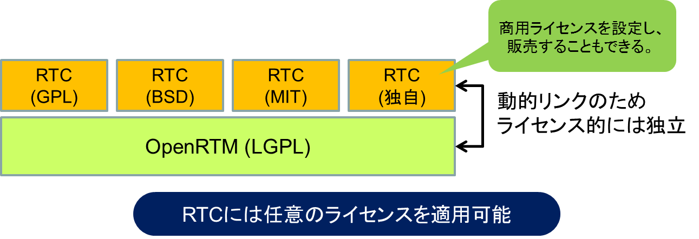
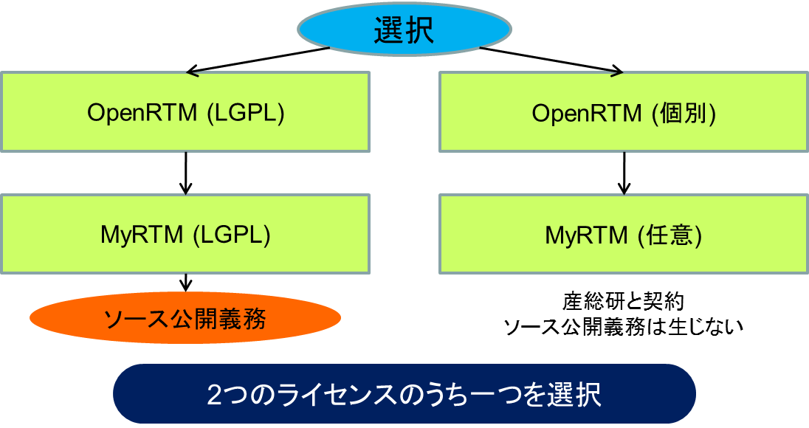

<!-- Title: License -->

OpenRTM-aist consists of middleware libraries for each supported language (C++, Java, and Python) as well as tools such as RTCBuilder and RTSystemEditor.

These components are distributed as open-source software under the following licensing schemes:

- OpenRTM-aist (C++, Java, and Python editions): **Dual-licensed under LGPL and a separate commercial license agreement**
- RTSystemEditor and RTCBuilder: **Dual-licensed under EPL and a separate commercial license agreement**

LGPL (GNU Lesser General Public License) is a copyleft-style free software license proposed by the Free Software Foundation (FSF).

EPL (Eclipse Public License) is one of the free software licenses recognized by the FSF. It is similar in style to CPL (and partly LGPL), while providing a framework that is more suitable for commercial use.

These licenses do not apply to (i) software distributed as separate modules or (ii) software that is not a derivative work of the licensed program. In addition, the EPL includes patent-related provisions, ensuring that patents held by contributors do not restrict the use of the software (users are granted a royalty-free patent license for such use).

For details on the LGPL, please refer to:

- http://www.gnu.org/copyleft/lesser.html

For details on the EPL, please refer to:

- http://opensource.org/licenses/eclipse-1.0.php
- http://sourceforge.jp/projects/opensource/wiki/licenses/Eclipse_Public_License (Japanese translation)

The following sections explain the licenses and restrictions associated with software developed using OpenRTM-aist.

## Development and Distribution of RT Components

The OpenRTM-aist license does not extend to individual RT Components. Therefore, **developers of RT Components may distribute or sell them under any license of their choosing**.

RT Components are dynamically linked with OpenRTM-aist's libRTC.so (or RTC.DLL), and RT Components themselves can also be distributed as shared objects (or dynamic link libraries).

Therefore, RT Components are not regarded as derivative works as defined by the LGPL, and the LGPL does not apply to them.

<strong>Licensing of RT Components</strong>

When developing and distributing RT Components, developers may distribute or sell them under any license and are free to choose whether the source code is open or closed.

## Modification and Redistribution of OpenRTM-aist under the LGPL

When using OpenRTM-aist released by AIST under the LGPL, AIST grants users a license to execute, modify, redistribute, and use OpenRTM-aist free of charge.

However, when redistributing software under the LGPL, the redistributed program must remain consistent with the LGPL. This includes the requirement that modified source code be made available to third parties.

Therefore, if OpenRTM-aist is modified and redistributed or sold under the LGPL, the modified source code must be disclosed.

In embedded systems and similar applications, it is often difficult to deploy software without modifying the source code. In many cases, organizations are reluctant to disclose those modifications. This can be inconvenient for companies seeking to commercialize robotic systems.

To address such situations, OpenRTM-aist is offered under a dual-license model, which also allows licensing through individual agreements as described below.

## Modification and Redistribution of OpenRTM-aist under a Separate License Agreement

In cases such as those described above, where a company wishes to commercialize a robotic system while modifying the source code and keeping it proprietary to protect its technology, a separate license agreement may be used instead of the LGPL or EPL.

When modifying and redistributing OpenRTM-aist, users may consult with AIST's intellectual property division and obtain a non-LGPL/non-EPL license from AIST under an individual agreement.

The licensing fee and scope of the license are determined based on factors such as the intended use, the extent of source code modifications, and the relative contributions of intellectual property from both parties.

However, AIST is a non-profit organization dedicated to promoting industry, and therefore licensing fees are expected to remain reasonable.

<strong>Licensing of RT Middleware</strong>

For RtcLink, RtcTemplate (earlier versions of RTSystemEditor and RTCBuilder), and OpenRTM-aist (Java edition), there have been cases in which licenses were provided through individual agreements for source code disclosure and implementation (use in commercial products).
