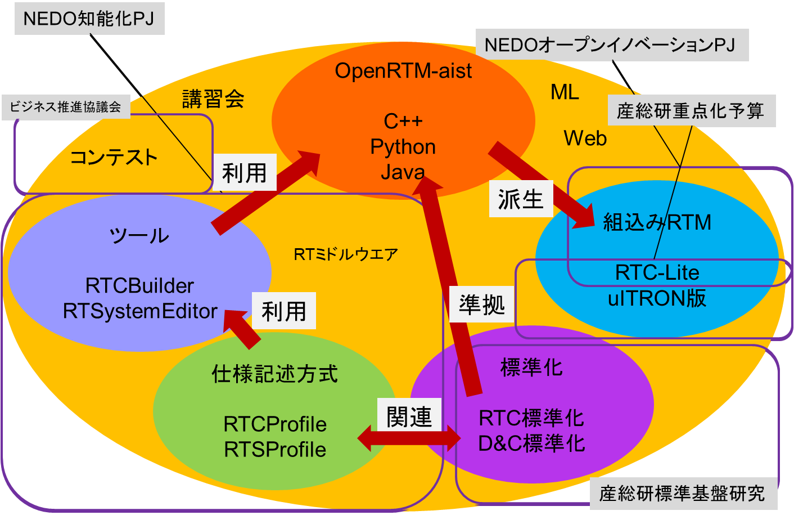
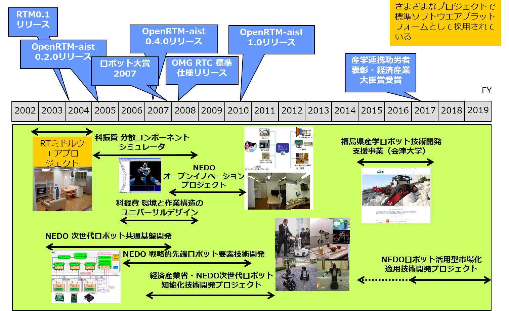
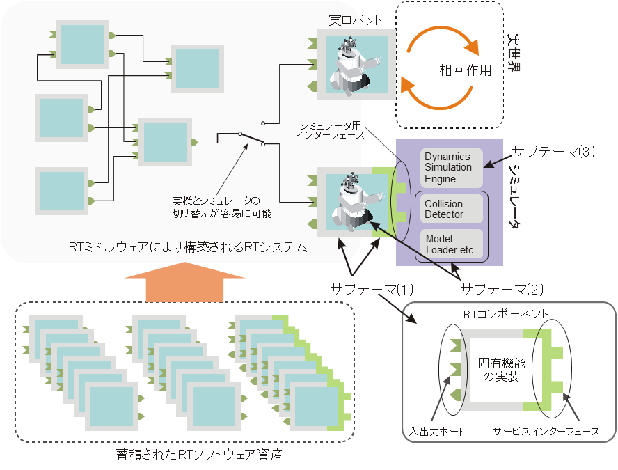
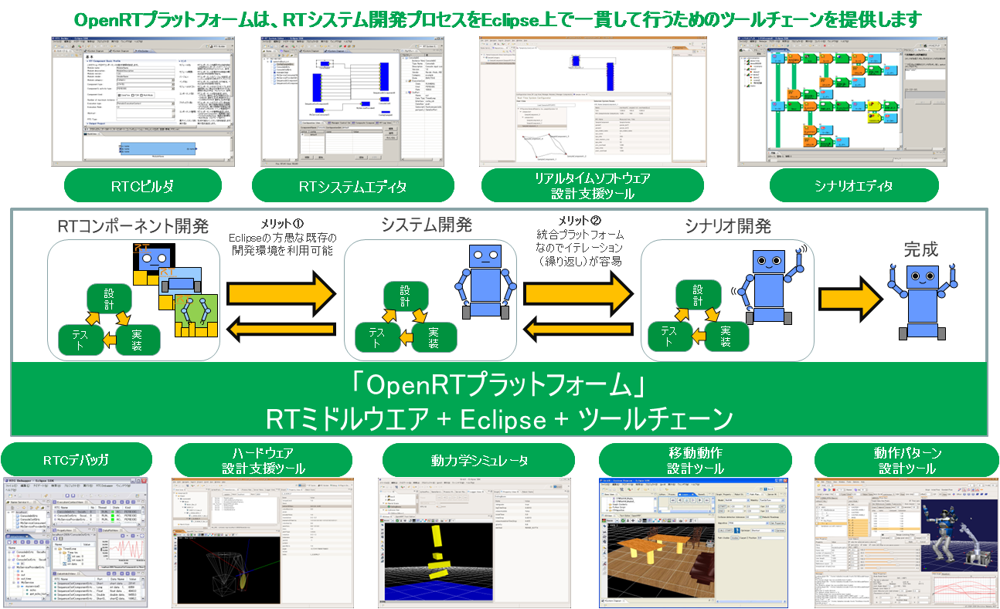

<!-- Title: Research and Development -->
#contents

## Development History

The concept of RT Middleware was first proposed in the 21st Century Robot Challenge Program (FY2002–2004) sponsored by the New Energy and Industrial Technology Development Organization (NEDO). Research, development, and standardization activities were carried out by the National Institute of Advanced Industrial Science and Technology (AIST), Matsushita Electric Works (now Panasonic Electric Works Co., Ltd.), and the Japan Robot Association.

As a result of the project, the RT Middleware reference implementation, OpenRTM-aist-0.2, and its interface specifications were released. Subsequently, the standardization of the RTC interface specification was promoted within the international standards organization OMG (Object Management Group: https://www.omg.org). In April 2008, the specification became an official OMG standard. OpenRTM-aist-1.0, released in January 2010, is one implementation of RT Middleware that conforms to this standard.

The figure below shows the current framework for research, development, and standardization.

<strong>Research, Development, and Standardization Framework for OpenRTM-aist</strong>

Research and development related to RT Middleware began with the RT Middleware Project in 2002 and continued through various projects aimed at enhancing related technologies, culminating in the NEDO Intelligent Robot Project that started in 2007 (see figure below).

<strong>Various Projects Related to OpenRTM-aist</strong>

The following sections provide an overview of the major projects conducted to date.

## RT Middleware Related Projects

### RT Middleware Project

As part of the NEDO 21st Century Robot Challenge Program (FY2002–2004), the "Elemental Technology Development for Realizing Robot Functions" project (commonly known as the RT Middleware Project) was carried out.

This project focused on the research and development of distributed middleware for robots (RT Middleware). As a result, middleware interface specifications were established, and OpenRTM-aist-0.2.0, an implementation based on those specifications, was released.

### Distributed Component-Based Robot Simulator

This project, funded by the Coordination Funds for Promoting Science and Technology from FY2005 to FY2007, aimed to improve the efficiency of next-generation robot development by promoting the reuse of foundational software.

The project developed a distributed component framework suitable for accumulating robot software assets and a robot world simulator built on top of that framework.

<strong>Distributed Component-Based Robot Simulator</strong>

Through this project, OpenHRP3, a robot dynamics simulator developed at AIST, and OpenRTM-aist, which had previously been developed independently, were integrated.

To enable both simulated systems and external controller modules to be developed as RT Components, and to allow controller components to be reused without recompilation for either simulation or real hardware, the Execution Context, which drives RT Component logic, was extended.

### Next-Generation Robot Intelligence Technology Development Project

The "Next-Generation Robot Intelligence Technology Development Project" (FY2007–2011), sponsored by the Ministry of Economy, Trade and Industry (METI) and NEDO, was a large-scale project with a total budget of approximately 7 billion yen over five years.

The objective of the project was to create and accumulate elemental technologies for next-generation robotic systems as RT Components, establish methodologies for designing and implementing next-generation robots through discussions on reuse methods and interface standardization, and build a large collection of practical RT Components.

In addition, a platform for RT system development called the OpenRT Platform (OpenRTP) was built on top of OpenRTM-aist. OpenRTP includes a variety of tools, middleware, and libraries that support different phases of robot system development.

The development tools were implemented as Eclipse plug-ins, forming an integrated tool chain that enables all development tasks to be performed within a single development environment.

<strong>OpenRT Platform (OpenRTP)</strong>

Data exchanged among tools is described using formats based on module specification and system specification description methods built on RT Components (consisting of UML models and XML schemas). This strengthens interoperability among tools and is intended to serve as a basis for future standardization.

As a final outcome of the project, the many RT Components and tools developed were considered for open-source release as well as commercialization.

### Open Innovation Promotion Project

This project, officially named the "Open Innovation Promotion Project Utilizing Fundamental Robot Technologies," was conducted by NEDO for three years beginning in 2008.

The project aimed to develop low-cost, compact communication modules that would make it easier to convert existing hardware components into RT Components.

Using these communication modules, sensors and actuators were installed throughout a residential environment to build a demonstration intelligent home system in which diverse devices cooperated to create a safe, secure, and comfortable living space.

## Other Activities

In addition to formal projects, various activities have been conducted to promote the research, development, and dissemination of OpenRTM-aist.

### Training Courses

Hands-on training courses are held several times a year at various locations.

In particular, a tutorial course is conducted annually as part of the Robotics and Mechatronics Conference organized by the Japan Society of Mechanical Engineers.

### RTM Contest

The RT Middleware Contest is held in conjunction with the SICE System Integration Division Conference and organized by the Robot Business Promotion Council.

The contest invites submissions of RT Middleware and RT Component projects and provides a forum for competition and evaluation of those works.
