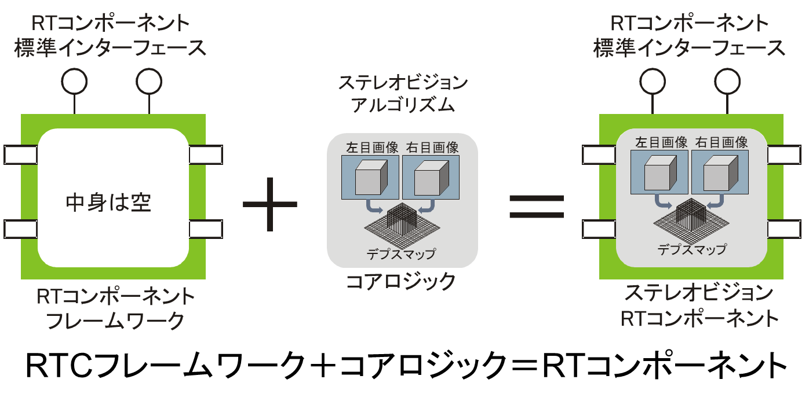
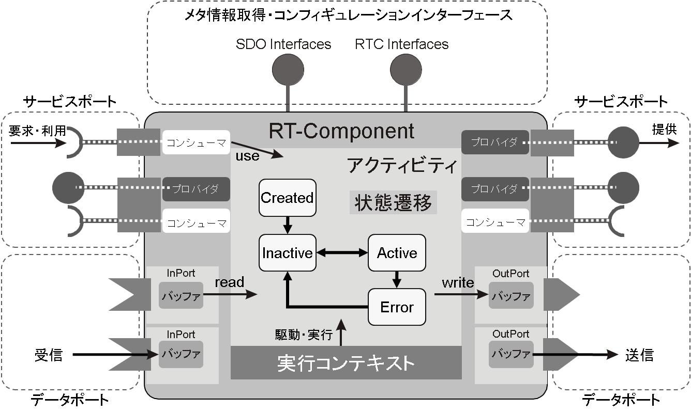
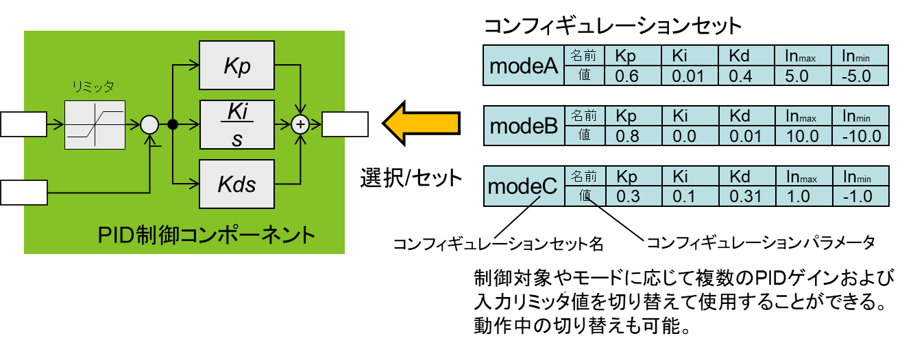
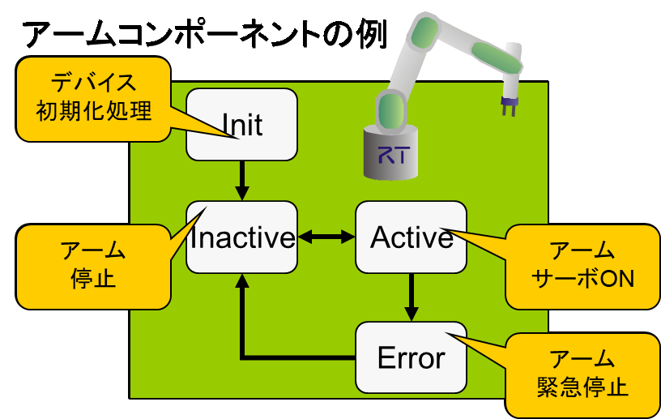
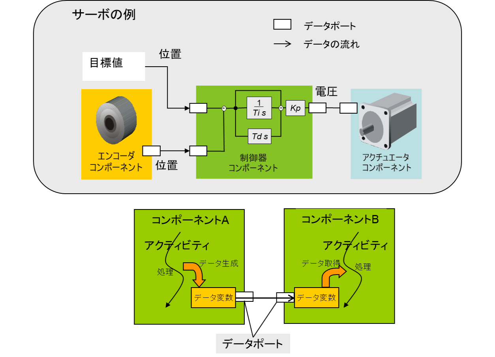
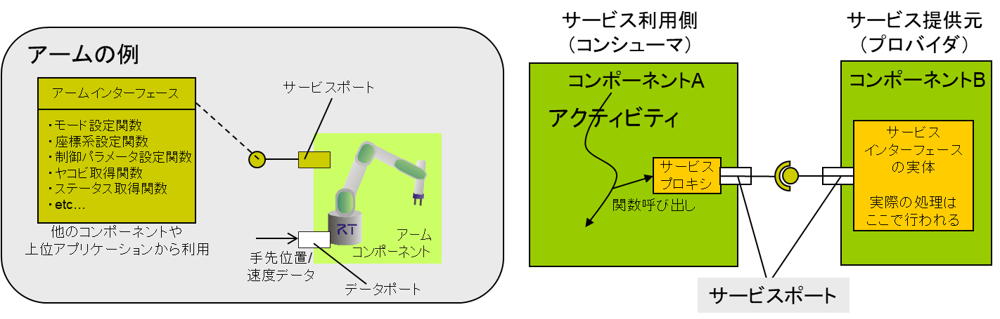
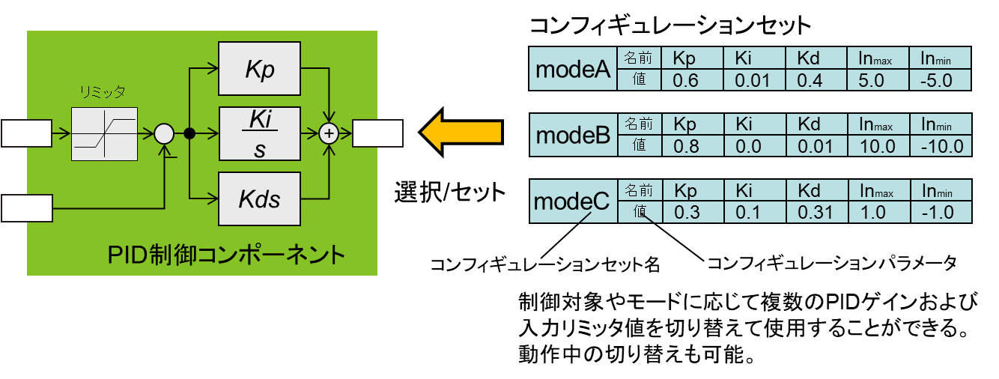

<!-- Title: RT Component Architecture -->
#contents

## RT Component Framework

The RT Component Framework is a framework for creating RT Components.

When modularizing the elements that make up a robotic system, various levels of granularity can be considered. For example, modules may represent single-function devices such as motors and sensors, complex systems such as mobile robots and robot arms, or algorithms that perform various types of processing. Systems are constructed through the hierarchical integration of these modules.

In RT Middleware, the essential software portion of these RT functional elements is referred to as the *core logic*. The RT Component Framework provides a mechanism for uniformly handling these modules by wrapping the core logic with a common interface.

<strong>RT Component Framework and Core Logic</strong>

As shown in the figure above, consider the example of componentizing a stereo vision algorithm. The program implementing the algorithm itself corresponds to the core logic. By implementing the stereo vision algorithm within an RT Component Framework configured with appropriate ports, a stereo vision component can be created.

A module in which a component developer implements core logic based on the component framework and integrates it into a system is called an RT Component.

The RT Component Framework hides the implementation of common interfaces from both component developers and system integrators who build systems by combining components. This allows component developers to focus on implementing the core logic, while integrators can concentrate on overall system design without being concerned with implementation details.

## RT Component Architecture

RT systems must coordinate processing at various levels, ranging from low-level sensor processing and actuator control to high-level perception, decision making, and behavior control.

Low-level control programs require programming languages capable of meeting performance and real-time requirements, while high-level programs benefit from languages that provide higher abstraction and expressiveness.

In addition, modern RT systems are increasingly composed of multiple CPUs, requiring support for parallel execution and network-based cooperation.

To modularize these functional elements, RT Components provide a distributed component framework that supports modularization at various levels of granularity and can operate across different programming languages and operating systems.

The figure below illustrates the basic architecture of an RTC. The main functions of an RTC are described below.

<strong>RT Component Architecture</strong>

### Metadata Acquisition

RTCs provide an interface for acquiring metadata (RTC Profiles), referred to as an introspection function.

An RTC Profile is a collection of information describing the characteristics of a component, such as the component name and the profiles of its ports.

This capability is essential when dynamically configuring systems at runtime.

> Introspection: A mechanism for obtaining metadata about objects or components. Although definitions vary, it is similar to Java Reflection. In the OMG RTC specification, this capability is defined as *introspection*.

<strong>Metadata Acquisition</strong>

### Activity

An Activity is the mechanism that executes the primary logic within a component.

For unified RTC management, common states such as Inactive (OFF), Active (ON), and Error are defined.

RTC developers create RTCs primarily by implementing desired functionality in functions (callback functions) assigned to each state and state-transition event.

<strong>Activity and Execution Context</strong>

### Execution Context

The callback functions that make up an Activity are executed by a thread called an Execution Context (EC).

ECs can be dynamically attached to or detached from RTCs. A single EC may be attached to multiple RTCs and execute them synchronously in sequence.

It is also possible to replace an EC with a real-time-capable EC, enabling real-time execution of RTCs.

### Data Ports

Data-oriented ports used for continuous data transmission and reception.

There are two types of Data Ports:

- Input Ports (InPort)
- Output Ports (OutPort)

As long as the data types are compatible, components can be connected and communicate over a network regardless of differences in programming language or operating system.

<strong>Data Ports</strong>

### Service Ports

Ports used to provide and consume command-level functionality.

Service Ports support user-defined Providers (Provided Interfaces) and Consumers (Required Interfaces).

- A **Provided Interface** exposes functionality to external components.
- A **Required Interface** requests and uses functionality provided by external components.

Like Data Ports, Service Ports can connect and invoke functions across different languages and operating systems as long as the interface types are compatible.

<strong>Service Ports</strong>

### Configuration

A mechanism that allows user-defined parameters to be modified externally at runtime.

Configurations can contain multiple parameter sets, which can be switched collectively.

By making parameters configurable in advance, RTCs can be reused in a variety of systems.

<strong>Configuration</strong>

In general, the lower levels of RT systems consist primarily of fine-grained, data-oriented, tightly coupled subsystems such as servo controllers. In contrast, higher-level layers responsible for decision making and behavior control are typically composed of coarse-grained, service-oriented subsystems.

Because RTCs provide a common framework that supports modularization at a wide range of granularities, the inter-layer coupling issues commonly found in hierarchical frameworks are avoided.

Transparent cooperation among RTCs running on different programming languages and operating systems is achieved through CORBA (Common Object Request Broker Architecture), the standard distributed object middleware specification.
