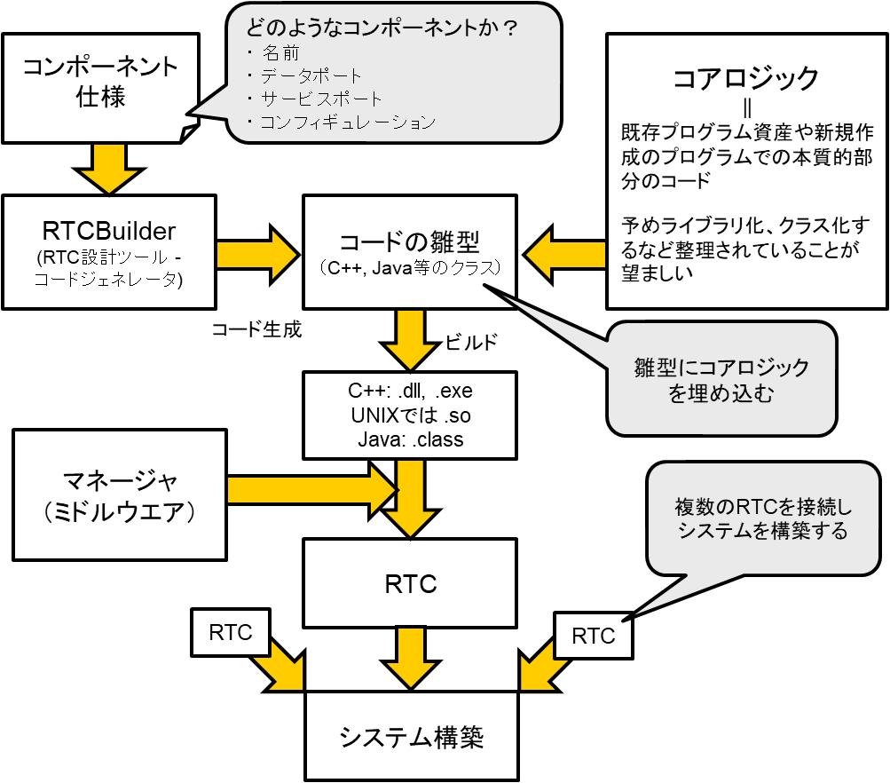
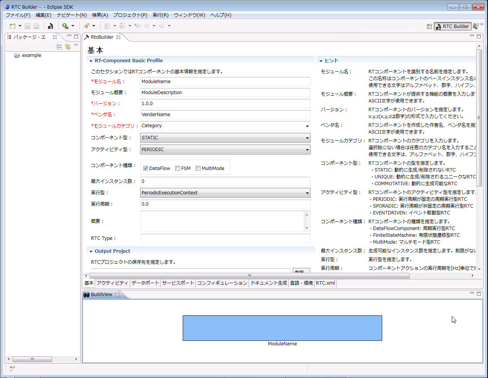
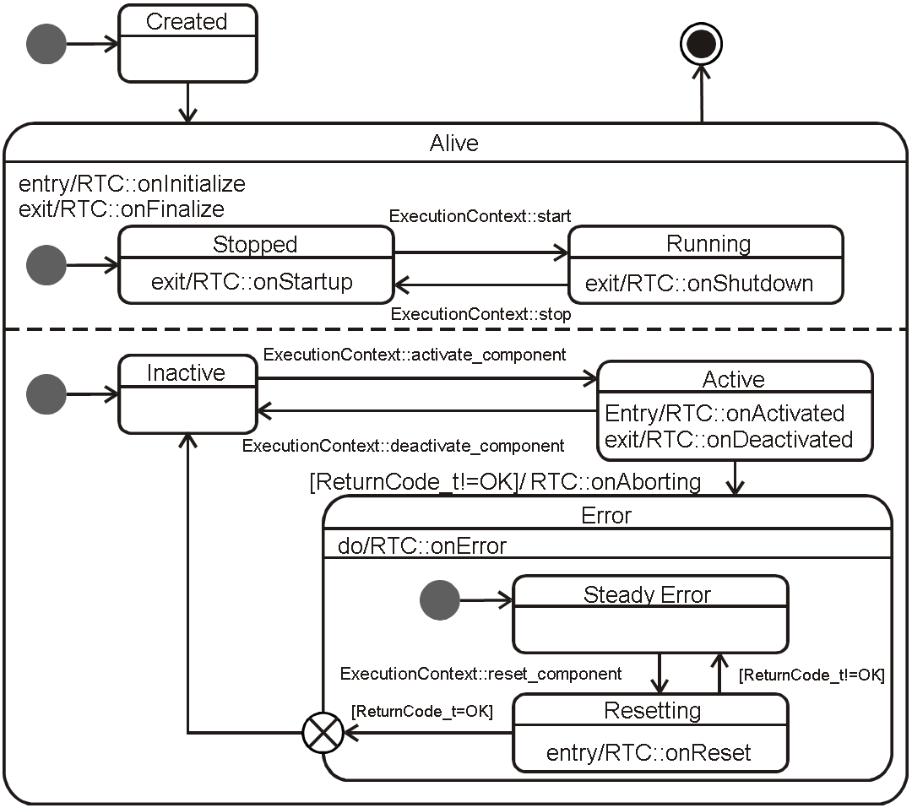

<!-- Title: RTC Development Process -->
#contents

This section explains how to develop RT Components using RT Middleware (OpenRTM-aist).

## Development Process

OpenRTM-aist consists of a framework for componentization and middleware for managing and executing components.

OpenRTM-aist provides a framework that enables users who wish to develop components (component developers) to easily convert their existing software assets, or newly created software, into RTCs. The overall process for creating an RTC is shown in the figure below.

<div align="center"><a href="rtc_devel_flow_ja.png"></a></div>
<div align="center"><strong>RTC and RT System Development Process</strong></div>

As described above, code related to the common interfaces provided by RT Components, as well as processing for exchanging data with other components, is hidden by the RT Component Framework. Since these functions are common to all components, many parts can be implemented as libraries or generated automatically.

OpenRTM-aist provides RTCBuilder as a tool for generating RTC skeleton code.

RTC developers create RT Components by integrating their existing programs into the component framework and then build robotic systems by combining multiple RTCs. Once existing software assets have been converted into RT Components, they can be reused easily in a variety of applications. Created RTCs can also be deployed on nodes across a network and used from arbitrary remote nodes.

RTCs developed according to the RTC framework generally take one of two forms:

- Standalone RT Components
- Loadable Module RT Components

A Standalone RTC is a single executable binary. A Loadable Module RTC is a dynamically loadable binary file and is typically used when multiple types of RTCs are executed simultaneously within a single process.

## Generating Skeleton Code with RTCBuilder

RTCBuilder is a development tool that automatically generates RT Component skeleton code.

Using this tool, developers can generate most of the code other than the core logic by entering information such as the RTC's basic profile, data ports, service ports, and configuration parameters.

The supported programming languages are:

- C++
- Java
- Python
- Lua

Before creating a component, the following information should generally be determined:

- Profile (name, category, version, etc.)
- Data Ports (InPort/OutPort, port name, data type)
- Service Ports (port name, service interface)
- Configuration (variable names and types)

From the Eclipse menu, select **[File] > [New] > [Other...]** to open the dialog. In the displayed tree, select **[Other] > [RTCBuilder]**, then click **[Next]**. Enter the project name and click **[Finish]**.

The screen shown below will appear, containing the following tabs:

- Basic
- Activity
- Data Ports
- Service Ports
- Configuration
- Document Generation
- Language & Environment
- RTC.xml

Fill in the required information on each tab from **Basic** through **Language & Environment**. Finally, click the **[Generate Code]** button on the **Basic** tab to generate the skeleton code.

The generated code will be created in the project folder within the workspace specified when Eclipse was launched.

<div align="center"><a href="rtcbuilder_ja.png"></a></div>
<div align="center"><strong>RTCBuilder Development Screen</strong></div>

## RTC Implementation

Programming an RT Component differs from ordinary programming in that processing is not implemented directly in the `main()` function.

The following example describes implementation using the C++ version.

An RT Component is implemented as a class that inherits from a specific base class. The core logic of the RT Component is written by overriding member functions (methods) of that base class.

For example:

- Processing performed during initialization is implemented in the **onInitialize()** function.
- Processing executed periodically while the RTC is active is implemented in the **onExecute()** function.

```cpp
class MyComponent
  : public DataflowComponentBase
{
public:
  // Processing to be executed during initialization
  virtual ReturnCode_t onInitialize()
  {
    if (mylogic.init())
      return RTC::RTC_OK;
    return RTC::RTC_ERROR;
  }

  // Processing to be executed periodically
  virtual ReturnCode_t onExecute(RTC::UniqueId ec_id)
  {
    if (mylogic.do_someting())
      return RTC::RTC_OK;
    RTC::RTC_ERROR;
  }

private:
  MyLogic mylogic;

  // Port declarations, etc.
  // ...
};
````

The above example shows a C++ implementation.

For simplicity, the class declaration and implementation are shown together. In practice, RTCBuilder generates separate header (`.h`) and implementation (`.cpp`) files.

The `mylogic` object of type `MyLogic` is an instance of the class that implements the actual core logic of the component.

In this example, the RTC is implemented simply by calling methods of `mylogic`. In real implementations, it is recommended to encapsulate the core logic in reusable classes beforehand and keep the callback functions as lightweight as possible.

By compiling and building this code using the Makefile or project files generated by RTCBuilder, executable files or shared libraries (DLLs) can be created.

## RTC Lifecycle

As described above, RTCs are implemented by writing processing logic in predefined functions (callback functions).

To understand which functions exist and when they are called, it is necessary to understand the RTC lifecycle and state transitions.

The figure below shows the RTC state transition diagram.

<div align="center"><a href="rtc_state_machine_ja.png"></a></div>
<div align="center"><strong>RTC Lifecycle (UML State Machine Diagram)</strong></div>

An RTC generally has the following states:

* Created
* Alive

  * Inactive
  * Active
  * Error
* Finalized

For each state and state transition, predefined callback functions are invoked by the Execution Context (EC).

The following table lists the callback functions and the timing at which they are called.

<table class="table-alt">
  <tr>
    <th>Function Name</th>
    <th>Description</th>
  </tr>
  <tr>
    <td>onInitialize</td>
    <td>Called only once when the lifecycle is initialized.</td>
  </tr>
  <tr>
    <td>onActivated</td>
    <td>Called once when the RTC is activated.</td>
  </tr>
  <tr>
    <td>onDeactivated</td>
    <td>Called once when the RTC is deactivated.</td>
  </tr>
  <tr>
    <td>onExecute</td>
    <td>Called periodically while the RTC is in the Active state.</td>
  </tr>
  <tr>
    <td>onStateUpdate</td>
    <td>Called after each execution of onExecute.</td>
  </tr>
  <tr>
    <td>onAborting</td>
    <td>Called once when transitioning to the Error state.</td>
  </tr>
  <tr>
    <td>onError</td>
    <td>Called periodically while the RTC is in the Error state.</td>
  </tr>
  <tr>
    <td>onReset</td>
    <td>Called once when recovering from the Error state.</td>
  </tr>
  <tr>
    <td>onShutdown</td>
    <td>Called once when EC execution stops.</td>
  </tr>
  <tr>
    <td>onStartup</td>
    <td>Called once when EC execution starts.</td>
  </tr>
  <tr>
    <td>onFinalize</td>
    <td>Called only once when the lifecycle terminates.</td>
  </tr>
</table>
