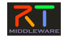

-------jp page!!-------
<!-- Title: OpenRTM-aistとは？ -->

OpenRTM-aistはロボットシステムをコンポーネント指向開発するためのソフトウエアプラットフォームです。
<!--break-->
OpenRTM-aistでは、ロボットシステムを作る際に、機能要素ごとにソフトウエア ― RTコンポーネント(RTCと呼ぶ)を作成し、それらをつなぎ合わせることでシステムを構築します。RTコンポーネントは、**C++**、**Python**、**Java**言語で開発することができ、主要なOS (Linux/Unix、Windows、Mac OS X)をサポートしています。
コンポーネント開発や、コンポーネントを利用したシステム開発には、**Eclipse**ツールおよび、コマンドラインのツールを利用できます。

RTコンポーネントは、コンポーネント間でデータやコマンドのやり取りをするためのポートと呼ばれる機能や、振る舞いを統一するためのアクティビティと呼ばれる基本的な状態遷移および、パラメーターを外部から操作可能なコンフィギュレーションといった機能が備わっています。
これらの機能を利用することで、独立性や再利用性の高いモジュールを容易に作成できます。既存のコンポーネントを利用することで、最小限のプログラミングでシステムを構築できます。

OpenRTM-aistは、ネットワーク透過性、OSやプログラミング言語に対する非依存性を重視して分散オブジェクト規格CORBAを用いて実装されています。現在のところ、OpenRTM-aistはC++、Python、およびJava言語での実装が提供されています。

- [RTミドルウエア]({{ site.baseurl }}/ja/doc/aboutopenrtm/rtmiddleware/)
- [ライセンス]({{ site.baseurl }}/ja/doc/aboutopenrtm/license/)
- [OpenRTM-aist 諸元]({{ site.baseurl }}/ja/doc/aboutopenrtm/specification/)
- [RTコンポーネントアーキテクチャ]({{ site.baseurl }}/ja/doc/aboutopenrtm/rtc_architecture)
- [RTC開発の流れ]({{ site.baseurl }}/ja/doc/aboutopenrtm/rtc_developmentflow/)
- [RTシステム開発の流れ]({{ site.baseurl }}/ja/doc/aboutopenrtm/rts_developmentflow/)
- [研究開発]({{ site.baseurl }}/ja/doc/aboutopenrtm/researchanddevel/)

-------jp page!!-------
