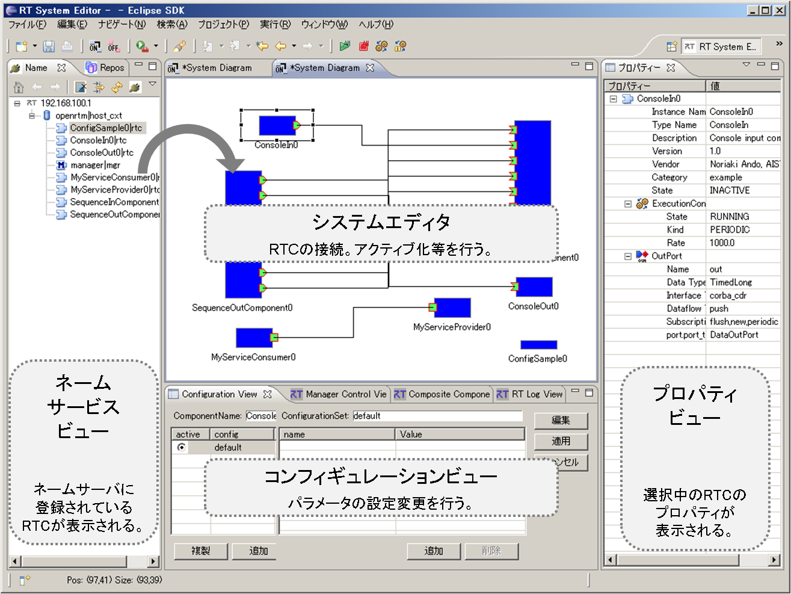

<!-- Title: RT System Development Process -->
#contents

This section explains how to construct a system by combining multiple RTCs.

## Naming Service

Distributed object middleware provides transparent access to objects located on arbitrary computers through proxy objects that hold references to those objects.

In CORBA, such references are called IORs (Interoperable Object References). An IOR contains encoded information such as the network address and port number of the computer on which the object resides, as well as an object-specific key.

One way to make an object's IOR available to programs running on other computers is to register the IOR on a server accessible through the network. The service used to register and retrieve these references is called the **Naming Service**.

The Naming Service is one of the standard services defined by CORBA, and in OpenRTM-aist it is provided through the wrapper command **rtm-naming**.

Before starting an RT system, it is necessary to start a Naming Server to which RTCs will be registered. In addition, each RTC must know the location of the Naming Server in advance. This information is specified in the configuration file **rtc.conf**.

For example, if the Naming Server is running on a host named **openrtm.mydomain.net**, the following entry must be added to the `rtc.conf` file used by all RTCs:

```text
corba.nameservers: openrtm.mydomain.net
````

A Naming Server may also be specified using an IP address. Multiple Naming Servers can be specified simultaneously by separating them with commas (`,`), allowing RTCs to be registered with multiple servers at the same time.

Since Naming Servers are typically long-running and remain fixed within a system, it is usually unnecessary to modify the configuration file frequently.

## Building Systems with RTSystemEditor

A system operates by running multiple RTCs, connecting their ports, and activating them.

RTSystemEditor is provided as a tool for connecting RTCs, sending activation and deactivation commands, and starting the system.

<div align="center"><a href="rtse_ja.png"></a></div>
<div align="center"><strong>System Construction Using RTSystemEditor</strong></div>

Once an RTC is started and loaded into memory, it appears in the Name Service View on the left side of the screen.

By dragging and dropping an RTC from the Name Service View into the editor area in the center, the RTC is displayed as an icon within the System Editor.

The protrusions on the edges of the rectangular RTC icon represent ports. A system is constructed by connecting these ports between RTCs.

In addition, the Configuration View is displayed in the lower center of the screen. This view allows users to edit the parameters of any RTC.

After constructing a system, all RTCs can be activated by right-clicking within the editor and selecting **"All Activate"**.

System configuration information can also be saved by right-clicking within the editor and selecting **"Save as"**.

The saved system configuration can later be reloaded to restore connection information, configuration settings, and other system-related information.

At present, RTCs must already be started and loaded into memory before a saved system configuration can be restored. However, future versions are expected to automate the entire process, from launching RTCs to restoring system connections.


