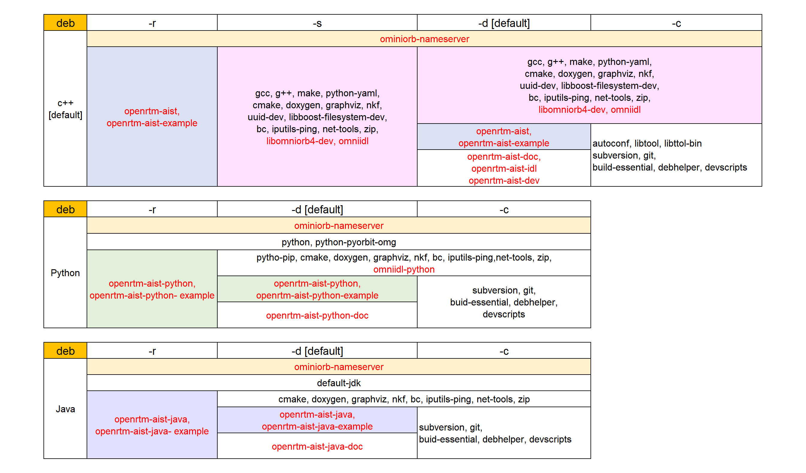
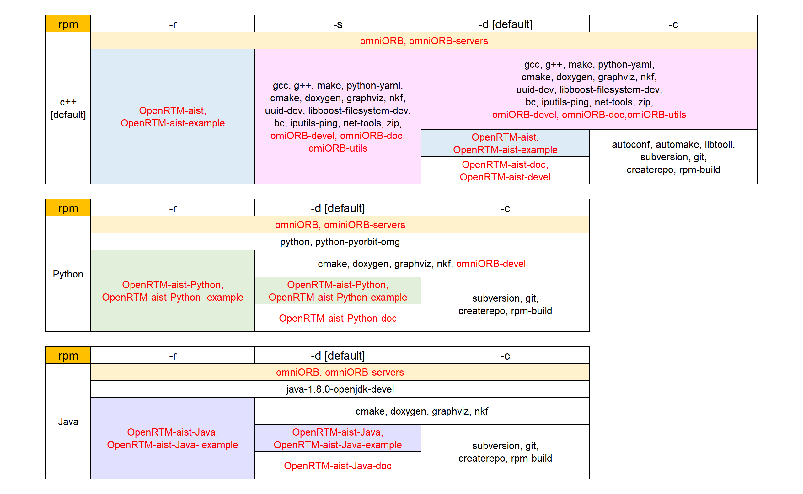

-------jp page!!-------

<!-- Title: 一括インストールスクリプト -->
<!-- #contents(5) -->


## 一括インストールスクリプト入手先

openrtm.orgが提供するインストール・スクリプトの入手先です。以下のリンクを右クリックして[リンクのURLのコピー] （Firefoxの場合）を選び、URLを入手してwget等のコマンドでダウンロードするか(下記にはその方法を示しています)、[名前を付けてリンク先を保存]（Firefoxの場合）を選んでダウンロードしてください。ダウンロードしたスクリプトはroot権限で実行してください。これらのスクリプトでは、必要なパッケージを順次apt-getを用いてインストールしていきます。

- [Ubuntu用一括インストールスクリプト](https://raw.githubusercontent.com/OpenRTM/OpenRTM-aist/master/scripts/pkg_install_ubuntu.sh)
- [Debian用一括インストールスクリプト](https://raw.githubusercontent.com/OpenRTM/OpenRTM-aist/master/scripts/pkg_install_debian.sh)
- [Raspbian用一括インストールスクリプト](https://raw.githubusercontent.com/OpenRTM/OpenRTM-aist/master/scripts/pkg_install_raspbian.sh)
- [Fedora用一括インストールスクリプト](https://raw.githubusercontent.com/OpenRTM/OpenRTM-aist/master/scripts/pkg_install_fedora.sh)

このスクリプトはオプションを指定することで、目的に合わせたパッケージをインストールで可能です。

ただし、このスクリプトはOpenRTM-aist関係のすべてのパッケージをインストールするので、不必要なパッケージもインストールされる可能性があります。
詳しく理解している場合は、手動でインストールすることも可能です。

<span style="color:red;">※UbuntuとRaspbian用スクリプトはバージョン番号を確認してください。</span>;

Python3に対応した OpenRTM-aist 1.2.2 をインストールする場合は、対応するスクリプトを使う必要があるので、バージョン番号を確認して下さい。
バージョン番号は次のようにして確認できます。バージョン番号が取得できない場合は古いスクリプトです。

Ubuntu用は2.0.0.05以上、Raspbian用は2.0.0.03以上が必要です。

```
 $ sh pkg_install_ubuntu.sh --version
 2.0.0.05
```

```
 $ sh pkg_install_raspbian.sh --version
 2.0.0.03
```

## pkg_install_{ubuntu?debian?raspbian}.shスクリプト

<!-- pkg_install_{ubuntu|debian|raspbian}.sh-->

使えるオプションは同じですが、pkg_install_raspbian.shではopenrtpインストールの対応はありません。従って-lオプションの引数としてopenrtpは使用できません。
<span style="color:red;">※-tオプションはubuntuとraspbianのみ対応しています。</span>;

### オプション一覧
```
  Usage:
    pkg_install_ubuntu.sh -l {all|c++} [-r|-d|-s|-c] [-t OpenRTM-aist old version number] [-u|--yes]
    pkg_install_ubuntu.sh [-u|--yes]
    pkg_install_ubuntu.sh -l {python} [-r|-d|-c] [-t OpenRTM-aist old version number] [-u|--yes]
    pkg_install_ubuntu.sh -l {java} [-r|-d|-c] [-u|--yes]
    pkg_install_ubuntu.sh -l {openrtp|rtshell} [-d] [-u|--yes]
    pkg_install_ubuntu.sh  {--help|-h|--version}
 
  Example:
    pkg_install_ubuntu.sh  [= pkg_install_ubuntu.sh -l all -d]
    pkg_install_ubuntu.sh -l all -d  
    pkg_install_ubuntu.sh -l c++ -c --yes
    pkg_install_ubuntu.sh -l all -u
   
  Options:
    -l <argument>  language or tool {c++|python|java|openrtp|rtshell|all}
       all        install packages of all the supported languages and tools
    -r             install robot component runtime
    -d             install for robot component developer [default]
    -t <argument>  OpenRTM-aist old version number
    -s             install tool packages for building from the source code
    -c             install tool packages for core developer
    -u             uninstall packages
    --yes          force yes 
    --help, -h     print this
    --version      print the version number
```

ここで-l allは全ての対応可能な言語、ツール用のパッケージがインストールされることを指定するものです。

オプションを指定することで、以下に示されるパッケージがインストールされます。

### インストールされるdebパッケージ一覧

赤字は-u(アンインストール)指定時にアンインストールされるパッケージです。

<span style="color:red;">※OpenRTM-aist 1.2.2 以降はPythonバージョンを2系から3系へ変更しましたので、インストールされるパッケージは下記となります。</span>;

omniidl-python3 openrtm-aist-python3 openrtm-aist-python3-example openrtm-aist-python3-doc


<div align="center"><a href="deb-list.png"></a></div>


## pkg_install_fedora.sh

<!-- pkg_install_fedora.shは次のパッケージに対応していません。 -->

<!-- - OpenRTM-aist-1.1.2-RELEASE -->
<!-- - rtshell -->


### オプション一覧

```
  Usage:
    pkg_install_fedora.sh -l {all|c++} [-r|-d|-s|-c] [-u|--yes]
    pkg_install_fedora.sh [-u|--yes]
    pkg_install_fedora.sh -l {python|java} [-r|-d|-c] [-u|--yes]
    pkg_install_fedora.sh -l {openrtp|rtshell} [-d] [-u|--yes]
    pkg_install_fedroa.sh  {--help|-h|--version}
 
  Example:
    pkg_install_fedora.sh  [= pkg_install_fedora.sh -l all -d]
    pkg_install_fedora.sh -l all -d  
    pkg_install_fedora.sh -l python -c --yes
 
  Options:
    -l <argument>  language or tool {c++|python|java|openrtp|rtshell|all}
        all:       install packages for all the supported languages and tools
    -r             install robot component runtime
    -d             install for robot component developer [default]
    -s             install tool packages for building from the source code
    -c             install tool packages for core developer
    -u             uninstall packages
    --yes          force yes
    --help, -h     print this
    --version      print the version number
```

### インストールされるrpmパッケージ一覧

赤字は-u指定時にアンインストールされるパッケージです。
<div align="center"><a href="rpm-list.png"></a></div>

## 一括インストールスクリプトを使う方法

以下、一括インストールスクリプトを使用したダウンロードとインストール方法です。（"ubuntu"の文字はそれぞれインストールされるディストリビューションに合わせて"debian"や"raspbian"、"fedora"としてください。)

お使いの環境に合わせた一括インストールスクリプトを次のコマンドでダウンロードします。
```
 $ wget <pkg_install_ubuntu.shのダウンロードURL>
```


#### C++版をインストールする

初めてC++版をインストールする方への推奨入力例です。オプション"-l"だけを追加することで目的の言語を指定し、他のオプションは指定せずに(ないしは-dオプションを指定して)、デフォルトインストール実行します。
```
 $ sudo sh ./pkg_install_ubuntu.sh -l c++
 //途中、いくつかの質問をたずねられるので、''y''あるいは''Y''を入力しながら完了させる。
```

#### Python版をインストールする("Y"の入力を省略する)
初めてPython版をインストールする方への推奨入力例です。オプション"--yes"を追加することで、インストールを確認する質問と"Y"の入力を省略できます。他のオプションは指定されてないので、-dオプションを指定したのと同じものがインストールされます。
```
 $ sudo sh ./pkg_install_ubuntu.sh -l python --yes
```

#### C++版とPython版とコア開発(OpenRTM-aist自体の開発)に必要なパッケージをインストールする
オプション"-c"を追加することでコア開発に必要なパッケージをインストールし、オプション"--yes"で"Y"の入力を省略します。
```
 $ sudo sh ./pkg_install_ubuntu.sh -l c++ -l python -c --yes
```

#### C++版をアンインストールする
オプション"-u"を追加することで、C++版をアンインストールします。

アンインストールされるパッケージは、[インストールされるdebパッケージ一覧](#インストールされるdebパッケージ一覧) 、[インストールされるrpmパッケージ一覧](#インストールされるrpmパッケージ一覧)を確認ください。
```
 $ sudo ./pkg_install_ubuntu.sh -l c++ -u
```

#### 旧バージョン（1.2.1）をインストールする
OpenRTM-aist の最新バージョンが1.2.2の場合、オプション"-t"で1.2.1バージョンをインストールします。対象はc++とpythonのみです。　すでに1.2.2がインストールされている環境で実行した場合は1.2.1へダウングレードされます。
```
 $ sudo ./pkg_install_ubuntu.sh -l c++ -t 1.2.1
 $ sudo ./pkg_install_ubuntu.sh -l python -t 1.2.1
```

-------jp page!!-------
