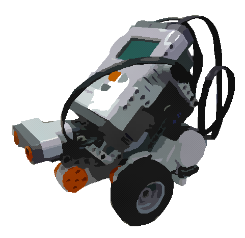

init
<!-- Title: Case Studies -->

- [Developing Image Processing Components](./opencv_comp_development)
  - [Windows 8.1, OpenRTM-aist-1.1.2, OpenRTP-1.1.2, CMake-3.5.2, VS2015](./opencv_comp_development/opencv_win81_vs2015)
  - [Windows 10, OpenRTM-aist-1.2.2, OpenRTP-1.2.2, CMake-3.18.1, VS2019](./opencv_comp_development/opencv_win10_vs2019)
  - [Ubuntu 16.04, OpenRTM-aist-1.1.2-RELEASE, OpenRTP-1.1.2, CMake-3.5.1, Code::Blocks-16.01](./opencv_comp_development/opencv_ubuntu_1604)

- [RT Component Development](./rtc_development)
  - [Components Using Chainer (1): Verifying Inference Results](./rtc_development/node/6388)
  - [Components Using Chainer (2): Data Collection and Storage](./rtc_development/node/6389)
  - [Fundamentals of RT Component Development](./rtc_development/rtc_development_basic)
  - [OpenCV Edition: Using the CameraImage Data Type](./rtc_development/opencv_camera_image_type_use)
  - [Visual C++ Edition](./rtc_development/rtc_development_vcpp)
  - [Java Edition](./rtc_development/rtc_development_java)
  - [OpenCV Edition for RTCB-RC1](./rtc_development/rtc_development_opencv_rtcb-rc1)
  - [NXTway Edition](./rtc_development/rtc_development_nxtway)
  - [LEGO Mindstorms Edition](./rtc_development_lego_mindstorm)
  - [RT Component Development (Raspberry Pi)]({{ site.baseurl }}/ja/doc/installation/other/raspberrypi_casestudy)
  - [Cross Development of RT Components (Armadillo240)]({{ site.baseurl }}/ja/doc/old_documents/armadillo240)

- [Integrating GUI Toolkits with RTCs](./guitool_and_rtc)
- [LEGO Mindstorms EV3 Use Cases](./lego_mindstorm)
- [Controlling Choreonoid with Leap Motion](./leapmotion_choreonoid)
- [RTM Network Configuration Using VPN](./vpn_setup_for_rtmnetwork)
- [Raspberry Pi Mouse Use Cases](./raspberrypi_mouse)
- [Processing Use Cases](./processing)
