-------jp page!!-------

<!-- Title: LeapMotion で Choreonoid の制御 -->
#contents

このケーススタディでは、LeapMotion センサーを利用して Choreonoid シミュレーターで機動中の GRobo を制御します。まずは準備されたコンポーネント（デモシステム及びサンプルコンポーネント）で動作確認をします。それから、自作コンポーネントでシミュレーター上のロボットを制御します。
<!--break-->
## リソースと事前準備

以下のアーカイブをダウンロードし解凍してください。

[robomec2015_openrtm_tutorial_part3.zip](http://openrtm.org/pub/OpenRTM-aist/ROBOMEC2015/part3_0/robomec2015_openrtm_tutorial_part3.zip) <span style="color:red;">2015/05/20更新</span>;

アーカイブの内容にある主なるファイルは以下のとおりです。

- **Demo/**: デモシステムのコンポーネント及び Choreonoid
  - **rtc_handle.bat**: デモシステムを機動するためのバッチファイル
- **src/**: 準備されたコンポーネントのソース
  - **LeapMotion_RobotControl_Sample**: サンプルコンポーネントのソース
- **LeapMotionGRoboControlSampleComp.exe**: サンプルコンポーネントのバイナリー（x64、Visual Studio 2013用）
- **online_tutorial/**：この Webページ

<span style="color:red;">【必須】</span>;以下のページから「Windows Download」をクリックして、LeapMotion のドライバーをダウンロードしてインストールしてください。

https://www.leapmotion.com/setup/windows

## デモシステム動作確認

ここでは、デモシステムを機動し動作を確認します。以下の手順にしたがってデモシステムを起動させてください。

1. スタートメニューの「Start Naming Service」でネームサーバーを機動する（[OpenRTMのドキュメント](http://openrtm.org/openrtm/ja/content/openrtm-aist%E3%82%9210%E5%88%86%E3%81%A7%E5%A7%8B%E3%82%81%E3%82%88%E3%81%86%EF%BC%81#toc2)に参照してください）
1. スタートメニューから「RTSystemEditorRCP」または「OpenRTP 1.1.1」を起動する
1. Demo/rtc_handle.batを実行してデモシステムのランチャーを起動する
<div align="center"><a href="start_launcher.png">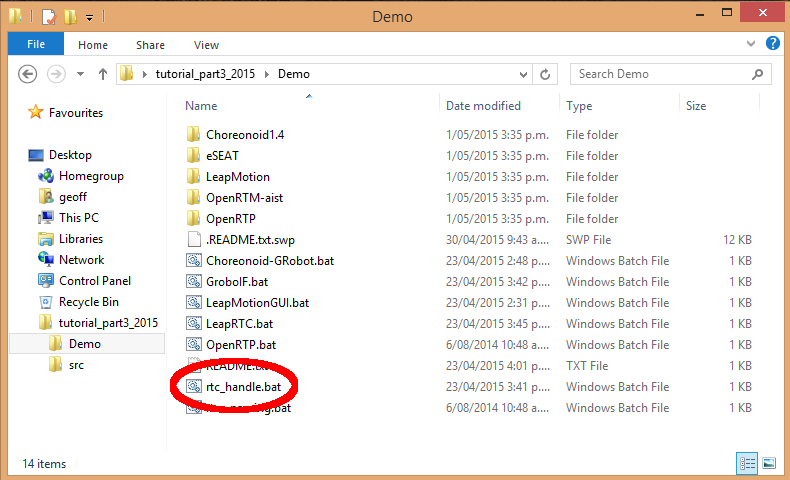</a></div>
<div align="center"><a href="rtchandle_launcher.png">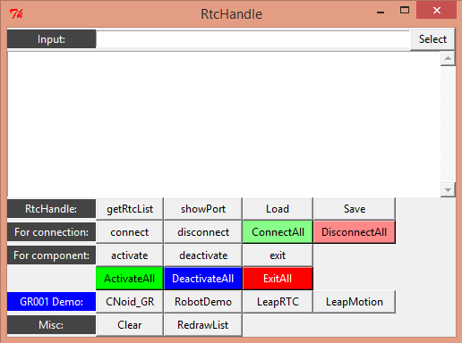</a></div>
1. RtcHandle で以下のボタンをクリックしてコンポーネントを起動する
  1. CNoid_G
  1. RobotDemo
  1. LeapRTC
  1. LeapMotion
<div align="center"><a href="launch_demo_components.png">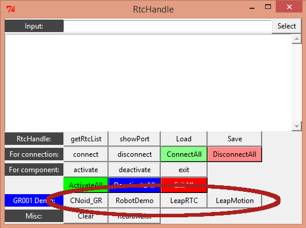</a></div>
<div align="center"><a href="rtchandle_launched_components.png">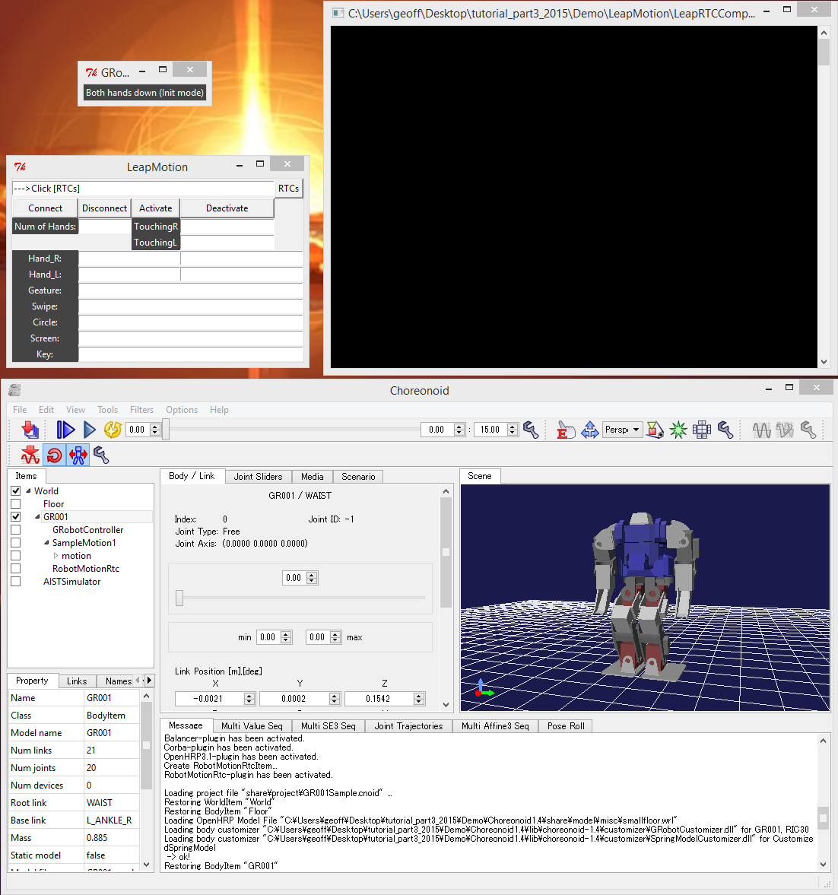</a></div>
1. 「getRtcList」をクリックする
<div align="center"><a href="rtchandle_getrtclist_button.png">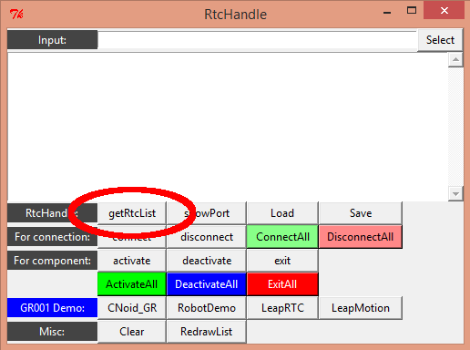</a></div>
<div align="center"><a href="rtchandle_getrtclist_result.png">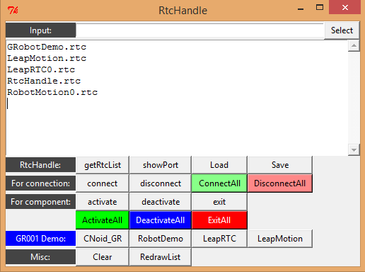</a></div>
1. 「Load」をクリックして「LeapDemo.data」を選択する
<div align="center"><a href="rtchandle_load_button.png">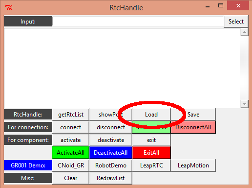</a></div>
<div align="center"><a href="rtchandle_load_button_after.png">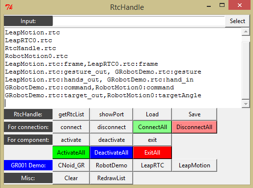</a></div>
1. 「ConnectAll」ボタンをクリックしてコンポーネントを接続するとコンポーネントは自動的に以下のように接続される。
<div align="center"><a href="rtchandle_connectall_button.png">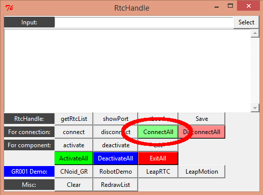</a></div>
<div align="center"><a href="rtsysed_demo_connected.png">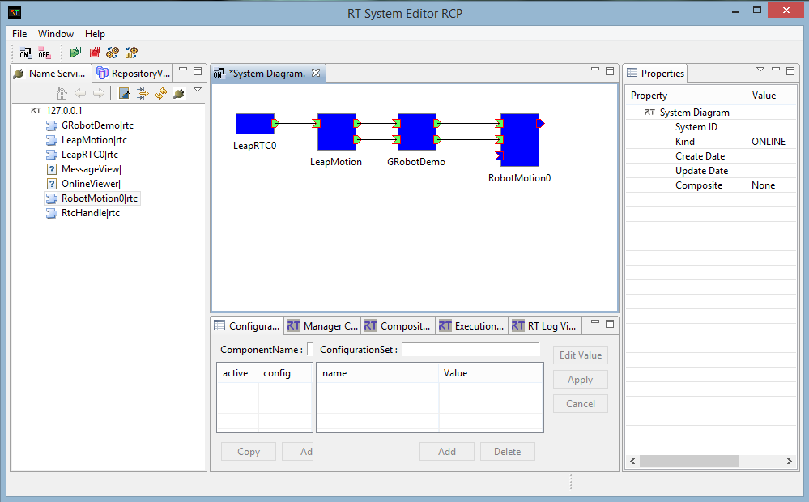</a></div>
1. 「ActivateAll」をクリックしてデモを起動してシステムを起動する
<div align="center"><a href="rtchandle_activateall_button.png">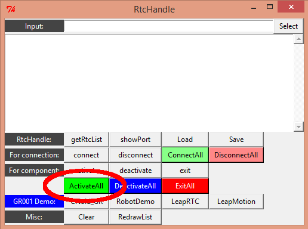</a></div>
<div align="center"><a href="rtsysed_demo_activated.png">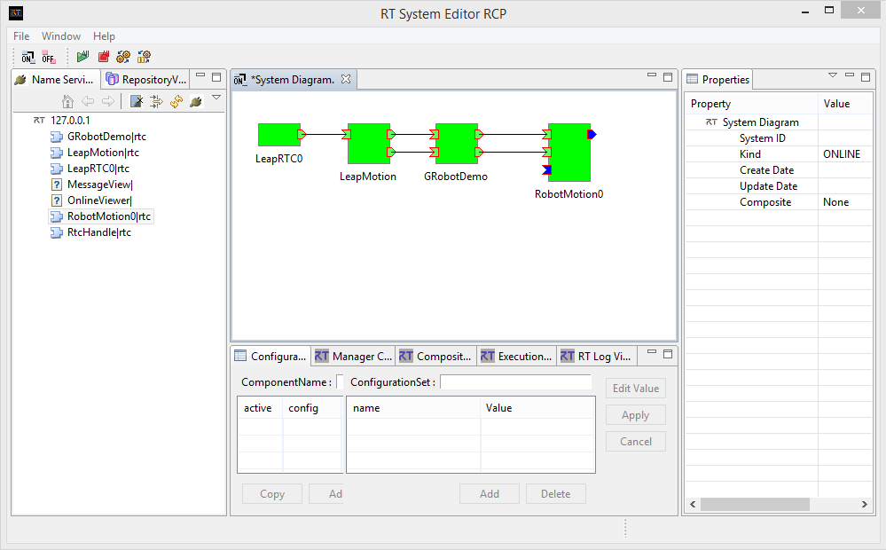</a></div>
1. **LeapRTCCompのウィンドーが選択された状態で** LeapMotionの上で手を動かすと、「LeapMotion」ウィンドーでデータが現れ、コマンドによってシミュレーター上のロボットが動く
<div align="center"><a href="demo_moving_robot.png">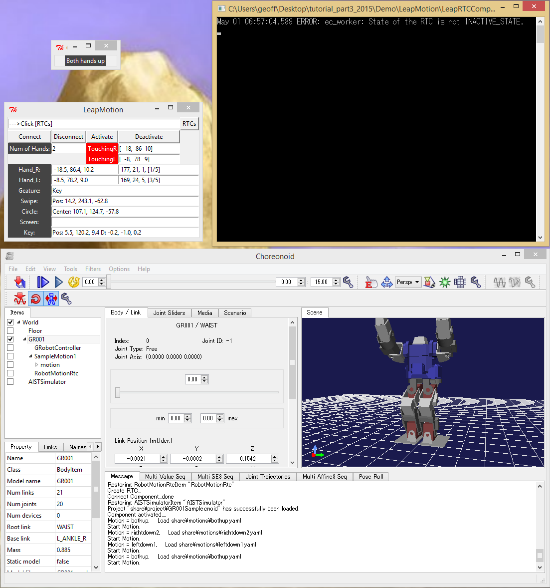</a></div>

## サンプルコンポーネントの動作確認

ここでは、デモシステムの中でロボットを制御するコンポーネント「GRobotDemo」の代わりにサンプルコンポーネントを使って、シミュレーター上のロボットを制御します。

以下の手順を始める前に、まずはデモシステムを上述の手順で起動してください。

1. 「LeapMotionGRoboControlSampleComp」をコンパイルする
  1. CMakeを起動する
  1. CMake上で、サンプルコンポーネントのソースダイレクトリー（解凍された場所の**src/LeapMotion_RobotControl_Sample**）をソースコードとして指定する
<div align="center"><a href="cmake_select_source.png">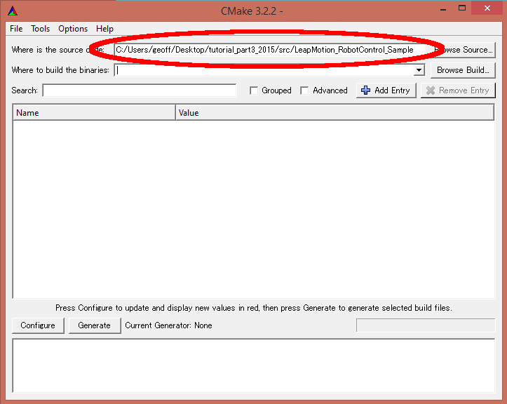</a></div>
  1. CMake上で、buildディレクトリーを、ソースディレクトリーの中の「build」ディレクトリーに指定する
<div align="center"><a href="cmake_select_build.png">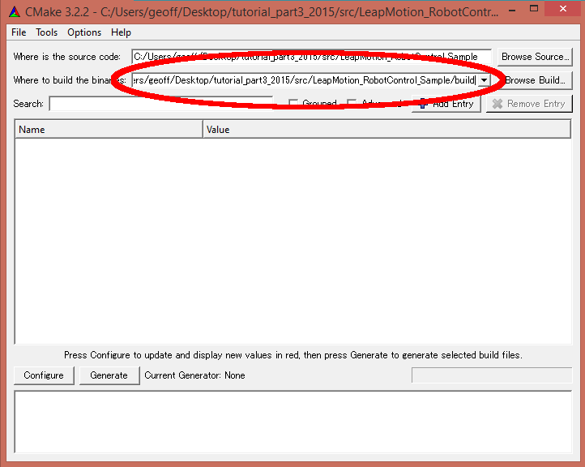</a></div>
  1. 「Configure」ボタンをクリックする
<div align="center"><a href="cmake_configure_button.png">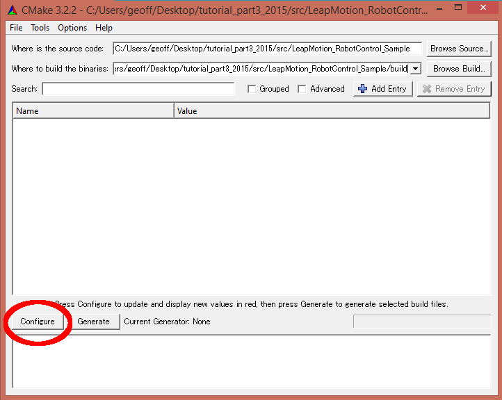</a></div>
  1. Generatorを選択する。以下のは、Visual Studio 2013でx64用のバイナリーの場合である。自分がインストールした OpenRTM バージョンに合わせた Generator を選択する。
<div align="center"><a href="cmake_select_generator.png">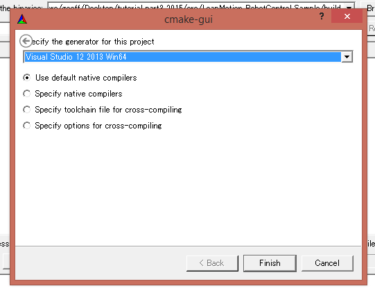</a></div>
  1. 「Generate」ボタンをクリックしてプロジェクトを生成する
<div align="center"><a href="cmake_generate_button.png">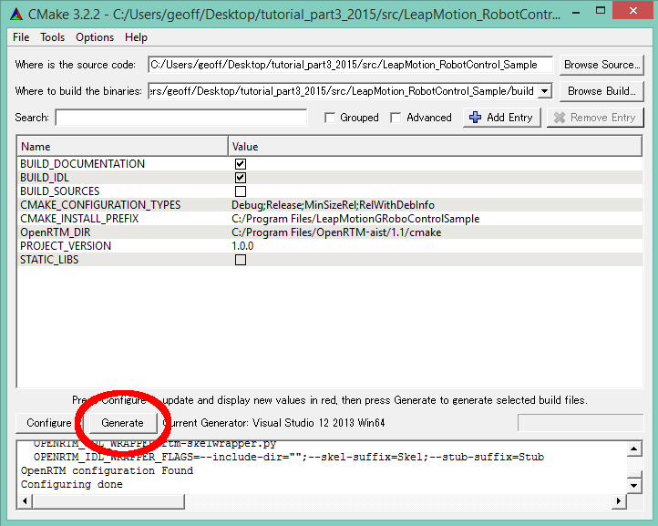</a></div>
  1. 「src/LeapMotion_RobotControl_Sample/build」にある「LeapMotionGRoboControlSample.sln」をVisual Studioで開いて、「ALL_BUILD」を右クリックメニューし、コンパイルする
<div align="center"><a href="sample_component_project.png">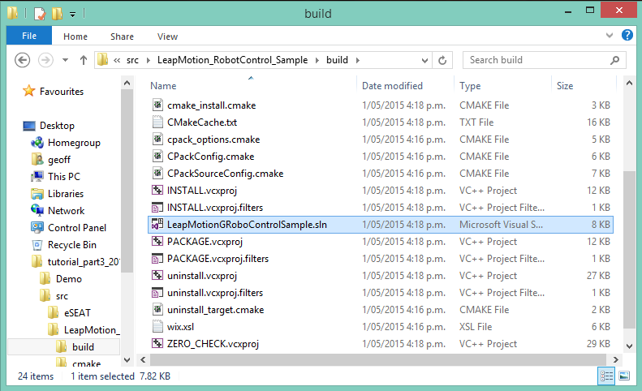</a></div>
<div align="center"><a href="sample_component_compile.png">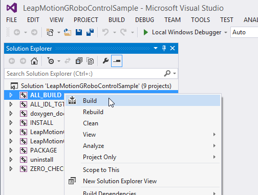</a></div>
  1. 以下の用にコンポーネントのバイナリーができた
<div align="center"><a href="sample_component_binary.png">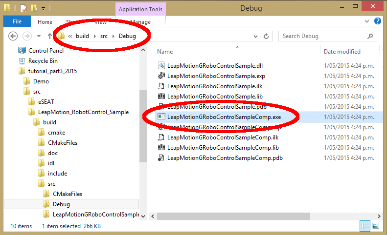</a></div>
1. 「LeapMotionGRoboControlSampleComp」を起動してロボットを制御する
  1. LeapMotionGRoboControlSampleComp.exeを実行する
  1. RTSystemEditorでGRobotDemoコンポーネントのコネクションを削除する
<div align="center"><a href="grobotdemo_delete_connections.png">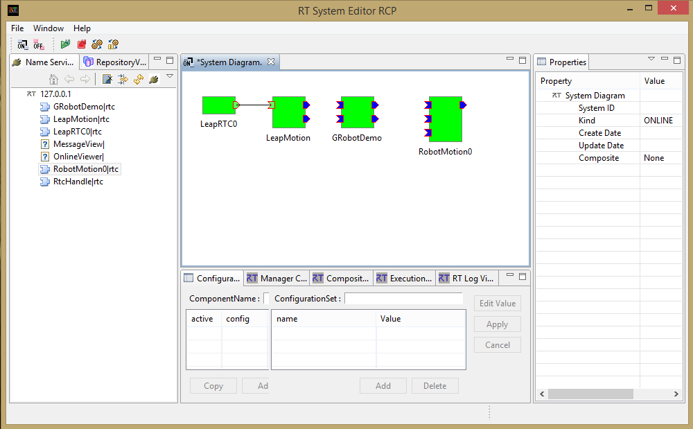</a></div>
  1. RTSystemEditorでLeapMotionGRoboControlSampleCompを以下の用につなげて、コンポーネントを activate する
    - LeapMotionのeSEAT0.hands_outポートからLeapMotionGRoboControlSample0の.hand_positionsへ
    - LeapMotionGRoboControlSample0.hand_positionsからRobotMotion0の.targetAngleへ
<div align="center"><a href="sample_component_connect.png">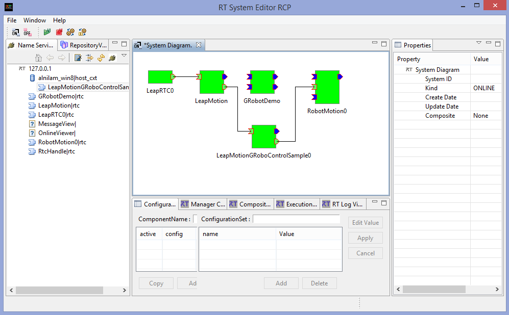</a></div>
  1. **LeapRTCCompのウィンドーが選択された状態で**LeapMotionの上で手を動かすとシミュレーター上のロボットの手が自分の手に合って動く
<div align="center"><a href="sample_component_follow_hands.png">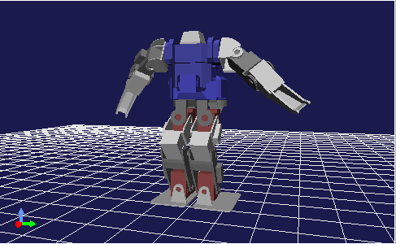</a></div>

## 自作コンポーネントを作る

ここでは、ロボット制御コンポーネントを作成する手順を説明します。まずは RTCBuilder を利用してソースのスタブを生成します。それから自由にソースを編集してLeapMotionからのデータに対してシミュレータ上のロボットを制御するアルゴリズムを実装します。

1. RTCBuilderを起動する
1. 新しい RTCBuilder プロジェクトを作る（プロジェクト名、コンポーネント名などを自由に選択してください）
<div align="center"><a href="rtcbuilder_new_project.png">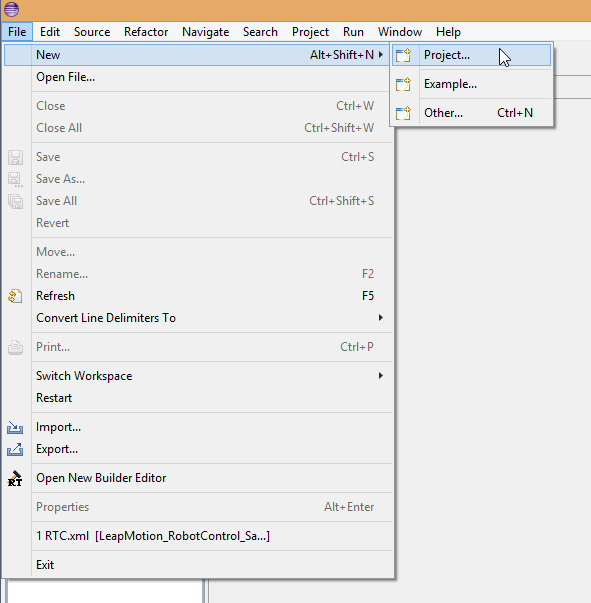</a></div>
<div align="center"><a href="rtcbuilder_project_type.png">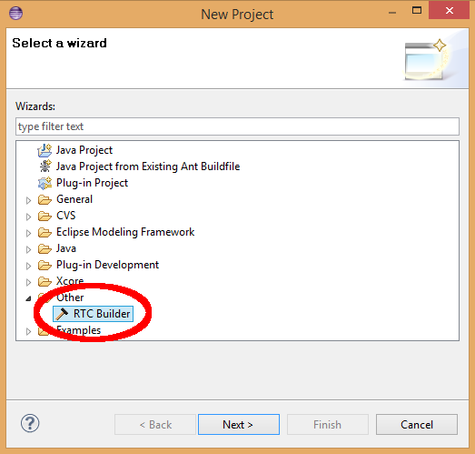</a></div>
1. アクティビティで**onActivated**、**onDeactivated**及び**onExecute**を選択する
1. 以下のデータポートを作成する
<table class="table-alt">
  <tr>
    <th>種類</th>
    <th>ポート名</th>
    <th>データ型</th>
  </tr>
  <tr>
    <td>入力ポート</td>
    <td>hand_positions</td>
    <td>RTC::TimedFloatSeq</td>
  </tr>
  <tr>
    <td>出力ポート</td>
    <td>command</td>
    <td>RTC::TimedString</td>
  </tr>
  <tr>
    <td>出力ポート</td>
    <td>target_angles</td>
    <td>RTC::TimedShortSeq</td>
  </tr>
</table>

<div align="center"><a href="rtcbuilder_create_ports.png">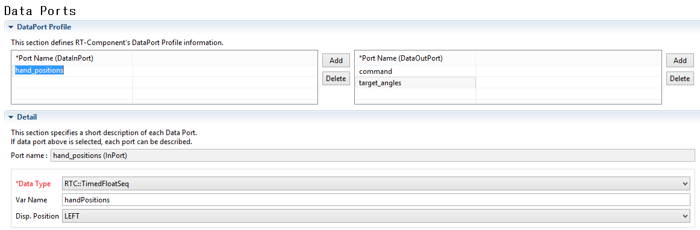</a></div>
1. サービスポートはないのでタブをスキップする
1. コンフィグレーションはないのでタブをスキップする
1. ソースコードの言語をC++に設定する
<div align="center"><a href="rtcbuilder_select_language.png">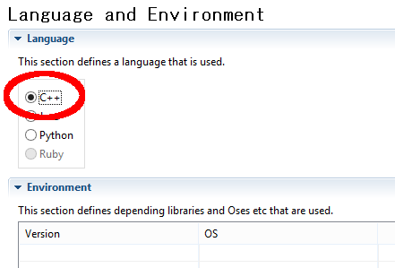</a></div>
1. コンポーネントソースのスタブを生成する
<div align="center"><a href="rtcbuilder_generate_source.png">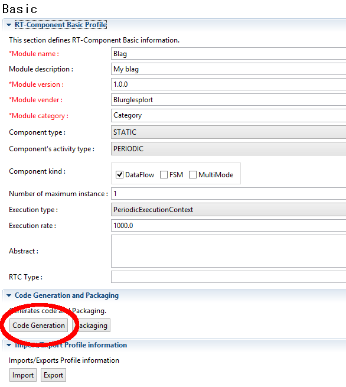</a></div>

以上の準備ができたら、CMake と Visual Studio を利用してコンポーネントのソースを編集してコンパイルします。生成されたソースの中に「include/<コンポーネント名>/<コンポーネントト名>.h」「src/<コンポーネント名>.cpp」を開いて、以下の編集を行ってください。

ヘッダーファイルのクラス定義で以下のプライベート変数を追加してください。

```
  bool m_rightUp;
  bool m_leftUp;
```

.cppファイルで、12行目で以下の関数を追加してください。

```
  double minmax(double a, double max, double min)
  {
    if (a > max)
    {
      return max;
    }
    else if (min > a)
    {
      return min;
    }
    return a;
  }
```

.cppファイルで、コンストラクタで以下の行を追加してください。

```
  m_rightUp = false;
  m_leftUp = false;
```

.cppファイルで、onExecute メソッドで以下のソースをペストしてください。

```
  if (m_hand_positionsIn.isNew())
  {
    m_hand_positionsIn.read();
    // Hand position data is received as an array of floats:
    // [right_hand_x, right_hand_y, right_hand_z, left_hand_x, left_hand_y, left_hand_z]
    // Where the x axis runs left to right across the LeapMotion sensor, the y axis is
    // verticle, and the z axis is front to back across the LeapMotion sensor.
    // So if you move your hand up and down above the sensor, the y axis will change.
    // If you move your hand towards the screen, the z axis will change.
    if (m_hand_positions.data.length() == 6)
    {
      // Calculate a command based on the hand positions
      // Right hand
      if (m_hand_positions.data[1] > 15 && !m_rightUp)
      {
        // Raise the hand
        if (m_leftUp)
        {
          m_command.data = CORBA::string_dup("rightup2");
        }
        else
        {
          m_command.data = CORBA::string_dup("rightup1");
        }
        m_rightUp = true;
        std::cout << "Right hand up\n";
        // Write the output port
        m_commandOut.write();
      }
      else if (m_hand_positions.data[1] < -15 && m_rightUp)
      {
        // Lower the hand
        if (m_leftUp)
        {
          m_command.data = CORBA::string_dup("rightdown2");
        }
        else
        {
          m_command.data = CORBA::string_dup("rightdown1");
        }
        m_rightUp = false;
        std::cout << "Right hand down\n";
        // Write the output port
        m_commandOut.write();
      }
  
      // Left hand
      if (m_hand_positions.data[4] > 15 && !m_leftUp)
      {
        // Raise the hand
        if (m_rightUp)
        {
          m_command.data = CORBA::string_dup("leftup2");
        }
        else
        {
          m_command.data = CORBA::string_dup("leftup1");
        }
        m_leftUp = true;
        std::cout << "Left hand up\n";
        // Write the output port
        m_commandOut.write();
      }
      else if (m_hand_positions.data[4] < -15 && m_leftUp)
      {
        // Lower the hand
        if (m_rightUp)
        {
          m_command.data = CORBA::string_dup("leftdown2");
        }
        else
        {
          m_command.data = CORBA::string_dup("leftdown1");
        }
        m_leftUp = false;
        std::cout << "Left hand down\n";
        // Write the output port
        m_commandOut.write();
      }
  
      // Calculate joint angles for direct control based on the hand positions
  
      // Output target positions are published as an array of 6 pairs of short integers. Each pair is [joint index, angle]:
      // [14, <joint 14 angle>, 15, <joint 15 angle>, ...]
      m_target_angles.data.length(12);
  
      // Set joint numbers to be manipulated
      m_target_angles.data[0] = 14;
      m_target_angles.data[2] = 15;
      m_target_angles.data[4] = 16;
      m_target_angles.data[6] = 17;
      m_target_angles.data[8] = 18;
      m_target_angles.data[10] = 19;
  
      // Right hand position
      m_target_angles.data[1] = minmax(m_hand_positions.data[1] * -10, 1500, -1500);
      m_target_angles.data[3] = minmax(m_hand_positions.data[0] * -10, 200, -1500);
      m_target_angles.data[5] = minmax((m_hand_positions.data[2] - 50) * 10, 200, -1300);
  
      // Left hand position
      m_target_angles.data[7] = minmax(m_hand_positions.data[4] * 10, 1500, -1500);
      m_target_angles.data[9] = minmax(m_hand_positions.data[3] * -10, 1500, -200);
      m_target_angles.data[11] = minmax((m_hand_positions.data[5] - 50) * -10, 1300, -200);
  
      // Write the output port
      m_target_anglesOut.write();
      //std::cout << "From hand positions:\nRight: (" << m_hand_positions.data[0] << ", " << m_hand_positions.data[1] <<
      //  ", " << m_hand_positions.data[2] << ")\t Left: (" << m_hand_positions.data[3] << ", " << m_hand_positions.data[4] <<
      //  ", " << m_hand_positions.data[5] << ")\nSetting joint positions:\n14: " << m_target_angles.data[1] <<
      //  ", 15: " << m_target_angles.data[3] << ", 16: " << m_target_angles.data[5] << ", 17: " << m_target_angles.data[7] <<
      //  ", 18: " << m_target_angles.data[9] << ", 19: " << m_target_angles.data[11] << "\n\n";
    }
  }
  return RTC::RTC_OK;
```


サンプルコンポーネントと同じ手順でコンパイルしてください。

コンパイルされたコンポーネントを LeapMotionGRoboControlSample0 と同じように利用できます。

サンプルコンポーネントと同じ振る舞いができたら、以下の入出力データフォーマットを参照しながら、自作コンポーネントのソースを編集して振る舞いを変更してください。

LeapMotionのeSEAT0.hands_out 出力ポート（自作コンポーネントのhand_positions入力ポートにくるデータ）のフォーマットは以下のようです。

```
 [右手ｘ,右手y, 右手z, 左手x,左手y,左手z]
```

自作コンポーネントの command 出力ポートは以下のコマンドの一つを出力してロボットのポーズを制御します。

- b_step
- balance
- bothdown
- bothup
- bow
- bye
- f01
- f1
- f_step
- go_ahead
- go_back
- gymnastics
- init
- kick
- l1
- left_step
- leftdown1
- leftdown2
- leftup1
- leftup2
- look_left
- look_right
- motion
- muri
- r1
- rest
- right_step
- rightdown1
- rightdown2
- rightup1
- rightup2
- turn_l
- turn_r

自作コンポーネントの target_angles 出力ポートは、軸の位置を出力します。フォーマットは

```
 [軸番号, 位置, 軸番号, 位置, ...]
```

です。例えば、両腕の軸の位置を設定するために以下のデータを出力します。

```
 [14, <位置>, 15, <位置>, 16, <位置>, 17, <位置>, 18, <位置>, 19, <位置>]
```


## 別パソコンのコンポーネントを利用する場合

別のパソコンで機動中のコンポーネントを利用することはあります。このセクションでネットワーク越えコンポーネントの接続方法を説明します。

<span style="color:red;">以下の手順を行う前に、必ず Windows Firewall を無効にしてください。</span>;

### ネームサーバー接続確認

まずは両パソコンの間でネットワークが接続されて、相手側のネームサーバーが見えるかどうかを確認します。

- 相手側のパソコンのIPを確認する。相手側のパソコンのコントロールパネルのネットワーク設定からコネクション情報を開く（以下はWindows 8の場合）
<div align="center"><a href="win8_network_settings.png">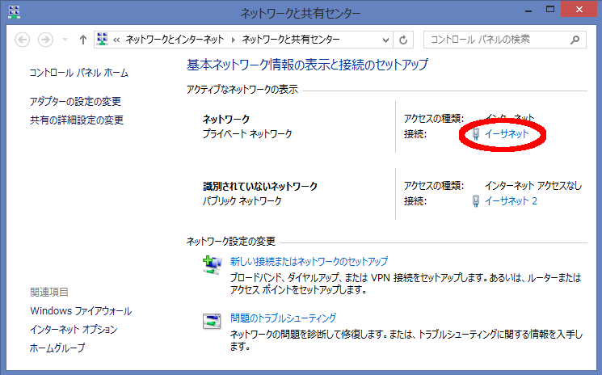</a></div>
- 詳細バトンでIPアドレス情報を表示する
<div align="center"><a href="win8_adapter_status.png">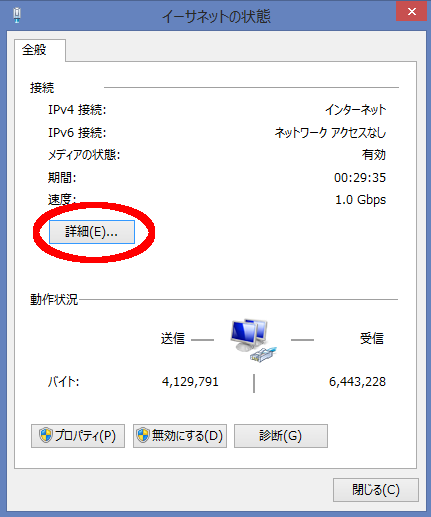</a></div>
<div align="center"><a href="win8_adapter_address.png">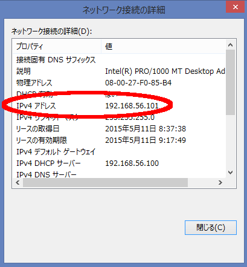</a></div>
- コマンドプロンプトからも確認できる（相手側のパソコンに実行する）
<div align="center"><a href="find_ip_address_windows.png">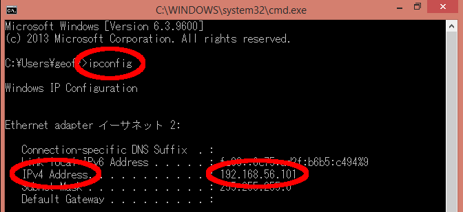</a></div>
- RTSystemEditorで相手側のネームサーバーに接続する。「ネームサーバを追加」バトンをクリックし、相手側のIPアドレスを入力する
<div align="center"><a href="rtsysed_add_nameserver_button.png">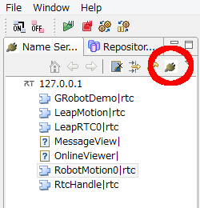</a></div>
<div align="center"><a href="rtsysed_add_nameserver_dialog.png">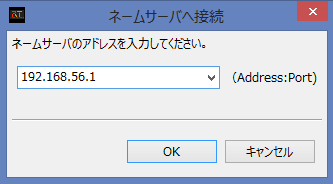</a></div>
- 成功の場合、以下の用にネームサーバリストに相手側のネームサーバーが追加される
<div align="center"><a href="rtsysed_added_nameserver.png">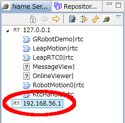</a></div>

### コンポーネント接続確認

ネームサーバーが見えるようになったら、コンポーネントが通信できるかどうかを確認します。

- こちら側のパソコンで、スタートメニューから「Console<span style="color:red;">In</span>;Comp.exe」を実行する
- 相手側のパソコンで、スタートメニューから「Console<span style="color:red;">Out</span>;Comp.exe」を実行する
- こちら側のパソコンの RTSystemEditor で ConsoleIn0（こちら側のネームサーバーから）と ConsoleOut0（相手側のネームサーバーから）を System Diagram に置き、ポートを接続する
<div align="center"><a href="rtsysed_connect_consolein_consoleout.png">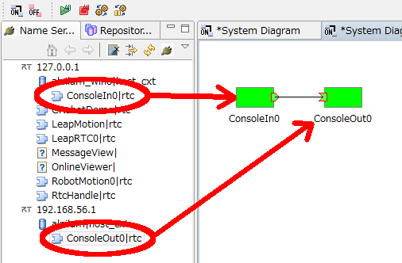</a></div>
- 成功の場合、こちら側の ConsoleInComp.exe ウィンドウで数字を入力すると、相手側の ConsoleOutComp.exe で表示される。

相手側のコンポーネントが操作できない場合はあります。この場合は以下の手順を両パソコンに行ってください。CORBA の設定を変更します。

- 「C:/Program Files/OpenRTM-aist/1.1/examples/C++」（64 bitの場合）または 「C:/Program Files (x86)/OpenRTM-aist/1.1/examples/C++」（32 bitの場合）を Explorer で開く
- 「rtc.conf」をノートパッドで編集する
- 以下の行を追加する
```
  corba.endpoint: <IPアドレス>
```
- <span style="color:red;">注意：こちら側のパソコンでこちら側のIPアドレスを入力し、相手側のパソコンで相手側のIPアドレスを入力してください。</span>;
- 全コンポーネントを再起動すると RTSystemEditor で操作できるようになる

### 相手側の LeapMotion コンポーネントを利用する

以上の手順にしたがって相手側のコンポーネントとの接続ができたら、同じ手順で相手側の「LeapRTC0」コンポーネントをこちら側の RTSystemEditor で利用できます。

RTSystemEditor上 で System Diagram に相手側の LeapRTC0 を置き、ポートを接続すると直接センサーをこちら側のパソコンにつながっているのと同じ様に動きます。

RTSystemEditor でコンポーネントが操作できない場合は、前セクションの手順を行ってください。しかし、rtc.conf の場所は「robomec2015_openrtm_tutorial_part3/Demo/LeapMotion」と「robomec2015_openrtm_tutorial_part3/Demo/eSEAT」です。
-------jp page!!-------
