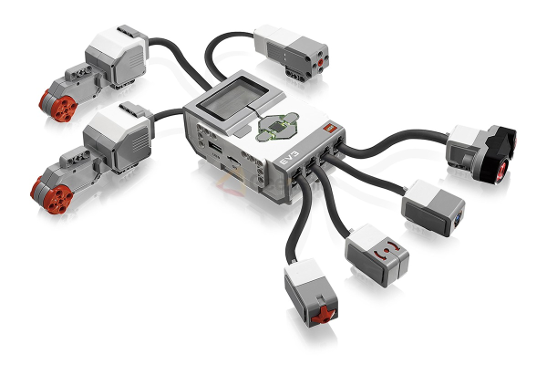

<!-- Title: LEGO Mindstorms EV3 活用事例 -->
<!-- -*- pukiwiki-edit -*- -->
<!-- * LEGO Mindstorms EV3 活用事例 -->
#contents

LEGO Mindstorms EV3 は LEGO の Mindstorms シリーズの新しいパッケージです。EV3のメインのコントローラーは、Linux が標準搭載され、様々な言語でロボットの開発が可能になりました。

また、NXT では外部との無線通信が基本的に Bluetooth のみでしたが、EV3 では USBインターフェースが搭載され、無線LAN の USBアダプタを挿すことで無線LANなどで外部と通信することも可能になりました。

搭載される OS が Linux になったことで、これまでよりもさらに柔軟に、かつ高度なロボット開発が可能になりました。

このドキュメントでは、LEGO Mindstorms EV3 上に OpenRTM-aist を搭載し、ロボット制御に活用する方法、コンポーネントの開発方法を紹介します。

### 仕様

EV3 の外観を以下に示します。

<strong>LEGO Mindstorms EV3</strong>

EV3のコンピュータは以下の仕様になっています。

- [アフレルWebページ](http://www.afrel.co.jp/archives/850)

<table class="table-alt">
  <tr>
    <td colspan="2" style="text-align: center;"><strong>LEGO Mindstorms EV3 仕様</strong></td>
  </tr>
  <tr>
    <td>プロセッサ</td>
    <td>ARM9 300MHz</td>
  </tr>
  <tr>
    <td>メモリ(ROM)</td>
    <td>16MB Flash</td>
  </tr>
  <tr>
    <td>メモリ(RAM)</td>
    <td>64MB RAM</td>
  </tr>
  <tr>
    <td>OS</td>
    <td>Linuxベース</td>
  </tr>
  <tr>
    <td>ディスプレイ</td>
    <td>178 x 128 pixels</td>
  </tr>
  <tr>
    <td>出力ポート</td>
    <td>4個</td>
  </tr>
  <tr>
    <td>入力ポート</td>
    <td>4個   アナログ   デジタル 460.8kbit/s</td>
  </tr>
  <tr>
    <td>USB通信速度</td>
    <td>High Speed (480Mbps)</td>
  </tr>
  <tr>
    <td>USBインターフェース</td>
    <td>EV3同士の連結可能 (最大4台)   Wi-Fi通信ドングル利用可能</td>
  </tr>
  <tr>
    <td>SDカードスロット</td>
    <td>Micro SDカード 32GBまでサポート</td>
  </tr>
  <tr>
    <td>スマートデバイス接続</td>
    <td>iOS, Android, Windows</td>
  </tr>
  <tr>
    <td>ユーザーインターフェース</td>
    <td>6ボタン, イルミネーション機能</td>
  </tr>
  <tr>
    <td>プログラムサイズ （ライントレースの場合）</td>
    <td>0.950KB</td>
  </tr>
  <tr>
    <td>センサー通信性能</td>
    <td>1000　回/秒, 1ms</td>
  </tr>
  <tr>
    <td>データロギング</td>
    <td>最大　1,000サンプリング/秒</td>
  </tr>
  <tr>
    <td>Bluetooth通信</td>
    <td>最大7台のスレーブと接続可能</td>
  </tr>
  <tr>
    <td>動力</td>
    <td>リチャージブルバッテリー または、単3電池　6本</td>
  </tr>
</table>

なお、EV3では、リチャージブルバッテリーが同梱されています。スペックは下記のとおりです。

<table class="table-alt">
  <tr>
    <th>電池の種類</th>
    <th>リチウムイオン</th>
  </tr>
  <tr>
    <td>容量</td>
    <td>2050mAh</td>
  </tr>
  <tr>
    <td>NXT DCバッテリとの互換性</td>
    <td>なし</td>
  </tr>
  <tr>
    <td>NXT DCアダプタでの充電</td>
    <td>可能</td>
  </tr>
  <tr>
    <td>単三電池で動かした場合との比較</td>
    <td>単三電池を利用した場合より充電式 DCバッテリーのほうが長く動く。</td>
  </tr>
  <tr>
    <td>充電時間</td>
    <td>4時間（フル充電の場合）</td>
  </tr>
</table>

### このBookの概要

このBookでは OpenRTM-aist で RTコンポーネントを開発・実行するための環境構築方法、便利に使うためのノウハウ、移動ロボットの制御や IO の利用方法などを解説します。

 

- [チュートリアル(EV3)](./lego_tutorial_ev3)
- [SD カードの準備](./lego_sdcard_prep)
- [EV3 および ev3dev の初期設定](./lego_setup_ev3_ev3dev)
- [サンプルコンポーネントの実行](./lego_samplec_exec)
- [開発環境の構築](./lego_devenv_make)
- [EV3 デバイスの利用](./lego_ev3_device_use)
- [python-ev3dev の利用](./lego_python-ev3dev_use)
- [EV3デバイス C++ バインディングの利用](./lego_ev3dev_cpp_binding)
- [EV3用RTCの作成 (Python編)](./lego_ev3rtc_python)
- [EV3デバイスの操作方法について](./lego_ev3_dev_operation)
- [Educator Vehicle用 RTC のインストール (EV3)](./lego_ev3_rtc_install)
- [サンプルの RTシステムの実行](./lego_sample_rts_exec)
- [自作の RTC で制御](./lego_original_rtc_use)
- [EV3 を無線LANアクセスポイントとして動作させるまでの手順](./lego_ev3_wifi_ap)
- [TETRIX の利用方法](./lego_tetrix_use)
- [シミュレーター利用方法](./lego_simulator_use)
- [チュートリアル(RTM講習会)](./lego_rtm_seminar)
- [組み立て方](./lego_howtobuild)

