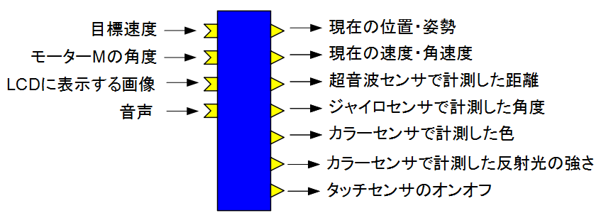
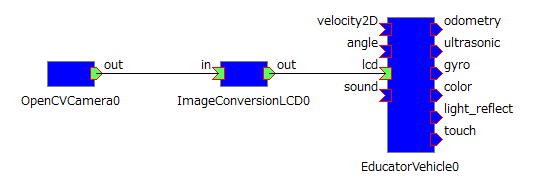
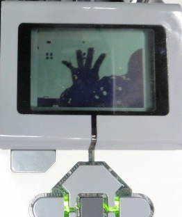
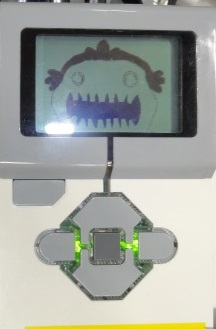
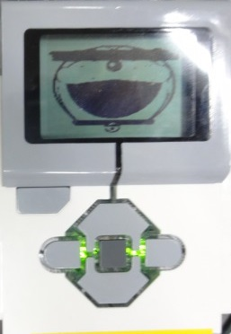
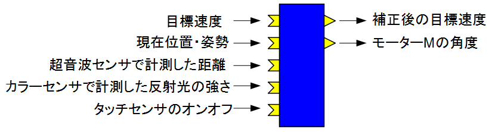
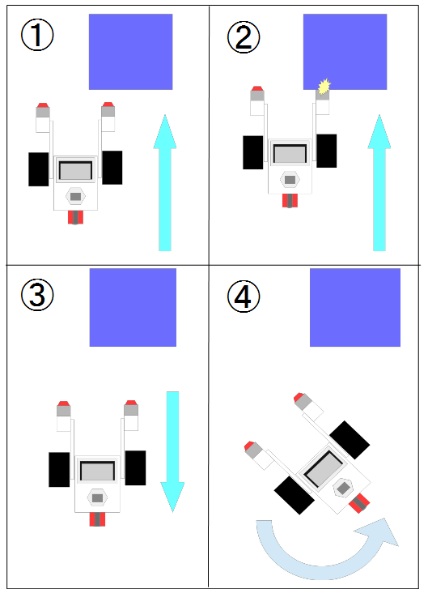

<!-- Educator Vehicle用 RTC のインストール (EV3) -->
#contents

このページでは Educator Vehicle を操作するための各RTC のインストール方法について説明します。


## EducatorVehicle

EducatorVehicle は EV3 の走行速度の入力、センサーのデータの出力等を行うためのコンポーネントです。

- [https://github.com/Nobu19800/EducatorVehicle](https://github.com/Nobu19800/EducatorVehicle)

クロス環境で以下のコマンドを入力してください。

```
 git clone https://github.com/Nobu19800/EducatorVehicle
 cd EducatorVehicle
 cmake .
 make
```

生成された src/EducatorVehicleComp を EV3 に転送してください。

<table class="table-alt">
  <tr>
    <th colspan="3" style="text-align: center;">EducatorVehicle</th>
  </tr>
  <tr>
    <td colspan="3" style="text-align: center;">InPort</td>
  </tr>
  <tr>
    <td>名前</td>
    <td>データ型</td>
    <td>説明</td>
  </tr>
  <tr>
    <td>velocity2D</td>
    <td>RTC::TimedVelocity2D</td>
    <td>目標速度</td>
  </tr>
  <tr>
    <td>angle</td>
    <td>RTC::TimedDouble</td>
    <td>モーターMの角度</td>
  </tr>
  <tr>
    <td>lcd</td>
    <td>RTC::CameraImage</td>
    <td>LCDに表示する画像データ</td>
  </tr>
  <tr>
    <td>sound</td>
    <td>RTC::TimedString</td>
    <td>出力する音声</td>
  </tr>
  <tr>
    <td colspan="3" style="text-align: center;">OutPort</td>
  </tr>
  <tr>
    <td>名前</td>
    <td>データ型</td>
    <td>説明</td>
  </tr>
  <tr>
    <td>odometry</td>
    <td>RTC::TimedPose2D</td>
    <td>現在の位置・姿勢</td>
  </tr>
  <tr>
    <td>current_vel</td>
    <td>RTC::TimedVelocity2D</td>
    <td>現在の速度・角速度</td>
  </tr>
  <tr>
    <td>ultrasonic</td>
    <td>RTC::RangeData</td>
    <td>超音波センサーで計測した距離</td>
  </tr>
  <tr>
    <td>gyro</td>
    <td>RTC::TimedDouble</td>
    <td>ジャイロセンサーで計測した角度</td>
  </tr>
  <tr>
    <td>color</td>
    <td>RTC::TimedString</td>
    <td>カラーセンサーで計測した色</td>
  </tr>
  <tr>
    <td>light_reflect</td>
    <td>RTC::TimedDouble</td>
    <td>カラーセンサーで計測した反射光の強さ</td>
  </tr>
  <tr>
    <td>touch</td>
    <td>RTC::TimedBoolean</td>
    <td>タッチセンサーのオンオフ。右側が0番目の要素、左側が1番目の要素</td>
  </tr>
  <tr>
    <td colspan="3" style="text-align: center;">コンフィギュレーションパラメーター</td>
  </tr>
  <tr>
    <td>名前</td>
    <td>デフォルト値</td>
    <td>説明</td>
  </tr>
  <tr>
    <td>wheelRadius</td>
    <td>0.028</td>
    <td>車輪の半径</td>
  </tr>
  <tr>
    <td>wheelDistance</td>
    <td>0.054</td>
    <td>タイヤ間距離の1/2</td>
  </tr>
  <tr>
    <td>medium_motor_speed</td>
    <td>1.6</td>
    <td>モーターMの速度</td>
  </tr>
</table>

<div align="center"><a href="simulator_ev3_2.png"></a></div>

### タッチセンサーの出力
touch で入力したデータの0番目が右側(3番ポート)のタッチセンサー、1番目が左側(1番ポート)のタッチセンサーに対応しています。

### 音声の出力
sound による音声の入力には以下のコマンドを利用できます。

- beep
  - beep と入力するとビープ音が鳴ります。

- tone
  - 以下のように tone、周波数、時間と入力すると指定周波数の音を指定ミリ秒数だけ鳴らします。

```
 tone,100,1000
```

- それ以外
  - それ以外は指定文字列を発音します


### LCD に表示する画像について
<!-- LCDで表示する画像は [[ここ:https://github.com/Nobu19800/saveBinaryImage/archive/master.zip]] からダウンロードしたファイルを解凍したフォルダーの中にある、EXE/saveBinaryImage.exe で変換したものを利用してください。 -->
画像ファイルを saveBinaryImage.exe にドラッグ・アンド・ドロップすれば変換できます。


LDC で表示する画像データは、以下のコンポーネントで画像データの変換を行えば入力可能です。
Windows で使用する場合は、release フォルダーの ImageConversionLCDComp.exe で起動できます。

- [https://github.com/Nobu19800/ImageConversionLCD)](https://github.com/Nobu19800/ImageConversionLCD)

<table class="table-alt">
  <tr>
    <th colspan="3" style="text-align: center;">ImageConversionLCD</th>
  </tr>
  <tr>
    <td colspan="3" style="text-align: center;">InPort</td>
  </tr>
  <tr>
    <td>名前</td>
    <td>データ型</td>
    <td>説明</td>
  </tr>
  <tr>
    <td>out</td>
    <td>RTC::CameraImage</td>
    <td>変換前の画像データ</td>
  </tr>
  <tr>
    <td colspan="3" style="text-align: center;">OutPort</td>
  </tr>
  <tr>
    <td>名前</td>
    <td>データ型</td>
    <td>説明</td>
  </tr>
  <tr>
    <td>out</td>
    <td>RTC::CameraImage</td>
    <td>変換後の画像データ</td>
  </tr>
</table>


<div align="center"><a href="ImageConversionLCD.png"></a></div>


例えば、OpenRTM-aist 付属のサンプルコンポーネント OpenCVCamera と接続すれば、EV3 にカメラ画像を表示させることができます。

<div align="center"><a href="system_lcd.png"></a></div>

<div align="center"><a href="s_DSC00796.JPG"></a></div>


あるいは、指定の画像を入力するということもできます。

<div align="center"><a href="s_DSC00797.JPG"></a></div>
<br>

<div align="center"><a href="s_DSC00798.JPG"></a></div>


## ControlEducatorVehicle
ControlEducatorVehicle を用いることによって以下の移動ロボット(Educator Vehicle 改)の制御ができます。組み立て方は [このページ](/ja/node/6038) を参考にしてください。


- [https://github.com/Nobu19800/ControlEducatorVehicle](https://github.com/Nobu19800/ControlEducatorVehicle)


<div align="center"><a href="s_DSC00443.JPG"></a></div>
<br>
<div align="center"><a href="s_DSC00440.JPG"></a></div>

- タッチセンサーに障害物が当たった時に回避する
- カラーセンサーで地面の反射光を計測して一定以下になったら停止する
- 超音波センサーで地面までの距離を計測して一定上になったら停止して超音波センサーを回転させて走行可能な地面を探索する

超音波センサーを使用しない場合は Educator Vehicle の制御にも使用できます。


クロス環境で以下のコマンドを入力してください。

```
 git clone https://github.com/Nobu19800/ControlEducatorVehicle
 cd ControlEducatorVehicle
 cmake .
 make
```

生成された src/ControlEducatorVehicleComp を EV3 に転送してください。


<table class="table-alt">
  <tr>
    <th colspan="3" style="text-align: center;">ControlEducatorVehicle</th>
  </tr>
  <tr>
    <td colspan="3" style="text-align: center;">InPort</td>
  </tr>
  <tr>
    <td>名前</td>
    <td>データ型</td>
    <td>説明</td>
  </tr>
  <tr>
    <td>target_velocity_in</td>
    <td>RTC::TimedVelocity2D</td>
    <td>目標速度</td>
  </tr>
  <tr>
    <td>current_pose</td>
    <td>RTC::TimedPose2D</td>
    <td>現在位置・姿勢</td>
  </tr>
  <tr>
    <td>ultrasonic</td>
    <td>RTC::TimedRangeData</td>
    <td>超音波センサーで計測した距離</td>
  </tr>
  <tr>
    <td>light_reflect</td>
    <td>RTC::TimedDouble</td>
    <td>カラーセンサーで計測した反射光の強さ</td>
  </tr>
  <tr>
    <td>touch</td>
    <td>TimedBoolean</td>
    <td>タッチセンサーのオンオフ</td>
  </tr>
  <tr>
    <td colspan="3" style="text-align: center;">OutPort</td>
  </tr>
  <tr>
    <td>名前</td>
    <td>データ型</td>
    <td>説明</td>
  </tr>
  <tr>
    <td>target_velocity_out</td>
    <td>RTC::TimedVelocity2D</td>
    <td>補正後の目標速度</td>
  </tr>
  <tr>
    <td>angle</td>
    <td>RTC::TimedDouble</td>
    <td>モーターMの角度</td>
  </tr>
  <tr>
    <td colspan="3" style="text-align: center;">コンフィギュレーションパラメーター</td>
  </tr>
  <tr>
    <td>名前</td>
    <td>デフォルト値</td>
    <td>説明</td>
  </tr>
  <tr>
    <td>sensor_height</td>
    <td>0.2</td>
    <td>走行できる地面があると判定する超音波センサーの計測値</td>
  </tr>
  <tr>
    <td>back_speed</td>
    <td>0.1</td>
    <td>後退運動をする速さ</td>
  </tr>
  <tr>
    <td>back_time</td>
    <td>1.0</td>
    <td>後退運動する時間</td>
  </tr>
  <tr>
    <td>rotate_speed</td>
    <td>0.8</td>
    <td>回転運動をする速さ</td>
  </tr>
  <tr>
    <td>rotate_time</td>
    <td>2.0</td>
    <td>回転運動する時間</td>
  </tr>
  <tr>
    <td>medium_motor_range</td>
    <td>1.6</td>
    <td>モーターMの動作範囲</td>
  </tr>
</table>


<div align="center"><a href="ControlEducatorVehicle.png"></a></div>


### タッチセンサーの入力による回避運動

<div align="center"><a href="ev3_4.png"></a></div>


タッチセンサーがオンになった場合、まず③のように back_speed で指定した速さで back_time で指定した時間だけ後退します。
そして④のように rotate_speed で指定した角速度で rotate_time で指定した時間だけ回転します。
回転する方向はオンになったタッチセンサーと逆方向です。


### 超音波センサーによる地面までの距離計測

超音波センサーで地面までの距離を計測して停止、超音波センサーを回転させて走行可能な地面を探索する操作を実行するためには、EV3 の Education Vehicle を組み立ててさらに超音波センサーを回転させるように取り付ける必要があります。

動作手順は以下のようになっています。

<div align="center"><a href="ev3_sensor.png"></a></div>

机の上などを走行している場合で、②のようぬ机の端まで移動したとします。
超音波センサーで計測した距離が sensor_height 以上になった場合、一旦停止します。
そして③のように超音波センサーを右側に90度回転させて地面までの高さが sensor_height 以下かを判定します。
sensor_height 以上だった場合は④のように左方向に180度回転させて地面までの高さが sensor_height 以下かを判定します。
sensor_height 以下だった場合は、超音波センサーを向けた方向に Education Vehicle を回転させます。

## 一括インストール
上記の RTC を一括でインストールします。 以下のコマンドを入力してください。

```
 git clone https://github.com/Nobu19800/EducatorVehicle_script_ev3dev
 cd EducatorVehicle_script_ev3dev
 sh Component/install_rtc.sh
```
