init
<!-- Title: EV3用RTCの作成 (Python編) -->
<!-- -*- pukiwiki-edit -*- -->
<!-- * EV3用 RTC の作成 (Python編) -->
#contents

## 移動ロボットの組み立て

EV3 の標準セットを購入すると、移動ロボット (Educator Vehicle) の作成方法のマニュアルが1冊ついてくるはずです。
なければ、以下の URL からダウンロードすることができます。この移動ロボットを例にとり、移動ロボットRTC を作成してみます。

- [Educator Vehicle](http://robotsquare.com/wp-content/uploads/2013/10/45544_educator.pdf)

まずは、このマニュアルに従って、移動ロボット (Educator Vehicle) を組み立てます。

それぞれのモーター、センサーはそれぞれ以下のように取り付けます。

<table class="table-alt">
  <tr>
    <td>モーター右</td>
    <td>ポート C</td>
  </tr>
  <tr>
    <td>モーター左</td>
    <td>ポート B</td>
  </tr>
  <tr>
    <td>モーター(M)</td>
    <td>ポートA</td>
  </tr>
  <tr>
    <td>タッチセンサー右</td>
    <td>ポート 3</td>
  </tr>
  <tr>
    <td>タッチセンサー左</td>
    <td>ポート 1</td>
  </tr>
  <tr>
    <td>超音波センサー</td>
    <td>ポート 4</td>
  </tr>
  <tr>
    <td>ジャイロセンサー</td>
    <td>ポート 2</td>
  </tr>
</table>

## 移動ロボットの運動学

さて、上記のコンポーネントは指令値として2次元速度指令を受け取りますが、実際にモータを制御する際には、モーターの角速度指令値を計算しモーターに命令しなければなりません。

移動ロボットの運動学については、東北学院大学の熊谷先生のページが参考になります。

- [http://www.mech.tohoku-gakuin.ac.jp/rde/contents/course/robotics/wheelrobot.html](http://www.mech.tohoku-gakuin.ac.jp/rde/contents/course/robotics/wheelrobot.html)

座標系としては、自律移動機能共通インターフェース仕様書に従って、

- [http://openrtm.org/openrtm/ja/project/Recommendation_CommonIF](http://openrtm.org/openrtm/ja/project/Recommendation_CommonIF)

ロボット進行方向をX軸とした右手系を想定する。速度指令は座標系にならって、(v_x、v_y、v_a)とする。独立二輪駆動式の移動ロボットなので、v_y は常に0となり、実質的に v_x および v_a を指定することになる。

さて、車輪の角速度を  , として、車輪の半径を r とすると、各車輪の接地点での速度 v_r、v_l はそれぞれ

<!-- v_r = rω_r -->
<!-- v_l = rω_l -->
 

 

となる。また、回転中心からロボット中心の距離を ρ とすると、以下の式が成り立つ。

<!-- vx = ρva -->
 

<a href="math5.png">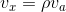</a>

 

一方、中心から車輪までの距離(トレッドの1/2)を d とすると、

<!-- v_r = (ρ + d)va -->
<!-- v_l = (ρ - d)va -->
 

<a href="math0.png">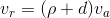</a>

<a href="math1.png">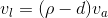</a>

<!-- #ref(http://latex.codecogs.com/png.latex?v_{r} = (\rho + d) v_{a},nolink) -->
<!-- #ref(http://latex.codecogs.com/png.latex?v_{l} = (\rho - d) v_{a},nolink) -->
 

となる。以上の式から、速度指令(v_x、v_y、v_a)の時に実際に与えるべき左右のモーターの角速度は以下の通りになります。

<!-- ω_r  = (vx + va d) / r -->
<!-- ω_l  = (vx - va d) / r -->
 

<a href="math6.png">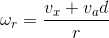</a>

<a href="math7.png">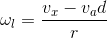</a>

 

Educator Vehicle の車輪の直径 (2r)、トレッド (2d) はそれぞれ

<table class="table-alt">
  <tr>
    <td>車輪の直径 2r</td>
    <td>56mm (0.056m)</td>
  </tr>
  <tr>
    <td>車輪の直径 r</td>
    <td>28mm (0.028m)</td>
  </tr>
  <tr>
    <td>トレッド幅 2d</td>
    <td>118.5mm (0.1185m)</td>
  </tr>
  <tr>
    <td>トレッド幅 d</td>
    <td>59.25mm (0.05925m)</td>
  </tr>
  <tr>
    <td>車輪の幅</td>
    <td>28.5mm (0.0285m)</td>
  </tr>
</table>

なので、
<!-- ω_r  = (vx + 0.05 va) / 0.02 -->
<!-- ω_l  = (vx - 0.05 va) / 0.02 -->
 

<a href="math9.png">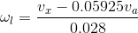</a>

 

となる。

## 自己位置推定（オドメトリ）

次に、ロボットの自己位置同定の方法について考えます。
ロボットの移動速度・角速度を積分することで任意の時点の位置・姿勢を得ることができます。速度 v_x、角速度 v_a とすると、(x、y、θ) の微小変位と v_x、v_a との関係を直線近似すると、

<!-- dx/dt = vx cosθ -->
<!-- dy/dt = vx sinθ -->
<!-- dθ/dt = va -->
 

<a href="math10.png">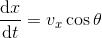</a>

<a href="math11.png">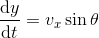</a>

<a href="math12.png">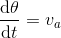</a>

 

となる。(より厳密には円弧近似する方法もあるが、ここでは簡単に直線近似とした。)
これを実際のロボット制御時に、計算機上で求める場合、サンプリング周期 Δt [s] として、

<!-- x_i+1 = x_i + vx_i cosθΔt -->
<!-- y_i+1 = y_i + vx_i sinθΔt -->
<!-- θ_i+1 = θ_i + va_i Δt -->

<a href="math13.png">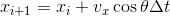</a>

<a href="math14.png">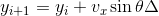</a>

<a href="math15.png">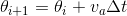</a>

のように求められる。

## RTC のひな形作成
## 作成する RTC の設計

作成する RTC を設計します。

作成する RTC の仕様をいかに示します。RTCBuilder で必要事項を入力し、ひな形コードを生成します。

<table class="table-alt">
  <tr>
    <td colspan="3" style="text-align: center;"><strong>基本タブ</strong></td>
  </tr>
  <tr>
    <td style="text-align: center;"><strong>プロファイル名</strong></td>
    <td colspan="2" style="text-align: center;"><strong>名称・指定</strong></td>
  </tr>
  <tr>
    <td>モジュール名</td>
    <td colspan="2" style="text-align: center;">EducatorVehicle</td>
  </tr>
  <tr>
    <td>バージョン</td>
    <td colspan="2" style="text-align: center;">任意</td>
  </tr>
  <tr>
    <td>ベンダ名</td>
    <td colspan="2" style="text-align: center;">任意</td>
  </tr>
  <tr>
    <td>カテゴリ</td>
    <td colspan="2" style="text-align: center;">Mobilerobot</td>
  </tr>
  <tr>
    <td colspan="3" style="text-align: center;"><strong>アクティビティ</strong></td>
  </tr>
  <tr>
    <td>有効アクション</td>
    <td colspan="2" style="text-align; ">onInitialize、onActivated、onDeactivated、onExecute</td>
  </tr>
  <tr>
    <td colspan="3" style="text-align: center;"><strong>データポート (InPort)</strong></td>
  </tr>
  <tr>
    <td><strong>ポート名</strong></td>
    <td><strong>型</strong></td>
    <td><strong>意味</strong></td>
  </tr>
  <tr>
    <td>velocity2D</td>
    <td>RTC::TimedVelocity2D</td>
    <td>速度指令 (v_x、v_y、v_θ) [m/s、m/s、rad/s]</td>
  </tr>
  <tr>
    <td>angle</td>
    <td>RTC::TimedDouble</td>
    <td></td>
  </tr>
  <tr>
    <td colspan="3" style="text-align: center;"><strong>データポート (OutPort)</strong></td>
  </tr>
  <tr>
    <td>ポート名</td>
    <td>型</td>
    <td>意味</td>
  </tr>
  <tr>
    <td>odometry</td>
    <td>RTC::TimedPose2D</td>
    <td>現在の位置・姿勢（角度） (x、y、θ) [m、m、rad]</td>
  </tr>
  <tr>
    <td>ultrasonic</td>
    <td>RTC::RangeData</td>
    <td>超音波センサーをレンジセンサーと仮定し、要素1の距離データを格納</td>
  </tr>
  <tr>
    <td>gyro</td>
    <td>RTC::TimedDouble</td>
    <td>ジャイロセンサーを TimedDouble [rad] にて出力</td>
  </tr>
  <tr>
    <td>color</td>
    <td>RTC::TimedString</td>
    <td>カラーセンサーの値を色名 (none、black、white、blue、green、red、yellow、brown) で出力</td>
  </tr>
  <tr>
    <td>touch</td>
    <td>RTC::TimedBooleanSeq</td>
    <td>タッチセンサーの値をBoolean[2] で出力</td>
  </tr>
  <tr>
    <td colspan="3" style="text-align: center;"><strong>コンフィギュレーション</strong></td>
  </tr>
  <tr>
    <td>ポート名</td>
    <td>型</td>
    <td>意味</td>
  </tr>
  <tr>
    <td>wheelRadius</td>
    <td>double</td>
    <td>タイヤの半径 [m]</td>
  </tr>
  <tr>
    <td>wheelDistance</td>
    <td>double</td>
    <td>タイヤ間距離の1/2 [m]</td>
  </tr>
</table>

