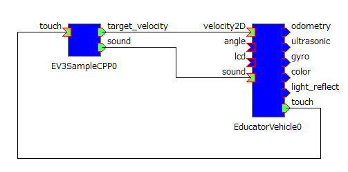
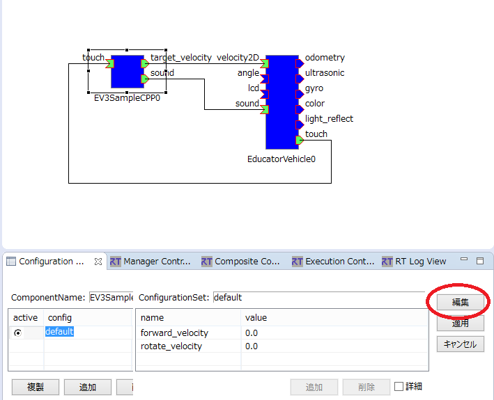
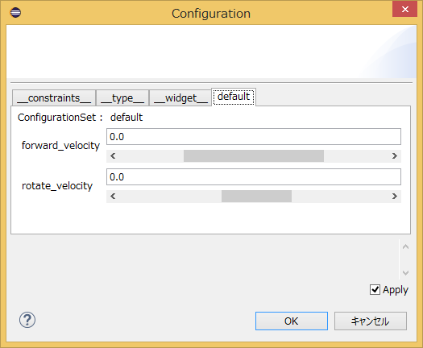
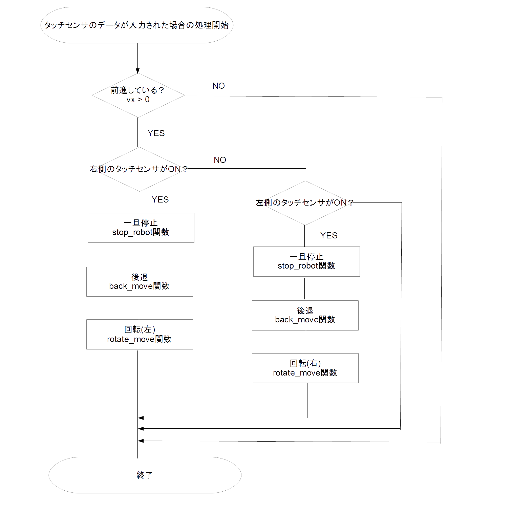
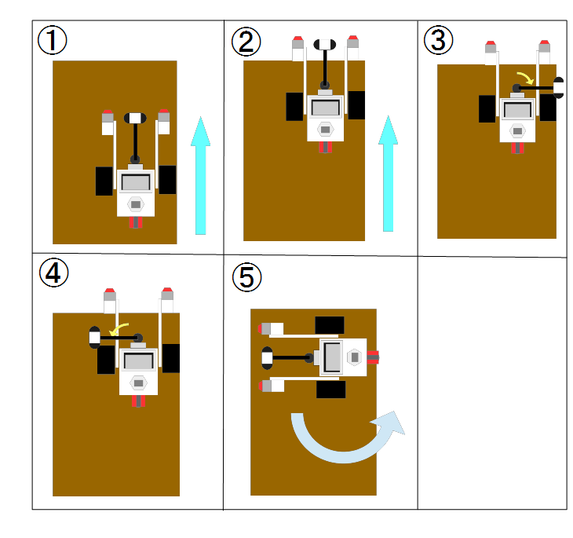
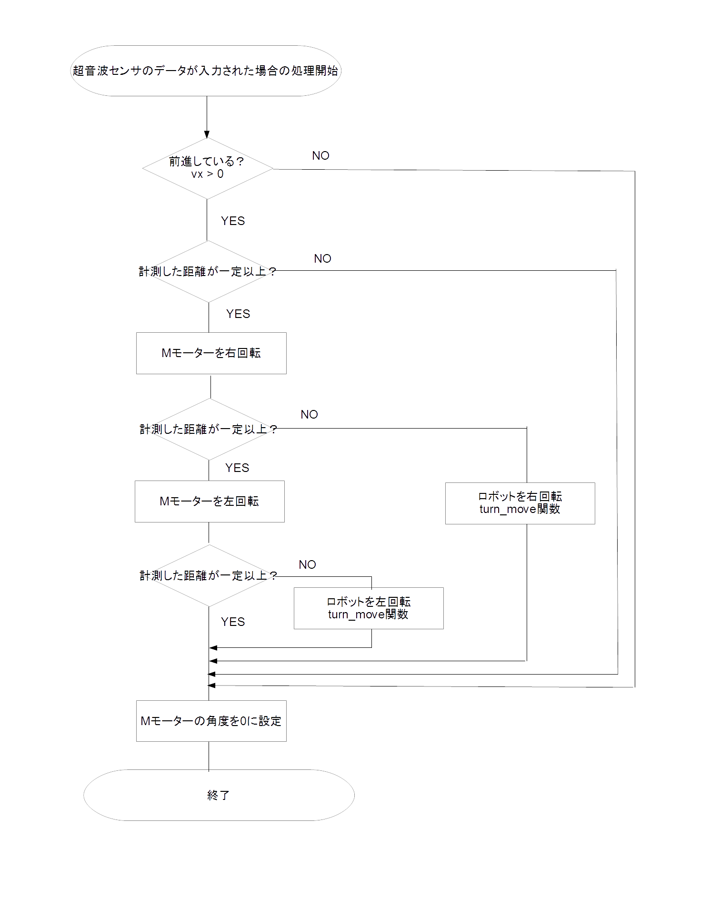

<!-- Title: Control with a Custom RTC -->
#contents

## Beginner Exercise

### Creating the Template Code

This section explains the procedure for connecting a newly created RTC to EducatorVehicle and controlling it.

First, create an RTC on Windows or Ubuntu by following the instructions on [this page](/en/node/4601).

Enter the RTC specifications as follows.

<table class="table-alt">
  <tr>
    <th colspan="3" style="text-align: center;">Basic</th>
  </tr>
  <tr>
    <td>Module Name</td>
    <td colspan="2" style="text-align: center;">EV3SampleCPP or EV3SamplePy</td>
  </tr>
  <tr>
    <td colspan="3" style="text-align: center;">Activities</td>
  </tr>
  <tr>
    <td>Enabled Actions</td>
    <td colspan="2" style="text-align;">onInitialize, onExecute, onActivated, onDeactivated</td>
  </tr>
  <tr>
    <td colspan="3" style="text-align: center;">Data Ports</td>
  </tr>
  <tr>
    <td colspan="3" style="text-align: center;">InPort</td>
  </tr>
  <tr>
    <td>Name</td>
    <td>Data Type</td>
    <td>Description</td>
  </tr>
  <tr>
    <td>touch</td>
    <td>RTC::TimedBooleanSeq</td>
    <td>Touch sensor ON/OFF status</td>
  </tr>
  <tr>
    <td colspan="3" style="text-align: center;">OutPort</td>
  </tr>
  <tr>
    <td>Name</td>
    <td>Data Type</td>
    <td>Description</td>
  </tr>
  <tr>
    <td>target_velocity</td>
    <td>RTC::TimedVelocity2D</td>
    <td>Target velocity</td>
  </tr>
  <tr>
    <td>sound</td>
    <td>RTC::TimedString</td>
    <td>Sound output</td>
  </tr>
  <tr>
    <td colspan="3" style="text-align: center;">Configuration</td>
  </tr>
  <tr>
    <td>Name</td>
    <td>Type</td>
    <td>Description</td>
  </tr>
  <tr>
    <td>forward_velocity</td>
    <td>double</td>
    <td>Forward velocity. Default value: 0.0. Constraint: -0.20&lt;=x&lt;=0.20. Widget: slider. Step: 0.02</td>
  </tr>
  <tr>
    <td>rotate_velocity</td>
    <td>double</td>
    <td>Rotational velocity. Default value: 0.0. Constraint: -3.1&lt;=x&lt;=3.1. Widget: slider. Step: 0.2</td>
  </tr>
  <tr>
    <td colspan="3" style="text-align: center;">Language / Environment</td>
  </tr>
  <tr>
    <td>Language</td>
    <td colspan="2" style="text-align: center;">C++ or Python</td>
  </tr>
</table>

In this RTC, the velocities entered in the configuration parameters `forward_velocity` and `rotate_velocity` are sent to EducatorVehicle through `target_velocity`.

In addition, the touch sensor status is obtained through `touch`. When the touch sensor is turned on, the RTC stops the vehicle and issues a sound command through `sound`.

> Note:
> This RTC is intended to run on EV3. However, it can also be executed on Windows or Ubuntu for testing and training purposes. In that case, it is recommended to generate a Visual Studio or Code::Blocks project with CMake before editing the code.

The procedure for generating projects and building with CMake is described on the following pages:

- [Windows](/en/node/4623)
- [Ubuntu](/en/node/6033)

### Editing the Code

First, edit the `onExecute` function.

The following code sends the values of `forward_velocity` and `rotate_velocity` through `target_velocity`.

C++ (src/EV3SampleCPP.cpp)

```cpp
 RTC::ReturnCode_t EV3SampleCPP::onExecute(RTC::UniqueId ec_id)
 {
 	// Send the velocity configured through the configuration parameters
 	m_target_velocity.data.vx = m_forward_velocity;
 	m_target_velocity.data.va = m_rotate_velocity;
 	setTimestamp(m_target_velocity);
 	m_target_velocityOut.write();
   return RTC::RTC_OK;
 }
```

Python (EV3SamplePy.py)

```python
 	def onExecute(self, ec_id):
 		# Send the velocity configured through the configuration parameters
 		self._d_target_velocity.data.vx = self._forward_velocity[0]
 		self._d_target_velocity.data.vy = 0
 		self._d_target_velocity.data.va = self._rotate_velocity[0]
 		OpenRTM_aist.setTimestamp(self._d_target_velocity)
 		self._target_velocityOut.write()
```

To ensure the robot stops when inactive, send zero velocity in `onDeactivated`.

C++ (src/EV3SampleCPP.cpp)

```cpp
 RTC::ReturnCode_t EV3SampleCPP::onDeactivated(RTC::UniqueId ec_id)
 {
 	// Stop the robot
 	m_target_velocity.data.vx = 0;
 	m_target_velocity.data.vy = 0;
 	m_target_velocity.data.va = 0;
 	setTimestamp(m_target_velocity);
 	m_target_velocityOut.write();

   return RTC::RTC_OK;
 }
```

Python (EV3SamplePy.py)

```python
 	def onDeactivated(self, ec_id):
 		# Stop the robot
 		self._d_target_velocity.data.vx = 0
 		self._d_target_velocity.data.vy = 0
 		self._d_target_velocity.data.va = 0
 		OpenRTM_aist.setTimestamp(self._d_target_velocity)
 		self._target_velocityOut.write()
 		return RTC.RTC_OK
```

According to the [Common Interface Specification](/en/node/3853), the positive X-axis represents the forward direction. Therefore, set the forward velocity in `vx` and the rotational velocity in `va` of the `Velocity2D` type.

For Python, also modify the following parts of the constructor.

Python (EV3SamplePy.py)

```python
 		#self._d_target_velocity = RTC.TimedVelocity2D(*target_velocity_arg)
 		self._d_target_velocity = RTC.TimedVelocity2D(RTC.Time(0,0),RTC.Velocity2D(0,0,0))
```

```python
 		#self._d_sound = RTC.TimedString(*sound_arg)
 		self._d_sound = RTC.TimedString(RTC.Time(0,0),[])
```

At this point, EducatorVehicle can already be operated, so you may skip the following steps if desired.

Next, implement processing to stop the robot when the touch sensor is turned ON.

Since new touch sensor data is not guaranteed to be available every time `onExecute` is called, declare a variable to temporarily store the sensor data.


C++ (include/EV3SampleCPP/EV3SampleCPP.h)

```cpp
 private:
 	 bool m_last_sensor_data[2];	/* Variable for storing sensor data */
```

Python (EV3SamplePy.py)

```python
 	def __init__(self, manager):
 		OpenRTM_aist.DataFlowComponentBase.__init__(self, manager)

 		# Variable for storing touch sensor data
 		self._last_sensor_data = [False, False]
```

Next, add processing to `onExecute` that stops the robot and outputs a sound when the touch sensor is ON.

C++ (src/EV3SampleCPP.cpp)

```cpp
 RTC::ReturnCode_t EV3SampleCPP::onExecute(RTC::UniqueId ec_id)
 {
 	// Start here

 	// If new data has been received, store it in m_last_sensor_data
 	if (m_touchIn.isNew())
 	{
 		m_touchIn.read();
 		if (m_touch.data.length() == 2)
 		{
 			for (int i = 0; i < 2; i++)
 			{
 				// Play a sound when the touch sensor changes from OFF to ON
 				if (!m_last_sensor_data[i] && m_touch.data[i])
 				{
 					m_sound.data = "beep";
 					setTimestamp(m_sound);
 					m_soundOut.write();

 				}
 				m_last_sensor_data[i] = m_touch.data[i];
 			}
 		}
 	}

 	// Prevent forward movement when the touch sensor is ON
 	if (m_forward_velocity > 0)
 	{
 		for (int i = 0; i < 2; i++)
 		{
 			if (m_last_sensor_data[i])
 			{
 				m_target_velocity.data.vx = 0;
 				m_target_velocity.data.vy = 0;
 				m_target_velocity.data.va = 0;
 				setTimestamp(m_target_velocity);
 				m_target_velocityOut.write();
 				return RTC::RTC_OK;
 			}
 		}
 	}

 	// End here

 	// Send the velocity configured through the configuration parameters
 	m_target_velocity.data.vx = m_forward_velocity;

  (omitted below)
```

Python (EV3SamplePy.py)

```python
	def onExecute(self, ec_id):

 		# Start here

 		# If new data has been received, store it in _last_sensor_data
 		if self._touchIn.isNew():
 			data = self._touchIn.read()
 			if len(data.data) == 2:
 				for i in range(2):

 					# Play a sound when the touch sensor changes from OFF to ON
 					if not self._last_sensor_data[i] and data.data[i]:
 						self._d_sound.data = "beep"
 						OpenRTM_aist.setTimestamp(self._d_sound)
 						self._soundOut.write()

 				self._last_sensor_data = data.data[:]

 		# Prevent forward movement when the touch sensor is ON
 		if self._forward_velocity[0] > 0:
 			for d in self._last_sensor_data:
 				if d:
 					self._d_target_velocity.data.vx = 0
 					self._d_target_velocity.data.vy = 0
 					self._d_target_velocity.data.va = 0
 					OpenRTM_aist.setTimestamp(self._d_target_velocity)
 					self._target_velocityOut.write()
 					return RTC.RTC_OK

		# End here

		# Send the velocity configured through the configuration parameters
		self._d_target_velocity.data.vx = self._forward_velocity[0]

 (omitted below)
```

### Build

After editing the source code, build the project if you are using C++.

If you intend to run it on EV3, perform the build in a cross-compilation environment.

Move to the source code directory and execute the following commands:

```bash
 cd EV3SampleCPP
 cmake .
 make
```

If you are editing with Visual Studio or Code::Blocks, perform the build through the GUI.

Transfer the generated `src/EV3SampleCPPComp` to the EV3.

*Do not transfer it when running on Windows or Ubuntu.*

```bash
 sftp robot@<IP address>
 sftp> put EV3SampleCPP/src/EV3SampleCPPComp
```

For the Python version, also transfer `EV3SamplePy.py`.

```bash
 sftp robot@<IP address>
 sftp> put EV3SamplePy/EV3SamplePy.py
```

If `cmake` is not installed, execute:

```bash
 sudo apt-get install cmake
```

### Starting the RTC

Once the build is complete, start the RTC.

#### C++

```bash
 EV3SampleCPPComp&
```

#### Python

```bash
 python EV3SamplePy.py&
```

If you are running the RTC on Windows, double-click `EV3SampleCPPComp.exe` (or `EV3SamplePy.py`).

Next, start EducatorVehicle with the following command:

```bash
 Compomnents/EducatorVehicleComp&
```

### Verifying Operation

First, connect the data ports for testing.

Start RT System Editor on Windows.

Add the Name Server running on the EV3 to the RT System Editor view.

Press the **Add Name Server** button and enter the EV3 IP address.

<div align="center"><a href="https://raw.githubusercontent.com/Nobu19800/RaspberryPiMouseRTSystem_script/master/rpm11.png"></a></div>

After adding the Name Server, connect the data ports as shown below.

<div align="center"><a href="ev3_sample.png"></a></div>

<table class="table-alt">
  <tr>
    <th colspan="2" style="text-align: center;">Port Connections</th>
  </tr>
  <tr>
    <td>EV3SampleCPP0 (EV3SamplePy0)</td>
    <td>EducatorVehicle0</td>
  </tr>
  <tr>
    <td>target_velocity</td>
    <td>velocity2D</td>
  </tr>
  <tr>
    <td>touch</td>
    <td>touch</td>
  </tr>
  <tr>
    <td>sound</td>
    <td>sound</td>
  </tr>
</table>

After activating the RTC, operation will begin.

First, try controlling EducatorVehicle by changing the configuration parameters of EV3SampleCPP (EV3SamplePy).

In RT System Editor, select EV3SampleCPP0 (EV3SamplePy0) and choose **Edit** in the Configuration View.

<div align="center"><a href="ev3_conf.png"></a></div>

The following window will appear.

<div align="center"><a href="ev3_conf2.png"></a></div>

You can control the EV3 using the `forward_velocity` and `rotate_velocity` sliders.

Next, verify that the robot stops when the touch sensor is activated.

Touch the touch sensor with an object and confirm that the robot stops.

Also verify that a sound is played when it stops.

## Advanced Exercise (Intermediate Level)

Next, implement obstacle avoidance behavior in which the robot backs up and then rotates when the touch sensor is activated.

The avoidance maneuver is performed by executing the following processing whenever touch sensor data is received.

<div align="center"><a href="flowChart_4.png"></a></div>

### Configuration Parameters

Add the following configuration parameters.

<table class="table-alt">
  <tr>
    <th colspan="3" style="text-align: center;">Configuration</th>
  </tr>
  <tr>
    <td>Name</td>
    <td>Type</td>
    <td>Description</td>
  </tr>
  <tr>
    <td>back_speed</td>
    <td>double</td>
    <td>Reverse speed. Default value: 0.1</td>
  </tr>
  <tr>
    <td>back_time</td>
    <td>double</td>
    <td>Duration of reverse movement. Default value: 1.0</td>
  </tr>
  <tr>
    <td>rotate_speed</td>
    <td>double</td>
    <td>Rotation speed. Default value: 0.8</td>
  </tr>
  <tr>
    <td>rotate_time</td>
    <td>double</td>
    <td>Duration of rotational movement. Default value: 2.0</td>
  </tr>
</table>


### Implementing Functions

Implement the following functions.

<table class="table-alt">
  <tr>
    <th>Function Name</th>
    <th>Description</th>
    <th>Arguments</th>
  </tr>
  <tr>
    <td>stop_robot</td>
    <td>Stops the robot</td>
    <td>None</td>
  </tr>
  <tr>
    <td>back_move</td>
    <td>Moves backward</td>
    <td>None</td>
  </tr>
  <tr>
    <td>rotate_move</td>
    <td>Rotates the robot</td>
    <td>dir (rotation direction)</td>
  </tr>
</table>

#### stop_robot Function

The `stop_robot` function is implemented as follows.

It sets the target velocity to zero and sends it.

```cpp
 void ControlEducatorVehicle::stop_robot()
 {
 	m_target_velocity_out.data.vx = 0;
 	m_target_velocity_out.data.vy = 0;
 	m_target_velocity_out.data.va = 0;
 	setTimestamp(m_target_velocity_out);
 	m_target_velocity_outOut.write();
 }
```

#### back_move Function

The `back_move` function is implemented as follows.

After outputting a reverse velocity command, it waits for a specified amount of time using the `sleep` function. This achieves backward movement at `back_speed` for a duration of `back_time`.

```cpp
 void ControlEducatorVehicle::back_move()
 {
 	// Command reverse movement
 	m_target_velocity_out.data.vx = -m_back_speed;
 	m_target_velocity_out.data.vy = 0;
 	m_target_velocity_out.data.va = 0;
 	setTimestamp(m_target_velocity_out);
 	m_target_velocity_outOut.write();

 	// Wait for a fixed period
 	double sec, usec;
 	usec = modf(m_back_time, &sec);

 	coil::TimeValue ts((int)sec, (int)(usec*1000000.0));
 	coil::sleep(ts);

 	// Stop temporarily
 	stop_robot();
 }
```

> Note:
> Waiting with `sleep()` inside `onExecute()` is generally not desirable because operations from RT System Editor and other tools become unavailable during the wait period.
>
> However, in this exercise, implementing the behavior without stopping the execution context would significantly increase complexity, so this approach is used.

#### rotate_move Function

The `rotate_move` function is implemented as follows.

Similar to backward movement, it performs rotational movement at the speed specified by `rotate_speed` for the duration specified by `rotate_time`.

```cpp
 void ControlEducatorVehicle::rotate_move(bool dir)
 {
 	// Command rotational movement
 	m_target_velocity_out.data.vx = 0;
 	m_target_velocity_out.data.vy = 0;

 	// Rotate left
 	if (dir)m_target_velocity_out.data.va = m_rotate_speed;

 	// Rotate right
 	else m_target_velocity_out.data.va = -m_rotate_speed;

 	setTimestamp(m_target_velocity_out);
 	m_target_velocity_outOut.write();

 	// Wait for a fixed period
 	double sec, usec;
 	usec = modf(m_rotate_time, &sec);

 	coil::TimeValue ts((int)sec, (int)(usec*1000000.0));
 	coil::sleep(ts);

 	// Stop temporarily
 	stop_robot();
 }
```

### Implementing the onExecute Function

Finally, implement obstacle avoidance behavior according to the flowchart.

```cpp
 RTC::ReturnCode_t ControlEducatorVehicle::onExecute(RTC::UniqueId ec_id)
 {
 	// Store the target velocity in variables
 	if (m_target_velocity_inIn.isNew())
 	{
 		m_target_velocity_inIn.read();
 		vx = m_target_velocity_in.data.vx;
 		vy = m_target_velocity_in.data.vy;
 		va = m_target_velocity_in.data.va;
 	}

 	// Process touch sensor input
 	if (m_touchIn.isNew())
 	{
 		while(m_touchIn.isNew())m_touchIn.read();

 		if (m_touch.data.length() >= 2)
 		{
 			touch_r = m_touch.data[0];
 			touch_l = m_touch.data[1];

 			// Only while moving forward
 			if (vx > 0)
 			{
 				// Left touch sensor
 				if (m_touch.data[0])
 				{
 					// Stop → Reverse → Rotate right
 					stop_robot();
 					back_move();
 					rotate_move(true);
 				}

 				// Right touch sensor
 				else if (m_touch.data[1])
 				{
 					// Stop → Reverse → Rotate left
 					stop_robot();
 					back_move();
 					rotate_move(false);
 				}
 			}
 		}
 	}

 	m_target_velocity_out.data.vx = vx;
 	m_target_velocity_out.data.vy = vy;
 	m_target_velocity_out.data.va = va;

 	setTimestamp(m_target_velocity_out);

 	// Send target velocity
 	m_target_velocity_outOut.write();

 	return RTC::RTC_OK;
 }
```

## Advanced Exercise (Advanced Level)

In this section, you will create an RTC that detects the distance to the ground using an ultrasonic sensor and prevents the robot from falling off an edge.

<div align="center"><a href="ev3_sensor.png"></a></div>

When the height to the ground detected by the ultrasonic sensor exceeds a specified threshold, execute the following processing.

<div align="center"><a href="flowChart2.png"></a></div>

### Data Ports and Configuration Parameters

Add the following data ports and configuration parameters.

<table class="table-alt">
  <tr>
    <th colspan="3" style="text-align: center;">Data Ports</th>
  </tr>
  <tr>
    <td colspan="3" style="text-align: center;">InPort</td>
  </tr>
  <tr>
    <td>Name</td>
    <td>Data Type</td>
    <td>Description</td>
  </tr>
  <tr>
    <td>ultrasonic</td>
    <td>RTC::RangeData</td>
    <td>Assumes the ultrasonic sensor is a range sensor and stores distance data in element 1</td>
  </tr>
  <tr>
    <td>current_pose</td>
    <td>RTC::TimedPose2D</td>
    <td>Current position and orientation</td>
  </tr>
  <tr>
    <td colspan="3" style="text-align: center;">OutPort</td>
  </tr>
  <tr>
    <td>Name</td>
    <td>Data Type</td>
    <td>Description</td>
  </tr>
  <tr>
    <td>angle</td>
    <td>RTC::TimedDouble</td>
    <td>Angle of Motor M</td>
  </tr>
  <tr>
    <td colspan="3" style="text-align: center;">Configuration</td>
  </tr>
  <tr>
    <td>Name</td>
    <td>Type</td>
    <td>Description</td>
  </tr>
  <tr>
    <td>sensor_height</td>
    <td>double</td>
    <td>Maximum ground height considered safe for landing. Default value: 0.20</td>
  </tr>
  <tr>
    <td>medium_motor_range</td>
    <td>double</td>
    <td>Operating range of Motor M. Default value: 1.6</td>
  </tr>
</table>

### Implementing Functions

Implement the following functions:

- `search_ground`
  - Searches for safe ground using the ultrasonic sensor.

- `turn_move`
  - Rotates the robot by a specified angle.


### Implementing the Functions

Implement the `search_ground` function, which searches for a safe landing surface using the ultrasonic sensor, and the `turn_move` function, which rotates the robot by a specified angle.

```cpp
 bool ControlEducatorVehicle::search_ground(double &a)
 {
 	// Rotate Motor M to the right
 	m_angle.data = (-1)*m_medium_motor_range;
 	setTimestamp(m_angle);
 	m_angleOut.write();

 	coil::TimeValue ts(2, 0);
 	coil::sleep(ts);

 	// Check whether the distance to the ground is below the threshold
 	if (m_ultrasonicIn.isNew())
 	{
 		while(m_ultrasonicIn.isNew())m_ultrasonicIn.read();

 		if (m_ultrasonic.ranges.length() >= 1)
 		{
 			if (m_ultrasonic.ranges[0] < m_sensor_height)
 			{
 				// Safe ground detected.
 				// Store the direction where safe ground was found.
 				a = m_medium_motor_range;
 				return true;
 			}
 		}
 	}

 	// Rotate Motor M to the left
 	m_angle.data = (-1)*-m_medium_motor_range;
 	setTimestamp(m_angle);
 	m_angleOut.write();

 	ts = coil::TimeValue(4, 0);
 	coil::sleep(ts);

 	// Check whether the distance to the ground is below the threshold
 	if (m_ultrasonicIn.isNew())
 	{
 		while(m_ultrasonicIn.isNew())m_ultrasonicIn.read();

 		if (m_ultrasonic.ranges.length() >= 1)
 		{
 			if (m_ultrasonic.ranges[0] < m_sensor_height)
 			{
 				// Safe ground detected.
 				// Store the direction where safe ground was found.
 				a = -m_medium_motor_range;
 				return true;
 			}
 		}
 	}

 	m_angle.data = 0;
 	setTimestamp(m_angle);
 	m_angleOut.write();

 	return false;
 }
```

### turn_move Function

```cpp
 void ControlEducatorVehicle::turn_move(double a)
 {

 	int max_count = 100;
 	coil::TimeValue ts(0,10000);

 	// Obtain the current orientation
 	double spos = 0;

 	for (int i = 0; i < max_count; i++)
 	{
 		if (m_current_poseIn.isNew())
 		{
 			m_current_poseIn.read();
 			spos = m_current_pose.data.heading;
 			break;
 		}

 		coil::sleep(ts);

 		// Cancel rotation if no data is received within the timeout period
 		if (i == max_count - 1)return;
 	}

 	max_count = 1000;

 	// Start rotational movement
 	double data_new_count = 0;
 	double max_data_new_count = 100;

 	for (int i = 0; i < max_count; i++)
 	{
 		if (m_current_poseIn.isNew())
 		{
 			while(m_current_poseIn.isNew())m_current_poseIn.read();

 			// Set target angular velocity proportional to orientation error
 			double pos = m_current_pose.data.heading - spos;
 			double k = 1;

 			m_target_velocity_out.data.vx = 0;
 			m_target_velocity_out.data.vy = 0;

 			double diff = (a - pos);
 			double vela = k * diff;

 			if(vela > m_rotate_speed)vela = m_rotate_speed;
 			if(vela < -m_rotate_speed)vela = -m_rotate_speed;

 			// Output target velocity
 			m_target_velocity_out.data.va = vela;

 			setTimestamp(m_target_velocity_out);
 			m_target_velocity_outOut.write();

 			// Stop when the orientation error becomes sufficiently small
 			if(sqrt(pow(diff,2)) < 0.03)
 			{
 				stop_robot();
 				return;
 			}

 			data_new_count = 0;
 		}
 		else
 		{
 			// End processing if no data is received for a certain period
 			data_new_count += 1;

 			if(data_new_count > max_data_new_count)
 			{
 				stop_robot();
 				return;
 			}

 			coil::sleep(ts);
 		}
 	}

 	stop_robot();
 }
```

### onExecute Function

Finally, implement `onExecute` as shown below.

```cpp
 RTC::ReturnCode_t ControlEducatorVehicle::onExecute(RTC::UniqueId ec_id)
 {
 	// Store target velocity in variables
 	if (m_target_velocity_inIn.isNew())
 	{
 		m_target_velocity_inIn.read();
 		vx = m_target_velocity_in.data.vx;
 		vy = m_target_velocity_in.data.vy;
 		va = m_target_velocity_in.data.va;
 	}

 	// Start processing when ultrasonic sensor data is received
 	if (m_ultrasonicIn.isNew())
 	{
 		while(m_ultrasonicIn.isNew())m_ultrasonicIn.read();

 		if (m_ultrasonic.ranges.length() >= 1)
 		{
 			range = m_ultrasonic.ranges[0];

 			// Check whether the robot is moving forward
 			if (vx > 0)
 			{
 				// Check whether the detected distance to the ground exceeds the threshold
 				if (m_ultrasonic.ranges[0] > m_sensor_height)
 				{
 					// Set stop flag to true
 					// (The flag will be reset when the next sensor reading is below the threshold)
 					stop_flag = true;

 					// Stop temporarily
 					stop_robot();

 					// Set Motor M angle to zero
 					m_angle.data = 0;
 					setTimestamp(m_angle);
 					m_angleOut.write();

 					// Rotate Motor M and search for safe ground
 					double a = 0;
 					bool ret = search_ground(a);

 					// Return Motor M to the center position
 					m_angle.data = 0;
 					setTimestamp(m_angle);
 					m_angleOut.write();

 					// If safe ground is found, perform a rotation maneuver
 					if (ret)
 					{
 						turn_move(a);
 					}

 					coil::TimeValue ts(2, 0);
 					coil::sleep(ts);
 				}

 				// If the detected distance is below the threshold,
 				// clear the stop flag
 				else
 				{
 					stop_flag = false;
 				}
 			}
 		}
 	}
```

```cpp
 	// Stop if the stop flag is true
 	if (stop_flag)
 	{
 		m_target_velocity_out.data.vx = 0;
 		m_target_velocity_out.data.vy = 0;
 		m_target_velocity_out.data.va = 0;
 	}

 	// If the stop flag is false, output the target velocity as-is
 	else
 	{
 		m_target_velocity_out.data.vx = vx;
 		m_target_velocity_out.data.vy = vy;
 		m_target_velocity_out.data.va = va;
 	}

 	setTimestamp(m_target_velocity_out);
 	m_target_velocity_outOut.write();

   return RTC::RTC_OK;
 }
```

## Saving the RT System

The RT system can also be saved from RT System Editor, but `rtshell` can be used to automate restoration of the RT system.

After connecting the ports and setting the configuration parameters in RT System Editor, execute the `rtcryo` command.

```bash
 rtcryo localhost -o testSystem.rtsys
```

This saves the RT system information to a file named `testSystem.rtsys`.

However, when using RTCs registered with multiple Name Servers, as in this exercise, you must specify multiple Name Servers as follows.

```bash
 rtcryo localhost 192.168.11.1 -o testSystem.rtsys
```

To restore the saved RT system, use the `rtresurrect` command.

```bash
 rtresurrect testSystem.rtsys
```

To activate the RTCs, use the `rtstart` command.

```bash
 rtstart testSystem.rtsys
```

To deactivate the RTCs, use the `rtstop` command.

```bash
 rtstop testSystem.rtsys
```

To disconnect the ports, use the `rtteardown` command.

```bash
 rtteardown testSystem.rtsys
```

One thing to note is that, by default, RTCs are registered under `.host_cxt` using the host name on the Name Server.

Since the host name differs depending on the environment, an RT system saved with this procedure may not be reproducible in another environment.

Therefore, by editing `rtc.conf` so that RTCs are registered directly under the root of the Name Server, the RT system can be restored in other environments as well.

```text
 naming.formats: %n.rtc
```
