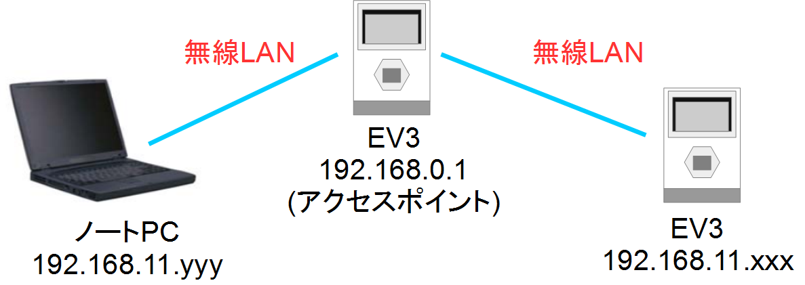
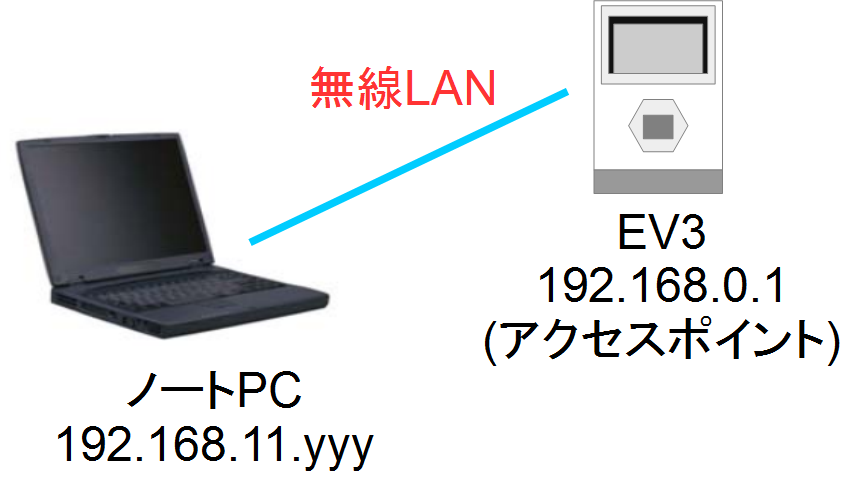
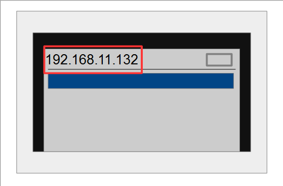
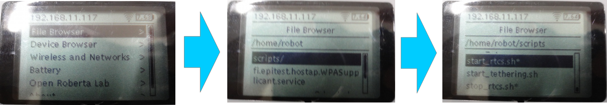
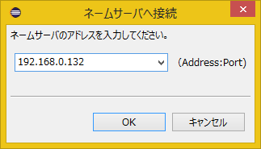
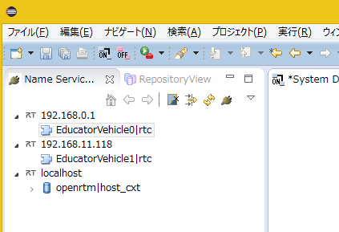
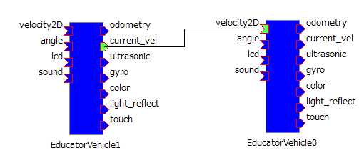
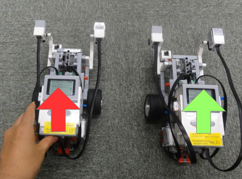

-------jp page!!-------

<!-- Title: チュートリアル(EV3、第3部) -->
#contents

このページでは2台のEV3を連携したRTシステムの構築を行います。

1台目のEV3をアクセスポイントとして、ノートPCと2台目のEV3をアクセスポイントに接続します。

※EV3(1台目)は奇数番号のものを配布します。EV3のシールに記載された番号を確認してください。
EV3(2台目)はEV3(1台目)の次の番号のものを配布します。(例：EV3(1台目)：7、EV3(2台目)：8)

<br>

<div align="center"><a href="tutorial_ev3_irex23.png"></a></div>
<br>

## EV3(2台目)の組立て
[第二部]({{ site.baseurl }}/ja/doc/casestudy/lego_mindstorm/lego_rtm_seminar/tutorial_ev3_win)の手順に従って2台目のEducator Vehicleを組み立ててください。

## EV3との接続
### ノートPCとEV3(1台目)の接続
[第二部]({{ site.baseurl }}/ja/doc/casestudy/lego_mindstorm/lego_rtm_seminar/tutorial_ev3_win)の、実機での動作確認まで完了してください。
この時点でノートPCとアクセスポイントのEV3が接続されているはずです。


<br>

<div align="center"><a href="tutorial_ev3_irex24.png"></a></div>
<br>


### EV3(1台目)とEV3(2台目)の接続

まずはEV3(2台目)の電源を投入してください。
起動後にEV3(1台目)に自動接続します。
自動接続できた場合は、EV3の画面左上にIPアドレスが表示されます。
IPアドレスは192.168.11.yyyが表示されます。


<br>

<div align="center"><a href="tutorial_ev3_irex25.png"></a></div>
<br>


他のIPアドレスが表示されている場合は、配布したEV3の番号が違う可能性があるため確認してください。

#### ネームサーバー、RTCの起動
EV3(2台目)の画面上の操作でネームサーバーとRTCを起動します。

EV3 の操作画面から「File Browser」→「scripts」を選択してください。


ネームサーバー、RTCは**start_rtcs.sh**のスクリプトを実行することで起動します。

```
 ------------------------------
 192.168.11.yyy
 ------------------------------
         File Browser
 ------------------------------
 /home/robot/scripts
 ------------------------------
 ../
 Component/
 ・・
 [start_rtcs.sh                 ]
 ------------------------------
```


<br>

<div align="center"><a href="tutorial_ev3_irex32.png"></a></div>
<br>


### ネームサーバー追加
RTシステムエディタから、192.168.11.yyyのネームサーバーに接続してください。


<br>

<div align="center"><div align="center"><a href="tutorial_raspimouse0.png"></a></div>;  <div align="center"><a href="tutorial_ev3_irex22.png"></a></div>;</div>
<br>
<br>


この時点でRTシステムエディタのネームサービスビューにはlocalhost、192.168.0.1、192.168.11.yyyのネームサーバーが登録されています。
192.168.11.yyyのネームサーバーに登録されているRTCの名前は**EducatorVehicle1**となります。


<br>

<div align="center"><a href="tutorial_ev3_irex30.png"></a></div>
<br>

- localhost
  - RobotController0
- 192.168.0.1
  - EducatorVehicle0
- 192.168.11.yyy
  - EducatorVehicle1


## 動作確認

EducatorVehicle0(192.168.0.1)とEducatorVehicle1(192.168.11.yyy)をシステムダイアグラム上で接続してください。
EducatorVehicle1の現在の速度出力をEducatorVehicle0の目標速度入力に接続することで、EV3(2台目)の動きにEV3(1台目)が追従するようになります。


<br>

<div align="center"><a href="tutorial_ev3_irex31.png"></a></div>
<br>


RTCをアクティベートして2台目のEducator Vehicleの車輪を転がすと、1台目のEducator Vehicleがそれに合わせて動作します。


<br>

<div align="center"><a href="tutorial_ev3_irex28.png"></a></div>
<br>


## 自由課題
これで実習は一通り終了ですが、時間が余っている場合は以下のような課題に挑戦してみてください。


### 例
- EV3(2台目)のタッチセンサのオンオフでEV3(1台目)を操作

- [ジョイスティックコンポーネントで2台同時に操作]({{ site.baseurl }}/ja/doc/casestudy/lego_mindstorm/lego_tutorial_ev3#toc18)

ジョイスティックコンポーネントはOpenRTM-aist Python版のサンプルにあります(**TkJoyStickComp.py**)。
TkJoyStickComp.pyのアウトポートのデータ型は**TimedFloatSeq**型であるため、**TimedVelocity2D**型に変換するRTCを作成する必要があります。


- [EV3をしゃべらせる]({{ site.baseurl }}/ja/doc/casestudy/lego_mindstorm/lego_ev3_rtc_install#toc2)

EducatorVehicleRTCの**sound**という名前のインポートに文字列(TimedString型)を入力すると、EV3が発声します。


文字列(const char*)をデータポートで出力する際は**CORBA::string_dup関数**で文字列をコピーする必要があります。

```
 m_out.data= CORBA::string_dup("abc");
```


- 各種センサの利用(カラーセンサ、超音波センサ、ジャイロセンサ)

-------jp page!!-------
