-------jp page!!-------

<!-- Title: チュートリアル(EV3、Ubuntu、第2部) -->
#contents

## はじめに

このページではシミュレーター上の Educator Vehicleを操作するためのコンポーネントの作成手順を説明します。
Educator VehicleはレゴマインドストームEV3の組み立て例の一つです。

<div align="center"><a href="ev32_2.png">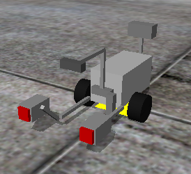</a></div>


## 資料のダウンロード
まずは資料をダウンロードしてください。

- [RTM_Tutorial_EV3.zip](https://github.com/OpenRTM/RTM_Tutorial_EV3/releases/download/iREX2019_0.01/RTM_Tutorial_EV3.zip)

付属のシミュレータで以下の Educator Vehicle 改のシミュレーションができます。

<div align="center"><a href="s_DSC00443.JPG">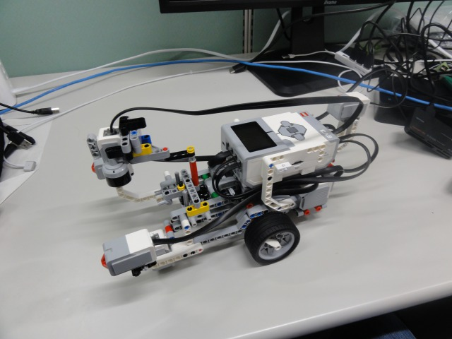</a></div>

Lモーター、Mモーターの制御だけではなく、タッチセンサー、ジャイロセンサー、超音波センサーのシミュレーションも可能になっています。


### 作成する RTコンポーネント

- RobotController コンポーネント

EV3Simulator コンポーネントと接続してシミュレーター上のロボットを操作するためのコンポーネントです。

## RobotController コンポーネントの作成

GUI(スライダー)によりシミュレーター上のロボットの操作を行い、タッチセンサーがオンの時には自動的に停止するコンポーネントの作成を行います。

<div align="center"><a href="tutorial_ev3_irex1.png"></a></div>

### 作成手順
作成手順は以下の通りです。

- 開発環境の確認
- コンポーネントの仕様を決める
- RTC Builderによるソースコードのひな型コードの作成
- ソースコードの編集
- コンポーネントの動作確認

### 動作環境・開発環境
Linux (ここでは Ubuntu 18.04 を仮定) 上に開発環境を構築します。


#### OpenRTM-aistのインストール
```
 $ wget https://raw.githubusercontent.com/OpenRTM/OpenRTM-aist/master/scripts/pkg_install_ubuntu.sh
 $ pkg_install_ubuntu.sh -l all --yes
```

#### JDKのインストール

```
 # Ubuntu 18.04、18.10の場合
 $ sudo apt-get install openjdk-8-jdk
 # Ubuntu 16.04の場合
 $ sudo apt-get install default-jdk
```

Ubuntu 18.04、18.10の場合は以下のコマンドでjava8に切り替えます。

```
 $ sudo update-alternatives --config java
```


<span style="color:red;">eclipse起動後、RTSystemEditor でネームサーバに接続できない場合があります。その場合、/etc/hosts の localhost の行に自ホスト名を追記してください。</span>;

```
 $ hostname
 ubuntu1404 ← ホスト名は ubuntu1404
 $ sudo vi /etc/hosts
```

```
 127.0.0.1       localhost
 を以下のように変更
 127.0.0.1       localhost ubuntu1404
```


#### gitのインストール

```
 $ sudo apt-get install git
```

#### cmake-guiのインストール

```
 $ sudo apt-get install cmake-qt-gui
```

#### Code::Blocks のインストール
Code::Blocks は C/C++ に対応した統合開発環境です。
以下のコマンドでインストールできます。

```
 $ sudo apt-get install codeblocks
```

最新版を入手したい場合は以下のコマンドを入力します。

```
 $ sudo add-apt-repository ppa:damien-moore/codeblocks-stable
 $ sudo apt-get update
 $ sudo apt-get install codeblocks
```

#### Premake、GLUTのインストール
ODEのビルドに必要です。

```
 $ sudo apt-get install premake4 freeglut3-dev
```

#### EV3Simulator コンポーネント
シミュレーターコンポーネントについては手動でビルドを行います。
以下のコマンドを入力してください。

```
 $ wget https://raw.githubusercontent.com/OpenRTM/RTM_Tutorial_EV3/master/script/install_ev3_simulator.sh
 $ sudo sh install_ev3_simulator.sh
```


インターネットに接続できない環境で講習会を実施している場合がありますので、その場合は配布の USBメモリー内のスクリプトを起動してください。

```
 $ sudo sh install_ev3_simulator_usb.sh
```


### コンポーネントの仕様

RobotController は目標速度を出力するアウトポート、センサー値を入力するインポート、目標速度を設定するコンフィギュレーションパラメーターを持っています。

<table class="table-alt">
  <tr>
    <th>コンポーネント名称</th>
    <th><strong>RobotController</strong></th>
  </tr>
  <tr>
    <td colspan="2" style="text-align: center;"><strong>InPort</strong></td>
  </tr>
  <tr>
    <td>ポート名</td>
    <td>in</td>
  </tr>
  <tr>
    <td>型</td>
    <td>TimedBooleanSeq</td>
  </tr>
  <tr>
    <td>説明</td>
    <td>センサー値</td>
  </tr>
  <tr>
    <td colspan="2" style="text-align: center;"><strong>OutPort</strong></td>
  </tr>
  <tr>
    <td>ポート名</td>
    <td>out</td>
  </tr>
  <tr>
    <td>型</td>
    <td>TimedVelocity2D</td>
  </tr>
  <tr>
    <td>説明</td>
    <td>目標速度</td>
  </tr>
  <tr>
    <td colspan="2" style="text-align: center;"><strong>Configuration</strong></td>
  </tr>
  <tr>
    <td>パラメーター名</td>
    <td>speed_x</td>
  </tr>
  <tr>
    <td>型</td>
    <td>double</td>
  </tr>
  <tr>
    <td>デフォルト値</td>
    <td>0.0</td>
  </tr>
  <tr>
    <td>制約</td>
    <td>-1.5<x<1.5</td>
  </tr>
  <tr>
    <td>Widget</td>
    <td>slider</td>
  </tr>
  <tr>
    <td>Step</td>
    <td>0.01</td>
  </tr>
  <tr>
    <td>説明</td>
    <td>直進速度の設定</td>
  </tr>
  <tr>
    <td colspan="2" style="text-align: center;"><strong>Configuration</strong></td>
  </tr>
  <tr>
    <td>パラメーター名</td>
    <td>speed_r</td>
  </tr>
  <tr>
    <td>型</td>
    <td>double</td>
  </tr>
  <tr>
    <td>デフォルト値</td>
    <td>0.0</td>
  </tr>
  <tr>
    <td>制約</td>
    <td>-2.0<x<2.0</td>
  </tr>
  <tr>
    <td>Widget</td>
    <td>slider</td>
  </tr>
  <tr>
    <td>Step</td>
    <td>0.01</td>
  </tr>
  <tr>
    <td>説明</td>
    <td>回転速度の設定</td>
  </tr>
</table>


#### TimedVelocity2D 型について
2次元平面上の移動ロボットの移動速度を格納するデータ型である TimedVelocity2D 型を使用します。

```
     struct Velocity2D
     {
           /// Velocity along the x axis in metres per second.
           double vx;
           /// Velocity along the y axis in metres per second.
           double vy;
           /// Yaw velocity in radians per second.
           double va;
     };
 
 
     struct TimedVelocity2D
     {
           Time tm;
           Velocity2D data;
     };
```


このデータ型にはX軸方向の速度**vx**、Y軸方向の速度**vy**、Z軸周りの回転速度**va**が格納できます。

**vx**、**vy**、**va**はロボット中心座標系での速度を表しています。

<br>

<div align="center"><a href="tutorial_ev3_irex3.png">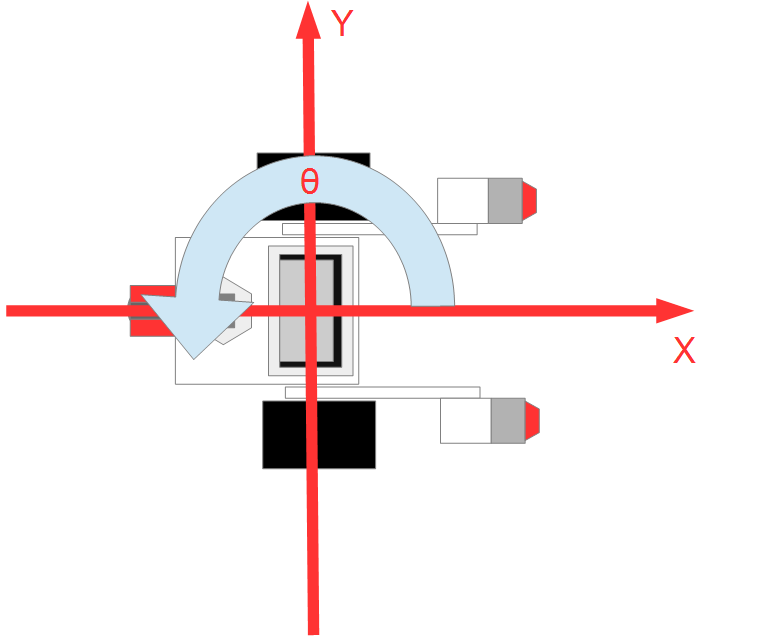</a></div>
<br>

**vx**はX方向の速度、**vy**はY方向の速度、**va**はZ軸周りの角速度です。

Educator Vehicle改のように2個の車輪が左右に取り付けられているロボットの場合、横滑りしないと仮定すると**vy**は0になります。

直進速度**vx**、回転速度**va**を指定することでロボットの操作を行います。

#### タッチセンサーについて

<br>

<div align="center"><a href="tutorial_ev3_irex2.png">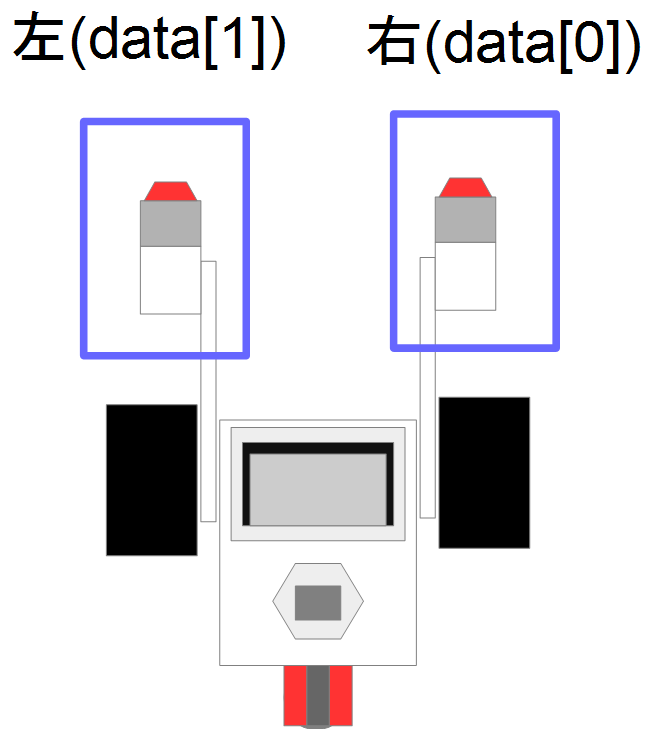</a></div>
<br>


### RobotController コンポーネントのひな型コードの生成

RobotController コンポーネントのひな型コードの生成は、RTCBuilder を用いて行います。

#### RTCBuilder の起動
Eclipse では、各種作業を行うフォルダーを「ワークスペース」(Work Space)とよび、原則としてすべての生成物はこのフォルダーの下に保存されます。
ワークスペースはアクセスできるフォルダーであれば、どこに作っても構いませんが、このチュートリアルでは以下のワークスペースを仮定します。

- /home/ユーザー名/workspace

まずは Eclipse を起動します。
OpenRTP を展開したディレクトリーに移動して以下のコマンドを入力します。

```
 $ openrtp
```

最初にワークスペースの場所を尋ねられますので、上記のワークスペースを指定してください。


<div align="center"><a href="workspace_ubuntu.png">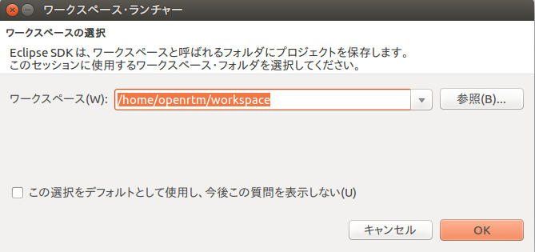</a></div>


すると、以下のような Welcome ページが表示されます。

<br>


<div align="center"><a href="install41.png"></a></div>
<div align="center"><strong>Eclipse の初期起動時の画面</strong></div>

Welcome ページはいまは必要ないので左上の「×」ボタンをクリックして閉じてください。

右上の [Open Perspective] ボタンをクリックしてください。

<div align="center"><a href="install42.png"></a></div>
<div align="center"><strong>パースペクティブの切り替え</strong></div>

「RTC Builder」を選択することで、RTCBuilderが起動します。メニューバーに「カナヅチとRT」の RTCBuilder のアイコンが現れます。

<div align="center"><a href="robomech2018_3.jpg"></a></div>
<div align="center"><strong>パースペクティブの選択</strong></div>


#### 新規プロジェクトの作成

RobotController コンポーネントを作成するために、RTC Builder で新規プロジェクトを作成する必要があります。

左上の [Open New RTCBuilder Editor] のアイコンをクリックしてください。


<div align="center"><a href="CreateProject_0.png"></a></div>
<div align="center"><strong>RTC Builder 用プロジェクトの作成</strong></div>

｢プロジェクト名｣欄に作成するプロジェクト名 (ここでは **RobotController**) を入力して [終了] をクリックします。


<div align="center"><a href="RT-Component-BuilderProject_1.png"></a></div>

指定した名称のプロジェクトが生成され、パッケージエクスプローラ内に追加されます。


<div align="center"><a href="PackageExplolrer_1.png">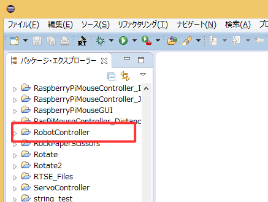</a></div>

生成したプロジェクト内には、デフォルト値が設定された RTC プロファイル XML(RTC.xml) が自動的に生成されます。

#### RTC プロファイルエディタの起動

RTC.xmlが生成された時点で、このプロジェクトに関連付けられているワークスペースとして RTCBuilder のエディタが開くはずです。
もし起動しない場合はパッケージエクスプローラーの RTC.xml をダブルクリックしてください。


<div align="center"><a href="Open_RTCBuilder_0.png"></a></div>


#### プロファイル情報入力とコードの生成

まず、いちばん左の「基本」タブを選択し、基本情報を入力します。先ほど決めた RobotController コンポーネントの仕様(名前)の他に、概要やバージョン等を入力してください。
ラベルが赤字の項目は必須項目です。その他はデフォルトで構いません。

- コンポーネント名: RobotController
- 概要: 任意(Robot Controller component)
- バージョン: 任意(1.0.0)
- ベンダ名: 任意
- カテゴリ: 任意(Controller)


<br>

<div align="center"><a href="rtcb11.png">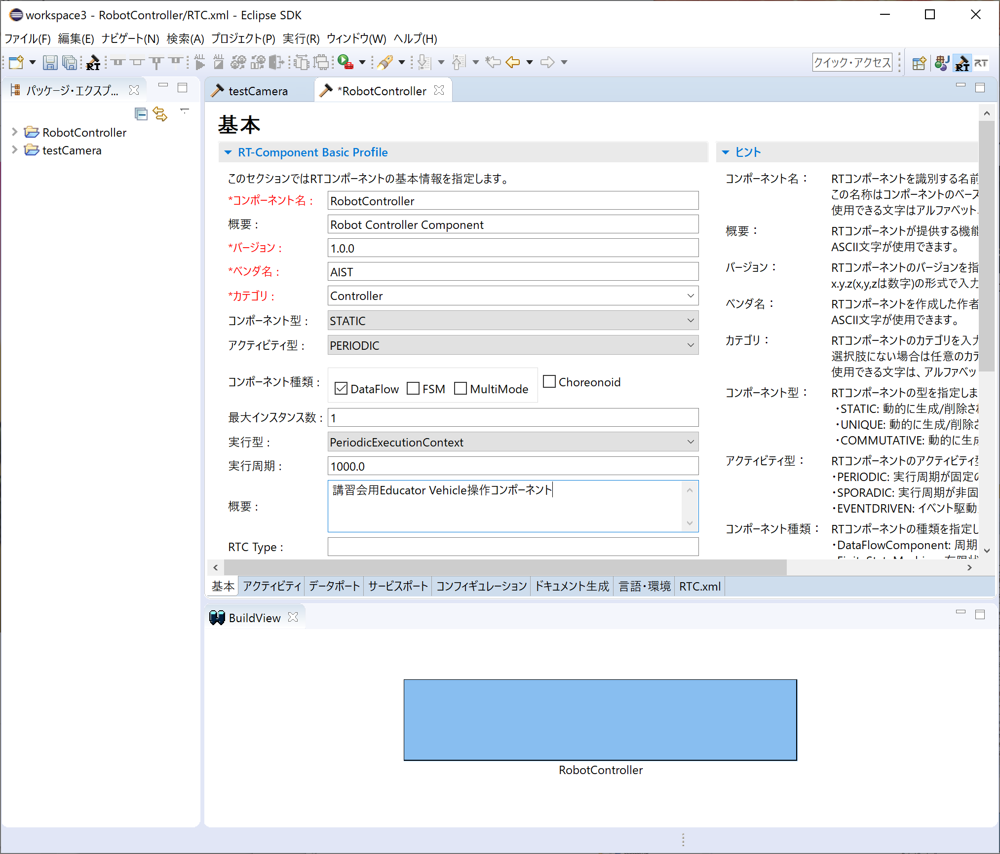</a></div>
<div align="center"><strong>基本情報の入力</strong></div>
<br>


次に、「アクティビティ」タブを選択し、使用するアクションコールバックを指定します。

RobotController コンポーネントでは、onActivated()、onDeactivated()、onExecute() コールバックを使用します。下図のように①の onAtivated をクリック後に②のラジオボタンにて [ON] にチェックを入れます。
onDeactivated、onExecute についても同様の手順を行います。

<br>

<div align="center"><a href="Activity_1.png"></a></div>
<div align="center"><strong>アクティビティコールバックの選択</strong></div>
<br>


さらに、「データポート」タブを選択し、データポートの情報を入力します。
先ほど決めた仕様を元に以下のように入力します。なお、変数名や表示位置はオプションで、そのままで結構です。


<br>

- InPort Profile:
  - ポート名: in
  - データ型: TimedBooleanSeq

<br>


- OutPort Profile:
  - ポート名: out
  - データ型: TimedVelocity2D


<br>


<div align="center"><a href="DataPort_1.png"></a></div>
<div align="center"><strong>データポート情報の入力</strong></div>
<br>

次に、「コンフィギュレーション」タブを選択し、先ほど決めた仕様を元に、Configuration の情報を入力します。
制約条件および Widget とは、RTSystemEditor でコンポーネントのコンフィギュレーションパラメーターを表示する際に、スライダー、スピンボタン、ラジオボタンなど、GUI で値の変更を行うためのものです。

直進速度 speed_x、回転速度 speed_r はスライダーのより操作できるようにします。

<br>

- speed_x
  - 名称: speed_x
  - データ型: double
  - デフォルト値: 0.0
  - 制約条件: -1.5&lt;:x&lt;:1.5
  - Widget: slider
  - Step: 0.01
- speed_r
  - 名称: speed_r
  - データ型: double
  - デフォルト値: 0.0
  - 制約条件: -2.0&lt;:x&lt;:2.0
  - Widget: slider
  - Step: 0.01


<br>


<div align="center"><a href="Configuration_1.png"></a></div>
<div align="center"><strong>コンフィグレーション情報の入力</strong></div>
<br>

次に、「言語・環境」タブを選択し、プログラミング言語を選択します。
ここでは、C++(言語) を選択します。なお、言語・環境はデフォルト等が設定されておらず、指定し忘れるとコード生成時にエラーになりますので、必ず言語の指定を行うようにしてください。


<div align="center"><a href="Language_1.png"></a></div>
<div align="center"><strong>プログラミング言語の選択</strong></div>
<br>

最後に、「基本」タブにある [コード生成] ボタンをクリックし、コンポーネントのひな型コードを生成します。

<br>


<div align="center"><a href="Generate_1.png"></a></div>
<div align="center"><strong>ひな型コードの生成(Generate)</strong></div>
<br>

&color(red){※ 生成されるコード群は、eclipse起動時に指定したワークスペースフォルダーの中に生成されます。
現在のワークスペースは、[ファイル] > [ワークスペースの切り替え...] で確認することができます。};


### CMake によるビルドに必要なファイルの生成

RTC Builder で生成したコードの中には CMake でビルドに必要な各種ファイルを生成するための CMakeLists.txt が含まれています。
CMake を利用することにより CMakeLists.txt から Visual Studio のプロジェクトファイル、ソリューションファイル、もしくは Makefile 等を自動生成できます。


#### CMake(cmake-gui) の操作
CMake を利用してビルド環境の Configure を行います。
まずは CMake(cmake-gui) を起動してください。

```
 $ cmake-gui
```


<div align="center"><a href="CMakeGUI0_2_ubuntu.png">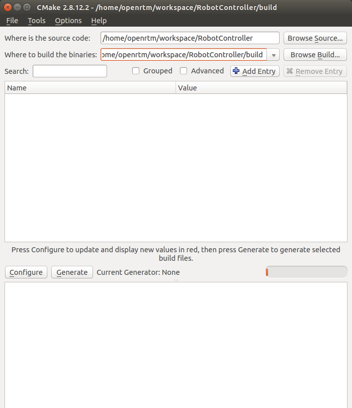</a></div>
<div align="center"><strong>CMake GUI の起動とディレクトリーの指定</strong></div>

画面上部に以下のようなテキストボックスがありますので、それぞれソースコードの場所 (CMakeList.txt がある場所) と、ビルドディレクトリーを指定します。

- `**Where is the soruce code**`
- `**Where to build the binaries**`

ソースコードの場所は RobotController コンポーネントのソースが生成された場所で CMakeList.txt が存在するディレクトリーです。
デフォルトでは <ワークスペースディレクトリー>/RobotController になります。

このディレクトリーはエクスプローラから cmake-gui にドラックアンドドロップすると手入力しなくても設定されます。


ビルドディレクトリーとは、ビルドするためのプロジェクトファイルやオブジェクトファイル、バイナリを格納する場所のことです。
場所は任意ですが、この場合 <ワークスペースディレクトリー>/RobotController/build のように分かりやすい名前をつけた RobotController のサブディレクトリーを指定することをお勧めします。

<table class="table-alt">
  <tr>
    <td>**Where is the soruce code**</td>
    <td>/home/ユーザー名/workspace/RobotController</td>
  </tr>
  <tr>
    <td>**Where to build the binaries**</td>
    <td>/home/ユーザー名/workspace/RobotController/build</td>
  </tr>
</table>

指定したら、下の [Configure] ボタンをクリックします。すると下図のようなダイアログが表示されますので、生成したいプロジェクトの種類を指定します。
今回は CodeBlocks - Unix Makefiles を指定します。
Code::Blocks を使わない場合は Unix Makefiles を使ってください。


<div align="center"><a href="CMakeGUI1_0.png">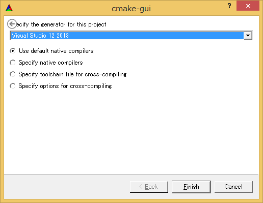</a></div>
<div align="center"><strong>生成するプロジェクトの種類の指定</strong></div>


また cmake-gui を使用しない場合は以下のコマンドでファイルを生成できます。

```
 $ mkdir build
 $ cd build
 $ cmake .. -G "CodeBlocks - Unix Makefiles"
```


ダイアログで [Finish] をクリックすると Configure が始まります。問題がなければ下部のログウインドウに「Configuring done」と出力されますので、続けて [Generate] ボタンをクリックします。
「Generating done」と出ればプロジェクトファイル・ソリューションファイル等の出力が完了します。

なお、CMake は Configure の段階でキャッシュファイルを生成しますので、トラブルなどで設定を変更したり環境を変更した場合は [File] > [Delete Cache] を選択して、キャッシュを削除してから Configure からやり直してください。


### ヘッダ、ソースの編集

次に先ほど指定した build ディレクトリーの中の RobotController.cbp をダブルクリックして Visual Studio 2013 を起動します。


ヘッダ (include/RobotController/RobotController.h) およびソースコード (src/RobotController.cpp) をそれぞれ編集します。
Code::BlocksのProjectsからRobotController.h、RobotController.cpp をクリックすることで編集画面が開きます。


<div align="center"><a href="codeblocks0_2.png">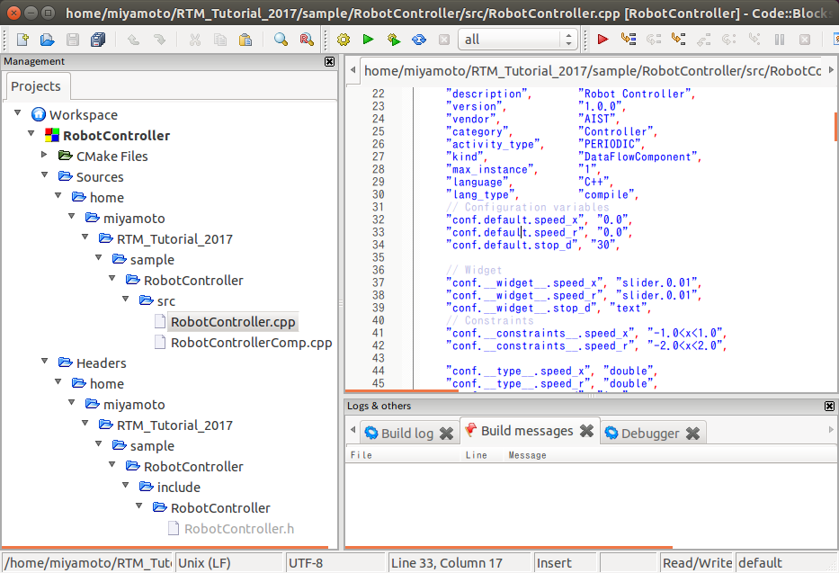</a></div>


&color(red){64bitの環境の場合に Code::Blocks の動作が不安定になることがあります。
その場合は code completion というプラグインを無効化すると動作することがあります。};

「Plugins」>「Manage plugins...」を選択します。

<div align="center"><a href="codeblocks1_0.png"></a></div>

「code completion」を選択して [Disable] ボタンをクリックします。

<div align="center"><a href="codeblocks2_0.png">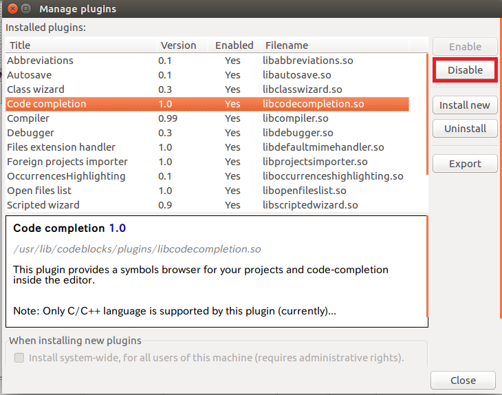</a></div>

動作しないときはこの手順を試してください。

#### アクティビティ処理の実装


RobotController コンポーネントでは、コンフィギュレーションパラメーター(speed_x、speed_y)をスライダーで操作しその値を目標速度としてアウトポート(out)から出力します。
インポート(in)から入力された値を変数に格納して、その値が一定以上の場合は停止するようにします。

<br>
onActivated()、onExecute()、onDeactivated() での処理内容を下図に示します。
<br>


<div align="center"><a href="RCRTC_State_1.png"></a></div>

<div align="center"><strong>アクティビティ処理の概要</strong></div>
<br>


#### ヘッダファイル (RobotController.h) の編集

センサー値を一時的に格納する変数 sensor_data を宣言します。

```
   private:
	 bool sensor_data[2];	       //センサー値を一時格納する変数
```


#### ソースファイル (RobotController.cpp) の編集

下記のように、onActivated()、onDeactivated()、onExecute() を実装します。

```
 RTC::ReturnCode_t RobotController::onActivated(RTC::UniqueId ec_id)
 {
 	//センサー値初期化
 	for (int i = 0; i < 2; i++)
 	{
 		sensor_data[i] = false;
 	}
 
 	return RTC::RTC_OK;
 }
```


```
 RTC::ReturnCode_t RobotController::onDeactivated(RTC::UniqueId ec_id)
 {
  	    //ロボットを停止する
  	    m_out.data.vx = 0;
  	    m_out.data.va = 0;
  	    m_outOut.write();
  
  	    return RTC::RTC_OK;
 }
```


```
 RTC::ReturnCode_t RobotController::onExecute(RTC::UniqueId ec_id)
 {
 	//入力データの存在確認
 	if (m_inIn.isNew())
 	{
 		//入力データ読み込み
 		m_inIn.read();
 		for (int i = 0; i < m_in.data.length(); i++)
 		{
 			//入力データ格納
 			if (i < 2)
 			{
 				sensor_data[i] = m_in.data[i];
 			}
 		}
 	}
 
 	//前進するときのみ停止するかを判定
 	if (m_speed_x > 0)
 	{
 		for (int i = 0; i < 2; i++)
 		{
 			//タッチセンサのオンオフを判定
 			if (sensor_data[i] == true)
 			{
 				//タッチセンサがオンの場合は停止
 				m_out.data.vx = 0;
 				m_out.data.va = 0;
 				m_outOut.write();
 				return RTC::RTC_OK;
 			}
 		}
 	}
 
 	//すべてのタッチセンサがオフの場合はコンフィギュレーションパラメーターの値で操作
 	m_out.data.vx = m_speed_x;
 	m_out.data.va = m_speed_r;
 	m_outOut.write();
 
 	return RTC::RTC_OK;
  }
```


### Code::Blocks によるビルド

#### ビルドの実行

Code::Blocksの [ビルド] ボタンをクリックしてビルドを行います。


<br>

<div align="center"><a href="codeblocks_build_2.png">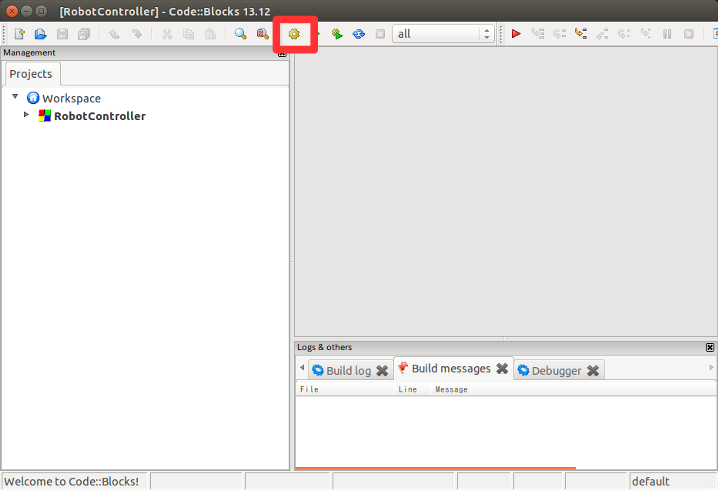</a></div>
<div align="center"><strong>ビルドの実行</strong></div>
<br>


## RobotController コンポーネントの動作確認
作成した RobotController をシミュレーターコンポーネントと接続して動作確認を行います。


以下より EV3Simulator コンポーネントをダウンロードしてください。

- [RTM_Tutorial_2017](https://github.com/Nobu19800/RTM_Tutorial_iREX2017/archive/master.zip)


インターネットに接続できない環境で講習会を実施している場合がありますので、その場合は配布のUSBメモリーに入れてあります。


### RTSystemEditorの起動
OpenRTPのパースペクティブを開くのウインドウからRT System Editorを選択して起動します。

<br>

<div align="center"><a href="rtse2000.png"></a></div>
<br>


### NameService の起動

コンポーネントの参照を登録するためのネームサービスを起動します。

<br>
RT System Editorのネームサービス起動ボタンを押すと起動します。

<div align="center"><a href="robomech2018_6.jpg">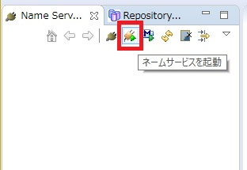</a></div>

<span style="color:red;">※ 「Start Naming Service」をクリックしても omniNames が起動されない場合は、フルコンピュータ名が14文字以内に設定されているかを確認してください。</span>;


### RobotController コンポーネントの起動

RobotController コンポーネントを起動します。

RobotController\build\srcフォルダーの RobotControllerComp ファイルを実行してください。


```
 $ RobotControllerComp
```


### シミュレーターコンポーネントの起動

EV3SimulatorComp コンポーネントをインストールしたディレクトリーに移動後、下記のコマンドにて起動できます。

```
 $ src/EV3SimulatorComp
```


### コンポーネントの接続

下図のように、RTSystemEditor にて
RobotController コンポーネント、EV3Simulator コンポーネントを接続します。
システムダイアグラムは左上のOpen New System Editorボタンで表示できます。

<div align="center"><a href="tutorial_ev3_irex9_2.png">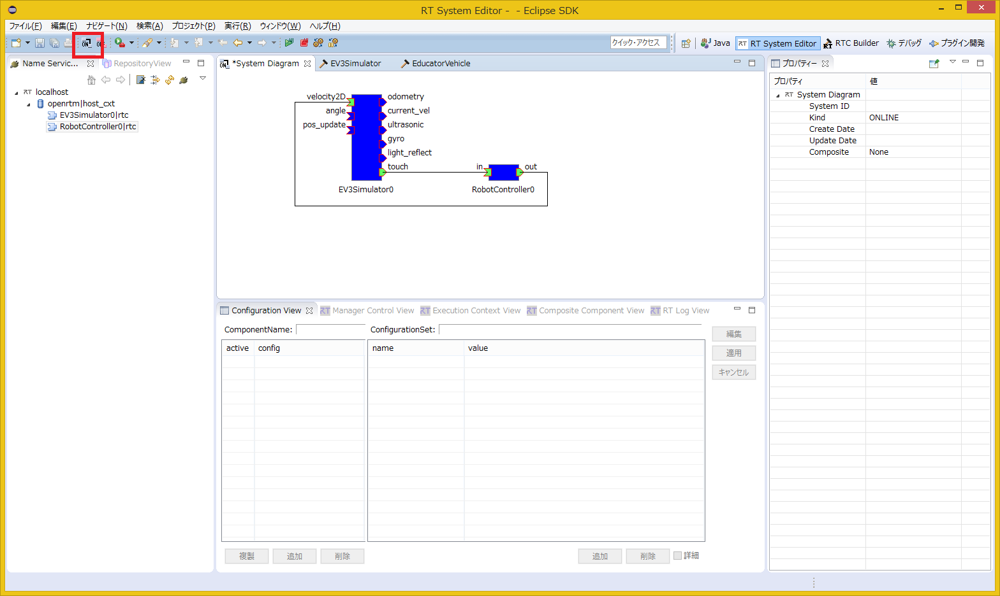</a></div>
<div align="center"><strong>コンポーネントの接続</strong></div>

### コンポーネントのActivate

RTSystemEditor の上部にあります [All Activate] というアイコンをクリックし、全てのコンポーネントをアクティブ化します。
正常にアクティベートされた場合、下図のように黄緑色でコンポーネントが表示されます。

<br>

<div align="center"><a href="tutorial_ev3_irex10.png">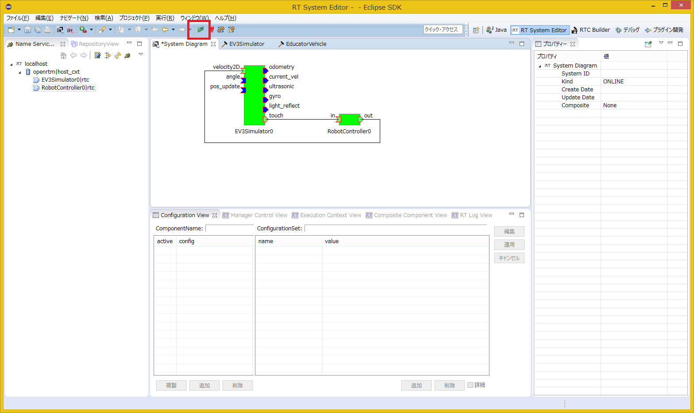</a></div>
<div align="center"><strong>コンポーネントのアクティブ化</strong></div>
<br>

### 動作確認

下図のようにコンフィギュレーションビューの [編集] ボタンからコンフィギュレーションを変更することができます。

<br>

<div align="center"><a href="tutorial_ev3_irex6.png">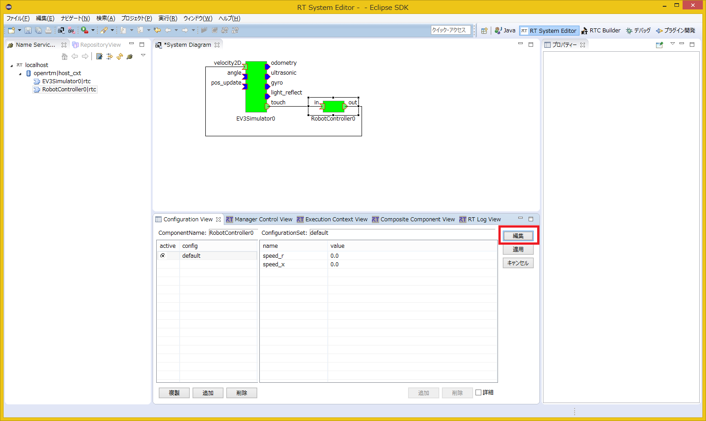</a></div>
<br>

スライダーを操作してシミュレーター上のEducator Vehicle改の操作ができるかを確認してください。

<br>

<div align="center"><a href="tutorial_ev3_irex7.png">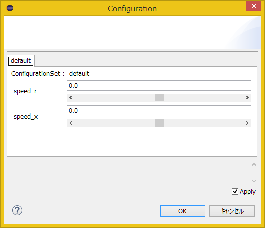</a></div>
<div align="center"><strong>コンフィギュレーションパラメーターの変更</strong></div>
<br>

正常に動作している場合は、開始し位置から直進した場合に壁の前で停止します。


<br>

<div align="center"><a href="tutorial_ev3_irex18.png">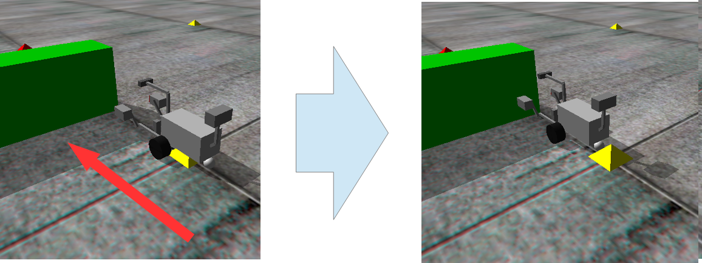</a></div>

<br>


正常に動作していない場合は、壁に接触後にそのまま前進を続けます。


<br>

<div align="center"><a href="tutorial_ev3_irex17.png">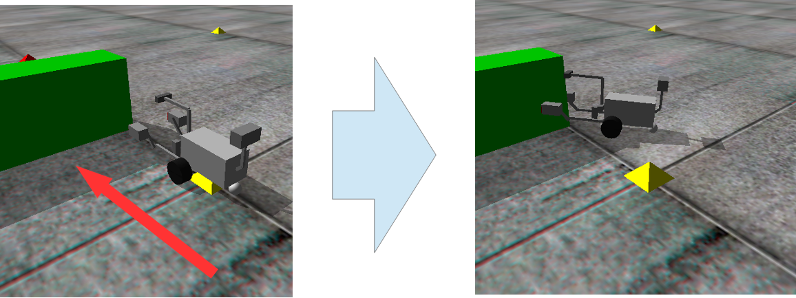</a></div>

<br>


## 実機での動作確認
講習会で EV3実機を用意している場合は実機での動作確認が可能です。

手順は以下の通りです。

- Educator Vehicle改の組立て
- EV3アクセスポイントの起動
- EV3のアクセスポイントに接続
- ポートの接続
- コンポーネントのアクティブ化


### Educator Vehicle改の組立て
EV3 は分解した状態で参加者に配ります。
組み立て方は以下の通りです。


ただし、超音波センサー、カラーセンサー、ジャイロセンサーについては、講習で使用しないため取り付ける必要はありません。
以下の※の作業については、時間が余った人が実施してください。

まずは土台部分を取り出してください。

<br>

<div align="center"><a href="s_DSC00463.JPG">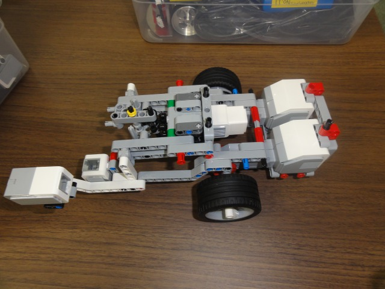</a></div>
<br>

最初にMモーターにケーブル(15cm)を接続します※。

<br>

<div align="center"><a href="s_DSC00446.JPG"></a></div>
<br>


次に EV3 本体を取り付けます。
Mモーターにケーブルを接続した場合は、ケーブルが左側の隙間から出るようにしてください。


<br>

<div align="center"><div align="center"><a href="s_DSC00448.JPG">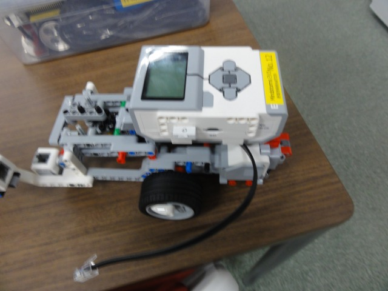</a></div>;  <div align="center"><a href="s_DSC00450.JPG">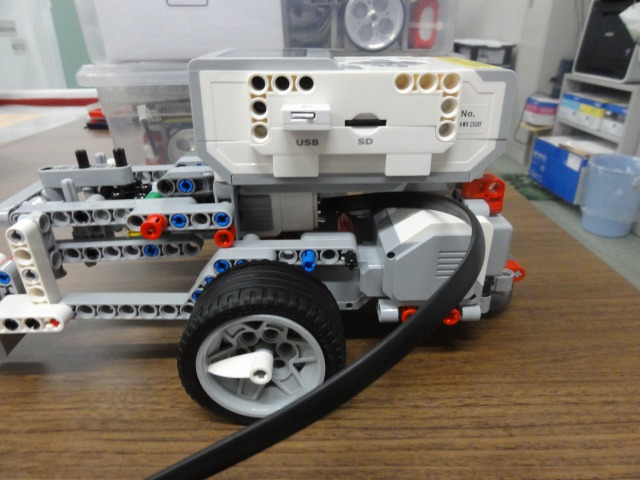</a></div>;</div>
<br>
<br>


右側のタッチセンサーを取り付けてください。

<br>

<div align="center"><div align="center"><a href="s_DSC00451.JPG"></a></div>;  <div align="center"><a href="s_DSC00452.JPG">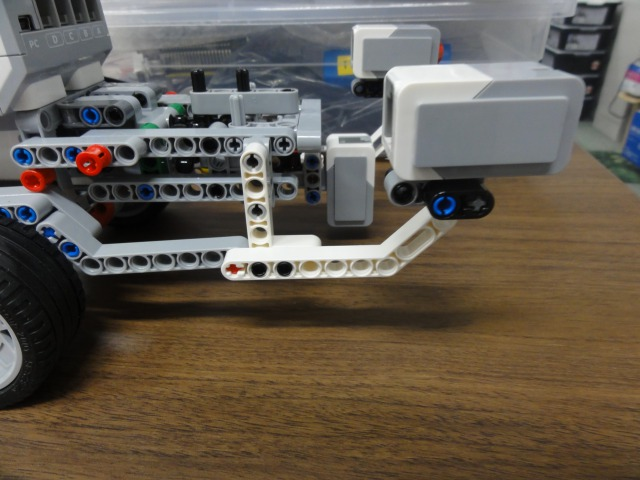</a></div>;</div>
<br>
<br>

超音波センサーを取り付けてください※。

<br>

<div align="center"><a href="s_DSC00454.JPG">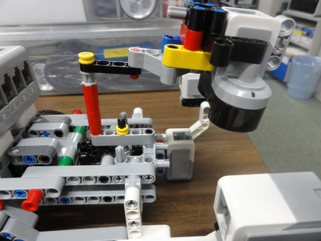</a></div>
<br>


ケーブルを接続してください。
必須なのは車輪駆動用のLモーター右、Lモーター左、タッチセンサーだけです。
ケーブルに貼り付けたシールにポートの番号、デバイス名を記載してあります。

<table class="table-alt">
  <tr>
    <td>Lモーター右</td>
    <td>ポート C</td>
    <td>25cmケーブル</td>
  </tr>
  <tr>
    <td>Lモーター左</td>
    <td>ポート B</td>
    <td>25cmケーブル</td>
  </tr>
  <tr>
    <td>Mモーター※</td>
    <td>ポートA</td>
    <td>25cmケーブル</td>
  </tr>
  <tr>
    <td>タッチセンサー右</td>
    <td>ポート 3</td>
    <td>35cmケーブル</td>
  </tr>
  <tr>
    <td>タッチセンサー左</td>
    <td>ポート 1</td>
    <td>35cmケーブル</td>
  </tr>
  <tr>
    <td>超音波センサー※</td>
    <td>ポート 4</td>
    <td>50cmケーブル</td>
  </tr>
  <tr>
    <td>ジャイロセンサー※</td>
    <td>ポート 2</td>
    <td>25cmケーブル</td>
  </tr>
</table>

ケーブルは EV3 の上下に A～D と 1～4 のポートがあるのでそこにケーブルを接続します。

<br>

<div align="center"><div align="center"><a href="s_DSC00.JPG">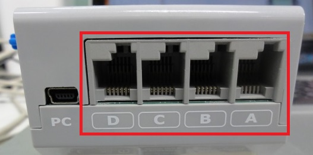</a></div>;  <div align="center"><a href="s_DSC00471.JPG"></a></div>;</div>
<br>
<br>

<br>

<div align="center"><div align="center"><a href="s_DSC00455.JPG"></a></div>;  <div align="center"><a href="s_DSC00456.JPG"></a></div>;</div>
<br>
<br>


左右にパーツを取り付けます※。
Lモーター右、Lモーター左、Mモーター、タッチセンサー右、タッチセンサー左のケーブルを挟むようにして取り付けてください※。
<br>

Lモーター右、タッチセンサー右のケーブルは右側から、Lモーター左、Mモーター、タッチセンサー左は左側から通してください※。

<br>

<div align="center"><a href="s_DSC00457.JPG">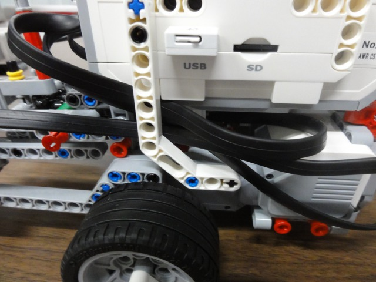</a></div>
<br>


<br>

<div align="center"><a href="s_DSC00459.JPG"></a></div>
<br>

これでとりあえず完成ですが、余裕のある人はジャイロセンサーを取り付けてみてください※。


<br>

<div align="center"><div align="center"><a href="s_DSC00460.JPG">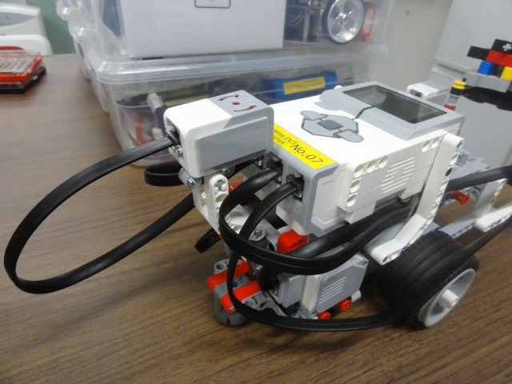</a></div>;  <div align="center"><a href="s_DSC00461.JPG"></a></div>;</div>
<br>
<br>

### 電源の入れ方/切り方

#### 電源の入れ方

中央のボタンを押せば電源が投入されます。

<br>

<div align="center"><a href="ev3_on.jpg"></a></div>
<br>

#### 電源の切り方

EV3 の電源を切る場合は最初の画面で EV3 本体の左上の戻るボタンを押して「Power Off」を選択してください。

<br>

<div align="center"><a href="ev3_off.jpg"></a></div>
<br>


<br>

<div align="center"><a href="s_DSC01033.JPG"></a></div>
<br>

#### 再起動

再起動する場合は最初の画面で EV3 本体の左上の戻るボタンを押して「Reboot」を選択してください。

#### リセット

ev3dev の起動が途中で停止する場合には、中央ボタン、戻るボタン(左上)、左ボタンを同時押ししてください。画面が消えたら戻るボタンを離すと再起動します。


<br>

<div align="center"><a href="ev3_reset.jpg">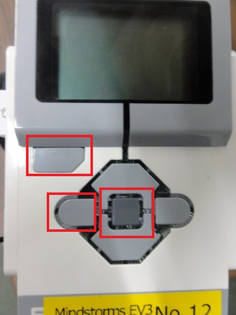</a></div>
<br>


### アクセスポイントの設定


EV3 の操作画面から「File Browser」を上下ボタンで選択して中央のボタンを押してください。


```
 ------------------------------
 192.168.0.1
 ------------------------------
 [File Browser               > ]
  Device Browser             >
  Wireless and Networks      > 
  Battery                    >
  Open Roberta Lab           >
  About                      >
 ------------------------------
```


次に scripts を選択して中央ボタンを押してください。

```
 ------------------------------
 192.168.0.1
 ------------------------------
         File Browser
 ------------------------------
 /home/robot
 ------------------------------
 [scripts                     ]
 ・・
 ・・
 ------------------------------
```


次の画面から **start_ap.sh** を選択して中央ボタンを押すとスクリプトが起動します。

```
 ------------------------------
 192.168.0.1
 ------------------------------
         File Browser
 ------------------------------
 /home/robot/scripts
 ------------------------------
 ../
 Component/
 ・・
 [start_ap.sh                 ]
 ------------------------------
```

しばらくすると無線LANアクセスポイントが起動するので、指定の SSID のアクセスポイントに接続してください。
<!-- SSID は ev3_***(***は EV3 に貼り付けたテープ記載の番号)に接続します。 -->
SSID、パスワードは EV3 に貼り付けたテープに記載してあります。

<br>

<div align="center"><a href="tutorial_ev3_irex26.png">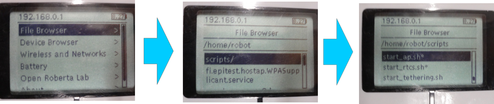</a></div>
<br>


### アクセスポイントに接続


SSID、パスワードは EV3に貼り付けたシールに記載してあります。

※ネットワークが切り替わった場合にネームサーバーへのコンポーネントの登録やポートの接続が失敗する場合があるのでOpenRTP、ネームサーバ、コンポーネントを一旦全て終了してください。
ネットワーク切り替え後に起動した場合には問題ないので、終了させる必要はありません。

OpenRTPを終了するには右上の×を押して終了してください。システムダイアグラムを保存するかどうか聞かれますが、Don't Saveを選択してください。

<div align="center"><a href="rtse0150.png"></a></div>

**openrtp**コマンドを実行してOpenRTPを起動してください。

RT System Editor上でネームサーバーを再起動するには「ネームサービスを起動」ボタンを再度クリックします。

<div align="center"><a href="rtse400.png"></a></div>


### ネームサーバー追加

続いてRTシステムエディタの [ネームサーバー追加] ボタンで <span style="color:red;">192.168.0.1</span>; を追加してください。


<br>

<div align="center"><div align="center"><a href="tutorial_raspimouse0.png">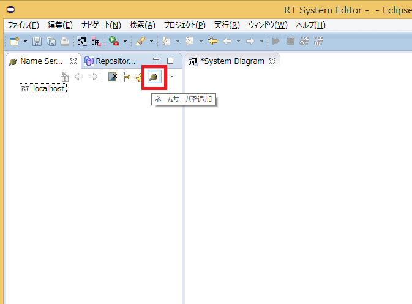</a></div>;  <div align="center"><a href="tutorial_ev3_irex12.png">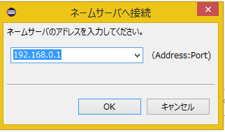</a></div>;</div>
<br>
<br>

するとEducatorVehicle0という RTC が見えるようになります。

<div align="center"><a href="tutorial_ev3_irex29.png">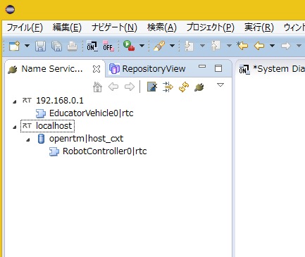</a></div>

- [EducatorVehicle]({{ site.baseurl }}/ja/doc/casestudy/raspberrypi_mouse/raspimouse_rtc_on_raspbian#toc0)


### ポートの接続

RTシステムエディタで EducatorVehicle、RobotController コンポーネントを以下のように接続します。

<div align="center"><a href="tutorial_ev3_irex11.png">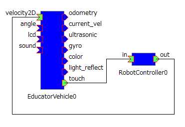</a></div>


### アクティブ化
そして RTC をアクティブ化すると EV3の操作ができるようになります。


-------jp page!!-------
