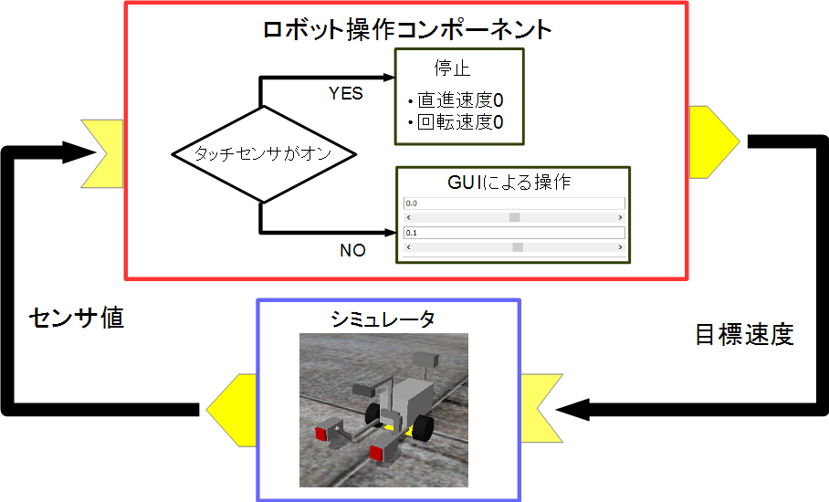
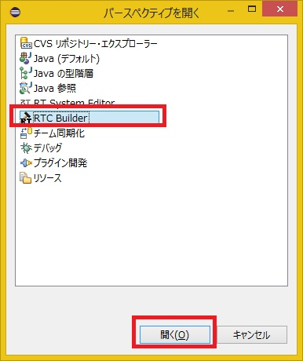
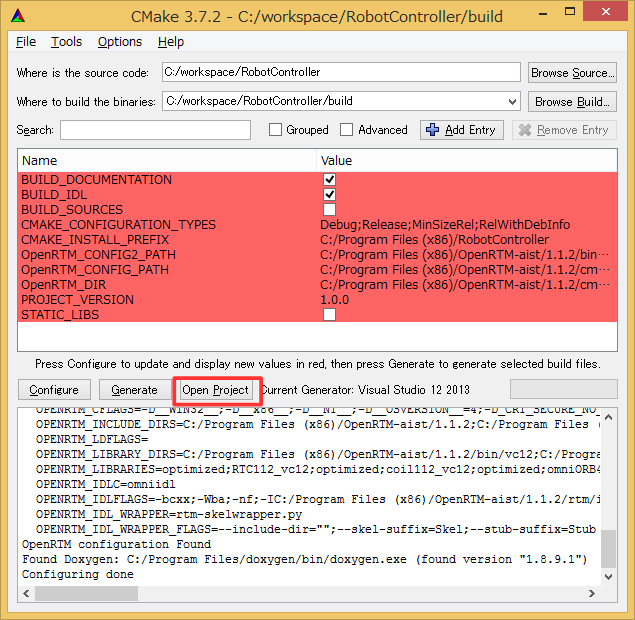
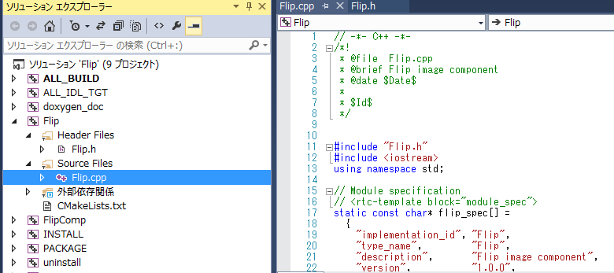

## Part 1/4

---
layout: page
title: Tutorial (EV3, Windows, Part 2)
---

<!-- Title: Tutorial (EV3, Windows, Part 2) -->
#contents

## Introduction

This page explains the procedure for creating a component to control the Educator Vehicle in the simulator.

Educator Vehicle is one of the LEGO MINDSTORMS EV3 assembly examples.

<div align="center"><a href="ev32_2.png"></a></div>

### Downloading the Materials

First, download the tutorial materials.

- [RTM_Tutorial_EV3.zip](https://github.com/OpenRTM/RTM_Tutorial_EV3/releases/download/iREX2019_0.01/RTM_Tutorial_EV3.zip)

Extract the ZIP file using a tool such as [Lhaplus](http://forest.watch.impress.co.jp/library/software/lhaplus/).

Training sessions may sometimes be conducted in environments without Internet access. In that case, the files are provided on the distributed USB memory.

The included simulator can simulate the following modified Educator Vehicle.

<div align="center"><a href="s_DSC00443.JPG"></a></div>

In addition to controlling the L motor and M motor, simulation of the touch sensor, gyro sensor, and ultrasonic sensor is also supported.

### RT Component to be Created

- RobotController Component

This component connects to the EV3Simulator component and controls the robot in the simulator.

## Creating the RobotController Component

In this tutorial, you will create a component that controls the robot in the simulator through a GUI (slider controls) and automatically stops when a touch sensor is activated.

<div align="center"><a href="tutorial_ev3_irex1.png"></a></div>

### Procedure

The procedure is as follows:

- Verify the development environment
- Define the component specifications
- Generate template source code using RTC Builder
- Edit the source code
- Verify component operation

### Verifying the Development Environment

The following environment is assumed.

- OS: Windows 10 (Windows 7 and 8.1 are also supported)
- [OpenRTM-aist: 1.2.2-Release](https://github.com/OpenRTM/OpenRTM-aist/releases/download/v1.2.2/OpenRTM-aist-1.2.2-RELEASE_x86_64.msi)
- [Visual Studio 2019]({{ site.baseurl }}/ja/doc/installation/install_1_2/cpp_1_2/install_windows_1_2/visual_studio_1_2/visual_studio_2022) (2013, 2015, and 2017 are also supported)
- [CMake](https://cmake.org/download/) (version 3.5 or later recommended)
- [Python 3.8](https://www.python.org/downloads/windows/)
- [Doxygen](http://www.doxygen.nl/download.html)

### Component Specifications

RobotController has an OutPort that outputs the target velocity, an InPort that receives sensor values, and configuration parameters for setting the target velocity.

<table class="table-alt">
  <tr>
    <td>Component Name</td>
    <td>**RobotController**</td>
  </tr>
  <tr>
    <td colspan="2" style="text-align: center;">**InPort**</td>
  </tr>
  <tr>
    <td>Port Name</td>
    <td>in</td>
  </tr>
  <tr>
    <td>Type</td>
    <td>TimedBooleanSeq</td>
  </tr>
  <tr>
    <td>Description</td>
    <td>Sensor values</td>
  </tr>
  <tr>
    <td colspan="2" style="text-align: center;">**OutPort**</td>
  </tr>
  <tr>
    <td>Port Name</td>
    <td>out</td>
  </tr>
  <tr>
    <td>Type</td>
    <td>TimedVelocity2D</td>
  </tr>
  <tr>
    <td>Description</td>
    <td>Target velocity</td>
  </tr>
  <tr>
    <td colspan="2" style="text-align: center;">**Configuration**</td>
  </tr>
  <tr>
    <td>Parameter Name</td>
    <td>speed_x</td>
  </tr>
  <tr>
    <td>Type</td>
    <td>double</td>
  </tr>
  <tr>
    <td>Default Value</td>
    <td>0.0</td>
  </tr>
  <tr>
    <td>Constraint</td>
    <td>-1.5<x<1.5</td>
  </tr>
  <tr>
    <td>Widget</td>
    <td>slider</td>
  </tr>
  <tr>
    <td>Step</td>
    <td>0.01</td>
  </tr>
  <tr>
    <td>Description</td>
    <td>Forward velocity setting</td>
  </tr>
  <tr>
    <td colspan="2" style="text-align: center;">**Configuration**</td>
  </tr>
  <tr>
    <td>Parameter Name</td>
    <td>speed_r</td>
  </tr>
  <tr>
    <td>Type</td>
    <td>double</td>
  </tr>
  <tr>
    <td>Default Value</td>
    <td>0.0</td>
  </tr>
  <tr>
    <td>Constraint</td>
    <td>-2.0<x<2.0</td>
  </tr>
  <tr>
    <td>Widget</td>
    <td>slider</td>
  </tr>
  <tr>
    <td>Step</td>
    <td>0.01</td>
  </tr>
  <tr>
    <td>Description</td>
    <td>Rotational velocity setting</td>
  </tr>
</table>

#### About the TimedVelocity2D Type

The TimedVelocity2D type is used to store the movement velocity of a mobile robot on a two-dimensional plane.

## Part 2/4

```cpp
     struct Velocity2D
     {
           /// Velocity along the x axis in metres per second.
           double vx;
           /// Velocity along the y axis in metres per second.
           double vy;
           /// Yaw velocity in radians per second.
           double va;
     };


     struct TimedVelocity2D
     {
           Time tm;
           Velocity2D data;
     };
```

This data type can store the X-axis velocity **vx**, the Y-axis velocity **vy**, and the rotational velocity around the Z-axis **va**.

**vx**, **vy**, and **va** represent velocities in the robot-centered coordinate system.

<br>

<div align="center"><a href="tutorial_ev3_irex3.png"></a></div>
<br>

**vx** is the velocity in the X direction, **vy** is the velocity in the Y direction, and **va** is the angular velocity around the Z axis.

For a robot such as the modified Educator Vehicle, which has two wheels mounted on the left and right sides, **vy** becomes 0 if lateral slipping is assumed not to occur.

The robot is controlled by specifying the forward velocity **vx** and rotational velocity **va**.

#### About the Touch Sensor

<br>

<div align="center"><a href="tutorial_ev3_irex2.png"></a></div>
<br>

### Generating Template Code for the RobotController Component

The template code for the RobotController component is generated using RTCBuilder.

#### Starting RTCBuilder

In Eclipse, the folder used for development work is called the "workspace," and as a general rule all generated files are stored under this folder.

The workspace can be created in any accessible folder. In this tutorial, the following workspace is assumed.

- C:\workspace

First, start Eclipse.

In Windows 8.1, it can be started by selecting:

**Start** > **Apps View (lower-right arrow)** > **OpenRTM-aist 1.1.2** > **OpenRTP**

When Eclipse starts, you will first be asked to specify the workspace location. Specify the workspace above.

<div align="center"><a href="install40.png"></a></div>

The following Welcome page will then be displayed.

<br>

<div align="center"><a href="install41.png"></a></div>
<div align="center"><strong>Screen displayed when Eclipse starts for the first time</strong></div>

The Welcome page is not needed at this point, so click the **×** button in the upper-left corner to close it.

Click the **[Open Perspective]** button in the upper-right corner.

<div align="center"><a href="install42.png"></a></div>
<div align="center"><strong>Switching Perspectives</strong></div>

Select **RTC Builder** to start RTCBuilder.

The RTCBuilder icon, represented by a hammer and RT symbol, will appear on the menu bar.

<div align="center"><a href="robomech2018_3.jpg"></a></div>
<div align="center"><strong>Selecting the Perspective</strong></div>

#### Creating a New Project

To create the RobotController component, you must create a new project in RTC Builder.

Click the **[Open New RTCBuilder Editor]** icon in the upper-left corner.

<div align="center"><a href="CreateProject_0.png"></a></div>
<div align="center"><strong>Creating a Project for RTC Builder</strong></div>

Enter the project name to create (here, **RobotController**) in the "Project Name" field and click the **[Finish]** button.

<div align="center"><a href="RT-Component-BuilderProject_1.png"></a></div>

A project with the specified name is generated and added to the Package Explorer.

<div align="center"><a href="PackageExplolrer_1.png"></a></div>

Inside the generated project, an RTC profile XML file (RTC.xml) with default values is automatically generated.

#### Starting the RTC Profile Editor

When RTC.xml is generated, the RTCBuilder editor associated with this project should automatically open.

If it does not start, double-click RTC.xml in the Package Explorer.

<div align="center"><a href="Open_RTCBuilder_0.png"></a></div>

#### Entering Profile Information and Generating Code

First, select the **Basic** tab on the far left and enter the basic information.

In addition to the RobotController component specification (name) decided earlier, enter information such as the description and version.

Items with red labels are required. The remaining fields may be left at their default values.

- Component Name: RobotController
- Description: Any value (e.g. Robot Controller component)
- Version: Any value (e.g. 1.0.0)
- Vendor Name: Any value
- Category: Any value (e.g. Controller)

<br>

<div align="center"><a href="rtcb11.png"></a></div>
<div align="center"><strong>Entering Basic Information</strong></div>
<br>

Next, select the **Activity** tab and specify the action callbacks to use.

The RobotController component uses the callbacks:

- onActivated()
- onDeactivated()
- onExecute()

As shown below, click **① onActivated** and then use radio button **②** to select **[ON]**.

Perform the same procedure for **onDeactivated** and **onExecute**.

## Part 3/4

<br>

<div align="center"><a href="Activity_1.png"></a></div>
<div align="center"><strong>Selecting Activity Callbacks</strong></div>
<br>

Next, select the **Data Ports** tab and enter the data port information.

Enter the following values according to the specifications defined earlier.

The variable names and display positions are optional and may be left unchanged.

<br>

- InPort Profile
  - Port Name: in
  - Data Type: TimedBooleanSeq

<br>

- OutPort Profile
  - Port Name: out
  - Data Type: TimedVelocity2D

<br>

<div align="center"><a href="DataPort_1.png"></a></div>
<div align="center"><strong>Entering Data Port Information</strong></div>
<br>

Next, select the **Configuration** tab and enter the configuration information according to the specifications defined earlier.

The constraint conditions and widgets are used when displaying component configuration parameters in RTSystemEditor. They allow values to be changed using GUI elements such as sliders, spin buttons, and radio buttons.

Configure the forward velocity **speed_x** and rotational velocity **speed_r** so that they can be adjusted using sliders.

<br>

- speed_x
  - Name: speed_x
  - Data Type: double
  - Default Value: 0.0
  - Constraint: -1.5<:x<:1.5
  - Widget: slider
  - Step: 0.01

- speed_r
  - Name: speed_r
  - Data Type: double
  - Default Value: 0.0
  - Constraint: -2.0<:x<:2.0
  - Widget: slider
  - Step: 0.01

<br>

<div align="center"><a href="Configuration_1.png"></a></div>
<div align="center"><strong>Entering Configuration Information</strong></div>
<br>

Next, select the **Language / Environment** tab and choose the programming language.

Here, select **C++** as the programming language.

The language/environment field does not have a default value. If you forget to specify the language, an error will occur during code generation, so be sure to set it.

<div align="center"><a href="Language_1.png"></a></div>
<div align="center"><strong>Selecting the Programming Language</strong></div>
<br>

Finally, click the **Generate Code** button on the **Basic** tab to generate the component template code.

<br>

<div align="center"><a href="Generate_1.png"></a></div>
<div align="center"><strong>Generating Template Code</strong></div>
<br>

<span style="color:red;">*The generated source files are created inside the workspace folder specified when Eclipse starts. The current workspace can be checked from [File] → [Switch Workspace...].*</span>;

### Generating Files Required for Building with CMake

The code generated by RTC Builder includes a `CMakeLists.txt` file for generating various files required by CMake.

Using CMake, Visual Studio project files, solution files, Makefiles, and other build-related files can be automatically generated from `CMakeLists.txt`.

#### Using CMake (cmake-gui)

Use CMake to configure the build environment.

First, start CMake (`cmake-gui`).

It can be started from:

**Start** → **Apps View** → **CMake 3.7.2** → **CMake (cmake-gui)**

<div align="center"><a href="CMakeGUI0_1.png"></a></div>
<div align="center"><strong>Starting CMake GUI and Specifying Directories</strong></div>

At the top of the window there are text boxes labeled:

- **Where is the source code**
- **Where to build the binaries**

Specify the source code location (where `CMakeLists.txt` exists) and the build directory.

The source code directory is the folder containing the RobotController component source code and `CMakeLists.txt`.

By default:

```text
<workspace directory>\RobotController
```

You can also drag and drop the folder from Windows Explorer into cmake-gui instead of typing it manually.

The build directory is where project files, object files, and generated binaries are stored.

Any location may be used, but in this tutorial the following directory is recommended:

```text
<workspace directory>\RobotController\build
```

<table class="table-alt">
  <tr>
    <th>Where is the source code</th>
    <th>C:\workspace\RobotController</th>
  </tr>
  <tr>
    <td>Where to build the binaries</td>
    <td>C:\workspace\RobotController\build</td>
  </tr>
</table>

After specifying these paths, click the **Configure** button at the bottom.

A dialog similar to the following will appear. Specify the type of project to generate.

For this tutorial, select **Visual Studio 15 2017**.

If you are using Visual Studio 2013 or Visual Studio 2019, select the corresponding version instead.

Also select **x64** as the platform. If you installed the 32-bit version, choose **Win32**.

<div align="center"><a href="cmake_vs.png"></a></div>
<div align="center"><strong>Specifying the Type of Project to Generate</strong></div>

Clicking the **Finish** button in the dialog starts the configuration process.

If there are no problems, the message:

```text
Configuring done
```

will be displayed in the log window at the bottom.

Then click the **Generate** button.

If the message:

```text
Generating done
```

appears, generation of the project files, solution files, and related files has completed successfully.

Note that CMake generates cache files during the Configure step.

If you change settings or modify the environment during troubleshooting, delete the cache via:

```text
File → Delete Cache
```

and then run Configure again from the beginning.

## Part 4/4

### Editing the Header File and Source File

Next, start Visual Studio by double-clicking `RobotController.sln` in the build directory specified earlier.

*In recent versions of cmake-gui, Visual Studio can also be launched directly from a button within cmake-gui.*

<br>

<div align="center"><a href="cmake_gui.png"></a></div>
<br>

Edit the header file (`include/RobotController/RobotController.h`) and source file (`src/RobotController.cpp`).

You can open the editing screen by selecting `RobotController.h` and `RobotController.cpp` from Visual Studio's Solution Explorer.

<div align="center"><a href="VisualStudio0_0.png"></a></div>

#### Implementing Activity Processing

In the RobotController component, the configuration parameters (`speed_x`, `speed_r`) are manipulated using sliders, and their values are output from the OutPort (`out`) as target velocity.

Values received from the InPort (`in`) are stored in variables, and if those values exceed a specified threshold, the robot is stopped.

<br>

The processing performed by `onActivated()`, `onExecute()`, and `onDeactivated()` is shown below.

<br>

<div align="center"><a href="RCRTC_State_1.png"></a></div>
<div align="center"><strong>Overview of Activity Processing</strong></div>
<br>

#### Editing the Header File (RobotController.h)

Declare a variable named `sensor_data` to temporarily store sensor values.

```cpp
   private:
	 bool sensor_data[2];	       // Variable for temporarily storing sensor values
```

#### Editing the Source File (RobotController.cpp)

Implement `onActivated()`, `onDeactivated()`, and `onExecute()` as shown below.

```cpp
 RTC::ReturnCode_t RobotController::onActivated(RTC::UniqueId ec_id)
 {
 	// Initialize sensor values
 	for (int i = 0; i < 2; i++)
 	{
 		sensor_data[i] = false;
 	}

 	return RTC::RTC_OK;
 }
```

```cpp
 RTC::ReturnCode_t RobotController::onDeactivated(RTC::UniqueId ec_id)
 {
  	    // Stop the robot
  	    m_out.data.vx = 0;
  	    m_out.data.va = 0;
  	    m_outOut.write();

  	    return RTC::RTC_OK;
 }
```

```cpp
 RTC::ReturnCode_t RobotController::onExecute(RTC::UniqueId ec_id)
 {
 	// Check for input data
 	if (m_inIn.isNew())
 	{
 		// Read input data
 		m_inIn.read();

 		for (int i = 0; i < m_in.data.length(); i++)
 		{
 			// Store input data
 			if (i < 2)
 			{
 				sensor_data[i] = m_in.data[i];
 			}
 		}
 	}

 	// Determine whether to stop only when moving forward
 	if (m_speed_x > 0)
 	{
 		for (int i = 0; i < 2; i++)
 		{
 			// Check touch sensor status
 			if (sensor_data[i] == true)
 			{
 				// Stop if a touch sensor is ON
 				m_out.data.vx = 0;
 				m_out.data.va = 0;
 				m_outOut.write();
 				return RTC::RTC_OK;
 			}
 		}
 	}

 	// If all touch sensors are OFF,
 	// control the robot according to the configuration parameters
 	m_out.data.vx = m_speed_x;
 	m_out.data.va = m_speed_r;
 	m_outOut.write();

 	return RTC::RTC_OK;
 }
```

### Building with Visual Studio

#### Executing the Build

Build the project by selecting **[Build] → [Build Solution]** in Visual Studio.

<br>

<div align="center"><a href="VC++_build_0.png"></a></div>
<div align="center"><strong>Executing the Build</strong></div>
<br>

## Verifying Operation of the RobotController Component

Connect the RobotController component created above to the simulator component and verify its operation.

Download the EV3Simulator component from the following URL.

- [RTM_Tutorial_2017](https://github.com/Nobu19800/RTM_Tutorial_iREX2017/archive/master.zip)

Extract the ZIP file using a tool such as Lhaplus.

Training sessions may sometimes be conducted in environments without Internet access. In that case, the files are provided on the distributed USB memory.

### Starting RTSystemEditor

Open the OpenRTP perspective and start RT System Editor from the window.

<br>

<div align="center"><a href="rtse2000.png"></a></div>
<br>

### Starting the Name Service

Start the Name Service used to register component references.

Press the Name Service startup button in RT System Editor.

<div align="center"><a href="robomech2018_6.jpg"></a></div>

<span style="color:red;">*If omniNames does not start when you click "Start Naming Service", verify that the computer's full name is 14 characters or fewer.*</span>;


