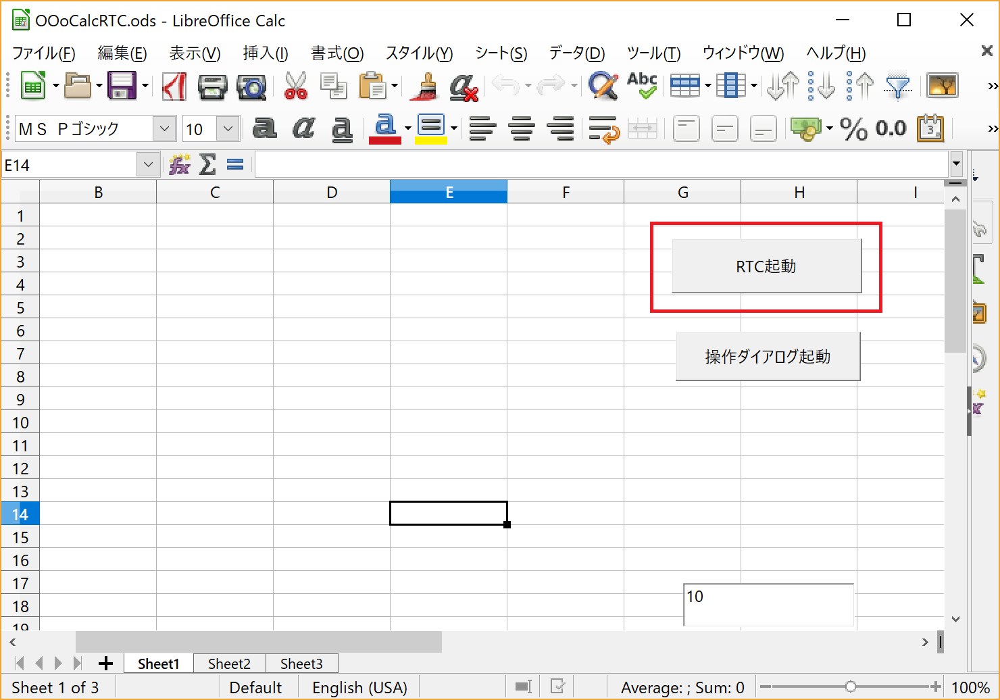
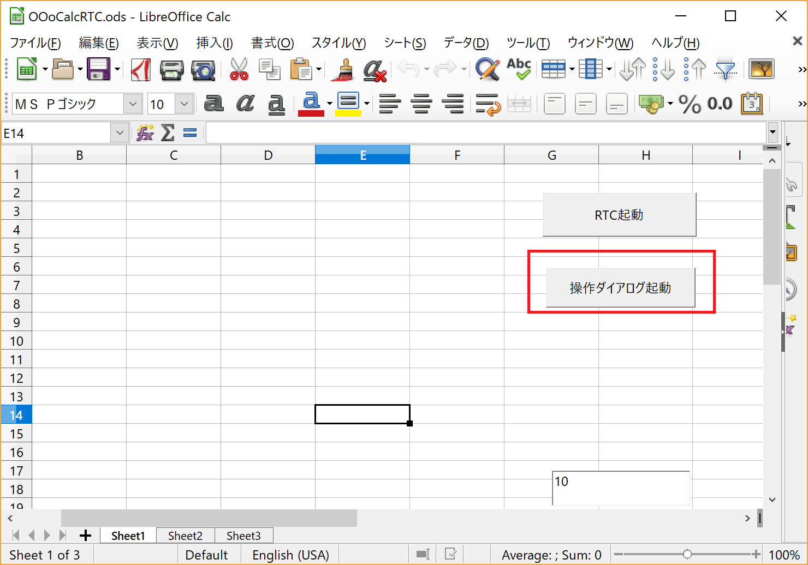
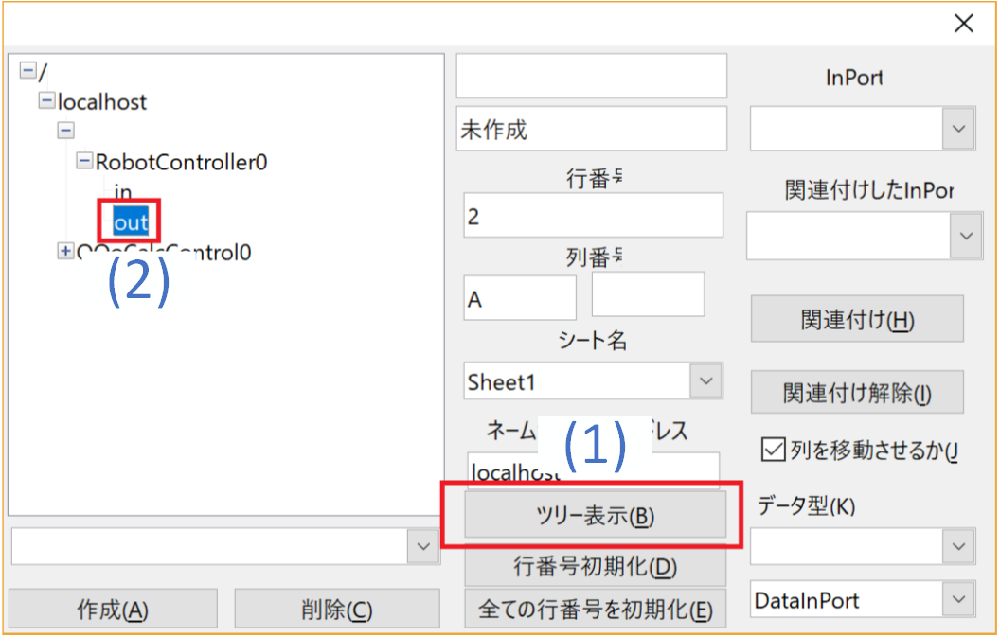
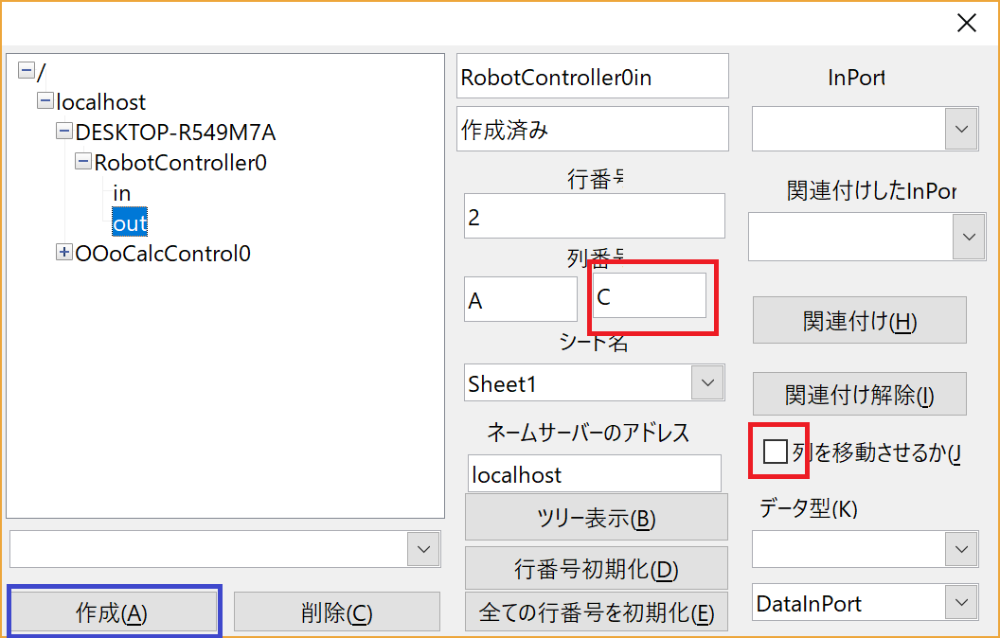
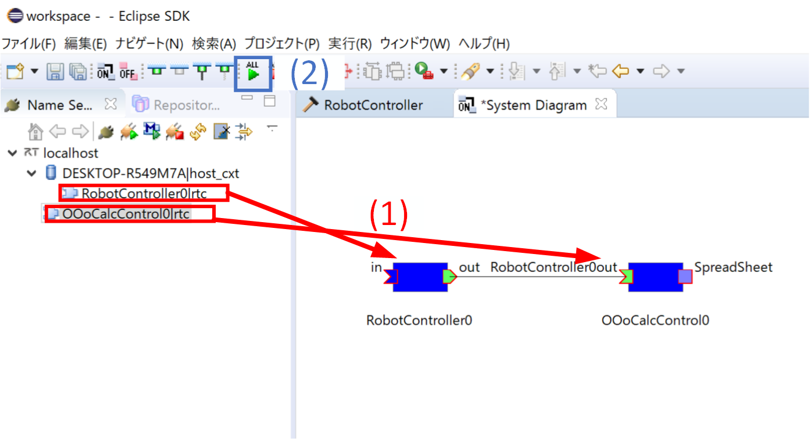
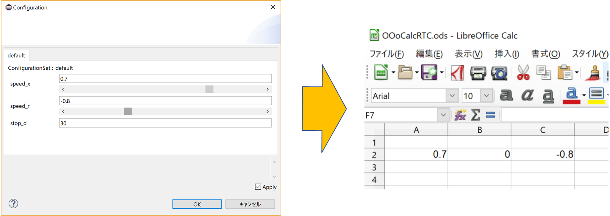
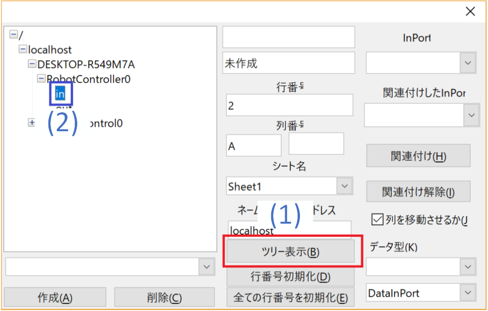
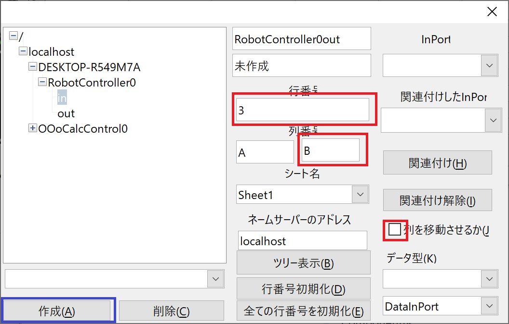
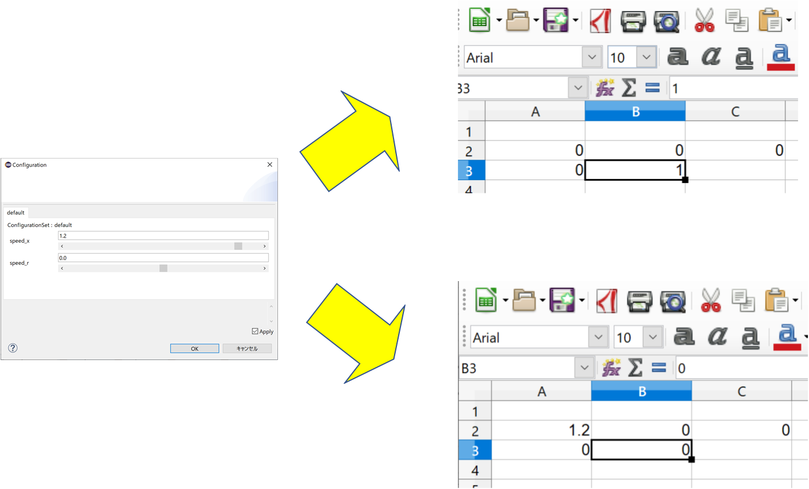

<!-- Title: チュートリアル(RTM講習会、第4部) -->
#contents

## はじめに

このページではLibreOffice Calc用RTCによるRTCの動作確認手順について説明します。
Calcのセルの値をInPortに入力、OutPortの出力した値をセルに表示することで対象RTCの挙動を確認できます。

RTM講習会ではUSBメモリでポータブル版LibreOfficeとRTCを配布します。
Windowsで実行できます。
UbuntuはPython3用のomniORBのパッケージがないため実行できません。講習会ではノートPCを貸し出します。

この実習では[第2部]({{ site.baseurl }}/ja/doc/casestudy/raspberrypi_mouse/raspimouse_tutorial_rtm_seminar/tutorial_rtm_seminar_win_part2)で作成したRobotControllerコンポーネントを使用します。

## LibreOfficeとは？
表計算、パワーポイント、ワープロ機能等を提供するオフィススイートです。
フリーソフトとして公開されており、今回の講習会では以下のポータブル版を使用します。

- [Portable版 LibreOffice Portable](https://ja.libreoffice.org/download/portable-versions/)

## LibreOffice Calc用RTCの起動

配布したUSBメモリ内の**ポータブル版LibreOffice\run_CalcRTC.bat**を実行します。

LibreOffice Calcが起動するため、**RTC起動**ボタンをクリックすることでOOoCalcControlというRTCを起動します。

## OutPortの接続

RobotControllerのOutPortと接続し、Calcで出力データの確認ができるようにします。
Calcの**操作ダイアログ起動**ボタンをクリックしてください。

まずは出力データを確認するOutPortと接続します。
**ツリー表示ボタン**を押下してネームサーバーに登録されたRTCのポート一覧を表示後、ツリーからRobotController0のoutを選択します。

次に一部設定を変更します。

**列を移動させる**のチェックを外してください。
このチェックが有効の場合、データを受信する度にセルの位置が移動するモードで動作します。
グラフに描画する場合は位置が移動するモードを使用しますが、今回は単純に値を確認したいだけのためチェックを外します。

**列番号**の右のボックスに**C**と入力してください。
これで**2**行目の**A**～**C**列のセルにOutPortの出力データを表示するようになりました。

設定完了後、作成ボタンを押してください。

## OutPortの動作確認
RT System Editor上でRTCをアクティブ化して動作を確認してください。

この状態でコンフィギュレーションパラメータを操作してCalcのセルの値が変化するかを確認してください。

## InPortの接続
RobotControllerのInPortと接続し、Calcからデータの入力を行うようにします。

**ツリー表示ボタン**を押下してネームサーバーに登録されたRTCのポート一覧を表示後、ツリーからRobotController0のinを選択します。

次に一部設定を変更します。

**列を移動させる**のチェックを外してください。

''''
**列番号**の右のボックスに**D**と入力してください。
これで**3**行目の**A**～**C**列のセルにOutPortの出力データを表示するようになりました。

設定完了後、作成ボタンを押してください。

## InPortの動作確認
RT System Editor上でRTCをアクティブ化して動作を確認してください。

この状態でコンフィギュレーションパラメータで前進する速度をOutPortから出力するように操作してください。
その後、Calcの**3**行目の**A**、**B**列のセルに1の値を入力するか、0の値を入力するかで動作が変化するかを確認してください。

