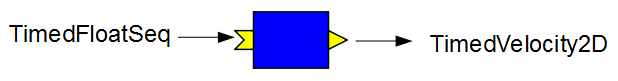
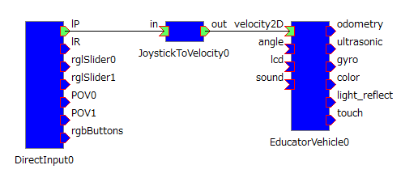
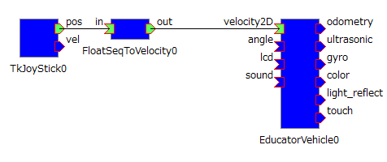
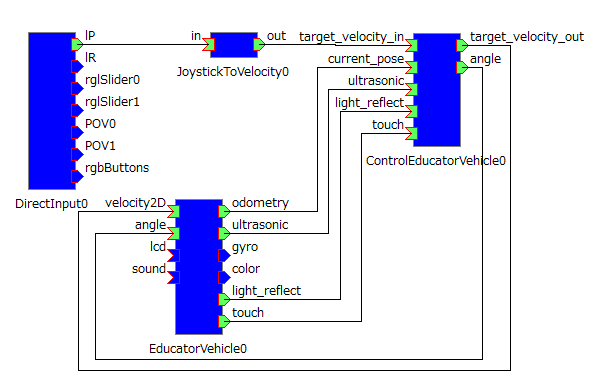
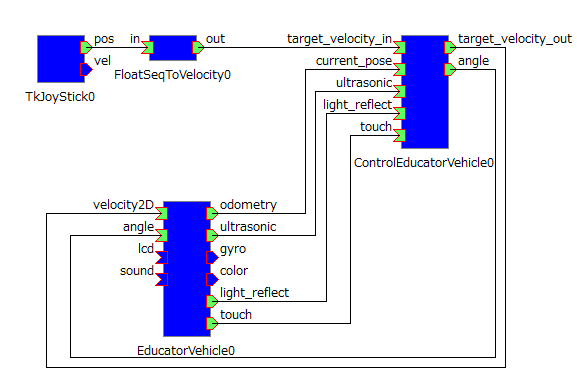

<!-- ~/jekyll_workdir/openrtm_test/ja/doc/casestudy/lego_mindstorm/lego_sample_rts_exec-->
<!-- Title: Running Sample RT Systems -->
#contents

## Preparation

### Windows

#### Installing RTCs

The following RTCs are used in some of the sample RT systems and must be installed.

##### DirectInputRTC

This RTC is used to operate the system with a joystick.

Download and run the installer from the following site:

- [http://ysuga.net/?p=130](http://ysuga.net/?p=130)

##### JoystickToVelocity

This RTC converts the `pos` output (TimedLongSeq type) from the DirectInputRTC OutPort into the TimedVelocity2D type.

Download and run the installer from the following site:

- [http://ysuga.net/?p=130](http://ysuga.net/?p=130)

<!-- - http://ysuga.net/?p=130-->

##### FloatSeqToVelocity

FloatSeqToVelocity is an RTC that converts the output (TimedFloatSeq type) of the TkJoyStick sample included with OpenRTM-aist-Python into TimedVelocity2D and outputs it through an OutPort.

Download it from [here](https://github.com/Nobu19800/FloatSeqToVelocity/archive/master.zip).

<table class="table-alt">
  <tr>
    <th colspan="3" style="text-align: center;">FloatSeqToVelocity</th>
  </tr>
  <tr>
    <td colspan="3" style="text-align: center;">InPort</td>
  </tr>
  <tr>
    <td>Name</td>
    <td>Data Type</td>
    <td>Description</td>
  </tr>
  <tr>
    <td>in</td>
    <td>TimeFloatSeq</td>
    <td>Input data before conversion</td>
  </tr>
  <tr>
    <td colspan="3" style="text-align: center;">OutPort</td>
  </tr>
  <tr>
    <td>Name</td>
    <td>Data Type</td>
    <td>Description</td>
  </tr>
  <tr>
    <td>in</td>
    <td>TimedVelocity2D</td>
    <td>Converted output data</td>
  </tr>
  <tr>
    <td colspan="3" style="text-align: center;">Configuration Parameters</td>
  </tr>
  <tr>
    <td>Name</td>
    <td>Default Value</td>
    <td>Description</td>
  </tr>
  <tr>
    <td>rotation_by_position</td>
    <td>-0.02</td>
    <td>Angular velocity corresponding to the joystick X position</td>
  </tr>
  <tr>
    <td>velocity_by_position</td>
    <td>0.002</td>
    <td>Forward velocity corresponding to the joystick Y position</td>
  </tr>
</table>

<div align="center"><a href="ev3_10.png"></a></div>

#### Script Files

These script files automate RTC startup and RT system restoration.

Download them from [here](https://github.com/Nobu19800/EducatorVehicle_script/archive/master.zip).

#### Starting the Name Server and RT System Editor

##### Windows

First, start the Name Server and RT System Editor on Windows.

For detailed instructions, refer to [this page]({{ site.baseurl }}/en/doc/installation/install_1_1/cpp_1_1/test_windows_1_1).

##### ev3dev

The downloaded package from the [Bulk Installation section](../lego_ev3_rtc_install#toc7) contains an `rtc.conf` file.

Modify the following line in `rtc.conf` by replacing `ppp.pp.pp.ppp` with the IP address of the Windows machine.

```text
corba.nameservers: ppp.pp.pp.ppp
```

This allows components started on EV3 to be registered with the Name Server running on Windows.

To check the Windows IP address, enter:

```bash
ipconfig
```

## Starting RTCs

### Windows

The downloaded script package from the [Script Files section](../lego_ev3_rtc_install#toc12) contains a batch file named `start_component.bat`.

Executing it starts the following RTCs.

* This batch file is intended for 64-bit Windows and 32-bit OpenRTM-aist.
* For 32-bit Windows, use `start_component_32.bat`.
* If you are using the 64-bit version of OpenRTM-aist, use `start_component_64.bat`.

If the Python installation directory is not included in the PATH environment variable, TkJoyStick cannot be started. In that case, please start it manually by following the instructions on [this page]({{ site.baseurl }}/en/doc/installation/install_1_1/python_1_1/test_windows_python_1_1#toc7).

### ev3dev

Execute `start_rtc.sh` contained in the package downloaded from the [Bulk Installation section](../lego_ev3_rtc_install#toc7).

```bash
cd RaspberryPiMouseRTSystem_script_Raspbian
sh start_rtc.sh
```

The following RTCs will start:

```text
ControlEducatorVehicle0
EducatorVehicle0
```

## Restoring and Starting the RT System

On Windows, execute `JoystickControlEV3_resurrect.bat` located in the `JoystickControlEV3` folder of the downloaded package from the [Script Files section](../lego_sample_rts_exec#toc6).

This performs tasks such as:

- Connecting data ports
- Setting configuration parameters

Next, execute `JoystickControlEV3_activate.bat` to activate the RTCs.

JoystickControlEV3 is an RT system that controls the EV3 using a joystick component.

To deactivate the system, execute:

```text
JoystickControlEV3_stop.bat
```

To disconnect the ports, execute:

```text
JoystickControlEV3_teardown.bat
```

## Sample Details

For samples other than JoystickControlEV3:

- `****_resurrect.bat` : Restore RT system
- `****_activate.bat` : Activate RTCs
- `****_stop.bat` : Deactivate RTCs
- `****_teardown.bat` : Disconnect ports

<table class="table-alt">
  <tr>
    <th>File Name</th>
    <th>Description</th>
  </tr>
  <tr>
    <td>`****_resurrect.bat`</td>
    <td>Restore RT system</td>
  </tr>
  <tr>
    <td>`****_activate.bat`</td>
    <td>Activate RTCs</td>
  </tr>
  <tr>
    <td>`****_stop.bat`</td>
    <td>Deactivate RTCs</td>
  </tr>
  <tr>
    <td>`****_teardown.bat`</td>
    <td>Disconnect ports</td>
  </tr>
</table>

### GamePadSimpleControlEV3

This sample RT system controls the Educator Vehicle in the direction indicated by the analog stick of a gamepad.

Connect a gamepad to the Windows PC before starting the system.

<div align="center"><a href="ev3_9.png"></a></div>

### JoystickSimpleControlEV3

This sample RT system controls the Educator Vehicle in the direction indicated by the TkJoyStick sample component included with OpenRTM-aist-Python.

<div align="center"><a href="ev3_8.png"></a></div>

### GamePadControlEV3

In addition to controlling the Educator Vehicle using a gamepad's analog stick, this sample RT system performs [control using the touch sensor, ultrasonic sensor, and color sensor](../lego_ev3_rtc_install#toc6).

<div align="center"><a href="ev3_6.png"></a></div>

### JoystickControlEV3

In addition to controlling the Educator Vehicle using the TkJoyStick sample component included with OpenRTM-aist-Python, this sample RT system performs [control using the touch sensor, ultrasonic sensor, and color sensor](../lego_ev3_rtc_install#toc6).

<div align="center"><a href="ev3_7.png"></a></div>

