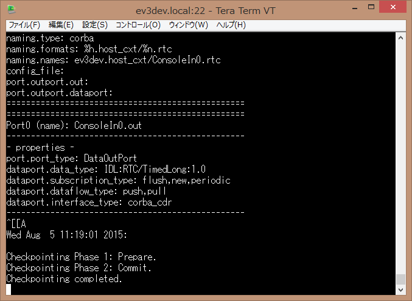
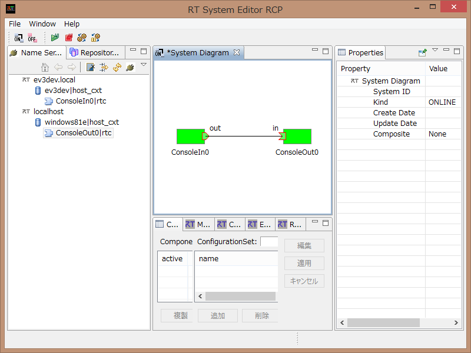
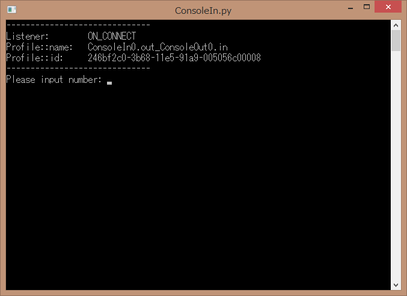
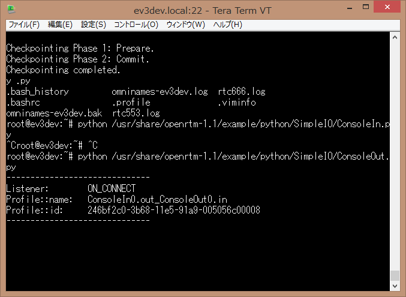
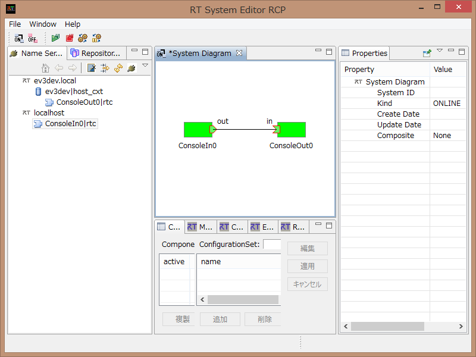

<!-- Title: Running Sample Components -->
<!-- -*- pukiwiki-edit -*- -->
<!-- * Running Sample Components -->
#contents

## Installing OpenRTM-aist

If you booted the EV3 using the ev3dev image from the link above, OpenRTM-aist (C++ and Python versions) is already installed.

In that case, skip the OpenRTM-aist installation steps below and proceed directly to running the sample components.

If you downloaded the image yourself from ev3dev.org, install the OpenRTM-aist packages using apt-get.

### Editing sources.list

Edit `/etc/sources.list` to add openrtm.org as a package repository.

```bash
# vi /etc/apt/sources.list
```

Open `/etc/apt/sources.list` with vi and add the following line:

```bash
deb http://ftp.debian.org/debian jessie main contrib non-free
deb http://ev3dev.org/debian jessie main
deb http://openrtm.org/pub/Linux/debian jessie main  ← Add this line
```

As shown above, add the OpenRTM repository at the end of the file.

Then update the package repository database:

```bash
# apt-get update
```

Since the EV3 is relatively slow, updating the package database may take a considerable amount of time.

### Installing OpenRTM-aist Packages

Once access to the openrtm.org package repository is available, install the required packages as follows:

```bash
# apt-get install libomniorb4-dev omniidl
# apt-get install openrtm-aist openrtm-aist-dev openrtm-aist-example python-yaml
# apt-get install gcc g++ make uuid-dev
# apt-get install python-omniorb
# apt-get install openrtm-aist-python openrtm-aist-python-example
```

Package installation also takes a considerable amount of time. Please be patient.

To avoid battery depletion during installation, it is recommended to keep the EV3 connected to a power adapter.

## Running OpenRTM-aist Samples

### ConsoleIn-ConsoleOut (C++)

Run the C++ sample components to verify that OpenRTM-aist has been installed correctly.

Run ConsoleIn on the EV3 and ConsoleOut on the PC, connect them together, and verify that numbers entered on the PC are displayed on the EV3.

#### Starting ConsoleIn

First, start the Name Service and ConsoleIn on the EV3.

Although the `omniorb-nameserver` package should already be running as a system service, it is recommended to start the Name Server using the `rtm-naming` command to avoid network-related issues.

Use a terminal application such as Tera Term on Windows, or log in to the EV3 via SSH from a Linux console.

After logging in, start `rtm-naming`.

When prompted whether to stop the existing Name Server, enter **y** and continue.

```bash
# rtm-naming
...
and start omniNames by rtm-naming? (y/N)y
...
omniNames properly started
```

Next, start ConsoleInComp.

```bash
root@ev3dev:~# /usr/share/openrtm-1.1/example/ConsoleInComp
```

<div align="center"><a href="ConsoleIn_cxx.png"></a></div>
<div align="center"><strong>ConsoleInComp Running on the EV3</strong></div>

#### Starting ConsoleOut

Start ConsoleOut on the PC.

For Windows:

- Start the Name Server
  - Start → OpenRTM-aist x.y → Tools → Start C++ Naming Service
- Start RTSystemEditor
  - Start → OpenRTM-aist x.y → Tools → RTSystemEditor
- Start ConsoleOut
  - Start → OpenRTM-aist x.y → C++ → Components → Examples → ConsoleOutComp.exe

For Linux:

```bash
$ rtm-naming
$ <start eclipse> &
$ /usr/share/openrtm-1.1/example/ConsoleOutComp
```

Connect RTSystemEditor (or OpenRTP) to both:

- The Name Server running on the EV3
- The Name Server running on the PC

You should see:

- ConsoleIn (registered with the EV3 Name Server)
- ConsoleOut (registered with the PC Name Server)

Drag and drop both components into the editor, connect the InPort and OutPort, and activate them.

<div align="center"><a href="ConsoleInOut_rtse01.png"></a></div>
<div align="center"><strong>Connecting ConsoleIn and ConsoleOut in RTSystemEditor</strong></div>

Enter a number in ConsoleIn and verify that it appears in ConsoleOut.

If it does, the test is successful.

### ConsoleIn-ConsoleOut (Python)

Next, perform the reverse configuration:

- Run ConsoleIn on the PC
- Run ConsoleOut on the EV3

#### Starting ConsoleIn on the PC

Start ConsoleIn as follows:

- Start → OpenRTM-aist x.y → Python → Components → Examples → ConsoleOutComp.exe

<div align="center"><a href="ConsoleIn_py.png"></a></div>
<div align="center"><strong>ConsoleIn Running on the PC (Python Version)</strong></div>

#### Starting ConsoleOut on the EV3

Start ConsoleOut.py on the EV3:

```bash
# python /usr/share/openrtm-1.1/example/python/SimpleIO/ConsoleOut.py
```

Example output:

```text
------------------------------
Listener:        ON_CONNECT
Profile::name:   ConsoleIn0.out_ConsoleOut0.in
Profile::id:     246bf2c0-3b68-11e5-91a9-005056c00008
------------------------------
```

<div align="center"><a href="ConsoleOut_py.png"></a></div>
<div align="center"><strong>ConsoleOut Running on the EV3 (Python Version)</strong></div>

Connect ConsoleIn and ConsoleOut in RTSystemEditor and activate them.

Enter a number in ConsoleIn and verify that it appears in ConsoleOut.

If it does, the test is successful.

<div align="center"><a href="ConsoleInOutpy_rtse01.png"></a></div>
<div align="center"><strong>Connecting ConsoleIn and ConsoleOut in RTSystemEditor</strong></div>

As additional experiments, try:

- Connecting C++ and Python components together
- Running and connecting other sample components
- Testing communication between different combinations of RTCs

